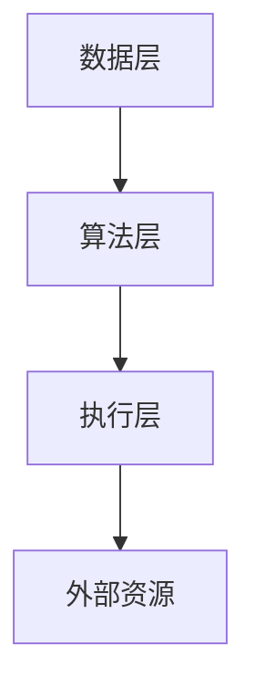

                 


# 价值投资中的智能城市紧急事件响应系统分析

> 关键词：价值投资，智能城市，紧急事件响应系统，系统架构，算法原理

> 摘要：本文深入分析了价值投资在智能城市紧急事件响应系统中的应用，探讨了该系统的系统架构、核心算法、实现技术及优化方法，为投资者提供了有价值的投资分析框架。

---

# 引言

智能城市的发展离不开高效的紧急事件响应系统。价值投资作为一种长期有效的投资策略，可以帮助投资者识别和投资于那些能够真正提升城市应对紧急事件能力的项目和技术。本文将从价值投资的角度，系统分析智能城市中的紧急事件响应系统，探讨其架构、算法和实现。

---

## 第一部分：价值投资与智能城市背景

### 1. 价值投资的基本概念

#### 1.1 价值投资的定义与核心理念

价值投资是一种以长期收益为导向的投资策略，核心在于寻找市场价格低于其内在价值的资产。其核心理念包括：

- **安全边际**：买入价格低于内在价值，以减少风险。
- **长期视角**：关注企业的长期盈利能力，而非短期波动。
- **基本面分析**：通过分析企业的财务状况、行业地位和竞争优势，评估其内在价值。

#### 1.2 智能城市的定义与发展

智能城市利用信息技术优化城市运营，提升居民生活质量。其发展依赖于物联网、大数据、人工智能等技术，涵盖交通、能源、公共安全等多个领域。

#### 1.3 价值投资与智能城市的结合

价值投资者可以通过分析智能城市的基础设施和技术供应商，找到那些具有竞争优势和长期增长潜力的企业。这些企业往往在智能城市的关键领域（如数据处理、网络安全）占据重要地位。

---

### 2. 紧急事件响应系统概述

#### 2.1 紧急事件响应系统的定义

紧急事件响应系统通过自动化和智能化手段，快速应对突发事件，减少损失。其核心包括信息收集、分析决策和响应执行。

#### 2.2 紧急事件响应系统的核心要素

- **信息收集**：实时获取事件数据，如传感器读数和监控视频。
- **事件分析**：利用算法判断事件的严重性并制定应对策略。
- **响应执行**：协调资源执行响应计划。

#### 2.3 智能城市中的紧急事件响应系统

智能城市的响应系统整合了多源数据，利用AI优化决策。例如，在火灾发生时，系统能快速定位火源，调度最近的消防资源。

---

## 第二部分：智能城市紧急事件响应系统的核心概念

### 3. 价值投资视角下的紧急事件响应系统分析

#### 3.1 价值投资在紧急事件响应系统中的应用

- **信息收集与处理**：投资于提供高效数据采集技术的企业。
- **事件分析与决策**：关注具备先进数据分析能力的企业。
- **响应执行与反馈**：支持快速部署应急资源的供应商。

#### 3.2 紧急事件响应系统的价值评估模型

价值评估模型综合考虑系统的响应时间、准确率和成本效益。通过分析这些指标，投资者可以识别出那些能够提供高性价比的系统供应商。

---

## 第三部分：紧急事件响应系统的算法原理与实现

### 4. 算法原理

#### 4.1 基于价值投资的事件优先级排序算法

该算法根据事件的潜在影响和处理成本，评估其优先级。公式如下：

$$
\text{优先级} = \frac{\text{潜在影响}}{\text{处理成本}}
$$

通过计算优先级，系统能够合理分配资源，优化响应效率。

#### 4.2 算法实现

```python
def value_investment_sort(events):
    # 事件列表，每个事件包含'影响'和'成本'属性
    events.sort(key=lambda x: (x['影响']/x['成本']), reverse=True)
    return events
```

该算法将事件按优先级排序，确保高价值的事件得到优先处理。

---

## 第四部分：系统分析与架构设计

### 5. 系统架构

系统架构分为数据层、算法层和执行层：

- **数据层**：收集和存储事件数据。
- **算法层**：分析数据并生成响应策略。
- **执行层**：调度资源执行响应。

架构图如下：



---

## 第五部分：项目实战

### 6. 项目实战：紧急事件响应系统

#### 6.1 环境安装

安装Python和必要的库：

```bash
pip install numpy pandas scikit-learn
```

#### 6.2 核心代码实现

实现价值投资排序算法：

```python
import pandas as pd

class Event:
    def __init__(self, id, impact, cost):
        self.id = id
        self.impact = impact
        self.cost = cost

    def get_priority(self):
        return self.impact / self.cost

events = [
    Event(1, 100, 20),
    Event(2, 80, 25),
    Event(3, 90, 30)
]

sorted_events = sorted(events, key=lambda x: x.get_priority(), reverse=True)

for event in sorted_events:
    print(f"ID: {event.id}, Priority: {event.get_priority()}")
```

---

## 第六部分：总结

### 7. 总结

价值投资在智能城市中的应用，尤其是紧急事件响应系统，为企业提供了长期稳定的投资机会。通过分析系统的架构和算法，投资者可以识别出那些能够真正提升城市应对能力的企业，实现双赢。

---

作者：AI天才研究院 & 禅与计算机程序设计艺术

