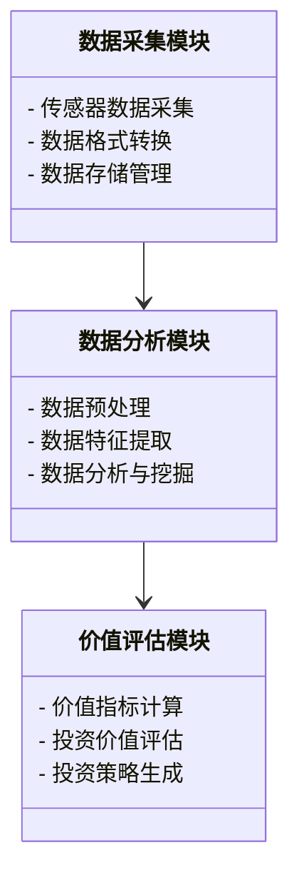

                 


# 第五章 系统功能设计

## 5.1 系统功能模块划分

### 5.1.1 数据采集模块
#### 5.1.1.1 传感器数据采集
#### 5.1.1.2 数据格式转换
#### 5.1.1.3 数据存储管理

### 5.1.2 数据分析模块
#### 5.1.2.1 数据预处理
#### 5.1.2.2 数据特征提取
#### 5.1.2.3 数据分析与挖掘

### 5.1.3 价值评估模块
#### 5.1.3.1 价值指标计算
#### 5.1.3.2 投资价值评估
#### 5.1.3.3 投资策略生成

## 5.2 系统功能设计图

### 5.2.1 系统功能类图


## 5.3 功能模块详细设计

### 5.3.1 数据采集模块
#### 5.3.1.1 传感器数据采集
- 使用多种传感器，如温度、湿度、心率等。
- 数据采集频率与精度要求。

#### 5.3.1.2 数据格式转换
- 数据格式转换的必要性。
- 转换规则与实现方法。

#### 5.3.1.3 数据存储管理
- 数据库选择（如MySQL、MongoDB）。
- 数据存储结构设计。

### 5.3.2 数据分析模块
#### 5.3.2.1 数据预处理
- 数据清洗、去噪处理。
- 时间序列数据处理。

#### 5.3.2.2 数据特征提取
- 使用统计方法提取特征。
- 特征选择与降维技术。

#### 5.3.2.3 数据分析与挖掘
- 数据可视化（如折线图、柱状图）。
- 关联规则挖掘与聚类分析。

### 5.3.3 价值评估模块
#### 5.3.3.1 价值指标计算
- 计算健康指数、市场指数等。
- 指标权重设定。

#### 5.3.3.2 投资价值评估
- 基于健康指数的资产定价模型。
- 风险调整后的价值评估。

#### 5.3.3.3 投资策略生成
- 动态投资策略生成。
- 策略执行与监控。

---

# 第六章 系统实现与代码开发

## 6.1 开发环境搭建

### 6.1.1 开发工具安装
- 安装Python、Jupyter Notebook。
- 安装数据处理库（如Pandas、NumPy）。

### 6.1.2 传感器数据接口开发
- 使用Raspberry Pi采集数据。
- 数据接口API设计与实现。

## 6.2 系统核心代码实现

### 6.2.1 数据采集模块代码
```python
import pandas as pd
import numpy as np

# 传感器数据采集
def collect_data():
    # 模拟传感器数据
    data = pd.DataFrame({
        'time': pd.date_range(start='2023-01-01', periods=100, freq='T'),
        'temperature': np.random.normal(25, 1, 100),
        'humidity': np.random.normal(50, 5, 100)
    })
    return data

# 数据存储
def store_data(data):
    data.to_csv('health_data.csv', index=False)
```

### 6.2.2 数据分析模块代码
```python
import pandas as pd
from sklearn import preprocessing

# 数据预处理
def preprocess_data(data):
    # 删除缺失值
    data = data.dropna()
    # 标准化处理
    scaler = preprocessing.StandardScaler()
    data[['temperature', 'humidity']] = scaler.fit_transform(data[['temperature', 'humidity']])
    return data

# 特征提取
def extract_features(data):
    features = data[['temperature', 'humidity']]
    return features
```

### 6.2.3 价值评估模块代码
```python
import pandas as pd
from sklearn.linear_model import LinearRegression

# 价值指标计算
def calculate_value_indices(data):
    # 计算健康指数
    health_index = data['temperature'] * 0.5 + data['humidity'] * 0.3
    return health_index

# 投资价值评估
def assess_investment_value(data):
    model = LinearRegression()
    model.fit(data[['temperature', 'humidity']], data['value'])
    return model.predict(data[['temperature', 'humidity']])
```

## 6.3 系统功能实现

### 6.3.1 数据采集模块实现
- 传感器数据的实时采集与存储。
- 数据存储的完整性和准确性验证。

### 6.3.2 数据分析模块实现
- 数据预处理与特征提取的具体实现。
- 数据分析结果的可视化展示。

### 6.3.3 价值评估模块实现
- 价值指标的计算与验证。
- 投资策略的生成与优化。

---

# 第七章 系统测试与优化

## 7.1 测试方案制定

### 7.1.1 测试目标
- 系统功能测试。
- 性能测试。

### 7.1.2 测试方法
- 单元测试。
- 集成测试。
- 性能测试。

## 7.2 系统测试实施

### 7.2.1 单元测试
- 数据采集模块测试。
- 数据分析模块测试。
- 价值评估模块测试。

### 7.2.2 集成测试
- 系统整体功能测试。
- 系统性能测试。

## 7.3 系统优化

### 7.3.1 性能优化
- 数据处理效率优化。
- 算法优化。

### 7.3.2 功能优化
- 用户界面优化。
- 系统功能扩展。

---

# 第八章 价值评估与投资策略

## 8.1 价值评估方法

### 8.1.1 健康指数计算
- 健康指数的计算方法。
- 健康指数的权重分配。

### 8.1.2 投资价值评估
- 价值评估模型的选择。
- 价值评估结果的解读。

## 8.2 投资策略制定

### 8.2.1 短期投资策略
- 短期市场的波动分析。
- 短期投资机会捕捉。

### 8.2.2 长期投资策略
- 长期市场趋势分析。
- 长期投资风险控制。

## 8.3 风险管理

### 8.3.1 风险识别
- 系统性风险与非系统性风险。
- 传感器数据的可靠性风险。

### 8.3.2 风险控制
- 风险分散策略。
- 风险预警机制。

---

# 第九章 总结与展望

## 9.1 全文总结

### 9.1.1 系统设计总结
- 系统设计的主要成果。
- 系统实现的关键技术。

### 9.1.2 投资价值总结
- 系统在价值投资中的应用价值。
- 系统的创新点与优势。

## 9.2 未来展望

### 9.2.1 系统功能扩展
- 新功能的开发方向。
- 系统性能的提升空间。

### 9.2.2 投资策略优化
- 投资策略的进一步优化。
- 新技术的应用前景。

---

# 附录

## 附录A: 关键技术术语解释

## 附录B: 系统架构图

## 附录C: 代码实现细节

## 附录D: 测试报告

---

# 参考文献

---

作者：AI天才研究院/AI Genius Institute & 禅与计算机程序设计艺术 /Zen And The Art of Computer Programming

