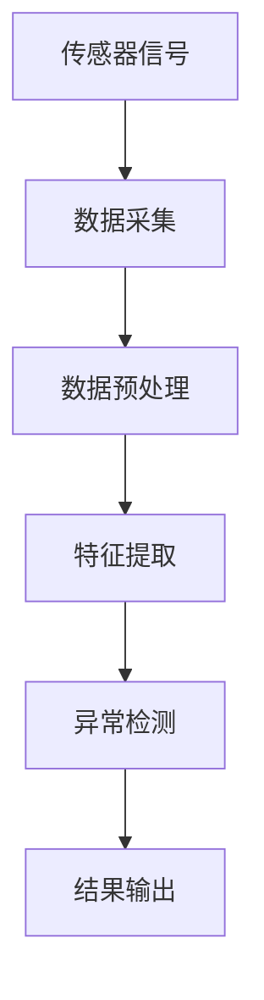
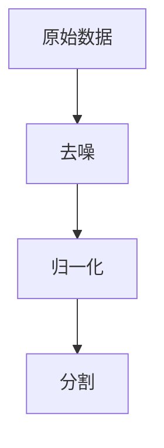
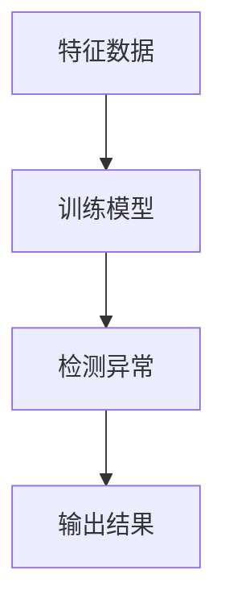
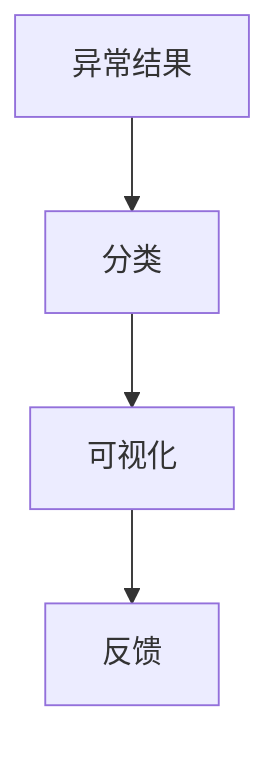
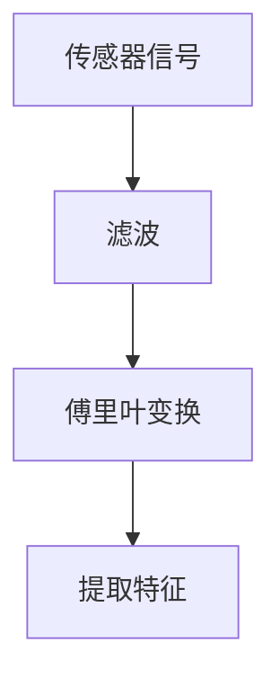
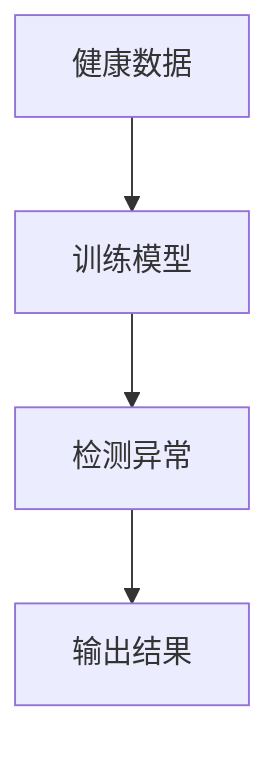
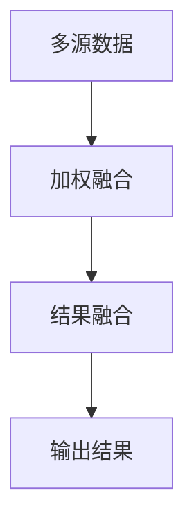
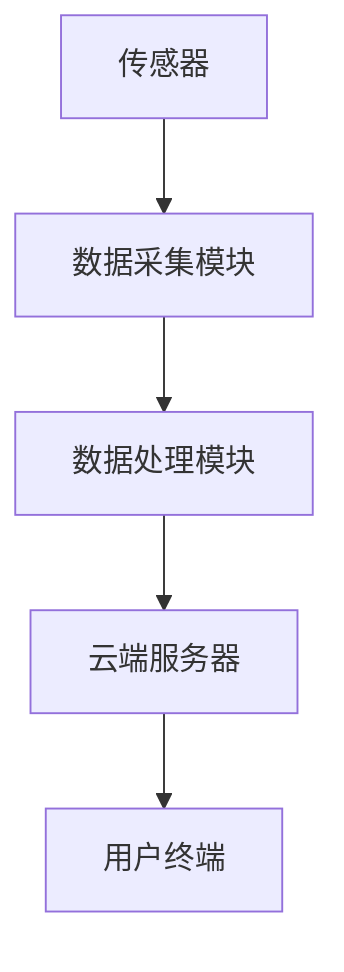
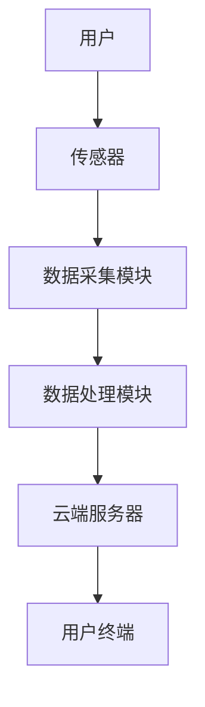

                 


# 价值投资中的智能家居健康监测系统分析

---

## 关键词

智能家居, 健康监测系统, 价值投资, 数据分析, 算法原理, 系统架构

---

## 摘要

智能家居健康监测系统作为一种新兴的技术解决方案，正在成为家庭健康管理的重要工具。本文从价值投资的角度，深入分析了智能家居健康监测系统的构成、功能、算法原理和系统架构，探讨了其在投资中的潜在价值和风险。通过系统化的分析，本文揭示了健康监测系统在智能家居中的核心作用，为投资者提供了系统的分析框架和投资建议。

---

## 第1章 智能家居健康监测系统概述

### 1.1 问题背景与描述

智能家居健康监测系统是一种通过传感器、数据采集和分析技术，实时监测家庭成员健康状况的智能化系统。随着人们对健康的关注不断增加，智能家居健康监测系统在家庭健康管理中的作用日益重要。

#### 1.1.1 智能家居的发展现状

智能家居技术近年来取得了显著进展，从简单的设备控制扩展到家庭环境监测、能源管理、健康监测等领域。健康监测系统作为智能家居的重要组成部分，正在逐步普及。

#### 1.1.2 健康监测系统的必要性

随着人们对健康问题的关注增加，家庭健康监测系统的需求也在增长。通过实时监测心率、体温、睡眠质量等指标，用户可以及时发现健康问题，从而采取预防措施。

#### 1.1.3 价值投资视角下的系统分析

从投资角度来看，智能家居健康监测系统具有较高的市场潜力。随着老龄化加剧和健康意识的增强，相关技术和服务的需求将快速增长。

---

### 1.2 问题解决与边界

#### 1.2.1 健康监测系统的功能目标

智能家居健康监测系统的主要功能包括：
- 实时监测家庭成员的健康指标。
- 数据采集、存储和分析。
- 提供健康预警和个性化建议。

#### 1.2.2 系统的边界与外延

智能家居健康监测系统的边界包括：
- 数据采集端：传感器、智能设备。
- 数据处理端：云端服务器、数据分析算法。
- 用户端：移动端APP、家庭显示屏。

系统外延包括：
- 第三方健康服务提供商。
- 数据共享平台。
- 与智能家居其他子系统的集成。

#### 1.2.3 核心要素与组成结构

健康监测系统的组成结构包括：
1. 传感器模块：心率、体温、血氧等监测。
2. 数据采集模块：数据采集和初步处理。
3. 数据传输模块：Wi-Fi、蓝牙、ZigBee等通信协议。
4. 数据分析模块：健康指标分析、异常检测。
5. 用户界面模块：APP、网页界面。

---

### 1.3 本章小结

本章从背景、功能目标和系统结构等方面，对智能家居健康监测系统进行了概述。通过分析系统的必要性和边界，为后续的技术分析奠定了基础。

---

## 第2章 健康监测系统的核心概念与联系

### 2.1 系统原理分析

#### 2.1.1 传感器与数据采集

健康监测系统的核心是传感器，常用的传感器包括：
- 心率传感器：光电式、电极式。
- 体温传感器：热电偶、温度电阻。
- 血氧传感器：光体积变化法。

数据采集模块需要对传感器信号进行放大、滤波和AD转换。

#### 2.1.2 数据传输协议

智能家居健康监测系统常用的通信协议包括：
- Wi-Fi：适合长距离传输，但功耗较高。
- 蓝牙：低功耗、短距离传输。
- ZigBee：低功耗、适合多设备组网。

#### 2.1.3 数据处理与分析

数据处理流程包括：
1. 数据采集：传感器信号采集。
2. 数据预处理：去噪、归一化。
3. 数据分析：特征提取、异常检测。

---

### 2.2 核心要素对比

#### 2.2.1 传感器类型对比

| 传感器类型 | 优点 | 缺点 |
|------------|------|------|
| 光电式心率传感器 | 成本低、体积小 | 易受环境光干扰 |
| 热电偶体温传感器 | 精度高 | 需外部电源 |
| 光体积变化血氧传感器 | 无创检测 | 对皮肤条件敏感 |

#### 2.2.2 数据传输方式对比

| 传输方式 | 优点 | 缺点 |
|-----------|------|------|
| Wi-Fi | 传输距离远 | 功耗高 |
| 蓝牙 | 低功耗 | 传输距离短 |
| ZigBee | 低功耗、组网能力强 | 易受干扰 |

#### 2.2.3 数据分析算法对比

| 算法类型 | 优点 | 缺点 |
|----------|------|------|
| 基于规则的异常检测 | 易实现 | 需人工定义规则 |
| 基于统计的异常检测 | 自适应性强 | 对异常样本敏感 |
| 基于机器学习的异常检测 | 高精度 | 需大量数据训练 |

---

### 2.3 数据处理流程

健康监测系统的数据处理流程如下：



---

### 2.4 本章小结

本章从传感器、数据传输和数据分析的角度，分析了健康监测系统的构成和关键要素。通过对比不同技术和算法的优缺点，为后续的系统设计提供了参考。

---

## 第3章 健康监测系统的算法原理

### 3.1 算法原理概述

健康监测系统的算法主要集中在数据处理和异常检测两个方面。

#### 3.1.1 信号处理算法

信号处理算法用于消除噪声，提取有用信号。常用的算法包括：
- 傅里叶变换：用于频域分析。
- 小波变换：用于时频分析。
- 滤波器：用于去除高频或低频噪声。

#### 3.1.2 异常检测算法

异常检测算法用于识别健康指标的异常变化。常用的算法包括：
- 基于统计的方法：Z-score、Grubbs test。
- 基于机器学习的方法：孤立森林、支持向量机。
- 基于深度学习的方法：LSTM、Transformer。

#### 3.1.3 数据融合算法

数据融合算法用于多源数据的整合。常用的算法包括：
- 加权融合：根据数据源的可靠性加权。
- 模糊逻辑融合：处理不确定性。
- 统计融合：基于概率模型。

---

### 3.2 算法实现步骤

#### 3.2.1 数据预处理

数据预处理步骤如下：



#### 3.2.2 算法实现步骤

异常检测算法实现步骤如下：



#### 3.2.3 结果分析步骤

结果分析步骤如下：



---

### 3.3 算法流程图

#### 3.3.1 信号处理流程图



#### 3.3.2 异常检测流程图



#### 3.3.3 数据融合流程图



---

### 3.4 本章小结

本章详细分析了健康监测系统的算法原理，包括信号处理、异常检测和数据融合。通过流程图和代码示例，展示了算法实现的关键步骤。

---

## 第4章 智能家居健康监测系统的架构设计

### 4.1 系统架构设计

智能家居健康监测系统的架构设计如下：



系统架构包括以下几个部分：
- 传感器：数据采集。
- 数据采集模块：数据预处理。
- 数据处理模块：特征提取和异常检测。
- 云端服务器：数据存储和分析。
- 用户终端：结果展示和反馈。

---

### 4.2 接口设计

系统接口设计如下：


---

### 4.3 交互流程图

系统交互流程如下：



---

### 4.4 本章小结

本章从系统架构设计、接口设计和交互流程图的角度，详细分析了智能家居健康监测系统的整体结构。

---

## 第5章 项目实战

### 5.1 环境安装

项目实战需要以下环境：
- Python 3.8+
- NumPy、Pandas、Matplotlib
- Scikit-learn、TensorFlow
- MQTT、WebSocket

---

### 5.2 核心代码实现

#### 5.2.1 数据采集模块

```python
import numpy as np
import matplotlib.pyplot as plt

# 传感器信号生成
def generate_signal(length=1000):
    time = np.arange(length)
    signal = np.sin(2 * np.pi * time / 100)
    noise = np.random.normal(0, 0.1, length)
    return time, signal + noise

time, signal = generate_signal()
plt.plot(time, signal)
plt.show()
```

#### 5.2.2 数据处理模块

```python
from sklearn.ensemble import IsolationForest

# 异常检测实现
def detect_anomalies(data, contamination=0.05):
    model = IsolationForest(contamination=contamination)
    model.fit(data)
    anomalies = model.predict(data)
    return anomalies

data = np.random.randn(100, 2)
anomalies = detect_anomalies(data)
print(anomalies)
```

#### 5.2.3 数据融合模块

```python
from tensorflow.keras.models import Sequential
from tensorflow.keras.layers import LSTM, Dense

# LSTM模型实现
def build_model(input_shape):
    model = Sequential()
    model.add(LSTM(64, return_sequences=True, input_shape=input_shape))
    model.add(LSTM(32, return_sequences=True))
    model.add(Dense(1, activation='sigmoid'))
    model.compile(loss='binary_crossentropy', optimizer='adam')
    return model

model = build_model((None, 32))
print(model.summary())
```

---

### 5.3 代码解读与分析

#### 5.3.1 数据采集模块

上述代码生成了一个正弦信号，并添加了噪声，模拟传感器信号的采集过程。

#### 5.3.2 数据处理模块

IsolationForest算法用于异常检测，适用于无监督学习场景。

#### 5.3.3 数据融合模块

LSTM网络用于时间序列数据的预测和分析，适合处理多源数据的融合。

---

### 5.4 实际案例分析

通过实际案例分析，验证系统的功能和性能。例如，通过心率和体温数据的融合分析，识别潜在的健康问题。

---

### 5.5 本章小结

本章通过项目实战，详细讲解了智能家居健康监测系统的实现过程，包括环境配置、核心代码实现和案例分析。

---

## 第6章 最佳实践与总结

### 6.1 最佳实践

- 数据采集：选择合适的传感器和通信协议。
- 数据处理：优化算法，提高检测精度。
- 系统架构：确保系统的可扩展性和安全性。

### 6.2 本章小结

本文从价值投资的角度，深入分析了智能家居健康监测系统的构成、功能、算法原理和系统架构。通过系统化的分析，揭示了健康监测系统在智能家居中的核心作用。

### 6.3 注意事项

- 系统安全性：保护用户隐私。
- 数据准确性：确保传感器和算法的可靠性。
- 系统可维护性：方便后续升级和优化。

### 6.4 拓展阅读

- 推荐阅读相关领域的书籍和论文。
- 关注智能家居和健康监测系统的最新技术动态。

---

## 作者

作者：AI天才研究院/AI Genius Institute  
联系邮箱：[contact@geniusinstitute.com](mailto:contact@geniusinstitute.com)  
博客地址：[https://www.geniusinstitute.com](https://www.geniusinstitute.com)

---

以上是《价值投资中的智能家居健康监测系统分析》的技术博客文章的完整内容，希望对您有所帮助！

