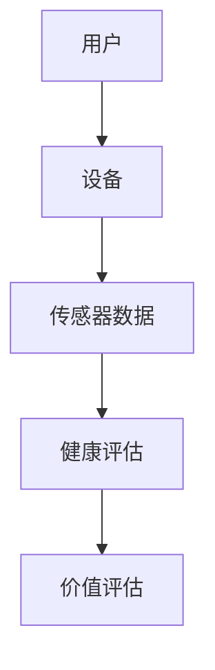
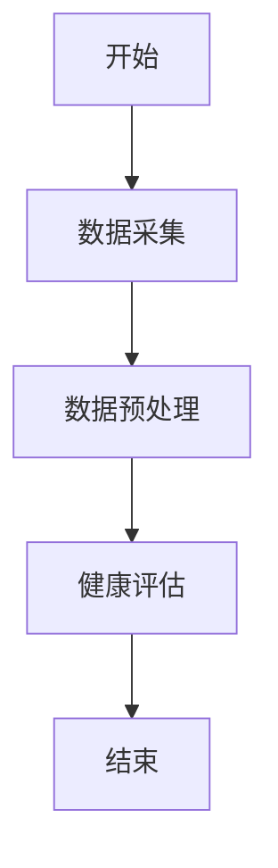
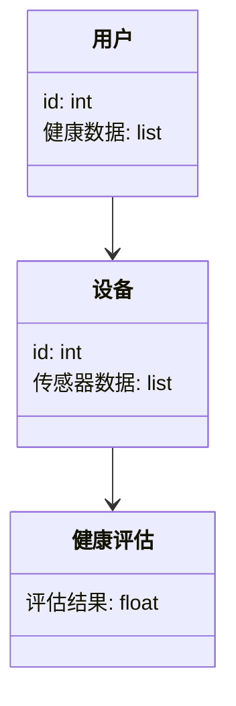
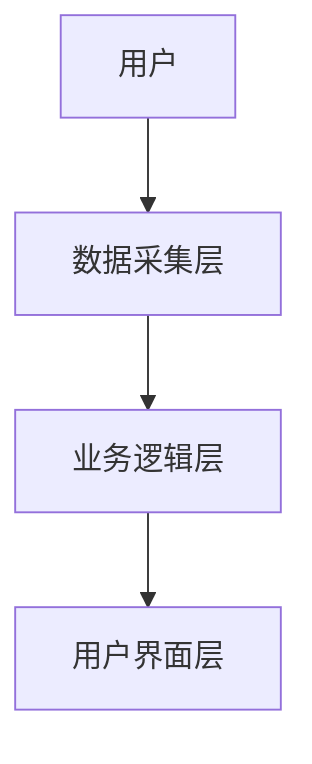
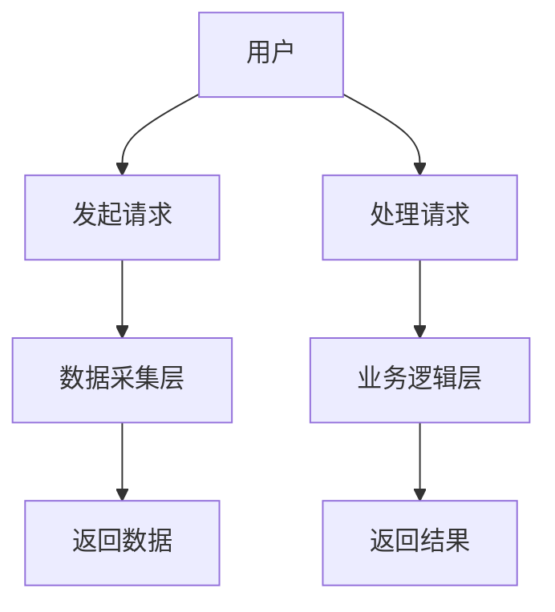

                 


# 价值投资中的智能家居健康监测系统分析

## 关键词
价值投资，智能家居，健康监测系统，数据分析，算法，系统架构

## 摘要
价值投资是一种长期投资策略，通过深入分析企业的基本面来寻找被低估的投资机会。智能家居健康监测系统利用物联网技术和数据分析，实时监测居住环境和用户健康状况。本文分析了智能家居健康监测系统在价值投资中的应用，探讨了系统的功能模块、算法原理、系统架构以及实际案例，帮助投资者和技术开发者更好地理解和应用这些技术。

---

# 第一部分: 系统概述

## 第1章: 系统背景与概念

### 1.1 价值投资与智能家居健康监测系统的结合
- **价值投资**：通过分析企业基本面，寻找低估的投资机会。
- **智能家居健康监测系统**：利用物联网技术，实时监测居住环境和用户健康状况。
- 结合两者，智能家居健康监测系统为投资者提供了实时数据，帮助评估投资标的的价值。

### 1.2 系统功能模块
- 数据采集模块：通过传感器收集环境数据。
- 数据分析模块：分析数据，评估健康状况和环境质量。
- 价值评估模块：基于分析结果，评估投资价值。

### 1.3 系统核心要素
- 传感器：采集环境数据。
- 数据库：存储历史数据。
- 分析算法：处理数据，生成评估结果。

---

## 第2章: 系统核心概念与联系

### 2.1 核心概念原理
- 数据采集：传感器采集环境数据，如温湿度、空气质量。
- 数据分析：使用机器学习算法分析数据，评估健康状况。
- 价值评估：基于健康评估结果，调整投资策略。

### 2.2 核心概念属性特征对比
| 核心概念 | 特性 | 描述 |
|----------|------|------|
| 传感器   | 类型 | 温湿度传感器、空气质量传感器等 |
| 数据分析 | 方法 | 机器学习、统计分析 |
| 价值评估 | 模型 | 基于健康数据的回归模型 |

### 2.3 ER实体关系图


---

## 第3章: 算法原理

### 3.1 数据采集与预处理
- 数据采集：通过传感器获取原始数据。
- 数据清洗：去除噪声和异常值，确保数据准确性。

### 3.2 健康评估算法
- 算法流程图：


- Python代码实现：
```python
import numpy as np

def health_assessment(data):
    processed_data = data.dropna()
    assessment = np.mean(processed_data)
    return assessment
```

### 3.3 价值评估模型
- 数学模型：
$$ 价值评估 = \alpha \cdot 健康评估 + \beta \cdot 环境评估 $$
其中，$\alpha$ 和 $\beta$ 是权重系数。

---

## 第4章: 系统架构与设计

### 4.1 系统功能设计
- 用户需求分析：实时监测环境和健康状况。
- 功能模块划分：数据采集、分析、评估。
- 领域模型：


### 4.2 系统架构设计
- 分层架构：数据采集层、业务逻辑层、用户界面层。
- 架构图：


### 4.3 接口设计与交互
- 接口设计：RESTful API，提供数据采集和评估结果查询功能。
- 序列图：


---

## 第5章: 项目实战

### 5.1 环境安装
- Python 3.8+
- NumPy、Pandas、Scikit-learn

### 5.2 核心实现代码
```python
import numpy as np
import pandas as pd
from sklearn.impute import SimpleImputer

def load_data(file_path):
    data = pd.read_csv(file_path)
    return data

def preprocess_data(data):
    imputer = SimpleImputer(strategy='mean')
    processed_data = imputer.fit_transform(data)
    return processed_data

def health_assessment(processed_data):
    assessment = np.mean(processed_data, axis=0)
    return assessment

# 使用示例
data = load_data('sensor_data.csv')
processed_data = preprocess_data(data)
result = health_assessment(processed_data)
print(result)
```

### 5.3 案例分析
- 数据来源：智能家居环境传感器数据。
- 数据分析：使用机器学习算法分析健康状况。
- 价值评估：基于健康评估结果，调整投资策略。

---

## 第6章: 小结与注意事项

### 6.1 小结
智能家居健康监测系统为价值投资提供了实时数据支持，帮助投资者做出更明智的决策。

### 6.2 注意事项
- 数据准确性：确保传感器数据的准确性。
- 算法选择：选择合适的算法，提高评估精度。
- 系统维护：定期更新系统，确保正常运行。

### 6.3 拓展阅读
- 推荐书籍：《价值投资实战策略》、《物联网技术与应用》。
- 推荐博客：深入探讨智能家居与投资的结合。

---

作者：AI天才研究院 & 禅与计算机程序设计艺术

