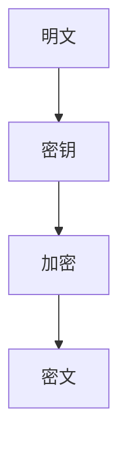

                 


# 《价值投资中的智能家居安全系统前景》

## 关键词：智能家居、安全系统、价值投资、市场分析、技术发展

## 摘要：智能家居安全系统作为智能家居的重要组成部分，随着智能家居市场的快速发展，其安全性和智能化程度成为用户关注的焦点。本文从价值投资的角度，分析智能家居安全系统的市场潜力、技术发展和投资机会，探讨其在未来的前景和挑战。

---

## 第1章：智能家居安全系统的概述

### 1.1 智能家居安全系统的概念与定义

智能家居安全系统是指通过智能设备、传感器和网络技术，实现对家庭环境的安全监控、入侵防范、火灾报警、煤气泄漏检测等功能的系统。它通常包括智能门锁、摄像头、烟雾报警器、门窗传感器等设备，通过物联网（IoT）技术将数据传输到用户端或云端，提供实时的安全监控和报警服务。

#### 1.1.1 智能家居的基本概念

智能家居是指通过互联网、物联网、云计算等技术，将家庭中的各种设备（如灯光、空调、电视、安防设备等）连接起来，实现智能化控制和管理。智能家居的核心在于设备之间的互联互通和智能化操作，旨在为用户提供更加舒适、安全和便捷的生活体验。

#### 1.1.2 安全系统在智能家居中的作用

智能家居安全系统是智能家居的重要组成部分，主要用于保护家庭财产和居民人身安全。它通过传感器和智能设备，实时监测家庭环境，及时发现并处理潜在的安全威胁，例如入侵、火灾、煤气泄漏等。同时，智能家居安全系统还可以通过远程监控和报警功能，为用户提供全天候的安全保障。

#### 1.1.3 智能家居安全系统的定义与范围

智能家居安全系统是指利用智能技术，对家庭环境进行实时监控和安全防护的系统。其范围包括但不限于家庭防盗、防火、防煤气泄漏、远程监控等功能。智能家居安全系统的定义不仅包括硬件设备，还包括软件平台、数据传输和用户交互等组成部分。

---

### 1.2 智能家居安全系统的背景与现状

智能家居的快速发展离不开技术的进步和用户需求的变化。随着物联网、人工智能和大数据技术的广泛应用，智能家居设备的种类和功能不断增加，用户对智能家居安全系统的关注度也逐渐提高。然而，智能家居安全系统的安全性、兼容性和智能化程度仍然是制约其发展的主要因素。

#### 1.2.1 当前智能家居市场的快速发展

近年来，智能家居市场呈现快速增长态势。根据市场研究机构的数据，全球智能家居市场规模已超过千亿美元，且仍在快速增长中。智能家居设备的普及率不断提高，用户对智能化生活的追求也推动了智能家居市场的进一步发展。

#### 1.2.2 智能家居安全问题的突出性

随着智能家居设备的普及，安全问题逐渐成为用户关注的重点。智能家居设备的漏洞可能导致家庭安全受到威胁，例如黑客攻击、数据泄露等问题。因此，智能家居安全系统的研发和应用显得尤为重要。

#### 1.2.3 全球智能家居安全系统的市场现状

当前，全球智能家居安全系统市场呈现多元化发展趋势，不同品牌和厂商推出了各种类型的智能家居安全产品。然而，市场上的产品鱼龙混杂，部分产品的安全性和智能化程度仍有待提高。因此，用户在选择智能家居安全系统时需要综合考虑产品的功能、性能和安全性。

---

### 1.3 价值投资视角下的智能家居安全系统

价值投资是一种长期投资策略，注重对公司的基本面分析和长期发展潜力的判断。智能家居安全系统的市场前景广阔，其在家庭安防、智能化管理等方面具有较高的应用价值和投资潜力。

#### 1.3.1 价值投资的基本概念

价值投资是一种以基本面分析为基础的投资策略，强调以低于市场价值的价格买入优质资产，长期持有，等待其价值的回归。价值投资者注重公司的财务状况、行业地位、竞争优势和未来发展潜力。

#### 1.3.2 智能家居安全系统的投资价值

智能家居安全系统的市场潜力巨大，随着智能家居市场的快速发展，其在家庭安防、智能化管理等方面的需求不断增加。智能家居安全系统的研发和应用不仅能够提高家庭的安全性，还能为投资者带来可观的经济回报。

#### 1.3.3 未来市场潜力与投资机会

未来，智能家居安全系统市场将呈现多元化发展趋势，不同品牌和厂商将推出更加智能化、安全性和兼容性更强的产品。投资者可以通过对市场的深入分析和对企业的长期关注，挖掘智能家居安全系统领域的投资机会。

---

## 第2章：智能家居安全系统的组成与核心要素

智能家居安全系统由多个组成部分构成，包括智能设备、传感器、网络传输、云端数据处理和用户交互等。这些部分相互协同，共同实现家庭环境的安全监控和智能化管理。

### 2.1 智能家居安全系统的组成结构

智能家居安全系统的组成结构可以分为以下几个层次：

#### 2.1.1 智能家居设备层

智能家居设备层包括各种智能设备和传感器，例如智能门锁、摄像头、门窗传感器、烟雾报警器等。这些设备通过传感器采集环境数据，并通过网络传输到云端或用户端。

#### 2.1.2 网络传输层

网络传输层是智能家居安全系统的重要组成部分，负责将设备采集的数据传输到云端或用户端。常用的网络传输技术包括Wi-Fi、蓝牙、 ZigBee等，这些技术能够确保数据的实时传输和安全性。

#### 2.1.3 云端数据处理层

云端数据处理层是智能家居安全系统的核心，负责对设备传输的数据进行分析和处理。云端平台通过大数据分析和人工智能技术，能够实时判断家庭环境的安全状态，并根据需要发出报警或采取相应的安全措施。

#### 2.1.4 用户交互层

用户交互层是智能家居安全系统与用户之间的接口，用户可以通过手机APP、智能家居中控面板等设备实现对安全系统的控制和管理。用户交互层的设计需要注重用户体验，确保用户能够方便地操作和管理安全系统。

---

### 2.2 核心概念与联系

智能家居安全系统的核心概念包括设备、网络、云端和用户。这些概念之间的联系可以通过ER图和流程图进行展示。

#### 2.2.1 实体关系图（ER图）展示智能家居安全系统的结构

```mermaid
erDiagram
    actor 用户角色 : 用户
    actor 设备层 : 智能设备
    actor 网络层 : 网络传输
    actor 云端 : 数据处理中心
    actor 安全系统 : 安全模块
    用户角色 --> 设备层 : 操作与控制
    设备层 --> 网络层 : 数据传输
    网络层 --> 云端 : 数据处理
    云端 --> 安全系统 : 安全分析
    安全系统 --> 用户

```

---

## 第3章：智能家居安全系统的算法原理

智能家居安全系统的核心算法包括数据加密、身份验证和安全监测等。这些算法通过流程图和代码示例进行详细讲解。

### 3.1 数据加密算法

数据加密算法用于保护智能家居设备的数据传输安全，防止数据被篡改或窃取。常用的加密算法包括AES、RSA等。

#### 3.1.1 AES加密算法

AES（高级加密标准）是一种广泛使用的加密算法，支持128、192和256位密钥长度。其加密流程如下：



代码实现：

```python
import hashlib

def aes_encrypt(plaintext, key):
    # 使用AES加密算法
    key = key.encode('utf-8')
    plaintext = plaintext.encode('utf-8')
    cipher = hashlib.new('aes', key=key)
    ciphertext = cipher.encrypt(plaintext)
    return ciphertext

# 示例
plaintext = "Hello, World!"
key = "secretkey1234"
encrypted = aes_encrypt(plaintext, key)
print("Encrypted:", encrypted)
```

---

## 第4章：智能家居安全系统的数学模型

智能家居安全系统的数学模型用于评估系统的安全性、可靠性和经济性。以下是几个关键公式：

$$
\text{投资回报率(ROI)} = \frac{\text{净利润}}{\text{投资成本}} \times 100\%
$$

$$
\text{市场渗透率} = \frac{\text{销售量}}{\text{潜在市场容量}} \times 100\%
$$

$$
\text{系统可靠性} = \sum_{i=1}^{n} \text{部件可靠性} \times \text{权重}
$$

---

## 第5章：智能家居安全系统的系统分析与架构设计

### 5.1 系统功能设计

智能家居安全系统的功能设计包括设备管理、用户管理、报警处理和数据存储等。

#### 5.1.1 设备管理

设备管理模块负责对智能家居设备的配置和管理，包括设备的添加、删除和配置等。

#### 5.1.2 用户管理

用户管理模块负责对用户的注册、登录和权限管理等。

#### 5.1.3 报警处理

报警处理模块负责对设备传入的报警信息进行处理，包括发出报警声音、推送通知等。

#### 5.1.4 数据存储

数据存储模块负责对设备和用户数据进行存储和管理，确保数据的安全性和完整性。

---

### 5.2 系统架构设计

智能家居安全系统的架构设计包括设备层、网络层、云端和用户层。

#### 5.2.1 设备层

设备层包括智能门锁、摄像头、门窗传感器等设备，负责采集环境数据。

#### 5.2.2 网络层

网络层负责将设备数据传输到云端，常用的网络技术包括Wi-Fi、蓝牙和ZigBee等。

#### 5.2.3 云端

云端负责对设备数据进行分析和处理，提供安全监控和报警服务。

#### 5.2.4 用户层

用户层负责与用户进行交互，包括手机APP、智能家居中控面板等。

---

## 第6章：智能家居安全系统的项目实战

### 6.1 项目环境搭建

项目环境搭建包括硬件设备、开发工具和云平台的安装和配置。

#### 6.1.1 硬件设备

需要购买智能门锁、摄像头、门窗传感器等硬件设备。

#### 6.1.2 开发工具

需要安装Python、Java、C语言等编程语言的开发工具。

#### 6.1.3 云平台

需要选择适合的云平台，例如阿里云、腾讯云等。

---

### 6.2 系统核心实现

系统核心实现包括设备管理、用户管理、报警处理和数据存储等模块。

#### 6.2.1 设备管理模块

设备管理模块负责对智能家居设备的配置和管理。

#### 6.2.2 用户管理模块

用户管理模块负责对用户的注册、登录和权限管理。

#### 6.2.3 报警处理模块

报警处理模块负责对设备传入的报警信息进行处理，发出报警声音、推送通知等。

#### 6.2.4 数据存储模块

数据存储模块负责对设备和用户数据进行存储和管理。

---

## 第7章：智能家居安全系统的最佳实践

### 7.1 最佳实践

智能家居安全系统的最佳实践包括选择可靠的设备、定期更新软件、加强用户教育等。

#### 7.1.1 选择可靠的设备

选择知名品牌和经过认证的智能家居设备，确保设备的安全性和兼容性。

#### 7.1.2 定期更新软件

定期更新智能家居设备的软件，修复漏洞和优化性能。

#### 7.1.3 加强用户教育

通过培训和宣传，提高用户的网络安全意识，防止密码泄露和账户被盗。

---

## 第8章：智能家居安全系统的总结与展望

### 8.1 总结

智能家居安全系统是智能家居的重要组成部分，随着智能家居市场的快速发展，其市场前景广阔。通过价值投资的角度，智能家居安全系统的投资潜力和市场潜力值得深入挖掘。

### 8.2 展望

未来，智能家居安全系统将更加智能化和安全化，随着技术的进步和市场的成熟，智能家居安全系统将为用户提供更加便捷和安全的生活体验。

---

## 作者：AI天才研究院/AI Genius Institute & 禅与计算机程序设计艺术 /Zen And The Art of Computer Programming

---

**本文通过价值投资的视角，深入分析了智能家居安全系统的市场潜力和技术发展，探讨了其在未来的前景和挑战。希望本文能够为投资者和用户提供有益的参考和启示。**

