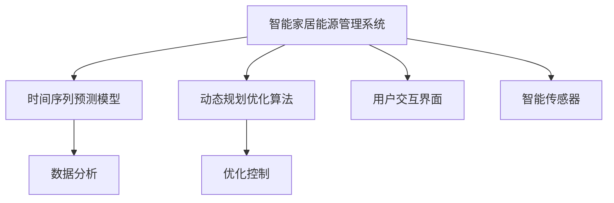
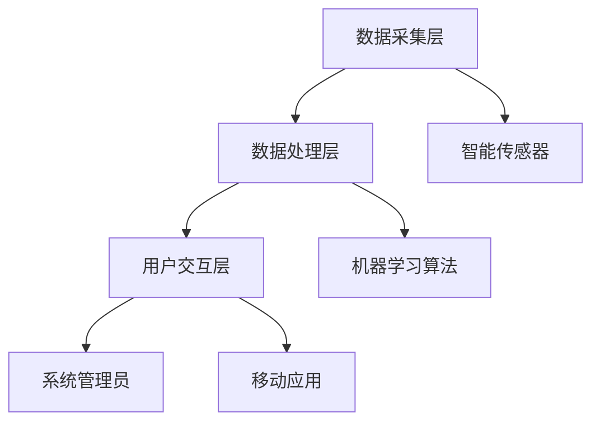

                 


# 《价值投资中的智能家居能源管理系统分析》

**关键词**：价值投资、智能家居、能源管理、能源系统、投资分析、能源效率

**摘要**：  
本文深入探讨了智能家居能源管理系统在价值投资中的应用与分析，从系统的概念、原理、算法到实际应用，结合价值投资的理论，全面解析了智能家居能源管理系统的效率、收益和投资价值。通过理论分析和实际案例，本文为投资者提供了科学的决策依据，并展望了未来的发展方向。

---

# 第一部分：智能家居能源管理系统的概念与价值投资背景

## 第1章：智能家居能源管理系统的概念与背景

### 1.1 智能家居能源管理系统的概念  
智能家居能源管理系统是一种通过智能化技术优化家庭能源消耗的系统，旨在通过数据分析和自动化控制，实现能源的高效利用和成本节约。  

#### 1.1.1 系统定义  
智能家居能源管理系统（Smart Home Energy Management System，SHEMS）是一种基于物联网（IoT）技术的智能化能源管理解决方案，通过采集、分析和优化家庭能源消耗数据，帮助用户实现能源成本的最小化和能源使用的最优化。  

#### 1.1.2 系统功能与特点  
智能家居能源管理系统的功能包括：  
1. **能源数据采集**：通过智能传感器和设备，实时采集家庭能源消耗数据（如用电量、燃气消耗量等）。  
2. **数据分析与预测**：利用机器学习算法，分析历史数据并预测未来的能源消耗趋势。  
3. **优化控制**：根据预测结果，自动调整能源使用策略，优化能源消耗，降低成本。  
4. **用户交互**：通过移动应用或网页界面，向用户展示能源消耗数据和优化建议。  

智能家居能源管理系统的优点包括：高效性、智能化、用户友好性和可持续性。  

#### 1.1.3 系统的边界与外延  
智能家居能源管理系统的边界主要集中在家庭能源消耗领域，外延则包括与能源相关的智能设备、能源供应商和能源市场。  

---

## 第2章：价值投资的背景与智能家居能源管理系统的结合  

### 2.1 价值投资的核心理念  
价值投资是一种以基本面分析为基础的投资策略，强调以低于内在价值的价格买入优质资产。其核心在于寻找被市场低估的投资标的，长期持有以实现收益最大化。  

### 2.2 价值投资与智能家居能源管理系统的结合  
智能家居能源管理系统的引入为价值投资提供了新的机会。通过优化能源消耗，降低家庭能源成本，投资者可以实现资产的保值和增值。  

#### 2.2.1 智能家居能源管理系统对价值投资的影响  
1. **降低能源成本**：通过优化能源消耗，智能家居能源管理系统能够显著降低家庭能源支出，从而提高家庭资产的净收益。  
2. **提高资产效率**：智能家居能源管理系统的高效性使其成为一种高性价比的资产，符合价值投资中对优质资产的要求。  
3. **长期收益潜力**：随着能源价格的波动和政策支持，智能家居能源管理系统具有较大的长期收益潜力。  

### 2.3 智能家居能源管理系统在价值投资中的应用前景  
智能家居能源管理系统的广泛应用将推动能源市场和智能家居行业的深度融合，为投资者提供更多的价值投资机会。  

---

## 本章小结  
本章从智能家居能源管理系统的概念和价值投资的背景出发，分析了两者的结合及其对投资的影响，为后续的深入分析奠定了基础。

---

# 第二部分：智能家居能源管理系统的核心概念与联系  

## 第3章：智能家居能源管理系统的原理与分析  

### 3.1 智能家居能源管理系统的原理  
智能家居能源管理系统通过数据采集、分析和优化控制，实现能源的高效管理。  

#### 3.1.1 数据采集与处理  
系统通过智能传感器和设备采集家庭能源消耗数据，包括用电量、燃气消耗量等。  

#### 3.1.2 数据分析与预测  
利用时间序列分析和机器学习算法，系统预测未来的能源消耗趋势。  

#### 3.1.3 优化控制  
基于预测结果，系统优化能源使用策略，降低能源消耗成本。  

### 3.2 价值投资中的关键指标分析  
在价值投资中，智能家居能源管理系统的分析需要关注以下几个关键指标：  
1. **能源消耗成本**：系统能够降低多少能源消耗成本。  
2. **投资回报率（ROI）**：系统的投资回报率是多少，是否符合价值投资的标准。  
3. **市场接受度**：系统在市场上的接受度和普及程度如何。  

---

## 第4章：智能家居能源管理系统的算法原理  

### 4.1 时间序列预测模型  
时间序列预测模型是智能家居能源管理系统的核心算法之一。  

#### 4.1.1 ARIMA模型  
ARIMA（AutoRegressive Integrated Moving Average）模型是一种常用的时间序列预测模型，适用于具有趋势和季节性的数据。  

##### ARIMA模型的公式  
$$ ARIMA(p, d, q) $$  
其中，$p$ 表示自回归阶数，$d$ 表示差分阶数，$q$ 表示移动平均阶数。  

#### 4.1.2 算法实现  
```python
from statsmodels.tsa.arima_model import ARIMA

# 假设 data 是能源消耗数据
model = ARIMA(data, order=(5, 1, 2))
model_fit = model.fit()
forecast = model_fit.forecast(steps=10)
print(forecast)
```

### 4.2 优化控制算法  
优化控制算法是智能家居能源管理系统实现能源节约的核心算法。  

#### 4.2.1 基于动态规划的优化算法  
动态规划是一种常用的优化算法，适用于分阶段决策问题。  

##### 动态规划的公式  
$$ \text{min} \sum_{t=1}^{n} c_t x_t + \sum_{t=1}^{n} x_t $$
其中，$c_t$ 是成本系数，$x_t$ 是决策变量。  

#### 4.2.2 算法实现  
```python
def dynamic_planning(cost_coefficients):
    n = len(cost_coefficients)
    dp = [0] * (n + 1)
    for i in range(n, 0, -1):
        dp[i-1] = min(dp[i], cost_coefficients[i-1])
    return dp[0]
```

---

## 第5章：智能家居能源管理系统的核心要素对比  

### 5.1 系统功能对比表  
以下是智能家居能源管理系统和其他能源管理系统的功能对比表：  

| 功能 | 智能家居能源管理系统 | 其他能源管理系统 |
|------|----------------------|------------------|
| 数据采集 | 智能传感器 | 传统传感器 |  
| 数据分析 | 机器学习算法 | 统计分析 |  
| 优化控制 | 自动化控制 | 手动控制 |  

### 5.2 系统属性对比图  
以下是智能家居能源管理系统与其他系统的属性对比图：  



---

## 本章小结  
本章分析了智能家居能源管理系统的原理、算法和核心要素，为后续的系统设计和价值投资分析奠定了基础。

---

# 第三部分：智能家居能源管理系统中的算法实现与优化

## 第6章：智能家居能源管理系统的算法实现  

### 6.1 时间序列预测模型的实现  
时间序列预测模型是智能家居能源管理系统的核心算法之一。  

#### 6.1.1 ARIMA模型的实现  
```python
from statsmodels.tsa.arima_model import ARIMA

# 假设 data 是能源消耗数据
model = ARIMA(data, order=(5, 1, 2))
model_fit = model.fit()
forecast = model_fit.forecast(steps=10)
print(forecast)
```

#### 6.1.2 LSTM模型的实现  
LSTM（Long Short Term Memory）是一种深度学习模型，适用于时间序列数据的预测。  

##### LSTM模型的公式  
$$ y_t = \sigma(W_{z}x_t + W_{z}h_{t-1} + b_z) $$
$$ y_t = \sigma(W_{f}x_t + W_{f}h_{t-1} + b_f) $$
$$ y_t = \sigma(W_{o}x_t + W_{o}h_{t-1} + b_o) $$
$$ h_t = y_t \cdot h_{t-1} + (1 - y_t) \cdot c_{t-1} $$
$$ c_t = \text{tanh}(W_{c}x_t + W_{c}h_{t-1} + b_c) $$  

#### 6.1.3 算法实现  
```python
import keras
from keras.layers import LSTM, Dense

model = keras.Sequential()
model.add(LSTM(64, input_shape=(timesteps, features)))
model.add(Dense(1))
model.compile(optimizer='adam', loss='mean_squared_error')
model.fit(X_train, y_train, epochs=100, batch_size=32)
```

---

## 第7章：智能家居能源管理系统的优化与改进  

### 7.1 系统优化的目标  
智能家居能源管理系统的优化目标包括：提高预测精度、降低能源消耗成本、提升用户体验等。  

### 7.2 算法优化策略  
1. **超参数优化**：通过网格搜索或随机搜索优化模型的超参数。  
2. **模型集成**：将多个模型的结果进行集成，提高预测精度。  
3. **实时优化**：根据实时数据动态调整优化策略。  

#### 7.2.1 超参数优化示例  
```python
from sklearn.model_selection import GridSearchCV

param_grid = {
    'n_estimators': [100, 200],
    'max_depth': [5, 10],
    'learning_rate': [0.01, 0.1]
}

grid_search = GridSearchCV(estimator=model, param_grid=param_grid, cv=5)
grid_search.fit(X_train, y_train)
best_params = grid_search.best_params_
```

---

## 本章小结  
本章详细讲解了智能家居能源管理系统的算法实现与优化策略，为系统的实际应用提供了技术支持。

---

# 第四部分：智能家居能源管理系统的系统设计与实现

## 第8章：智能家居能源管理系统的系统设计  

### 8.1 系统架构设计  
智能家居能源管理系统的架构包括数据采集层、数据处理层和用户交互层。  

#### 8.1.1 数据采集层  
数据采集层通过智能传感器采集家庭能源消耗数据。  

#### 8.1.2 数据处理层  
数据处理层利用机器学习算法对数据进行分析和预测。  

#### 8.1.3 用户交互层  
用户交互层通过移动应用或网页界面向用户展示能源消耗数据和优化建议。  

#### 8.1.4 系统架构图  


---

## 第9章：智能家居能源管理系统的项目实战  

### 9.1 项目背景与需求分析  
智能家居能源管理系统的开发是为了优化家庭能源消耗，降低能源成本。  

### 9.2 系统核心功能实现  
1. **能源数据采集**：通过智能传感器采集家庭能源消耗数据。  
2. **能源消耗预测**：利用机器学习算法预测未来的能源消耗趋势。  
3. **优化控制**：根据预测结果优化能源使用策略，降低能源消耗成本。  

#### 9.2.1 数据采集与处理  
```python
import pandas as pd

data = pd.read_csv('energy_consumption.csv')
data.head()
```

#### 9.2.2 数据分析与预测  
```python
from statsmodels.tsa.arima_model import ARIMA

model = ARIMA(data['consumption'], order=(5, 1, 2))
model_fit = model.fit()
forecast = model_fit.forecast(steps=10)
print(forecast)
```

#### 9.2.3 优化控制  
```python
def optimize_consumption(predicted_consumption):
    optimal_consumption = []
    for consumption in predicted_consumption:
        if consumption > 100:
            optimal_consumption.append(100)
        else:
            optimal_consumption.append(consumption)
    return optimal_consumption
```

### 9.3 项目案例分析  
以某家庭的能源消耗数据为例，分析智能家居能源管理系统的实际应用效果。  

---

## 本章小结  
本章通过项目实战，详细讲解了智能家居能源管理系统的开发与实现，为读者提供了实际操作的经验。

---

# 第五部分：智能家居能源管理系统的价值投资分析与总结

## 第10章：智能家居能源管理系统的价值投资分析  

### 10.1 投资价值的评估方法  
1. **成本收益分析**：评估系统的投资成本和预期收益。  
2. **市场竞争力分析**：分析系统的市场竞争力和潜在收益。  
3. **风险评估**：评估系统的市场风险和技术风险。  

#### 10.1.1 成本收益分析  
$$ \text{投资回报率（ROI）} = \frac{\text{净收益}}{\text{投资成本}} \times 100\% $$  

#### 10.1.2 市场竞争力分析  
智能家居能源管理系统的市场竞争力主要体现在技术优势和成本优势。  

### 10.2 投资策略的制定  
1. **选择优质资产**：选择具有高性价比的智能家居能源管理系统。  
2. **长期持有**：智能家居能源管理系统具有长期收益潜力，适合长期投资。  
3. **风险管理**：通过分散投资和风险控制降低投资风险。  

---

## 第11章：智能家居能源管理系统的未来展望与总结  

### 11.1 未来发展方向  
1. **技术融合**：智能家居能源管理系统将与5G、人工智能等技术深度融合。  
2. **市场拓展**：智能家居能源管理系统将在全球范围内进一步普及。  
3. **政策支持**：政府政策的支持将进一步推动智能家居能源管理系统的快速发展。  

### 11.2 总结  
智能家居能源管理系统是一种具有广阔前景的智能化能源管理解决方案，其在价值投资中的应用潜力巨大。通过本文的分析，投资者可以更好地把握智能家居能源管理系统的投资机会，实现资产的保值和增值。

---

**作者：AI天才研究院/AI Genius Institute & 禅与计算机程序设计艺术 /Zen And The Art of Computer Programming**

