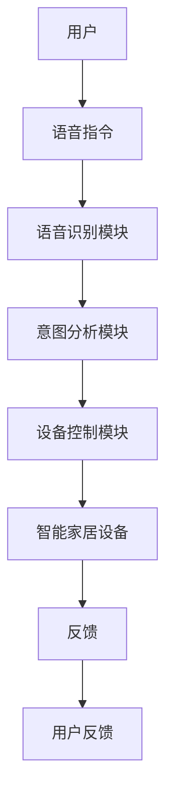
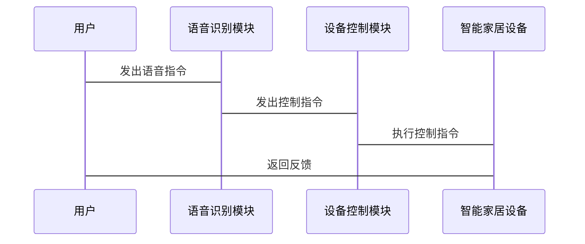

                 

# 价值投资中的智能家居语音控制系统分析

> 关键词：智能家居，语音控制系统，价值投资，深度学习，算法分析，系统架构

> 摘要：本文从智能家居语音控制系统的角度，分析其在价值投资中的潜力与挑战。通过技术原理、算法实现、系统架构等多方面的深入探讨，结合实际案例，为投资者提供科学的决策依据。

---

## 第一章：智能家居与价值投资的结合

### 1.1 智能家居的发展背景

智能家居的概念最早可以追溯到20世纪90年代，随着物联网（IoT）技术的发展，智能家居逐渐从概念走向现实。智能家居通过将家中的设备连接到互联网，实现设备间的互联互通，从而提升生活的便利性和舒适性。

智能家居的核心特征包括：
- **智能化**：通过传感器和智能设备实现自动化控制。
- **互联互通**：设备之间可以通过网络进行通信和数据交换。
- **用户友好**：通过语音、手势等方式实现人机交互。

智能家居的市场现状如下：
- 根据市场研究机构的数据，2022年全球智能家居市场规模已超过1000亿美元。
- 预计到2030年，智能家居市场将增长至数千亿美元。

智能家居在价值投资中的潜力主要体现在以下几个方面：
- 技术创新带来的市场机会。
- 用户需求的增长推动的市场规模扩大。
- 技术门槛的提高带来的竞争壁垒。

---

### 1.2 语音控制系统的核心作用

语音控制系统是智能家居的核心技术之一，它通过语音识别和自然语言处理技术，实现人与设备之间的自然交互。

语音控制系统的主要功能包括：
- 设备控制：通过语音指令控制智能家居设备（如灯光、空调、电视等）。
- 信息查询：通过语音指令查询天气、新闻等信息。
- 服务调用：通过语音指令调用智能家居中的服务（如智能音箱播放音乐、智能门锁开启等）。

语音控制系统的优势在于：
- **便捷性**：用户可以通过语音指令快速完成操作，无需手动操作设备。
- **普适性**：语音是人类最自然的交互方式，适用于所有人群。
- **高效性**：语音指令可以快速被设备理解和执行。

---

### 1.3 本书的核心目标与框架

本书的核心目标是通过技术分析和市场研究，揭示智能家居语音控制系统在价值投资中的潜力和挑战。具体内容安排如下：

- **第二章**：智能家居语音控制系统的背景与核心概念。
- **第三章**：智能家居语音控制系统的算法与数学模型。
- **第四章**：智能家居语音控制系统的系统分析与架构设计。
- **第五章**：智能家居语音控制系统的项目实战。
- **第六章**：智能家居语音控制系统的最佳实践与未来展望。

---

## 第二章：智能家居语音控制系统的背景与核心概念

### 2.1 智能家居语音控制系统的定义与分类

智能家居语音控制系统是一种通过语音指令实现智能家居设备控制的系统。根据功能和应用场景的不同，可以将智能家居语音控制系统分为以下几类：

1. **家庭娱乐系统**：主要用于控制智能家居中的娱乐设备（如智能音箱、电视等）。
2. **家庭安防系统**：主要用于控制智能家居中的安防设备（如智能门锁、摄像头等）。
3. **家庭环境系统**：主要用于控制智能家居中的环境设备（如空调、灯光等）。

智能家居语音控制系统的分类如下：

| 类型             | 功能描述                             | 应用场景                     |
|------------------|------------------------------------|------------------------------|
| 家庭娱乐系统     | 控制娱乐设备（音箱、电视等）         | 家庭影音娱乐                 |
| 家庭安防系统     | 控制安防设备（摄像头、门锁等）         | 家庭安全监控                 |
| 家庭环境系统     | 控制环境设备（空调、灯光等）         | 家庭环境调节                 |

---

### 2.2 语音控制技术的原理与实现

语音控制技术的核心在于语音识别和自然语言处理。以下是其基本原理：

1. **语音采集**：通过麦克风采集用户的语音信号。
2. **语音特征提取**：对采集到的语音信号进行特征提取（如频率、时域特征等）。
3. **语音识别**：将提取的语音特征与训练好的模型进行匹配，识别出语音内容。
4. **自然语言处理**：对识别出的语音内容进行语义理解和意图分析。
5. **设备控制**：根据理解和分析的结果，向目标设备发送控制指令。

语音控制技术的实现依赖于以下关键算法：
- **语音特征提取算法**：如MFCC（Mel-Frequency Cepstral Coefficients）。
- **语音识别算法**：如基于深度学习的模型（CNN、RNN、Transformer）。
- **自然语言处理算法**：如词袋模型、TF-IDF、BERT等。

---

### 2.3 智能家居语音控制系统的核心要素

智能家居语音控制系统的核心要素包括：
1. **传感器与执行器**：传感器用于采集环境数据，执行器用于执行控制指令。
2. **云计算与边缘计算**：云计算用于数据存储和处理，边缘计算用于实时数据处理。
3. **用户交互界面**：用户通过语音指令与系统交互。

智能家居语音控制系统的核心要素构成如下：

---

## 第三章：智能家居语音控制系统的算法与数学模型

### 3.1 基于深度学习的语音识别模型

深度学习在语音识别中的应用主要体现在以下方面：

1. **卷积神经网络（CNN）**：用于特征提取。
2. **循环神经网络（RNN）**：用于序列建模。
3. **Transformer架构**：用于全局依赖建模。

---

### 3.2 语音识别的数学模型与公式

语音识别的数学模型主要涉及声学模型和语言模型。

1. **声学模型**：用于将语音信号映射到音节或单词。
   - 概率公式：$$P(x|c)$$，其中$x$表示语音信号，$c$表示音节或单词。
   
2. **语言模型**：用于预测下一个词或句子的概率。
   - 概率公式：$$P(c|w)$$，其中$w$表示已识别的词或句子。

3. **联合概率公式**：$$P(c|x) \propto P(x|c)P(c)$$

---

### 3.3 语音识别算法的优化与调优

语音识别算法的优化主要体现在以下几个方面：

1. **数据增强**：通过数据增强技术（如噪声添加、速度变换）提高模型的鲁棒性。
2. **模型优化**：通过模型压缩、知识蒸馏等技术降低模型的计算成本。
3. **算法调优**：通过调整超参数（如学习率、批量大小）提高模型的性能。

---

## 第四章：智能家居语音控制系统的系统分析与架构设计

### 4.1 问题场景介绍

智能家居语音控制系统的应用场景主要包括家庭娱乐、家庭安防和家庭环境控制。

---

### 4.2 系统功能设计

智能家居语音控制系统的功能设计包括：
1. **设备控制**：通过语音指令控制智能家居设备。
2. **信息查询**：通过语音指令查询天气、新闻等信息。
3. **服务调用**：通过语音指令调用智能家居中的服务。

---

### 4.3 系统架构设计

智能家居语音控制系统的架构设计包括：
1. **设备层**：智能家居设备（如灯光、空调等）。
2. **数据层**：数据存储和处理（如云服务器）。
3. **控制层**：语音识别和自然语言处理模块。
4. **用户层**：用户交互界面。

---

### 4.4 系统接口设计

智能家居语音控制系统的接口设计包括：
1. **设备接口**：与智能家居设备进行通信。
2. **用户接口**：与用户进行交互。
3. **数据接口**：与云服务器进行数据通信。

---

### 4.5 系统交互设计

智能家居语音控制系统的交互流程如下：

---

## 第五章：智能家居语音控制系统的项目实战

### 5.1 环境安装

智能家居语音控制系统开发的环境安装包括：
1. **开发工具**：如Python、Jupyter Notebook。
2. **框架选择**：如TensorFlow、PyTorch。
3. **数据集**：如Common Voice、LibriSpeech。

---

### 5.2 系统核心实现

智能家居语音控制系统的核心实现包括：
1. **语音特征提取**：如MFCC特征提取。
2. **语音识别**：如基于Transformer的语音识别模型。
3. **自然语言处理**：如基于BERT的意图分析。

---

### 5.3 实际案例分析

智能家居语音控制系统的实际案例分析包括：
1. **家庭娱乐场景**：用户通过语音指令播放音乐。
2. **家庭安防场景**：用户通过语音指令开启门锁。
3. **家庭环境场景**：用户通过语音指令调节空调温度。

---

## 第六章：智能家居语音控制系统的最佳实践与未来展望

### 6.1 最佳实践

智能家居语音控制系统的最佳实践包括：
1. **数据隐私保护**：确保用户数据的安全性。
2. **系统稳定性**：提高系统的稳定性和容错能力。
3. **用户体验优化**：优化用户的交互体验。

---

### 6.2 未来展望

智能家居语音控制系统的未来展望包括：
1. **技术融合**：与其他智能家居技术（如计算机视觉）的融合。
2. **场景扩展**：在更多场景中的应用，如商业建筑、公共设施等。
3. **智能化升级**：通过人工智能技术实现更智能的设备控制。

---

## 结语

智能家居语音控制系统是智能家居的核心技术之一，其在价值投资中的潜力巨大。通过技术分析和市场研究，我们可以更好地把握智能家居语音控制系统的投资机会。

---

## 作者

作者：AI天才研究院/AI Genius Institute & 禅与计算机程序设计艺术/Zen And The Art of Computer Programming

