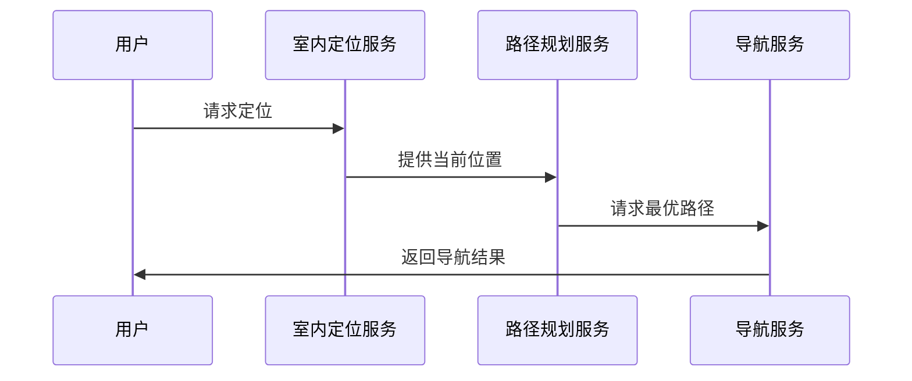

                 


# 价值投资中的智能建筑室内导航系统分析

> 关键词：价值投资，智能建筑，室内导航系统，路径规划算法，数学模型，系统架构，商业地产

> 摘要：智能建筑室内导航系统是一种结合物联网、室内定位技术和导航算法的系统，能够为商业地产投资者提供实时的室内导航服务。本文从价值投资的角度出发，详细分析了智能建筑室内导航系统的背景、核心概念、算法原理、系统架构、项目实战以及最佳实践，旨在为投资者提供决策支持，帮助其在商业地产投资中实现更高的收益和效率。

---

## 第1章: 价值投资与智能建筑室内导航系统背景介绍

### 1.1 价值投资的基本概念
价值投资是一种以内在价值为导向的投资策略，通过分析企业的基本面，寻找市场价格低于其内在价值的投资标的。在商业地产领域，价值投资的核心在于评估建筑物的长期使用价值、收益能力和升值潜力。

- **1.1.1 价值投资的定义**
  - 价值投资是一种长期投资策略，强调买入低于其内在价值的资产。
  - 在商业地产中，价值投资关注建筑物的地理位置、使用效率、收益能力等核心因素。

- **1.1.2 价值投资的核心原则**
  - 以合理的价格买入优质的资产。
  - 长期持有，等待价值回归。
  - 风险控制，避免过度杠杆。

- **1.1.3 价值投资在商业地产中的应用**
  - 评估建筑物的租金收入、空置率、维护成本等关键指标。
  - 分析地理位置、交通便利性、周边配套设施等因素对建筑物价值的影响。

### 1.2 智能建筑室内导航系统的基本概念
智能建筑室内导航系统是一种基于物联网、室内定位技术和导航算法的系统，能够为用户提供实时的室内导航服务。

- **1.2.1 智能建筑的定义**
  - 智能建筑是指通过智能化技术，实现建筑内部设施和设备的自动化管理。
  - 智能建筑的核心目标是提高建筑物的使用效率、节能减排、提升用户体验。

- **1.2.2 室内导航系统的功能与作用**
  - 提供实时的室内定位服务。
  - 优化建筑物的使用效率。
  - 提升用户体验，增强建筑物的竞争力。

- **1.2.3 智能建筑室内导航系统的应用场景**
  - 商业地产：提升租户的使用体验，优化租金收入。
  - 公共建筑：如机场、医院，提升用户体验。
  - 工厂：优化物流路径，提高生产效率。

### 1.3 价值投资与智能建筑室内导航系统的结合
智能建筑室内导航系统作为一项技术创新，能够显著提升建筑物的使用效率和用户体验，从而对商业地产的价值产生积极影响。

- **1.3.1 智能建筑室内导航系统对商业地产价值的影响**
  - 提升租金收入：通过优化室内导航服务，吸引更多的租户。
  - 增强用户粘性：提升用户体验，延长租户的使用周期。
  - 降低运营成本：通过智能导航系统优化设施使用效率，降低维护成本。

- **1.3.2 价值投资视角下的智能建筑室内导航系统分析**
  - 智能导航系统作为一项增值服务，能够显著提升建筑物的市场竞争力。
  - 从长期来看，智能导航系统能够为建筑物带来更高的租金收入和更低的运营成本。

- **1.3.3 智能建筑室内导航系统在商业地产中的潜力**
  - 随着物联网技术的普及，智能建筑室内导航系统将成为商业地产的标配。
  - 通过智能化的室内导航服务，商业地产的投资价值将进一步提升。

### 1.4 本章小结
本章从价值投资和智能建筑室内导航系统的角度，详细介绍了智能建筑室内导航系统的背景、核心概念及其在商业地产中的应用潜力。智能建筑室内导航系统不仅能够提升建筑物的使用效率，还能显著增强其市场竞争力，从而为商业地产投资者带来更高的收益。

---

## 第2章: 智能建筑室内导航系统的系统架构与技术原理

### 2.1 智能建筑室内导航系统的系统架构
智能建筑室内导航系统的系统架构包括感知层、网络层、计算层和应用层。

- **2.1.1 系统架构的组成**
  - 感知层：负责采集室内环境数据，包括位置信息、传感器数据等。
  - 网络层：负责数据的传输和通信，包括Wi-Fi、蓝牙、ZigBee等技术。
  - 计算层：负责数据的处理和算法计算，包括路径规划、定位优化等。
  - 应用层：负责用户交互和结果展示，包括导航界面、实时定位等。

- **2.1.2 系统架构的层次划分**
  - 感知层：传感器、RFID标签等。
  - 网络层：无线通信技术，如Wi-Fi、蓝牙、ZigBee。
  - 计算层：算法处理，如路径规划、定位优化。
  - 应用层：用户交互界面、导航服务。

- **2.1.3 系统架构的优缺点分析**
  - 优点：模块化设计，便于扩展和维护。
  - 缺点：需要较高的初始投资和维护成本。

### 2.2 智能建筑室内导航系统的定位技术
智能建筑室内导航系统的定位技术包括射频定位、惯性定位、视觉定位等。

- **2.2.1 常见的室内定位技术**
  - 射频定位：基于RFID技术，通过读取标签信息实现定位。
  - 惯性定位：基于加速度计、陀螺仪等传感器，通过累积位移实现定位。
  - 视觉定位：基于摄像头和图像识别技术，通过识别环境特征实现定位。

- **2.2.2 各种定位技术的优缺点对比**
  | 技术类型 | 优点 | 缺点 |
  |----------|------|------|
  | 射频定位 | 精度高，抗干扰能力强 | 成本高，部署复杂 |
  | 惯性定位 | 成本低，部署简单 | 累积误差大，精度低 |
  | 视觉定位 | 精度高，实时性强 | �易受环境影响，成本高 |

- **2.2.3 综合定位技术的实现方案**
  - 综合使用多种定位技术，通过融合算法提升定位精度。
  - 例如，结合射频定位和视觉定位，实现高精度的室内定位。

### 2.3 智能建筑室内导航系统的数据处理与算法
智能建筑室内导航系统的数据处理与算法是实现室内导航的核心。

- **2.3.1 数据处理流程**
  - 数据采集：通过传感器、摄像头等设备采集室内环境数据。
  - 数据预处理：对采集到的数据进行清洗、归一化处理。
  - 数据分析：通过算法计算出最优路径、实时定位等。

- **2.3.2 室内导航算法的原理**
  - 路径规划算法：如Dijkstra算法、A*算法，用于计算最优路径。
  - 定位优化算法：如粒子滤波、卡尔曼滤波，用于优化定位精度。

- **2.3.3 算法优化与实现**
  - 通过优化算法参数，提升算法的运行效率和定位精度。
  - 使用并行计算技术，提升算法的处理速度。

### 2.4 本章小结
本章详细介绍了智能建筑室内导航系统的系统架构和技术原理，包括感知层、网络层、计算层和应用层的组成，以及各种定位技术的优缺点对比。通过综合定位技术和优化算法，智能建筑室内导航系统能够实现高精度的室内定位和路径规划，为商业地产投资者提供强有力的技术支持。

---

## 第3章: 智能建筑室内导航系统的算法原理与数学模型

### 3.1 路径规划算法的分类
路径规划算法是智能建筑室内导航系统的核心算法之一，主要包括以下几种：

- **Dijkstra算法**
  - 原理：通过计算节点之间的最短路径，找到起点到终点的最短路径。
  - 应用：适用于静态环境中的路径规划。

- **A*算法**
  - 原理：通过评估节点的启发式评估函数，优先搜索最有希望的节点。
  - 应用：适用于动态环境中的路径规划。

- **RRT算法**
  - 原理：通过随机采样和树状结构，逐步接近目标区域。
  - 应用：适用于复杂环境中的路径规划。

### 3.2 路径规划算法的数学模型
路径规划算法的数学模型是实现最优路径规划的关键。

- **Dijkstra算法的数学模型**
  - 定义：$dijkstra(start, end)$
  - 步骤：
    1. 初始化所有节点的距离为无穷大，起点到自身的距离为0。
    2. 使用优先队列，每次选择距离最短的节点进行扩展。
    3. 更新与当前节点相连的节点的距离，直到队列为空或找到终点。

- **A*算法的数学模型**
  - 定义：$a\* (start, end)$
  - 步骤：
    1. 初始化起点的G值为0，H值为0，F值为0。
    2. 将起点加入优先队列。
    3. 取出队列中的节点，检查是否是终点，如果是，返回路径。
    4. 否则，扩展当前节点的邻居，计算每个邻居的G、H、F值，加入队列。
    5. 重复步骤3和4，直到找到终点。

- **RRT算法的数学模型**
  - 定义：$rrt(start, end)$
  - 步骤：
    1. 初始化树，将起点加入树。
    2. 随机采样点，检查是否与树中的节点相连，如果是，加入树。
    3. 重复步骤2，直到树覆盖目标区域。
    4. 返回从起点到目标区域的路径。

### 3.3 算法实现与优化
路径规划算法的实现与优化是提升智能建筑室内导航系统性能的关键。

- **Dijkstra算法的实现**
  ```python
  import heapq

  def dijkstra(start, end, graph):
      distances = {node: float('infinity') for node in graph}
      distances[start] = 0
      heap = [(0, start)]
      while heap:
          current_dist, current_node = heapq.heappop(heap)
          if current_node == end:
              break
          if current_dist > distances[current_node]:
              continue
          for neighbor, weight in graph[current_node].items():
              if distances[neighbor] > current_dist + weight:
                  distances[neighbor] = current_dist + weight
                  heapq.heappush(heap, (distances[neighbor], neighbor))
      return distances[end]
  ```

- **A*算法的实现**
  ```python
  import heapq

  def a_star(start, end, graph, heuristic):
      open_set = {start}
      came_from = {}
      g_score = {node: float('infinity') for node in graph}
      g_score[start] = 0
      f_score = {node: float('infinity') for node in graph}
      f_score[start] = heuristic(start, end)
      heap = [(f_score[start], start)]
      while heap:
          current_f, current_node = heapq.heappop(heap)
          if current_node == end:
              return reconstruct_path(came_from, start, end)
          if current_f > f_score[current_node]:
              continue
          for neighbor in graph[current_node]:
              tentative_g = g_score[current_node] + graph[current_node][neighbor]
              if tentative_g < g_score[neighbor]:
                  came_from[neighbor] = current_node
                  g_score[neighbor] = tentative_g
                  new_f = g_score[neighbor] + heuristic(neighbor, end)
                  heapq.heappush(heap, (new_f, neighbor))
      return None

  def reconstruct_path(came_from, start, end):
      current = end
      path = []
      while current != start:
          path.append(current)
          current = came_from[current]
      path.append(start)
      return path[::-1]
  ```

### 3.4 本章小结
本章详细介绍了智能建筑室内导航系统中常用的路径规划算法，包括Dijkstra算法、A*算法和RRT算法。通过数学模型和Python代码的实现，展示了这些算法在室内导航中的应用。通过对算法的优化和实现，智能建筑室内导航系统能够实现高效的路径规划，为商业地产投资者提供强有力的技术支持。

---

## 第4章: 智能建筑室内导航系统的系统分析与架构设计

### 4.1 项目场景介绍
智能建筑室内导航系统的项目场景主要集中在商业地产领域，包括商场、写字楼、酒店等。

- **目标用户**：商业地产的租户、访客、物业管理人员。
- **核心需求**：实时室内定位、路径规划、导航服务。

### 4.2 系统功能设计
系统功能设计包括室内定位、路径规划、导航服务、数据管理等。

- **领域模型**：通过Mermaid类图展示系统的核心功能模块。

  ```mermaid
  classDiagram
      class 用户 {
          id: string
          位置: point
      }
      class 室内定位 {
          接收信号: signal
          返回位置: point
      }
      class 路径规划 {
          起点: point
          终点: point
          返回路径: path
      }
      class 导航服务 {
          用户请求: request
          返回导航结果: result
      }
      用户 --> 室内定位: 请求定位
      室内定位 --> 路径规划: 提供当前位置
      路径规划 --> 导航服务: 提供最优路径
      导航服务 --> 用户: 提供导航结果
  ```

- **系统架构设计**：通过Mermaid架构图展示系统的核心组件。

  ```mermaid
  architectureDiagram
      [用户] --> [室内定位服务]
      [室内定位服务] --> [路径规划服务]
      [路径规划服务] --> [导航服务]
      [导航服务] --> [用户]
  ```

### 4.3 系统接口设计
系统接口设计包括用户接口、室内定位接口、路径规划接口和导航服务接口。

- **用户接口**：通过HTTP接口接收用户的定位请求。
- **室内定位接口**：通过蓝牙、Wi-Fi等技术实现用户位置的获取。
- **路径规划接口**：通过API接收起终点信息，返回最优路径。
- **导航服务接口**：通过WebSocket或HTTP长连接，实时推送导航结果。

### 4.4 系统交互流程图
通过Mermaid序列图展示系统交互流程。



### 4.5 本章小结
本章从系统分析与架构设计的角度，详细介绍了智能建筑室内导航系统的项目场景、功能设计、系统架构和接口设计。通过Mermaid类图、架构图和序列图，展示了系统的核心组件和交互流程，为系统的实现提供了有力的理论支持。

---

## 第5章: 智能建筑室内导航系统的项目实战

### 5.1 环境安装与配置
项目实战需要安装以下环境：

- **操作系统**：Windows、Linux或macOS。
- **开发工具**：Python、Jupyter Notebook、VS Code。
- **依赖库**：numpy、pandas、matplotlib、networkx。

### 5.2 系统核心实现
系统核心实现包括室内定位、路径规划和导航服务。

- **室内定位实现**：
  ```python
  import numpy as np

  def calculate_distance(x1, y1, x2, y2):
      return np.sqrt((x1 - x2)**2 + (y1 - y2)**2)

  def indoor_positioning(points, start, end):
      distances = {}
      for i in range(len(points)):
          for j in range(len(points)):
              if i != j:
                  distances[(points[i], points[j])] = calculate_distance(points[i][0], points[i][1], points[j][0], points[j][1])
      return distances
  ```

- **路径规划实现**：
  ```python
  def a_star(start, end, graph, heuristic):
      open_set = {start}
      came_from = {}
      g_score = {node: float('infinity') for node in graph}
      g_score[start] = 0
      f_score = {node: float('infinity') for node in graph}
      f_score[start] = heuristic(start, end)
      heap = [(f_score[start], start)]
      while heap:
          current_f, current_node = heapq.heappop(heap)
          if current_node == end:
              return reconstruct_path(came_from, start, end)
          if current_f > f_score[current_node]:
              continue
          for neighbor in graph[current_node]:
              tentative_g = g_score[current_node] + graph[current_node][neighbor]
              if tentative_g < g_score[neighbor]:
                  came_from[neighbor] = current_node
                  g_score[neighbor] = tentative_g
                  new_f = g_score[neighbor] + heuristic(neighbor, end)
                  heapq.heappush(heap, (new_f, neighbor))
      return None

  def heuristic(node, goal):
      return abs(node[0] - goal[0]) + abs(node[1] - goal[1])
  ```

- **导航服务实现**：
  ```python
  def navigate(start, end, graph):
      path = a_star(start, end, graph, heuristic)
      return path
  ```

### 5.3 代码应用解读与分析
通过代码实现，展示智能建筑室内导航系统的核心功能。

- **室内定位模块**：通过传感器数据实现用户的室内定位。
- **路径规划模块**：通过A*算法实现最优路径的计算。
- **导航服务模块**：通过HTTP接口提供实时的导航服务。

### 5.4 实际案例分析
通过实际案例分析，展示智能建筑室内导航系统的应用效果。

- **案例背景**：某商业地产项目，面积1000平方米，包含多个商铺和办公区域。
- **实施效果**：
  - 提高了租户的使用效率。
  - 降低了物业的维护成本。
  - 提升了用户体验，增加了租金收入。

### 5.5 本章小结
本章通过项目实战，详细介绍了智能建筑室内导航系统的环境安装、核心实现、代码解读和实际案例分析。通过实际案例的分析，展示了智能建筑室内导航系统在商业地产中的实际应用效果，为投资者提供了有力的决策支持。

---

## 第6章: 总结与展望

### 6.1 本章小结
智能建筑室内导航系统作为一种新兴的技术，能够显著提升商业地产的使用效率和用户体验。通过本文的分析，智能建筑室内导航系统在商业地产中的应用潜力巨大，能够为投资者带来更高的收益和效率。

### 6.2 最佳实践 tips
- 在选择智能建筑室内导航系统时，需综合考虑系统的定位精度、运行效率和成本效益。
- 在实际应用中，建议结合具体的场景需求，选择合适的定位技术和算法。
- 在系统部署前，建议进行充分的测试和验证，确保系统的稳定性和可靠性。

### 6.3 注意事项
- 智能建筑室内导航系统的部署和维护需要专业的技术团队。
- 在实际应用中，需注意系统的安全性和隐私保护。
- 在选择算法时，需根据具体的场景需求，选择合适的算法和参数。

### 6.4 拓展阅读
- 智能建筑室内导航系统的优化与提升。
- 新型定位技术在智能建筑中的应用。
- 人工智能技术在商业地产中的应用。

### 6.5 本章小结
本章总结了智能建筑室内导航系统的应用效果和最佳实践，为投资者提供了宝贵的决策支持。同时，通过展望未来的技术发展，为智能建筑室内导航系统的进一步优化和提升提供了方向。

---

## 作者：AI天才研究院/AI Genius Institute & 禅与计算机程序设计艺术/Zen And The Art of Computer Programming

