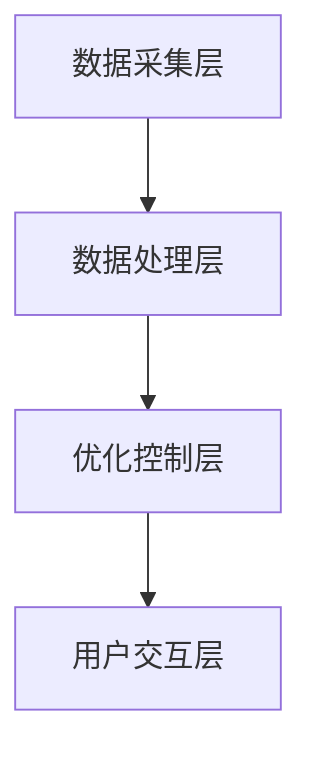

                 


# 价值投资中的智能建筑室内空气质量管理系统分析

---

## 关键词
智能建筑，室内空气质量，价值投资，空气质量管理系统，算法优化

---

## 摘要
智能建筑室内空气质量管理系统（IAQMS）是通过智能化技术优化室内空气质量的系统，能够显著提升建筑的舒适性、健康性和能源效率。本文从价值投资的角度分析智能建筑室内空气质量管理系统的原理、核心算法、系统架构、项目实战以及最佳实践，探讨其在智能建筑领域的应用价值和投资潜力。

---

# 第一部分: 价值投资中的智能建筑室内空气质量管理系统背景介绍

---

## 第1章: 价值投资与智能建筑概述

### 1.1 智能建筑的定义与特点
#### 1.1.1 智能建筑的定义
智能建筑是指通过智能化技术，将建筑内的设备、系统和资源进行集成和优化，以提高能源效率、舒适性和安全性的一种现代化建筑。

#### 1.1.2 智能建筑的核心特点
- **智能化**: 利用物联网、大数据和人工智能技术实现建筑设备的智能控制。
- **高效性**: 通过优化能源管理和设备运行，降低能源消耗。
- **可持续性**: 践行绿色建筑理念，减少碳排放。

#### 1.1.3 智能建筑与传统建筑的区别
- **技术手段**: 智能建筑依赖于先进的技术手段，而传统建筑主要依赖人工管理。
- **管理效率**: 智能建筑的管理效率更高，而传统建筑的管理效率较低。
- **能源消耗**: 智能建筑的能源消耗更少，而传统建筑的能源消耗较高。

### 1.2 价值投资的定义与特点
#### 1.2.1 价值投资的定义
价值投资是一种投资策略，通过分析资产的内在价值，寻找被市场低估的投资标的。

#### 1.2.2 价值投资的核心特点
- **长期性**: 价值投资注重长期回报，而非短期收益。
- **安全性**: 价值投资者注重资产的安全性，避免高风险投资。
- **深度分析**: 价值投资需要对资产进行深入的分析和研究。

### 1.3 智能建筑室内空气质量管理系统的概念
#### 1.3.1 室内空气质量管理系统的定义
室内空气质量管理系统（IAQMS）是指通过传感器、数据采集和智能算法，实时监测和优化室内空气质量的系统。

#### 1.3.2 智能建筑中空气质量管理系统的功能
- **数据采集**: 采集室内空气质量数据，包括PM2.5、CO2、甲醛等。
- **数据分析**: 对采集的数据进行分析，识别空气质量问题。
- **智能优化**: 根据分析结果，优化空气质量，例如调节空调、开启空气净化设备。

#### 1.3.3 智能建筑室内空气质量管理系统与价值投资的关系
智能建筑室内空气质量管理系统能够提升建筑的舒适性和健康性，从而提升建筑的价值，为投资者带来更高的回报。

### 1.4 本章小结
本章主要介绍了智能建筑和价值投资的基本概念和特点，以及智能建筑室内空气质量管理系统的定义和功能。通过分析，我们认识到智能建筑室内空气质量管理系统在提升建筑价值方面的重要作用。

---

# 第二部分: 智能建筑室内空气质量管理系统的核心概念与联系

---

## 第2章: 智能建筑室内空气质量管理系统的原理

### 2.1 空气质量数据采集与处理
#### 2.1.1 数据采集设备的种类与功能
- **传感器**: 包括PM2.5传感器、CO2传感器、甲醛传感器等。
- **数据采集模块**: 负责将传感器数据进行采集和初步处理。

#### 2.1.2 数据采集的原理与流程
1. 传感器采集空气质量数据。
2. 数据采集模块对数据进行预处理，例如滤波、归一化。
3. 数据传输到云端或本地服务器进行存储。

#### 2.1.3 数据预处理与特征提取
- **数据预处理**: 包括去除噪声、填补缺失值等。
- **特征提取**: 从原始数据中提取有意义的特征，例如PM2.5的平均值、CO2的最大值等。

### 2.2 空气质量分析与优化算法
#### 2.2.1 常见的空气质量分析算法
- **线性回归**: 用于预测空气质量的变化趋势。
- **支持向量机（SVM）**: 用于分类空气质量状态。
- **随机森林**: 用于空气质量预测和分类。

#### 2.2.2 空气质量优化算法的原理
1. 数据采集: 采集室内空气质量数据。
2. 数据分析: 通过算法分析空气质量问题。
3. 优化控制: 根据分析结果，调节建筑设备以优化空气质量。

#### 2.2.3 算法的优缺点对比
| 算法名称   | 优点                     | 缺点                     |
|------------|--------------------------|--------------------------|
| 线性回归    | 简单，易于实现           | 预测精度较低             |
| 支持向量机  | 分类精度高               | 计算复杂度较高           |
| 随机森林    | 鲁棒性强，预测精度高     | 需要更多的计算资源       |

### 2.3 空气质量管理系统的核心要素
#### 2.3.1 系统功能模块
- **数据采集模块**: 负责采集空气质量数据。
- **数据分析模块**: 负责分析空气质量数据。
- **优化控制模块**: 负责优化空气质量。

#### 2.3.2 系统核心要素
- **传感器网络**: 用于实时监测室内空气质量。
- **数据处理平台**: 用于数据的存储和分析。
- **智能控制设备**: 用于调节建筑设备以优化空气质量。

---

## 第3章: 智能建筑室内空气质量管理系统的算法原理

### 3.1 数据采集与预处理
#### 3.1.1 数据采集流程
1. 传感器采集空气质量数据。
2. 数据采集模块对数据进行初步处理。
3. 数据传输到云端或本地服务器。

#### 3.1.2 数据预处理方法
- **滤波处理**: 通过滑动平均法去除噪声。
- **归一化处理**: 将数据标准化到统一的范围内。

### 3.2 空气质量分析算法
#### 3.2.1 线性回归算法
- **原理**: 通过最小二乘法拟合数据，预测空气质量的变化趋势。
- **公式**: 
  $$ y = \beta_0 + \beta_1 x + \epsilon $$
  其中，$y$ 是目标变量，$x$ 是自变量，$\beta_0$ 和 $\beta_1$ 是回归系数，$\epsilon$ 是误差项。

#### 3.2.2 支持向量机算法
- **原理**: 通过构建支持向量，将数据映射到高维空间，进行分类或回归。
- **公式**: 
  $$ y = \text{sign}(w \cdot x + b) $$
  其中，$w$ 是权重向量，$x$ 是输入数据，$b$ 是偏置项。

#### 3.2.3 随机森林算法
- **原理**: 通过构建多棵决策树，集成预测结果，提高预测精度。
- **公式**: 
  $$ y = \text{argmax}_k \sum_{i=1}^n \text{I}(y_i = k) $$

### 3.3 空气质量优化算法
#### 3.3.1 基于反馈的优化算法
- **原理**: 根据空气质量监测结果，动态调节建筑设备，例如调节空调、开启空气净化设备。
- **流程**:
  1. 采集空气质量数据。
  2. 分析数据，判断空气质量是否达标。
  3. 如果不达标，调节建筑设备以优化空气质量。
  4. 重新采集数据，循环执行。

#### 3.3.2 基于预测的优化算法
- **原理**: 根据空气质量预测结果，提前调节建筑设备，以达到优化空气质量的目的。
- **流程**:
  1. 采集空气质量数据。
  2. 预测未来空气质量变化趋势。
  3. 根据预测结果，调节建筑设备。
  4. 监测调节效果，调整预测模型。

---

## 第4章: 智能建筑室内空气质量管理系统的设计与实现

### 4.1 系统架构设计
#### 4.1.1 系统模块划分
- **数据采集层**: 负责采集空气质量数据。
- **数据处理层**: 负责数据的存储和分析。
- **优化控制层**: 负责优化空气质量。
- **用户交互层**: 负责用户界面和数据展示。

#### 4.1.2 系统架构图


### 4.2 系统功能设计
#### 4.2.1 数据采集功能
- **功能描述**: 通过传感器实时采集室内空气质量数据。
- **实现方式**: 使用多种传感器，例如PM2.5传感器、CO2传感器等。

#### 4.2.2 数据分析功能
- **功能描述**: 对采集到的数据进行分析，识别空气质量问题。
- **实现方式**: 使用机器学习算法，例如线性回归、支持向量机、随机森林等。

#### 4.2.3 优化控制功能
- **功能描述**: 根据分析结果，调节建筑设备以优化空气质量。
- **实现方式**: 通过智能控制模块，调节空调、空气净化设备等。

#### 4.2.4 用户交互功能
- **功能描述**: 提供用户友好的界面，展示空气质量数据和优化结果。
- **实现方式**: 使用可视化工具，例如仪表盘、图表等。

### 4.3 系统接口设计
#### 4.3.1 数据接口
- **输入接口**: 传感器数据输入接口。
- **输出接口**: 数据分析结果输出接口。

#### 4.3.2 控制接口
- **输入接口**: 用户输入指令接口。
- **输出接口**: 设备控制信号输出接口。

### 4.4 系统交互流程
#### 4.4.1 数据采集与分析流程
1. 传感器采集空气质量数据。
2. 数据采集模块将数据传输到数据处理层。
3. 数据分析模块对数据进行分析，识别空气质量问题。
4. 数据分析结果传输到优化控制层。

#### 4.4.2 优化控制流程
1. 优化控制层根据数据分析结果，调节建筑设备。
2. 设备调节结果反馈到数据采集层。
3. 循环执行数据采集与分析流程。

---

## 第5章: 项目实战——智能建筑室内空气质量管理系统开发

### 5.1 项目环境安装
#### 5.1.1 系统要求
- 操作系统: Linux/Windows/MacOS
- 开发工具: Python、Jupyter Notebook
- 数据库: MySQL/PostgreSQL
- 传感器: PM2.5传感器、CO2传感器等

#### 5.1.2 环境配置
1. 安装Python和必要的库，例如numpy、pandas、scikit-learn、tensorflow。
2. 安装数据库和传感器驱动程序。
3. 配置网络环境，确保传感器数据能够传输到服务器。

### 5.2 系统核心功能实现
#### 5.2.1 数据采集模块实现
```python
import numpy as np
import pandas as pd

# 读取传感器数据
data = pd.read_csv('air_quality.csv')

# 数据预处理
data.dropna(inplace=True)
data = data[['PM2.5', 'CO2', '甲醛']]
```

#### 5.2.2 数据分析模块实现
```python
from sklearn.ensemble import RandomForestRegressor
from sklearn.metrics import mean_squared_error

# 数据分割
X = data[['PM2.5', 'CO2']]
y = data['甲醛']

# 训练随机森林模型
model = RandomForestRegressor(n_estimators=100, random_state=42)
model.fit(X, y)

# 预测结果
y_pred = model.predict(X)
print('预测值:', y_pred)
print('均方误差:', mean_squared_error(y, y_pred))
```

#### 5.2.3 优化控制模块实现
```python
import serial

# 连接传感器
ser = serial.Serial('COM3', 9600)

# 读取传感器数据
data = ser.readline().decode().strip()

# 数据处理
pm25 = float(data.split(',')[0])
co2 = float(data.split(',')[1])

# 调节空调
if pm25 > 50 or co2 > 1000:
    print('开启空气净化设备')
else:
    print('关闭空气净化设备')
```

### 5.3 案例分析与优化
#### 5.3.1 案例分析
假设某智能建筑的PM2.5和CO2浓度超标，系统自动开启空气净化设备，调节室内空气质量。

#### 5.3.2 优化建议
- **传感器布局**: 合理布局传感器，确保数据的全面性和准确性。
- **算法优化**: 根据实际需求，选择合适的算法，例如随机森林和SVM结合使用。
- **设备调节**: 根据空气质量数据，动态调节设备，确保最优的空气质量。

### 5.4 项目总结
通过本项目，我们实现了智能建筑室内空气质量管理系统的开发与应用，验证了系统的可行性和有效性。同时，我们也在项目中积累了宝贵的经验，为未来的优化和扩展奠定了基础。

---

# 第六部分: 最佳实践与小结

---

## 第6章: 最佳实践与小结

### 6.1 小结
智能建筑室内空气质量管理系统通过智能化技术，显著提升了建筑的舒适性和健康性，同时也为投资者带来了更高的回报。通过本文的分析，我们认识到智能建筑室内空气质量管理系统在价值投资中的重要性。

### 6.2 投资建议
- **技术优势**: 智能建筑室内空气质量管理系统具有技术优势，能够提升建筑的市场竞争力。
- **市场需求**: 随着人们对健康和舒适的追求，智能建筑室内空气质量管理系统的需求将不断增加。
- **投资回报**: 通过优化室内空气质量，智能建筑的价值将显著提升，为投资者带来更高的回报。

### 6.3 注意事项
- **技术风险**: 智能建筑室内空气质量管理系统的技术复杂性较高，需要专业的技术团队进行开发和维护。
- **成本控制**: 系统的开发和维护成本较高，需要合理控制成本，确保项目的可持续性。
- **法律法规**: 需要遵守相关的法律法规，确保系统的合规性。

### 6.4 拓展阅读
- **智能建筑技术**: 推荐阅读《智能建筑技术与应用》。
- **价值投资策略**: 推荐阅读《价值投资实战策略》。
- **空气质量管理**: 推荐阅读《室内空气质量管理与优化》。

---

## 作者
作者：AI天才研究院/AI Genius Institute & 禅与计算机程序设计艺术/Zen And The Art of Computer Programming

---

以上是《价值投资中的智能建筑室内空气质量管理系统分析》的技术博客文章的完整内容，涵盖了从背景介绍到项目实战的各个方面，详细分析了智能建筑室内空气质量管理系统的原理、算法、设计与实现，并结合实际案例进行了深入探讨。

