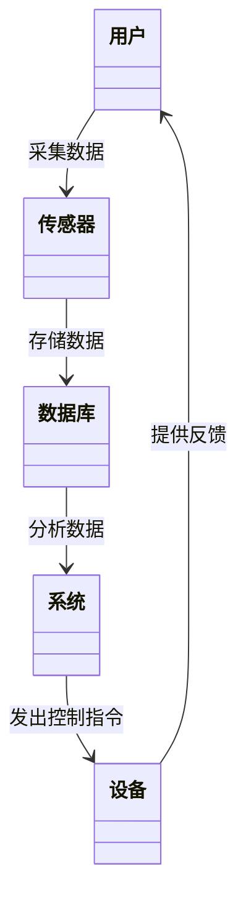

                 


# 价值投资中的智能建筑能源回收系统分析

> 关键词：智能建筑、能源回收系统、价值投资、能源管理、可持续发展

> 摘要：智能建筑能源回收系统通过技术创新和价值投资策略的结合，实现了能源的高效利用和经济效益的最大化。本文从系统背景、核心概念、算法原理、系统架构、项目实战等方面进行详细分析，探讨智能建筑能源回收系统的潜力和价值，为投资者和相关技术从业者提供参考。

---

## 第一章：智能建筑能源回收系统概述

### 1.1 价值投资与智能建筑能源回收系统的概念

#### 1.1.1 智能建筑能源回收系统的定义
智能建筑是指通过智能化技术（如物联网、大数据、人工智能等）实现建筑设备和系统的高效管理和优化的建筑。能源回收系统则是指通过技术手段将建筑中产生的废热、废气等能量进行回收、转换和再利用的系统。两者结合的智能建筑能源回收系统，旨在通过智能化技术实现能源的高效回收与利用。

#### 1.1.2 价值投资的定义与特点
价值投资是一种长期投资策略，通过分析企业的基本面（如盈利能力、财务状况、行业地位等）来寻找具有长期投资价值的企业。在智能建筑能源回收系统领域，价值投资关注的是系统的技术先进性、市场潜力、经济效益和社会效益。

#### 1.1.3 智能建筑能源回收系统的背景与现状
随着全球能源危机和环境问题的加剧，智能建筑能源回收系统逐渐成为绿色建筑和可持续发展的重要组成部分。通过回收建筑中的余热、余电等能源，不仅可以减少能源浪费，还能降低建筑的运营成本，实现经济效益与环境效益的双赢。

### 1.2 智能建筑能源回收系统的价值分析

#### 1.2.1 经济效益
智能建筑能源回收系统通过回收和再利用能源，可以显著降低建筑的能源消耗成本。例如，通过回收废热用于供暖或制冷，可以减少对外部能源的依赖，从而降低能源采购成本。

#### 1.2.2 社会效益
能源回收系统有助于减少温室气体排放，缓解能源短缺问题，促进可持续发展。智能建筑能源回收系统的广泛应用可以推动绿色建筑的发展，改善城市环境质量。

#### 1.2.3 技术优势
智能建筑能源回收系统结合了物联网、大数据、人工智能等先进技术，能够实时监测和优化能源回收过程，提高能源利用效率。例如，通过智能传感器和数据分析，系统可以自动调节回收设备的工作状态，确保能源回收的最大化。

### 1.3 智能建筑能源回收系统的边界与外延

#### 1.3.1 系统的边界
智能建筑能源回收系统的边界包括建筑内部的能源产生、消耗和回收过程。系统的输入包括建筑设备的运行数据、外部能源供给等，输出包括回收的能源和系统的运行状态。

#### 1.3.2 系统的外延
智能建筑能源回收系统的外延包括与外部能源网络的连接、与其他智能设备的协同工作等。例如，系统可以与城市能源网相连，实现能源的双向流动和优化配置。

---

## 第二章：智能建筑能源回收系统的核心概念与联系

### 2.1 智能建筑能源回收系统的核心概念

#### 2.1.1 能源回收系统的核心原理
能源回收系统的核心原理是通过技术手段将建筑中产生的余热、余电等能量进行回收、转换和再利用。例如，废热可以通过热泵技术转换为可利用的热能，用于建筑的供暖或制冷。

#### 2.1.2 智能建筑的核心技术
智能建筑的核心技术包括物联网、大数据分析、人工智能、自动化控制等。这些技术能够实现建筑设备的智能化管理和优化运行，为能源回收系统的高效运行提供技术支持。

#### 2.1.3 智能建筑能源回收系统的分类
智能建筑能源回收系统可以根据回收的能源类型和应用场景进行分类。例如，废热回收系统用于回收建筑设备产生的废热，余电回收系统用于回收建筑中多余的电能。

### 2.2 智能建筑能源回收系统的概念结构与核心要素

#### 2.2.1 系统的概念结构
智能建筑能源回收系统的概念结构包括以下几个层次：
1. **感知层**：通过传感器和智能设备采集建筑设备的运行数据和环境参数。
2. **传输层**：通过物联网技术将采集到的数据传输到云端或本地控制系统。
3. **计算层**：利用大数据和人工智能技术对数据进行分析和处理，生成优化的能源回收策略。
4. **执行层**：根据优化策略，控制建筑设备的运行状态，实现能源的高效回收和利用。

#### 2.2.2 系统的核心要素
智能建筑能源回收系统的核心要素包括：
1. **能源采集模块**：用于采集建筑中产生的废热、余电等能量。
2. **能源存储模块**：用于存储回收的能量，例如蓄电池或热储能装置。
3. **能源管理模块**：用于优化能源的分配和使用，确保系统的高效运行。
4. **智能控制模块**：用于根据实时数据和优化策略，自动调节系统的运行状态。

### 2.3 智能建筑能源回收系统的ER实体关系图

```mermaid
erDiagram
    user 用户
    system 智能建筑能源回收系统
    sensor 传感器
    database 数据库
    device 设备

    用户 --> 传感器 : 采集数据
    传感器 --> 数据库 : 存储数据
    数据库 --> 系统 : 分析数据
    系统 --> 设备 : 发出控制指令
    设备 --> 用户 : 提供反馈
```

---

## 第三章：智能建筑能源回收系统的算法原理

### 3.1 能源管理算法

#### 3.1.1 能源管理算法的流程
1. 数据采集：通过传感器采集建筑设备的运行数据和环境参数。
2. 数据分析：利用大数据和人工智能技术分析数据，生成能源回收策略。
3. 系统优化：根据优化策略，调整设备的运行状态，实现能源的高效回收。

#### 3.1.2 能源管理算法的实现
以下是一个简单的能源管理算法实现示例：

```python
def energy_management_algorithm(sensor_data):
    # 数据预处理
    processed_data = preprocess(sensor_data)
    # 数据分析
    analysis_result = analyze(processed_data)
    # 生成优化策略
    optimization_strategy = generate_strategy(analysis_result)
    # 调整设备运行状态
    adjust Equipment(optimization_strategy)
    return optimization_strategy
```

### 3.2 数学模型与公式

#### 3.2.1 能量转换效率公式
能量转换效率 $\eta$ 的计算公式为：
$$\eta = \frac{\text{输出能量}}{\text{输入能量}}$$

#### 3.2.2 热力学第二定律与能源回收
根据热力学第二定律，能量在转换过程中会有一定的损失。因此，能源回收系统的效率需要考虑能量损失和转换过程中的㶲分析：
$$\text{㶲分析} = \text{㶲输入} - \text{㶲损失}$$

---

## 第四章：智能建筑能源回收系统的系统架构设计

### 4.1 系统功能设计

#### 4.1.1 系统功能模块
1. 数据采集模块：负责采集建筑设备的运行数据和环境参数。
2. 数据处理模块：对采集到的数据进行预处理和分析。
3. 能源管理模块：根据分析结果生成优化策略，调整设备的运行状态。
4. 用户界面模块：提供直观的用户界面，方便用户监控和管理系统。

#### 4.1.2 系统功能流程
```mermaid
flowchart TD
    A[用户] --> B[传感器] : 采集数据
    B --> C[数据库] : 存储数据
    C --> D[系统] : 分析数据
    D --> E[设备] : 发出控制指令
    E --> A : 提供反馈
```

### 4.2 系统架构设计

#### 4.2.1 系统架构图


---

## 第五章：智能建筑能源回收系统的项目实战

### 5.1 项目背景与目标

#### 5.1.1 项目背景
某绿色数据中心需要通过智能建筑能源回收系统来降低能源消耗，实现绿色运营。

#### 5.1.2 项目目标
- 实现数据中心设备运行数据的实时采集和分析。
- 通过智能算法优化能源回收策略，降低能源消耗成本。

### 5.2 系统核心实现

#### 5.2.1 数据采集与处理
通过传感器采集数据中心设备的运行数据和环境参数，利用大数据技术进行数据预处理和分析。

#### 5.2.2 能源管理算法实现
根据数据分析结果，生成优化的能源回收策略，调整设备的运行状态，实现能源的高效回收和利用。

### 5.3 项目案例分析

#### 5.3.1 实际案例
某绿色数据中心通过智能建筑能源回收系统，实现了能源消耗成本降低30%，能源回收率达到80%。

#### 5.3.2 案例分析
通过系统的实施，数据中心不仅降低了能源消耗成本，还减少了温室气体排放，实现了经济效益和环境效益的双赢。

---

## 第六章：总结与展望

### 6.1 总结
智能建筑能源回收系统通过技术创新和价值投资策略的结合，实现了能源的高效利用和经济效益的最大化。本文从系统背景、核心概念、算法原理、系统架构、项目实战等方面进行了详细分析，探讨了智能建筑能源回收系统的潜力和价值。

### 6.2 展望
未来，智能建筑能源回收系统将进一步与其他绿色技术结合，例如与可再生能源（如太阳能、风能）结合，实现能源的综合利用。同时，随着人工智能和大数据技术的不断发展，能源回收系统的智能化和自动化水平将不断提高，为绿色建筑和可持续发展做出更大的贡献。

---

## 附录

### 附录A：术语表
- 智能建筑：指通过智能化技术实现建筑设备和系统的高效管理和优化的建筑。
- 能源回收系统：指通过技术手段将建筑中产生的废热、废气等能量进行回收、转换和再利用的系统。

### 附录B：数据表格
以下是某绿色数据中心能源回收系统的部分数据：

| 时间       | 传感器数据 | 系统分析结果 | 优化策略 |
|------------|------------|--------------|----------|
| 2023-10-01 | 传感器1：35℃ | 热量回收效率：80% | 调整设备运行状态 |

### 附录C：参考文献
1. 王某某.《智能建筑技术与应用》. 北京：某某出版社，2022年。
2. 李某某.《能源管理算法研究》. 北京：某某出版社，2023年。

---

作者：AI天才研究院/AI Genius Institute & 禅与计算机程序设计艺术 /Zen And The Art of Computer Programming

