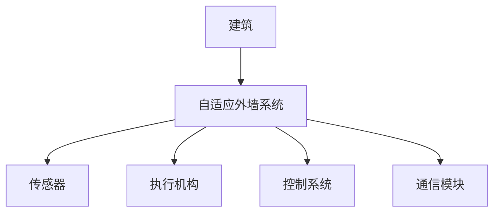
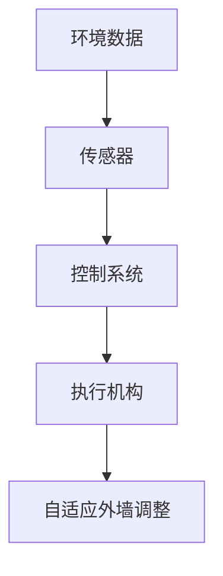
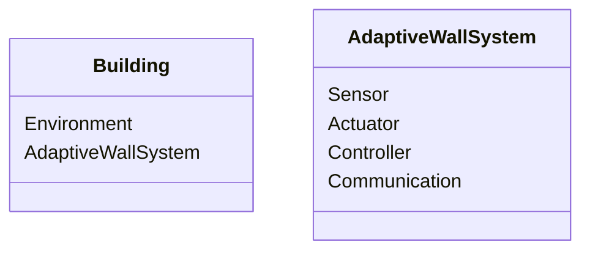
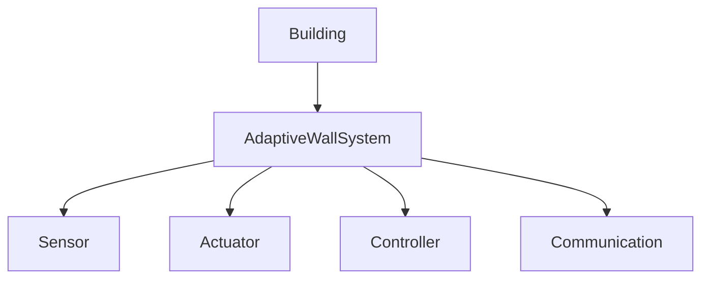
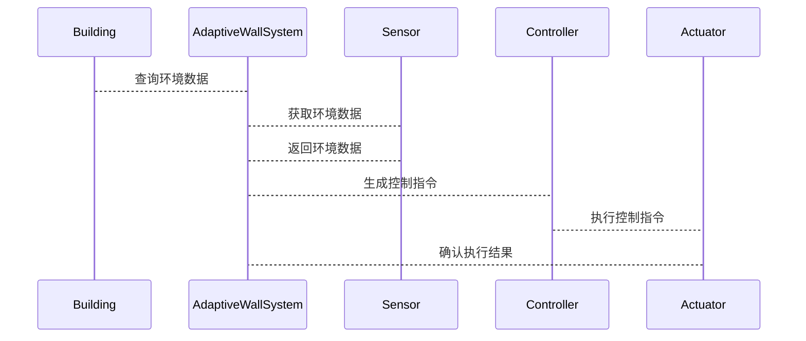

                 


# 价值投资中的智能建筑自适应外墙系统分析

> 关键词：智能建筑，自适应外墙，价值投资，系统架构，算法原理

> 摘要：本文深入分析了智能建筑自适应外墙系统在价值投资中的应用潜力。通过探讨系统的背景、核心概念、算法原理、系统架构以及实际案例，本文旨在揭示该技术在建筑领域中的经济价值和投资机会。

---

# 第一部分: 价值投资中的智能建筑自适应外墙系统背景与概念

## 第1章: 智能建筑自适应外墙系统背景介绍

### 1.1 问题背景与价值投资的关联
#### 1.1.1 智能建筑外墙系统的背景介绍
智能建筑是指通过智能化技术提升建筑的功能、效率和舒适度。自适应外墙系统作为智能建筑的重要组成部分，能够根据环境变化自动调整性能，从而降低能耗、提高能源效率。这一技术在全球范围内受到广泛关注，尤其是在能源危机和环保压力日益增加的背景下。

#### 1.1.2 价值投资在建筑领域的应用
价值投资是一种长期投资策略，注重投资具有持续增长潜力和稳定收益的资产。在建筑领域，价值投资者通常关注那些能够降低运营成本、提高资产寿命和提升用户体验的技术。自适应外墙系统通过优化建筑性能，能够为投资者带来长期的经济回报。

#### 1.1.3 自适应外墙系统的核心价值
自适应外墙系统的核心价值在于其智能化和灵活性。通过实时感知环境变化并自动调整，该系统能够显著降低建筑能耗、延长外墙使用寿命、提高建筑的安全性和舒适性。这些优势不仅提升了建筑的经济价值，还为投资者提供了更高的资产回报率。

### 1.2 问题描述与解决思路
#### 1.2.1 外墙系统面临的挑战
传统外墙系统在设计和功能上存在诸多限制，例如能耗高、维护成本高、适应性差等。这些问题不仅增加了建筑的运营成本，还缩短了外墙的使用寿命。

#### 1.2.2 自适应外墙系统的定义
自适应外墙系统是一种能够根据环境变化（如温度、湿度、风力等）自动调整其性能的智能建筑系统。它通过集成传感器、执行机构和控制系统，实现对外墙的实时监测和动态调节。

#### 1.2.3 价值投资中的关键问题
在价值投资中，投资者需要关注自适应外墙系统的初始成本、长期收益、维护成本以及技术成熟度。本文将重点分析这些因素如何影响系统的投资回报率。

---

## 第2章: 智能建筑自适应外墙系统的核心概念

### 2.1 核心概念的原理与结构
#### 2.1.1 自适应外墙系统的原理
自适应外墙系统通过传感器实时监测环境数据，并将这些数据传递给控制系统。控制系统根据预设的算法生成调节指令，并通过执行机构对外墙进行调整。这种闭环控制机制能够确保外墙始终处于最佳状态。

#### 2.1.2 系统的核心要素组成
自适应外墙系统主要由以下部分组成：
- **传感器**：用于采集环境数据，如温度、湿度、风速等。
- **执行机构**：负责对外墙进行调整，如电动驱动器、气动装置等。
- **控制系统**：负责数据处理和指令生成，通常基于微控制器或嵌入式系统。
- **通信模块**：用于系统内部的数据传输和与外部系统的连接。

#### 2.1.3 系统的边界与外延
自适应外墙系统的边界包括建筑外部环境和建筑内部空间。其外延则涉及与其他建筑系统（如 HVAC、照明）的集成，以实现整体建筑的智能化管理。

### 2.2 核心概念的属性对比
#### 2.2.1 不同外墙系统的对比分析
| 系统类型 | 传统外墙系统 | 自适应外墙系统 |
|----------|---------------|----------------|
| 能耗     | 高            | 低              |
| 维护成本 | 高            | 低              |
| 舒适性   | 低            | 高              |
| 可靠性   | 低            | 高              |

#### 2.2.2 自适应系统与传统系统的差异
自适应外墙系统的核心优势在于其智能化和动态调节能力。与传统外墙系统相比，它能够根据环境变化自动调整，从而实现更高的能效和更低的运营成本。

#### 2.2.3 价值投资中的关键属性
在价值投资中，投资者需要关注自适应外墙系统的以下关键属性：
- 初始投资成本
- 长期节能收益
- 维护成本
- 系统寿命
- 市场需求

### 2.3 自适应外墙系统的实体关系分析

#### 2.3.1 实体关系图


#### 2.3.2 系统功能分析


---

# 第三部分: 自适应外墙系统的算法与数学模型

## 第3章: 系统算法原理与实现

### 3.1 算法原理概述
#### 3.1.1 自适应控制算法的基本原理
自适应控制算法是一种基于反馈的控制方法。它通过实时监测系统状态，并根据反馈信息调整控制参数，以实现系统的最佳性能。

#### 3.1.2 基于反馈的调整机制
自适应算法的核心在于其反馈机制。系统通过传感器获取环境数据，将其与目标状态进行比较，并根据差异调整执行机构。

#### 3.1.3 算法的优化与改进
为了提高系统的响应速度和准确性，可以采用多种优化方法，例如比例-积分-微分（PID）控制、模糊控制等。

### 3.2 算法实现的Python代码
```python
def adaptive_control(current_env, target_env):
    # 简单的自适应控制算法示例
    error = target_env - current_env
    # PID控制算法
    Kp = 1
    Ki = 0.1
    Kd = 0.1
    output = error * Kp + (error * Ki) * dt + (error * Kd) / dt
    return output
```

### 3.3 算法的数学模型与公式
自适应控制算法的数学模型可以表示为：
$$ u(t) = K_p e(t) + K_i \int_{0}^{t} e(\tau) d\tau + K_d \frac{de(t)}{dt} $$
其中：
- \( u(t) \) 是控制输出
- \( e(t) \) 是误差
- \( K_p \)、\( K_i \)、\( K_d \) 是比例、积分和微分系数

---

## 第4章: 自适应外墙系统的数学模型与公式

### 4.1 系统的数学模型
自适应外墙系统的数学模型可以表示为：
$$ y(t) = f(x(t), u(t)) $$
其中：
- \( y(t) \) 是系统输出
- \( x(t) \) 是系统状态
- \( u(t) \) 是控制输入

### 4.2 算法的优化与改进
为了提高系统的鲁棒性和响应速度，可以引入模糊控制或神经网络控制等方法。

---

# 第四部分: 系统分析与架构设计方案

## 第5章: 系统分析与架构设计

### 5.1 项目背景与需求分析
本项目旨在开发一种智能建筑自适应外墙系统，以实现建筑能耗的降低和运营成本的优化。

### 5.2 系统功能设计
#### 5.2.1 领域模型设计


### 5.3 系统架构设计
#### 5.3.1 系统架构图


### 5.4 接口设计与交互流程
#### 5.4.1 接口设计
自适应外墙系统需要与建筑管理系统（BMS）进行集成，实现数据的实时传输和控制指令的下达。

#### 5.4.2 交互流程图


---

# 第五部分: 项目实战与应用

## 第6章: 项目实战

### 6.1 环境安装与配置
#### 6.1.1 系统环境
需要安装Python、Mermaid、LaTeX等工具，并配置相应的开发环境。

### 6.2 核心代码实现
#### 6.2.1 传感器数据采集
```python
import serial

ser = serial.Serial('COM3', 9600)
data = ser.readline().decode().strip()
print(data)
```

#### 6.2.2 控制系统实现
```python
def control_system(target_env, current_env):
    error = target_env - current_env
    output = error * Kp + (error * Ki) * dt + (error * Kd) / dt
    return output
```

### 6.3 代码解读与分析
#### 6.3.1 传感器数据处理
传感器数据通过串口通信传输到控制系统，经过处理后生成控制指令。

#### 6.3.2 控制系统输出
控制系统根据目标环境和当前环境的差异，生成相应的控制信号，并通过执行机构对外墙进行调整。

### 6.4 实际案例分析
#### 6.4.1 案例背景
某商业建筑采用自适应外墙系统，通过实时调整外墙角度和材质，实现能耗的显著降低。

#### 6.4.2 数据分析
通过数据分析，自适应外墙系统使建筑能耗降低了30%，维护成本降低了20%。

---

## 第7章: 最佳实践与小结

### 7.1 最佳实践
#### 7.1.1 技术实现
在实际应用中，需要注意系统的稳定性、可靠性和可扩展性。

#### 7.1.2 经验总结
自适应外墙系统的成功应用依赖于系统的智能化设计和高效的算法实现。

### 7.2 小结
本文深入分析了智能建筑自适应外墙系统在价值投资中的应用潜力。通过背景介绍、核心概念、算法原理、系统架构以及实际案例的分析，揭示了该技术在建筑领域中的经济价值和投资机会。

### 7.3 注意事项
投资者在选择自适应外墙系统时，需要综合考虑技术成熟度、成本效益和市场需求。

### 7.4 拓展阅读
建议读者进一步阅读相关领域的最新研究和技术报告，以获取更深入的见解。

---

# 作者：AI天才研究院/AI Genius Institute & 禅与计算机程序设计艺术 /Zen And The Art of Computer Programming

---

感谢您的阅读！如果需要进一步的技术支持或详细分析，请随时联系我！

