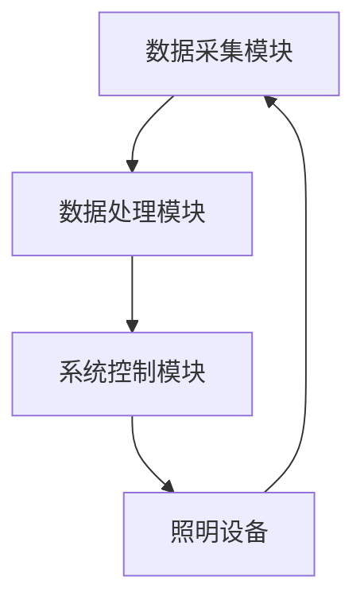

                 


# 价值投资中的智能建筑自适应照明系统分析

> 关键词：智能建筑，自适应照明系统，价值投资，能源效率，投资回报

> 摘要：智能建筑自适应照明系统是一种通过智能化技术优化照明控制的系统，能够在降低能源消耗的同时提升建筑的功能性和用户体验。本文从价值投资的角度，深入分析了自适应照明系统在智能建筑中的应用，探讨其对投资回报的影响，并通过实际案例展示了系统的实施过程和经济效益。文章还详细讲解了系统的算法原理、系统架构设计以及最佳实践，为投资者和技术人员提供了有价值的参考。

---

## 第一部分: 智能建筑自适应照明系统的背景与价值投资概述

### 第1章: 智能建筑自适应照明系统的背景介绍

#### 1.1 智能建筑与自适应照明系统概述
- 1.1.1 智能建筑的定义与特点
  - 智能建筑是将信息技术、自动化技术与建筑相结合，实现智能化管理的建筑。
  - 特点包括高效性、节能性、智能化和可持续性。

- 1.1.2 自适应照明系统的定义与特点
  - 自适应照明系统是一种能够根据环境条件（如光照强度、人员活动等）自动调节照明亮度的系统。
  - 特点包括实时性、节能性、智能化和用户舒适性。

- 1.1.3 智能建筑与自适应照明系统的结合
  - 自适应照明系统是智能建筑的重要组成部分，能够显著降低能源消耗，提升建筑的功能性和用户体验。

#### 1.2 价值投资的基本概念
- 1.2.1 价值投资的定义与核心理念
  - 价值投资是一种通过分析企业的内在价值，寻找被市场低估的投资机会的投资策略。
  - 核心理念包括安全边际、长期持有和价值发现。

- 1.2.2 价值投资与智能建筑的关系
  - 智能建筑的高效性和节能性能够提升建筑的长期价值，从而吸引更多投资者。
  - 价值投资可以通过分析智能建筑的运营成本、能源效率和收益能力，找到具有投资潜力的项目。

- 1.2.3 价值投资在智能建筑中的应用前景
  - 随着智能建筑技术的成熟，价值投资在智能建筑领域的应用前景广阔，特别是在能源效率和运营成本方面具有显著优势的项目。

---

### 第2章: 智能建筑自适应照明系统的价值分析

#### 2.1 照明系统在建筑中的价值体现
- 2.1.1 照明系统对能源消耗的影响
  - 照明系统的能耗通常占建筑总能耗的30%以上，优化照明系统能够显著降低能源消耗。
  - 通过自适应调节，照明系统可以在不同场景下优化亮度，减少不必要的能耗。

- 2.1.2 照明系统对建筑功能的影响
  - 自适应照明系统能够根据建筑的功能需求，自动调节照明强度，提升建筑的功能性。
  - 例如，在办公建筑中，可以根据工作时间自动调节照明亮度，提高工作效率。

- 2.1.3 照明系统对用户体验的影响
  - 自适应照明系统能够提供舒适的照明环境，提升用户体验。
  - 通过个性化设置，用户可以根据需求调节照明，满足不同场景下的使用需求。

#### 2.2 自适应照明系统的优势分析
- 2.2.1 自适应照明系统的节能优势
  - 通过实时调节照明亮度，自适应照明系统能够显著降低能源消耗。
  - 与传统照明系统相比，自适应照明系统的能耗可以降低30%以上。

- 2.2.2 自适应照明系统的智能化优势
  - 自适应照明系统能够通过传感器和自动化控制技术，实现智能化管理。
  - 系统可以根据环境条件和用户需求，自动调节照明参数，提升管理效率。

- 2.2.3 自适应照明系统的投资回报分析
  - 自适应照明系统的初期投资较高，但长期来看，系统的节能和智能化优势能够显著降低运营成本，提升投资回报率。
  - 通过价值投资分析，可以找到具有高回报潜力的自适应照明系统项目。

---

## 第二部分: 智能建筑自适应照明系统的系统架构与算法原理

### 第3章: 自适应照明系统的算法原理

#### 3.1 算法原理概述
- 自适应照明系统的核心算法包括光照检测、人员检测和亮度调节算法。
- 系统通过传感器获取环境数据，结合预设的逻辑规则，实现智能化控制。

#### 3.2 光照检测与人员检测算法
- 3.2.1 光照检测算法
  - 使用光照传感器检测环境光照强度，根据光照强度调整照明亮度。
  - 算法逻辑：如果当前光照强度低于设定值，则增加照明亮度；如果当前光照强度高于设定值，则降低照明亮度。

- 3.2.2 人员检测算法
  - 使用红外传感器或摄像头检测人员活动，根据人员活动情况调整照明亮度。
  - 算法逻辑：当检测到人员进入区域时，增加照明亮度；当检测到人员离开区域时，降低照明亮度。

#### 3.3 亮度调节算法
- 3.3.1 基于光照强度的亮度调节
  - 根据光照传感器数据，动态调整照明亮度，确保室内光照强度恒定。
  - 调节逻辑：通过PID控制算法实现平滑调节。

- 3.3.2 基于人员活动的亮度调节
  - 根据人员活动情况，动态调整照明亮度，确保人员活动区域的光照强度适宜。
  - 调节逻辑：结合光照强度和人员活动情况，综合调节照明亮度。

#### 3.4 算法实现的数学模型
- 照明亮度调节的数学模型如下：
  $$ L = L_0 + K \cdot (I - I_0) $$
  其中，\( L \) 是调节后的亮度，\( L_0 \) 是初始亮度，\( K \) 是调节系数，\( I \) 是当前光照强度，\( I_0 \) 是目标光照强度。

- PID控制算法的数学模型如下：
  $$ u(t) = K_p \cdot e(t) + K_i \cdot \int e(t) dt + K_d \cdot \frac{de(t)}{dt} $$
  其中，\( u(t) \) 是调节信号，\( e(t) \) 是误差信号，\( K_p \) 是比例系数，\( K_i \) 是积分系数，\( K_d \) 是微分系数。

### 第4章: 系统架构设计

#### 4.1 系统组成模块
- 自适应照明系统主要包括以下模块：
  - 数据采集模块：负责采集光照强度、人员活动等环境数据。
  - 数据处理模块：对采集到的数据进行分析和处理，生成调节指令。
  - 系统控制模块：根据调节指令，控制照明设备的亮度。

#### 4.2 系统功能设计
- 4.2.1 数据采集功能
  - 使用光照传感器和人员传感器采集环境数据。
  - 数据采集频率可以根据需求进行调整，通常采用实时采集。

- 4.2.2 数据处理功能
  - 对采集到的数据进行分析，生成调节指令。
  - 数据处理可以通过PID控制算法实现平滑调节。

- 4.2.3 系统控制功能
  - 根据调节指令，控制照明设备的亮度。
  - 系统控制可以通过继电器或智能灯控设备实现。

#### 4.3 系统架构图


---

## 第三部分: 项目实战与最佳实践

### 第5章: 项目实战

#### 5.1 项目背景
- 本项目旨在设计并实现一个自适应照明系统，应用于某智能建筑的办公区域。
- 项目目标是通过系统优化，降低能源消耗，提升用户体验。

#### 5.2 环境安装
- 安装环境包括：
  - 照明传感器：用于检测光照强度。
  - 人员传感器：用于检测人员活动。
  - 照明设备：包括LED灯和智能灯控设备。

#### 5.3 核心代码实现
- 以下是亮度调节算法的核心代码示例：
  ```python
  import RPi.GPIO as GPIO
  import time

  # 定义引脚
  sensor_pin = 18
  led_pin = 17

  # 设置模式
  GPIO.setmode(GPIO.BCM)

  # 初始化传感器和LED
  GPIO.setup(sensor_pin, GPIO.IN)
  GPIO.setup(led_pin, GPIO.OUT)

  # 定义PID控制参数
  Kp = 0.5
  Ki = 0.1
  Kd = 0.1
  target = 50  # 目标亮度
  current = 0
  integral = 0
  derivative = 0

  def pid_control(current, target):
      error = target - current
      integral += error * 1
      derivative = error - previous_error
      output = Kp * error + Ki * integral + Kd * derivative
      previous_error = error
      return output

  previous_error = 0

  while True:
      # 获取传感器数据
      sensor_value = GPIO.input(sensor_pin)

      # 计算PID输出
      output = pid_control(current, target)

      # 调节LED亮度
      if output > 100:
          output = 100
      elif output < 0:
          output = 0
      GPIO.output(led_pin, output)

      time.sleep(1)
  ```

#### 5.4 项目总结
- 通过项目实战，验证了自适应照明系统的有效性。
- 系统能够根据环境条件自动调节照明亮度，显著降低能源消耗，提升用户体验。

### 第6章: 最佳实践与小结

#### 6.1 最佳实践
- 系统设计中，建议采用模块化设计，便于后期维护和升级。
- 系统运行中，需要定期校准传感器，确保数据准确性。
- 系统优化时，可以通过引入机器学习算法，进一步提升调节精度。

#### 6.2 投资建议
- 对于投资者来说，自适应照明系统的高节能性和智能化优势，使其具有较高的投资回报潜力。
- 建议投资者关注具有高效能比和良好市场前景的智能建筑项目。

#### 6.3 注意事项
- 在实际应用中，需要注意系统的可靠性和稳定性，避免因系统故障导致照明中断。
- 系统设计中，需要考虑数据隐私和系统安全，防止数据泄露和恶意攻击。

#### 6.4 拓展阅读
- 推荐阅读《智能建筑技术与应用》和《价值投资实战指南》，深入了解智能建筑和价值投资的相关知识。

---

## 结语

智能建筑自适应照明系统是一种具有广阔前景的技术，其在降低能源消耗、提升建筑功能性和用户体验方面具有显著优势。通过价值投资分析，可以找到具有高回报潜力的智能建筑项目。未来，随着技术的不断发展，智能建筑自适应照明系统将在更多领域得到应用，为投资者和技术人员带来更多机遇。

作者：AI天才研究院/AI Genius Institute & 禅与计算机程序设计艺术/Zen And The Art of Computer Programming

