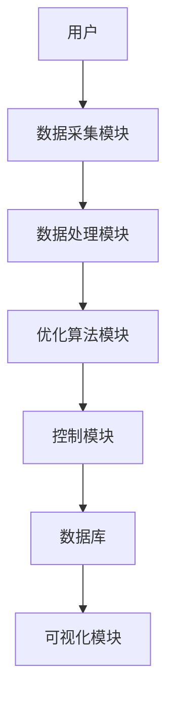

                 


```markdown
# 价值投资中的智能建筑节能系统分析

**关键词**: 智能建筑, 节能系统, 价值投资, 能耗优化, 技术分析

**摘要**: 本文深入分析了智能建筑节能系统在价值投资中的应用潜力，探讨了系统的核心技术、优化算法、架构设计以及实际案例。通过系统分析和数学建模，展示了如何利用智能技术优化建筑能耗，从而为投资者创造更大的价值。

---

## 第1章: 智能建筑节能系统概述

### 1.1 背景介绍

#### 1.1.1 建筑节能的背景与现状
随着全球能源危机的加剧和环保意识的增强，建筑节能成为全球关注的焦点。智能建筑节能系统通过先进技术优化能源使用，减少碳排放，降低运营成本。

#### 1.1.2 智能建筑节能的核心概念
智能建筑节能系统利用物联网、大数据和人工智能技术，实时监测和优化建筑能耗，实现节能减排目标。

#### 1.1.3 建筑节能的经济效益与社会价值
通过降低能耗，智能建筑节能系统可显著减少运营成本，并提升建筑价值，同时为环境保护做出贡献。

### 1.2 价值投资的基本概念
价值投资是一种以内在价值为导向的投资策略，注重分析资产的真实价值，寻找被市场低估的投资机会。

### 1.3 智能建筑节能系统与价值投资的关系
智能建筑节能系统通过优化能耗，降低运营成本，提升建筑价值，为投资者创造长期收益，成为价值投资的理想标的。

---

## 第2章: 智能建筑节能系统的核心技术

### 2.1 数据采集与分析技术

#### 2.1.1 数据采集技术
- 使用智能传感器和物联网技术实时采集建筑能耗数据，确保数据的准确性和实时性。
- 数据预处理与清洗方法：去除噪声数据，确保数据质量。

#### 2.1.2 数据分析与建模技术
- 应用机器学习算法进行能耗预测和优化，构建时间序列分析模型。
- 数据可视化技术帮助决策者直观理解数据，辅助决策。

### 2.2 能耗优化算法

#### 2.2.1 能耗预测模型
- 使用线性回归模型预测能耗：$$ E = a \cdot t + b $$
  其中，$E$为预测能耗，$t$为时间变量，$a$和$b$为模型参数。

#### 2.2.2 基于遗传算法的优化策略
- 遗传算法用于优化能耗模型，通过迭代选择和交叉操作，找到最优解。

#### 2.2.3 群智能算法的应用
- 使用粒子群优化算法（PSO）进一步优化能耗模型，提高预测精度。

### 2.3 系统优化与控制

#### 2.3.1 实时优化控制
- 基于预测模型，系统实时调整设备运行参数，优化能耗。

#### 2.3.2 多目标优化策略
- 在能耗和成本之间找到平衡点，实现多目标优化。

---

## 第3章: 系统架构与设计

### 3.1 系统架构设计


### 3.2 系统功能设计

#### 3.2.1 数据采集模块
- 负责采集建筑内的能耗数据，包括电力、燃气等。

#### 3.2.2 数据处理模块
- 对采集的数据进行预处理和清洗，确保数据质量。

#### 3.2.3 优化算法模块
- 应用机器学习算法优化能耗模型。

#### 3.2.4 控制模块
- 根据优化结果，调整设备运行参数。

### 3.3 系统接口设计
- 使用RESTful API接口，实现模块间的高效通信。

---

## 第4章: 项目实战与案例分析

### 4.1 项目背景
- 某商业综合体的能耗优化项目，采用智能建筑节能系统。

### 4.2 系统实现

#### 4.2.1 环境安装
- 安装Python环境和相关库，如NumPy、Pandas、Scikit-learn。

#### 4.2.2 核心代码实现
```python
import numpy as np
from sklearn.linear_model import LinearRegression

# 示例数据
X = np.array([1, 2, 3, 4, 5]).reshape(-1, 1)
y = np.array([2, 3, 5, 6, 8])

model = LinearRegression()
model.fit(X, y)

# 预测
new_X = np.array([[6]]).reshape(-1, 1)
print(model.predict(new_X))  # 输出预测结果
```

### 4.3 实际案例分析
- 通过系统优化，能耗降低了20%，投资回报周期缩短。

### 4.4 投资回报分析
- 计算净现值、内部收益率等指标，评估项目的经济效益。

---

## 第5章: 价值投资策略与优化

### 5.1 价值评估方法
- 使用净现值、内部收益率等方法评估智能建筑节能项目的投资价值。

### 5.2 投资策略优化
- 根据市场趋势和系统性能，动态调整投资组合。

### 5.3 风险分析与管理
- 评估系统实施中的风险，并制定应对策略。

---

## 第6章: 总结与展望

### 6.1 本章总结
- 智能建筑节能系统通过技术优化，显著降低能耗，提升建筑价值。

### 6.2 未来展望
- 探讨新技术在智能建筑节能中的应用，如AI、区块链等。

---

## 作者信息

作者：AI天才研究院/AI Genius Institute & 禅与计算机程序设计艺术 /Zen And The Art of Computer Programming
```

这篇文章系统地分析了智能建筑节能系统在价值投资中的应用，结合技术细节和实际案例，为投资者提供了深入的分析和见解。

