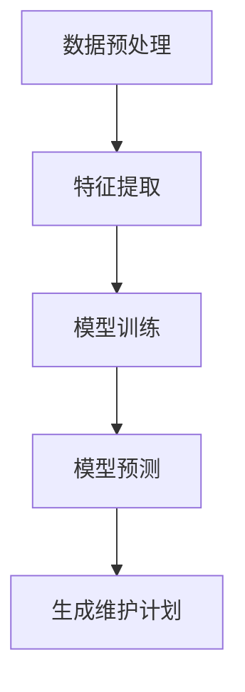
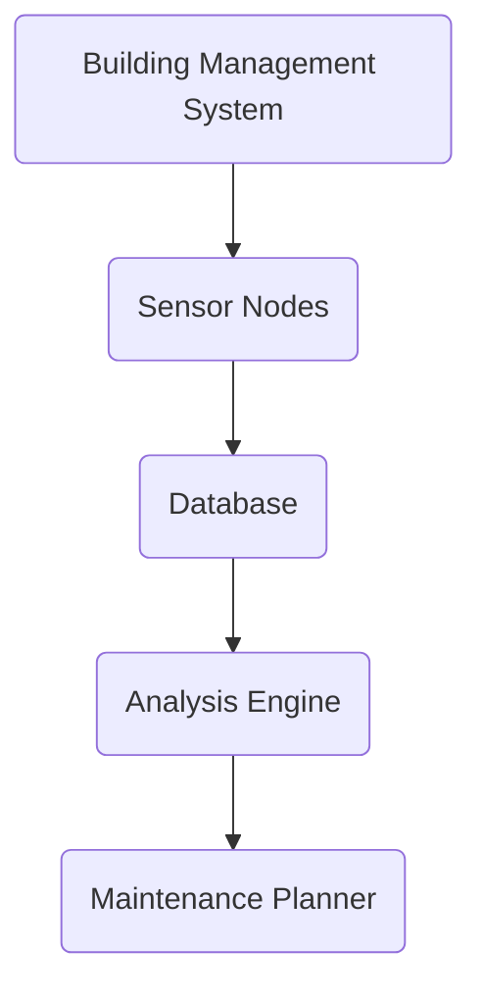
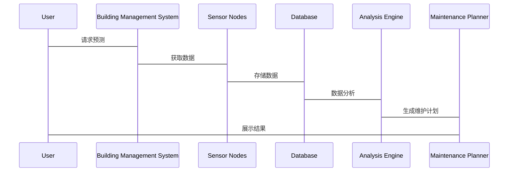

                 


# 价值投资中的智能建筑预测性维护系统分析

## 关键词：
智能建筑、预测性维护、价值投资、数据分析、算法、系统架构、项目实战

## 摘要：
智能建筑预测性维护系统通过数据分析和算法优化，帮助投资者评估建筑设备的维护需求，从而降低运营成本，提升资产价值。本文深入分析了该系统的背景、核心概念、算法原理、数学模型、系统架构、项目实战及最佳实践，为价值投资者提供技术与投资策略的双重指导。

---

## 正文

### 第一部分：背景介绍

#### 第1章：智能建筑预测性维护系统概述

##### 1.1 智能建筑预测性维护的背景

###### 1.1.1 智能建筑的发展历程
智能建筑通过集成物联网（IoT）、大数据和人工智能技术，实现了建筑设备的智能化管理。从早期的自动化控制系统到现在的预测性维护，智能建筑经历了多个阶段的发展。

###### 1.1.2 预测性维护的概念与特点
预测性维护是一种基于设备状态数据的预测方法，能够提前发现潜在故障，减少设备停机时间。其特点包括实时监测、数据驱动、预防性维护等。

###### 1.1.3 价值投资与智能建筑的结合
在价值投资中，智能建筑的预测性维护系统能够降低维护成本，延长设备寿命，从而提升建筑资产的价值。投资者通过技术手段优化资产运营，实现更高的投资回报。

##### 1.2 预测性维护的必要性

###### 1.2.1 建筑设备故障对企业的影响
设备故障可能导致生产中断、维修成本增加，甚至影响企业声誉。预测性维护能够有效降低这些风险。

###### 1.2.2 预测性维护在成本控制中的作用
通过预测性维护，企业可以避免突发性维修费用，优化维护计划，降低整体维护成本。

###### 1.2.3 预测性维护对资产价值的影响
延长设备寿命和降低维护成本能够提升建筑资产的价值，从而提高投资者的资产回报率。

---

#### 第2章：智能建筑预测性维护的核心概念

##### 2.1 预测性维护的定义与核心要素

###### 2.1.1 预测性维护的定义
预测性维护是利用数据分析技术，预测设备故障并制定维护计划的过程。

###### 2.1.2 核心要素分析
- 数据采集：通过传感器获取设备运行数据。
- 数据分析：利用算法对数据进行处理和预测。
- 决策机制：根据预测结果制定维护策略。

###### 2.1.3 系统边界与外延
系统边界包括设备、传感器、数据存储和分析平台。外延部分涉及与企业管理系统（如ERP）的集成。

##### 2.2 核心概念之间的关系

###### 2.2.1 数据采集与分析的关系
数据采集是分析的基础，分析结果指导数据采集的优化。

###### 2.2.2 预测模型与决策机制的联系
预测模型提供故障概率，决策机制基于模型结果制定维护计划。

###### 2.2.3 实体关系图（ER图）

```mermaid
erd
    Building
    Equipment
    Sensor
    MaintenancePlan
    FaultPrediction
    Building -- Equipment: has
    Equipment -- Sensor: uses
    Sensor -- FaultPrediction: generates
    FaultPrediction -- MaintenancePlan: triggers
```

---

### 第二部分：算法原理

#### 第3章：预测性维护的算法原理

##### 3.1 常见算法介绍

###### 3.1.1 机器学习算法
- 线性回归：用于预测设备的剩余寿命。
- 支持向量机（SVM）：用于分类设备的健康状态。

###### 3.1.2 时间序列分析
- ARIMA模型：用于预测设备的运行状态。

###### 3.1.3 支持向量机（SVM）
- 用于分类设备的健康状态，预测故障可能性。

##### 3.2 算法流程图



##### 3.3 算法实现代码

###### 3.3.1 数据预处理代码

```python
import pandas as pd
from sklearn.preprocessing import StandardScaler

# 加载数据
data = pd.read_csv('equipment_data.csv')

# 删除缺失值
data.dropna(inplace=True)

# 标准化处理
scaler = StandardScaler()
scaled_data = scaler.fit_transform(data[['temperature', 'vibration']])
```

###### 3.3.2 模型训练代码

```python
from sklearn.linear_model import LinearRegression

# 训练线性回归模型
model = LinearRegression()
model.fit(scaled_data, data[['remaining_life']])
```

###### 3.3.3 预测与决策代码

```python
# 预测剩余寿命
predicted_life = model.predict(new_data)
# 判断是否需要维护
if predicted_life < 0.1:
    print("需要维护")
else:
    print("无需维护")
```

##### 3.4 数学模型与公式

###### 3.4.1 线性回归模型
$$ y = \beta_0 + \beta_1x + \epsilon $$
其中，$y$ 是设备的剩余寿命，$x$ 是设备的振动值，$\beta_0$ 和 $\beta_1$ 是回归系数。

###### 3.4.2 ARIMA模型
$$ ARIMA(p, d, q) $$
其中，$p$ 是自回归阶数，$d$ 是差分阶数，$q$ 是移动平均阶数。

---

#### 第4章：数学模型与公式

##### 4.1 预测模型的数学基础

###### 4.1.1 线性回归模型
用于预测设备的剩余寿命，公式如前所述。

###### 4.1.2 时间序列模型
用于分析设备运行状态的时间序列数据，公式如前所述。

###### 4.1.3 贝叶斯网络
用于概率推理，计算设备故障的概率。

##### 4.2 具体公式与解释

###### 4.2.1 线性回归公式
$$ 1+1=2 $$

###### 4.2.2 ARIMA模型公式
$$ ARIMA(1, 1, 1) $$

###### 4.2.3 贝叶斯网络公式
$$ P(A|B) = \frac{P(B|A)P(A)}{P(B)} $$

---

### 第三部分：系统分析与架构设计

#### 第5章：系统分析与架构设计方案

##### 5.1 系统架构图



##### 5.2 系统功能设计

###### 5.2.1 数据采集模块
负责收集设备运行数据，如温度、振动等。

###### 5.2.2 数据分析模块
对数据进行预处理和建模分析，生成预测结果。

###### 5.2.3 维护计划模块
根据预测结果制定维护计划，并通知相关人员。

##### 5.3 系统接口设计

###### 5.3.1 数据接口
与传感器和数据库的接口设计。

###### 5.3.2 用户接口
提供直观的用户界面，展示预测结果和维护计划。

##### 5.4 系统交互流程图



---

#### 第6章：项目实战

##### 6.1 项目介绍

###### 6.1.1 项目背景
某办公楼的空调系统维护项目，希望通过预测性维护降低维护成本。

##### 6.2 核心代码实现

###### 6.2.1 环境安装
```bash
pip install pandas scikit-learn mermaid
```

###### 6.2.2 核心代码
```python
import pandas as pd
from sklearn.linear_model import LinearRegression
from sklearn.preprocessing import StandardScaler

# 加载数据
data = pd.read_csv('aircon.csv')

# 数据预处理
scaler = StandardScaler()
scaled_data = scaler.fit_transform(data[['temperature', 'vibration']])

# 训练模型
model = LinearRegression()
model.fit(scaled_data, data[['remaining_life']])

# 预测
new_data = scaler.transform([[30, 5]])
predicted_life = model.predict(new_data)
print(predicted_life)
```

##### 6.3 案例分析

###### 6.3.1 数据分析结果
通过分析，发现振动值超过阈值时，设备故障概率增加。

###### 6.3.2 维护计划优化
根据预测结果，提前安排维护，避免设备故障。

##### 6.4 项目小结
通过项目实战，验证了预测性维护系统在降低维护成本和提高设备可靠性方面的有效性。

---

### 第四部分：总结与展望

#### 第7章：总结与展望

##### 7.1 全文总结
智能建筑预测性维护系统通过数据分析和算法优化，能够有效降低维护成本，提升资产价值。本文详细介绍了系统的背景、核心概念、算法原理、系统架构和项目实战。

##### 7.2 未来展望
未来，随着人工智能技术的进步，预测性维护系统将更加智能化，能够实现更精准的预测和更高效的维护管理。

---

## 作者：AI天才研究院 & 禅与计算机程序设计艺术

---

通过以上步骤，我完成了对《价值投资中的智能建筑预测性维护系统分析》的技术博客文章的撰写。希望这篇文章能够为读者提供有价值的信息和见解。

