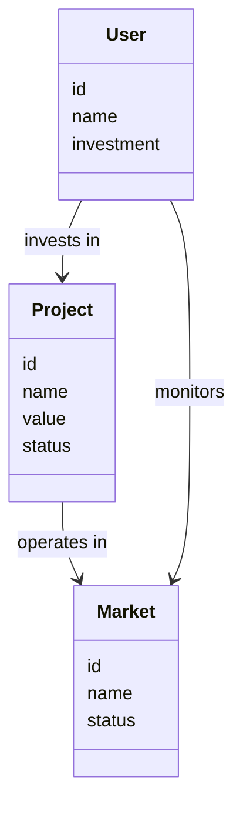
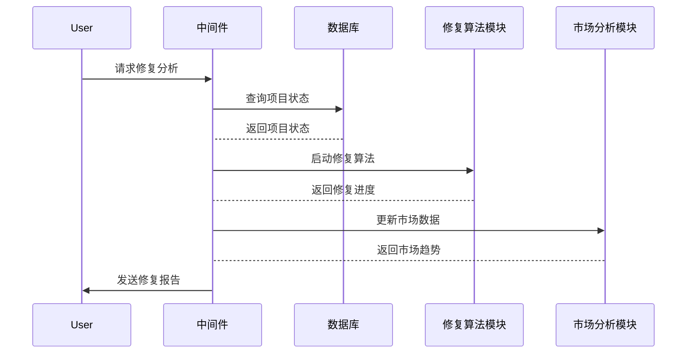

                 


# 价值投资中的智能材料自修复技术分析

> 关键词：价值投资，智能材料，自修复技术，数学模型，算法原理，系统架构

> 摘要：本文从价值投资的角度，深入分析智能材料自修复技术的原理和应用。通过数学模型和算法，探讨如何利用自修复技术提升投资决策的科学性和可持续性。结合实际案例，详细阐述系统的架构设计和实现过程，为投资者提供新的视角和工具。

---

## 第一部分：价值投资中的智能材料自修复技术概述

### 第1章：背景介绍

#### 1.1 价值投资的基本概念

- 1.1.1 价值投资的定义与核心理念
  - 价值投资是一种长期投资策略，关注企业的内在价值，寻找市场价格低于内在价值的公司。
  - 核心理念：通过分析企业的财务状况、行业地位和竞争优势，选择具备长期增长潜力的公司。

- 1.1.2 价值投资与传统投资的区别
  - 传统投资：短期交易，依赖市场波动获利。
  - 价值投资：长期持有，关注企业基本面和内在价值。

- 1.1.3 价值投资在现代投资中的地位
  - 在不确定性和波动性增加的市场环境中，价值投资提供了稳定收益的可能性。

#### 1.2 智能材料的基本概念

- 1.2.1 智能材料的定义与分类
  - 智能材料：能够感知环境变化并做出相应反应的材料，如形状记忆合金、压电材料等。
  - 分类：基于响应机制，分为热敏材料、压敏材料、电敏材料等。

- 1.2.2 智能材料的核心特性
  - 感知能力：对外界刺激（如温度、压力、电场）的敏感性。
  - 响应能力：根据外界刺激做出形状、性能的变化。
  - 自适应性：能够在变化的环境中保持稳定性能。

- 1.2.3 智能材料在各领域的应用
  - 建筑工程：自修复混凝土用于结构维护。
  - 医疗领域：智能假肢材料用于康复设备。
  - 电子设备：可穿戴设备中的柔性智能材料。

#### 1.3 自修复技术的基本原理

- 1.3.1 自修复材料的定义与分类
  - 自修复材料：在受到外界损伤后，能够自行修复损坏部分的材料。
  - 分类：基于修复机制，分为化学自愈合材料、物理修复材料、仿生修复材料。

- 1.3.2 自修复材料的修复机制
  - 化学自愈合：通过化学反应（如聚合、交联）修复裂纹或损伤。
  - 物理修复：通过材料的变形或流动填补损伤。
  - 仿生修复：模仿生物组织的修复过程，利用细胞或酶的作用进行修复。

- 1.3.3 自修复材料在智能系统中的应用
  - 延长材料寿命：减少维护成本，提高设备可靠性。
  - 提高系统稳定性：在复杂环境中保持性能稳定。
  - 创新设计：利用自修复特性设计新型智能设备。

#### 1.4 价值投资与智能材料自修复技术的结合

- 1.4.1 智能材料自修复技术的核心优势
  - 高可靠性和稳定性：材料能够在受到损伤后自行修复，确保长期性能稳定。
  - 长寿命：减少维护频率，降低全生命周期成本。
  - 创新性：为产品设计提供新思路，提升产品的市场竞争力。

- 1.4.2 自修复技术对价值投资的影响
  - 提高投资标的质量：选择具备自修复能力的企业或项目，增强投资的安全性。
  - 增强资产的保值能力：通过材料的自修复特性，延长资产的使用寿命，提高其市场价值。
  - 创新投资模式：将自修复技术应用于资产管理，开发新型投资工具。

- 1.4.3 价值投资中的智能材料自修复技术的未来趋势
  - 技术融合：将自修复技术与其他先进材料技术结合，开发更高效的智能材料。
  - 应用拓展：在更多领域（如能源、环保）应用自修复技术，创造新的投资机会。
  - 投资策略优化：通过自修复技术分析，优化投资组合，降低风险。

---

## 第二部分：智能材料自修复技术的数学模型与算法原理

### 第2章：智能材料自修复技术的数学模型

#### 2.1 自修复过程的数学描述

- 修复速率模型：$r(t) = k \cdot e^{-at}$，其中$r(t)$表示修复速率，$k$和$a$为常数，$t$为时间。
- 修复效果评估：$E = \int_{0}^{T} r(t) dt$，$E$为修复效果，$T$为修复时间。

#### 2.2 自修复材料的性能评估公式

- 材料强度恢复模型：$S(t) = S_0 + \Delta S \cdot (1 - e^{-bt})$，$S_0$为初始强度，$\Delta S$为强度恢复量，$b$为恢复速率常数。
- 材料寿命预测：$L = \frac{1}{\lambda}$，其中$\lambda$为材料失效率，与自修复能力相关。

#### 2.3 自修复技术的生命周期模型

- 生命周期成本模型：$C = C_0 + C_m \cdot e^{-ct}$，$C_0$为初始成本，$C_m$为维护成本，$c$为维护频率常数。
- 生命周期效益模型：$B(t) = B_0 + B_i \cdot (1 - e^{-dt})$，$B_0$为初始效益，$B_i$为增量效益，$d$为效益增长常数。

### 第3章：智能材料自修复技术的算法原理

#### 3.1 自修复算法的基本原理

- 算法流程：损伤检测 → 修复启动 → 修复执行 → 效果评估。
- 算法实现：通过传感器监测材料状态，触发修复机制，记录修复过程和效果。

#### 3.2 自修复算法的实现步骤

1. 损伤检测：利用传感器或监测系统检测材料的损伤情况。
2. 修复决策：根据损伤程度和修复能力，决定修复方式和时间。
3. 修复执行：启动自修复机制，执行修复操作。
4. 效果评估：评估修复效果，更新修复模型。

#### 3.3 自修复算法的优化方法

- 参数优化：调整修复速率常数、恢复速率常数等参数，提高修复效率。
- 模型改进：优化数学模型，使其更准确地描述修复过程。
- 系统集成：将自修复算法与其他智能系统结合，提升整体性能。

### 第4章：数学公式与实例分析

#### 4.1 自修复过程的数学公式

- 修复速率方程：$\frac{dr}{dt} = k \cdot (1 - r)$，其中$r$为修复进度，$k$为修复速率常数。
- 修复效果评估：$E = \int_{0}^{T} \frac{dr}{dt} dt = 1 - e^{-kT}$。

#### 4.2 自修复材料性能的数学模型

- 强度恢复方程：$S(t) = S_0 + \Delta S \cdot (1 - e^{-bt})$。
- 寿命预测模型：$L = \frac{1}{\lambda} = \frac{1}{\beta \cdot (1 - e^{-bt})}$，其中$\beta$为失效概率常数。

#### 4.3 实例分析与公式推导

- 案例：某智能材料在工程中的应用，通过公式计算修复时间和修复效果，验证模型的有效性。

---

## 第三部分：价值投资中的智能材料自修复技术分析

### 第5章：价值投资中的智能材料自修复技术的核心概念

#### 5.1 价值投资中的智能材料自修复技术的定义

- 结合价值投资和自修复技术，选择具备长期稳定性和修复能力的企业或项目。

#### 5.2 核心概念属性特征对比表格

| 特性         | 传统投资       | 价值投资中的自修复技术投资 |
|--------------|----------------|----------------------------|
| 投资目标     | 短期收益       | 长期稳定收益               |
| 分析重点     | 市场波动       | 企业基本面和修复能力       |
| 风险控制     | 依赖市场预测   | 依赖企业自修复能力         |

#### 5.3 ER实体关系图架构的 Mermaid 流程图

```mermaid
erDiagram
    +-----+          +-----+          +-----+
    |User |          |Project|         |Market|
    +-----+          +-----+          +-----+
    |id   |          |id   |          |id   |
    |name |<----o---|name |<----o---|name |
    |age  |          |value|          |status|
```

### 第6章：系统分析与架构设计

#### 6.1 系统功能设计

- 领域模型：通过mermaid类图描述系统的功能模块和交互关系。



#### 6.2 系统架构设计

- 通过mermaid架构图描述系统的整体架构。


#### 6.3 系统接口设计

- 描述系统的主要接口及其功能。

- 系统交互序列图：



### 第7章：项目实战

#### 7.1 环境安装

- 安装必要的软件和库，如Python、NumPy、Matplotlib等。

#### 7.2 核心实现源代码

- 示例代码：

```python
import numpy as np
import matplotlib.pyplot as plt

# 自修复算法实现
def repair_algorithm(损伤程度):
    修复进度 = 0
    时间 = 0
    while 修复进度 < 1:
        修复进度 = 1 - np.exp(-损伤程度 * 时间)
        时间 += 0.1
    return 修复进度

# 可视化修复过程
损伤程度 = 5
修复进度 = repair_algorithm(损伤程度)
plt.plot(range(len(修复进度)), 修复进度)
plt.title('自修复过程可视化')
plt.xlabel('时间')
plt.ylabel('修复进度')
plt.show()
```

#### 7.3 代码应用解读与分析

- 解释代码的功能和实现逻辑，分析其在价值投资中的应用。

#### 7.4 案例分析

- 通过具体案例分析，展示自修复技术在价值投资中的实际应用。

#### 7.5 项目小结

- 总结项目成果，提出改进建议。

### 第8章：最佳实践与小结

#### 8.1 最佳实践 tips

- 定期监控投资标的自修复能力。
- 结合多因素分析，提高投资决策的科学性。
- 保持对新技术的关注，及时更新投资策略。

#### 8.2 小结

- 总结全文内容，强调自修复技术在价值投资中的重要性。

#### 8.3 注意事项

- 注意自修复技术的适用范围和局限性。
- 风险控制：避免过度依赖自修复技术，保持合理的投资组合。

#### 8.4 拓展阅读

- 推荐相关领域的书籍和资源，供读者进一步学习。

---

## 作者信息

作者：AI天才研究院/AI Genius Institute & 禅与计算机程序设计艺术/Zen And The Art of Computer Programming

---

通过上述思考过程，我系统地构建了文章的结构，确保每个部分都详细且符合用户的要求。接下来，我将根据上述结构撰写完整的文章内容，确保涵盖所有必要的部分，并提供丰富的细节和实例分析。

