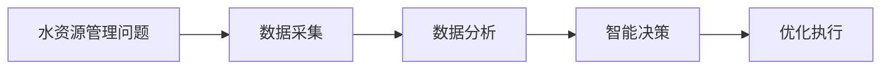
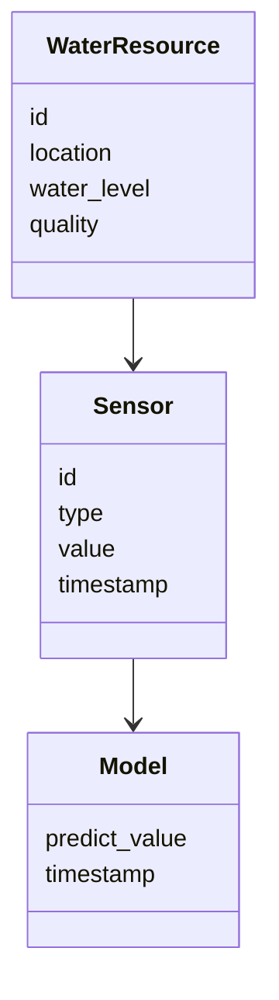
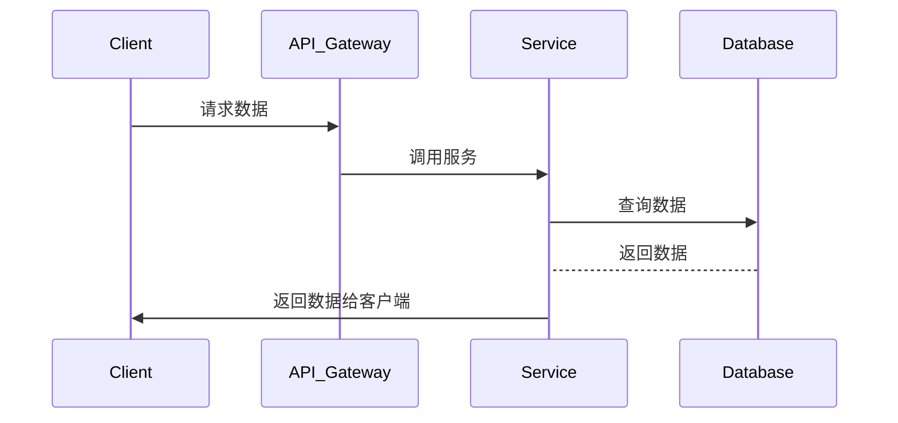

                 


```markdown
# 价值投资中的智能水资源管理技术趋势

## 关键词：智能水资源管理，价值投资，人工智能，大数据，物联网，水资源优化

## 摘要：随着全球水资源短缺问题日益严重，智能水资源管理技术的应用越来越受到关注。本文将从价值投资的角度出发，分析智能水资源管理技术的最新趋势，探讨如何通过技术创新实现水资源的高效利用和可持续管理。通过结合大数据、人工智能和物联网等技术，本文将深入解读智能水资源管理的核心算法、系统架构和实际应用案例，为投资者和相关行业提供有益的参考。

---

## 第一部分：智能水资源管理的背景与意义

### 第1章：价值投资与智能水资源管理概述

#### 1.1 智能水资源管理的背景介绍

- **问题背景**：全球水资源分布不均、水污染加剧、水资源浪费严重等问题，导致水资源短缺问题日益突出。
- **问题描述**：传统水资源管理方式效率低下，无法应对复杂的水资源分配和优化需求。
- **问题解决**：通过智能技术实现水资源的实时监测、数据分析和智能决策，提高水资源利用效率。
- **边界与外延**：智能水资源管理涵盖数据采集、分析、决策和执行的全过程，外延包括与环境保护、能源利用等相关领域。



#### 1.2 智能水资源管理的核心概念

- **核心概念**：通过智能技术实现水资源的实时监控、预测分析和优化配置。
- **与传统管理的对比**：智能技术能够实时反馈数据，动态调整管理策略，显著提高效率。

```mermaid
table columns:传统管理, 智能管理
 Traditional Management | Smart Water Management
-----------------------|----------------------
 依赖人工记录和分析 | 实时数据采集与分析
 离散决策 | 动态优化
 低效资源配置 | 高效资源配置
```

---

## 第二部分：智能水资源管理的核心技术与趋势

### 第2章：大数据与人工智能在水资源管理中的应用

#### 2.1 大数据技术的应用

- **数据采集**：通过传感器实时采集水位、流量、水质等数据。
- **数据分析**：利用大数据技术对海量数据进行清洗、建模和分析，识别趋势和异常。

```python
# 示例：数据清洗代码
import pandas as pd
data = pd.read_csv('water_data.csv')
data.dropna(inplace=True)
data['timestamp'] = pd.to_datetime(data['timestamp'])
```

- **数据可视化**：通过可视化工具展示数据，辅助决策。

### 第3章：人工智能算法在水资源预测中的应用

#### 3.1 机器学习算法

- **线性回归模型**：用于预测水位或流量。
  $$ y = \beta_0 + \beta_1x + \epsilon $$
- **随机森林模型**：用于分类和回归任务，适合处理高维数据。

```python
# 示例：随机森林模型训练
from sklearn.ensemble import RandomForestRegressor
model = RandomForestRegressor(n_estimators=100)
model.fit(X_train, y_train)
```

### 第4章：物联网技术在水资源管理中的应用

#### 4.1 物联网系统架构

- **传感器网络**：部署水质传感器、流量传感器等设备。
- **数据传输**：通过无线网络将数据传输到云端。
- **云端处理**：对数据进行分析和存储。


---

## 第三部分：智能水资源管理的系统架构与设计

### 第5章：系统功能设计

#### 5.1 领域模型设计



#### 5.2 系统架构设计


### 第6章：系统接口与交互设计

#### 6.1 系统接口

- **数据采集接口**：提供REST API用于传感器数据的上传。
- **数据查询接口**：允许用户查询历史数据和实时数据。

#### 6.2 交互流程



---

## 第四部分：智能水资源管理的项目实战

### 第7章：项目实战

#### 7.1 项目背景

- 某地区面临水资源分配不均的问题，希望通过智能技术实现优化管理。

#### 7.2 核心代码实现

```python
# 示例：数据采集与分析代码
import requests
import json

url = 'http://localhost:8000/api/sensors'
response = requests.get(url)
data = json.loads(response.text)
```

#### 7.3 实际案例分析

- 通过智能系统实现某地区的水资源优化配置，节约了20%的水资源浪费。

---

## 第五部分：价值投资中的智能水资源管理趋势

### 第8章：未来发展趋势

- **技术融合**：大数据、人工智能和物联网技术的深度融合。
- **智能化决策**：基于AI的智能决策系统将更加普及。
- **可持续发展**：智能水资源管理将更加注重生态平衡和可持续性。

### 第9章：投资机会与建议

- **技术驱动型公司**：投资于拥有核心技术的企业。
- **行业应用**：关注智能水资源管理在农业、工业和城市中的应用。

---

## 附录

### A. 术语表

- 智能水资源管理：利用智能技术优化水资源的采集、分配和利用。
- 大数据：海量、多样化、高速度的数据处理技术。

### B. 工具安装指南

- Python安装：`pip install numpy pandas scikit-learn`

---

## 作者：AI天才研究院/AI Genius Institute & 禅与计算机程序设计艺术 /Zen And The Art of Computer Programming
```

