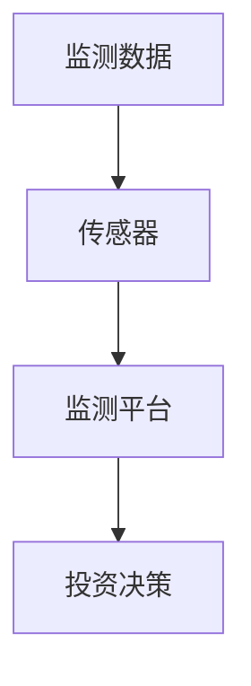
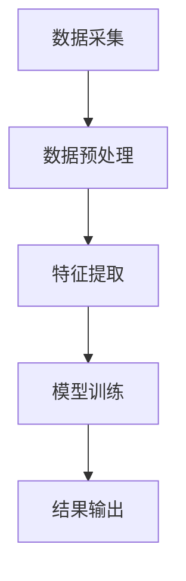
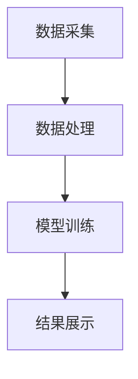
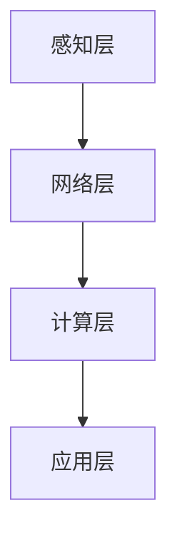
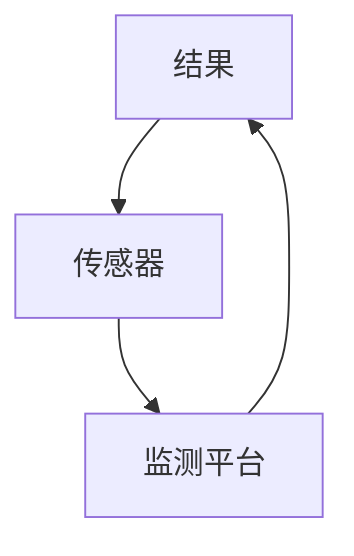

                 


# 价值投资中的智能海洋塑料污染监测系统分析

> 关键词：价值投资，智能监测，海洋塑料污染，算法分析，系统架构

> 摘要：本文深入分析了智能海洋塑料污染监测系统在价值投资中的应用，从系统背景、核心概念、算法原理、系统架构到项目实战，全面解析了如何利用智能技术进行有效投资决策。

---

## 第一部分: 背景介绍与核心概念

### 第1章: 智能海洋塑料污染监测系统概述

#### 1.1 问题背景与描述

- **1.1.1 海洋塑料污染的现状与挑战**
  海洋塑料污染是全球性环境问题，每年约有800万吨塑料垃圾进入海洋，威胁海洋生态和人类健康。传统的监测方法效率低下，数据不完整，无法满足实时、精准的需求。

- **1.1.2 智能监测系统的需求与目标**
  通过智能传感器、大数据分析和机器学习算法，实现对海洋塑料污染的实时监测、数据处理和预测分析，为投资决策提供科学依据。

- **1.1.3 价值投资中的监测系统意义**
  监测系统帮助投资者识别环保型企业的投资机会，评估企业社会责任，优化投资组合，降低环境风险。

#### 1.2 问题解决与边界

- **1.2.1 智能监测系统的核心问题**
  如何高效采集、处理和分析海洋塑料污染数据，提供实时监测和预测能力。

- **1.2.2 系统的边界与外延**
  系统专注于监测数据的采集、分析和投资应用，不涉及具体的投资策略执行。

- **1.2.3 核心要素与组成分析**
  感知层（传感器）、网络层（数据传输）、计算层（数据处理）和应用层（投资分析）。

### 第2章: 价值投资与智能监测系统的核心概念

#### 2.1 智能监测系统的原理与特点

- **2.1.1 监测系统的原理**
  通过传感器采集数据，利用大数据分析和机器学习进行数据处理和预测。

- **2.1.2 系统的主要特点**
  实时性、准确性、数据驱动、可扩展性。

#### 2.2 价值投资与监测系统的联系

- **2.2.1 价值投资的基本原理**
  基于基本面分析和市场趋势，寻找具有长期投资价值的企业。

- **2.2.2 监测系统在投资中的应用**
  通过监测数据评估企业环保表现，优化投资组合，降低环境风险。

- **2.2.3 两者的结合与协同**
  监测系统提供数据支持，价值投资提供决策框架，两者结合实现可持续投资。

### 第3章: 核心概念与联系分析

#### 3.1 核心概念原理

- **3.1.1 监测系统的核心算法**
  数据采集、特征提取、模型训练。

- **3.1.2 价值投资的关键模型**
  市盈率、市净率、现金流分析。

#### 3.2 概念属性特征对比表格

| 概念 | 属性 | 特征 |
|------|------|------|
| 监测系统 | 数据采集 | 多源异构 |
| 价值投资 | 模型构建 | 数据驱动 |

#### 3.3 ER实体关系图



---

## 第二部分: 算法原理与数学模型

### 第4章: 监测系统的核心算法

#### 4.1 算法原理

- **4.1.1 数据采集与预处理**
  使用传感器采集海洋数据，进行数据清洗和标准化。

- **4.1.2 数据分析与特征提取**
  通过统计分析和机器学习提取关键特征。

- **4.1.3 模型训练与优化**
  使用深度学习模型进行训练，优化模型性能。

#### 4.2 算法流程图



### 第5章: 数学模型与公式

#### 5.1 监测系统的数学模型

- **5.1.1 数据处理公式**
  $$ y = f(x) $$

- **5.1.2 模型评估指标**
  $$ R^2 = 1 - \frac{\sum (y_i - \hat{y_i})^2}{\sum (y_i - \bar{y})^2} $$

#### 5.2 价值投资的数学模型

- **5.2.1 投资回报率计算**
  $$ ROI = \frac{净收益}{投资成本} \times 100\% $$

- **5.2.2 风险评估模型**
  $$ VaR = \alpha \times \sigma $$

---

## 第三部分: 系统架构与设计

### 第6章: 系统架构设计方案

#### 6.1 问题场景介绍

- **6.1.1 监测系统的应用场景**
  实时监测、预测分析、投资决策。

#### 6.2 系统功能设计

- **6.2.1 功能模块划分**
  数据采集、数据处理、模型训练、结果展示。

- **6.2.2 功能流程图**



#### 6.3 系统架构设计

- **6.3.1 系统架构图**



#### 6.4 系统接口设计

- **6.4.1 接口定义**
  API接口用于数据传输和模型调用。

#### 6.5 系统交互设计

- **6.5.1 交互序列图**



---

## 第四部分: 项目实战与应用

### 第7章: 项目实战

#### 7.1 环境安装

- **7.1.1 系统环境**
  Python 3.8+, PyTorch, Scikit-learn。

#### 7.2 系统核心实现源代码

```python
import numpy as np
import pandas as pd
from sklearn.model import LinearRegression

# 数据预处理
data = pd.read_csv('plastic_pollution.csv')
X = data[['latitude', 'longitude']]
y = data['pollution_level']

# 模型训练
model = LinearRegression()
model.fit(X, y)

# 预测结果
new_data = pd.DataFrame({'latitude': [45], 'longitude': [120]})
print(model.predict(new_data))
```

#### 7.3 案例分析与解读

- **7.3.1 数据分析**
  使用回归分析预测污染程度。

- **7.3.2 投资决策**
  根据监测数据评估企业环保表现，优化投资组合。

#### 7.4 项目小结

通过智能监测系统实现对海洋塑料污染的实时监测和预测，为价值投资提供科学依据，优化投资决策。

---

## 第五部分: 最佳实践与总结

### 第8章: 最佳实践与总结

#### 8.1 最佳实践

- **数据质量管理**
  确保数据准确性和完整性。

- **模型优化**
  定期更新模型，提高预测精度。

#### 8.2 小结

智能监测系统在价值投资中的应用，不仅提高了投资决策的科学性，还推动了可持续投资的发展。

#### 8.3 注意事项

- 数据隐私保护
- 模型鲁棒性
- 系统可扩展性

#### 8.4 拓展阅读

- 推荐书籍：《智能系统设计》、《价值投资实战》
- 相关论文：海洋塑料污染监测技术研究

---

## 作者信息

作者：AI天才研究院/AI Genius Institute  
联系邮箱：contact@aicourse.com  
版权声明：本文版权归作者所有，转载请注明出处。

---

**小结**：通过本文的详细分析，我们了解了智能海洋塑料污染监测系统在价值投资中的重要性，掌握了系统的实现方法和应用案例。希望本文能为读者在智能监测和价值投资领域提供新的视角和思路。

