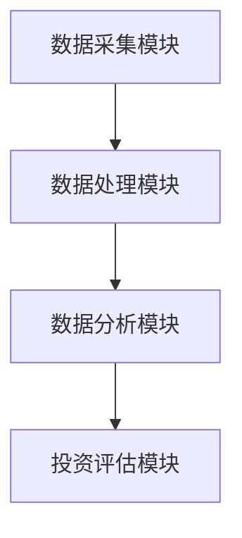
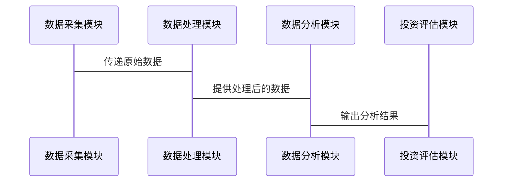

                 


# 价值投资中的智能海洋环境监测系统分析

> 关键词：智能海洋环境监测系统、价值投资、数据采集、数据分析、系统架构

> 摘要：本文探讨了智能海洋环境监测系统在价值投资中的应用，分析了系统的核心原理、算法模型、架构设计，并通过实际案例展示了系统的实现过程，为投资者提供了科学的决策支持。

---

## 第1章: 问题背景与价值投资分析

### 1.1 问题背景介绍

#### 1.1.1 海洋环境监测的现状与挑战

海洋是地球生命的重要组成部分，涵盖了经济、生态和战略等多个层面。随着全球气候变化和人类活动的加剧，海洋环境面临着前所未有的挑战。例如，海洋污染、过度捕捞、珊瑚礁退化等问题不仅威胁到海洋生态系统的平衡，也对人类社会和经济发展造成了负面影响。

传统的海洋环境监测手段依赖于人工采样和实验室分析，这种方式效率低下、成本高昂，并且难以实时获取数据。此外，海洋环境的复杂性和动态变化使得数据的准确性和及时性成为监测系统的重要挑战。

#### 1.1.2 价值投资在海洋经济中的重要性

价值投资是一种长期投资策略，强调通过深入分析企业的内在价值，选择那些市场价格低于其实际价值的股票或资产进行投资。在海洋经济中，价值投资的对象可以是海洋资源开发、渔业管理、港口建设等项目。然而，传统的价值投资方法往往忽略了环境数据对投资决策的影响。

例如，投资者在评估一个海洋能源开发项目时，需要考虑海洋环境的稳定性、资源的可持续性以及政策法规的影响。然而，由于缺乏实时、准确的环境数据支持，投资者难以全面评估项目的潜在风险和收益。

#### 1.1.3 智能监测系统在海洋环境中的应用前景

智能海洋环境监测系统通过整合物联网、大数据和人工智能技术，能够实时采集、处理和分析海洋环境数据，为投资者提供及时、准确的信息支持。这种系统不仅可以提高数据采集的效率，还能通过数据分析挖掘出潜在的市场机会和风险，从而帮助投资者做出更加科学的投资决策。

### 1.2 问题描述与目标设定

#### 1.2.1 海洋环境监测的主要问题

1. **数据采集效率低**：传统监测手段依赖人工采样，效率低下，难以覆盖大面积海域。
2. **数据处理复杂**：海洋环境数据种类繁多，包括温度、盐度、溶解氧、浮游生物等多种参数，数据处理难度大。
3. **数据分析滞后**：由于数据采集和处理的延迟，投资者难以及时获取环境变化的信息，影响投资决策的时效性。

#### 1.2.2 价值投资中的关键问题

1. **环境风险评估不足**：投资者难以准确评估海洋项目的环境风险，例如气候变化对海洋能源项目的影响。
2. **数据支持不足**：缺乏实时、准确的环境数据支持，导致投资决策的不确定性增加。
3. **缺乏动态调整能力**：市场环境和海洋环境都在不断变化，投资者需要动态调整投资策略，但传统方法难以快速响应。

#### 1.2.3 智能监测系统的目标与边界

智能海洋环境监测系统的目标是通过实时数据采集、高效数据处理和智能分析，为投资者提供准确的环境信息，支持其做出科学的投资决策。系统的边界包括数据采集范围、监测参数种类、数据处理能力以及系统的可扩展性。

### 1.3 问题解决与系统架构

#### 1.3.1 智能监测系统的核心功能

智能监测系统的核心功能包括数据采集、数据处理、数据分析和投资评估。数据采集模块负责从海洋环境中获取实时数据，数据处理模块对采集的数据进行清洗和预处理，数据分析模块利用机器学习算法对数据进行建模和预测，投资评估模块基于分析结果为投资者提供决策支持。

#### 1.3.2 系统架构的初步设计

系统的初步架构设计包括以下几个模块：

1. **数据采集模块**：负责从海洋传感器、卫星遥感等多源数据中获取实时数据。
2. **数据处理模块**：对采集的数据进行清洗、标准化和特征提取。
3. **数据分析模块**：利用时间序列分析、机器学习等算法对数据进行建模和预测。
4. **投资评估模块**：基于分析结果，评估投资项目的潜在风险和收益。

#### 1.3.3 系统功能与投资价值的关联

系统的功能与投资价值密切相关。例如，实时数据采集功能可以提高投资决策的时效性，数据处理功能可以确保分析结果的准确性，数据分析功能可以挖掘出潜在的市场机会，投资评估功能可以直接为投资者提供决策支持。

---

## 第2章: 核心概念与系统分析

### 2.1 智能海洋环境监测系统的核心原理

#### 2.1.1 数据采集与处理的流程

数据采集是智能监测系统的第一步，主要包括传感器数据采集和卫星遥感数据采集。传感器数据采集通过部署在海洋中的各种传感器（如温度传感器、盐度传感器等）实时获取环境数据。卫星遥感数据采集则利用卫星技术获取大范围的海洋环境信息，例如海表温度、叶绿素浓度等。

数据处理是将采集到的原始数据转化为可用的分析数据。这一步骤包括数据清洗（去除噪声）、数据标准化（统一数据格式）和特征提取（从原始数据中提取有用的信息）。

#### 2.1.2 数据分析与价值评估的方法

数据分析是系统的核心部分，主要采用时间序列分析和机器学习算法。时间序列分析用于预测未来的环境变化趋势，例如使用ARIMA模型对海洋温度进行预测。机器学习算法则用于分类、回归和聚类分析，例如利用随机森林算法对海洋污染程度进行分类。

价值评估是基于分析结果，评估投资项目的潜在风险和收益。例如，通过分析海洋环境的变化趋势，评估海洋能源项目的可持续性和盈利能力。

#### 2.1.3 系统输出与投资决策的支持

系统的输出包括实时环境数据、环境变化趋势预测、投资风险评估报告等。这些输出为投资者提供了科学的决策支持，例如帮助投资者选择合适的投资时机和优化投资组合。

### 2.2 核心概念对比分析

#### 2.2.1 不同监测方法的对比表格

| 监测方法       | 数据采集方式 | 数据处理复杂度 | 数据分析方法 | 优缺点                  |
|----------------|--------------|----------------|--------------|-----------------------|
| 传统人工监测   | 人工采样     | 高             | 统计分析      | 成本高、效率低         |
| 半自动监测     | 传感器采集   | 中             | 时间序列分析 | 效率有所提高           |
| 智能自动化监测 | 传感器+卫星 | 低             | 机器学习     | 实时性强、精度高       |

#### 2.2.2 数据处理算法的优劣势分析

| 算法名称       | 优点                     | 缺点                     |
|----------------|--------------------------|--------------------------|
| 时间序列分析   | 易理解、适合趋势预测     | 对异常值敏感             |
| 机器学习算法   | 高精度、适应复杂数据     | 需要大量数据和计算资源   |

#### 2.2.3 系统架构的可扩展性评估

智能监测系统的架构设计具有良好的可扩展性。通过模块化设计，系统的各个部分可以独立升级和扩展。例如，数据采集模块可以添加更多的传感器，数据处理模块可以优化算法提高效率，数据分析模块可以引入更多的模型进行对比分析。

### 2.3 算法原理与数学模型

#### 2.3.1 时间序列分析的原理

时间序列分析是一种统计方法，用于分析随时间变化的数据序列。其核心思想是通过模型捕捉数据的变化趋势和周期性，从而预测未来的值。

##### 示例：使用ARIMA模型进行预测

$$ ARIMA(p, d, q) = \phi(B)X_t - \theta(B)\epsilon_t $$

其中，\( p \) 是自回归阶数，\( d \) 是差分阶数，\( q \) 是移动平均阶数。

##### 代码实现

```python
from statsmodels.tsa.arima_model import ARIMA
import pandas as pd

# 假设我们有一个时间序列数据集 df，其中包含 'date' 和 'value' 列
df = pd.read_csv('ocean_data.csv')
df['date'] = pd.to_datetime(df['date'])
df.set_index('date', inplace=True)
data = df['value'].values

# 创建ARIMA模型
model = ARIMA(data, order=(5, 1, 0))
model_fit = model.fit()

# 预测未来值
forecast = model_fit.forecast(steps=10)
print(forecast)
```

---

## 第3章: 系统架构与接口设计

### 3.1 系统架构设计

#### 3.1.1 系统功能模块划分

智能监测系统的功能模块包括：

1. **数据采集模块**：负责从传感器和卫星获取实时数据。
2. **数据处理模块**：对数据进行清洗、标准化和特征提取。
3. **数据分析模块**：利用时间序列分析和机器学习算法进行建模和预测。
4. **投资评估模块**：基于分析结果评估投资项目的潜在风险和收益。

#### 3.1.2 系统架构的Mermaid图



#### 3.1.3 模块之间的交互流程

1. 数据采集模块从传感器和卫星获取原始数据。
2. 数据处理模块对原始数据进行清洗和预处理，提取有用特征。
3. 数据分析模块利用机器学习算法对数据进行建模和预测。
4. 投资评估模块基于分析结果，评估投资项目的潜在风险和收益，并提供决策支持。

### 3.2 系统接口与数据流

#### 3.2.1 数据接口的设计规范

系统采用RESTful API接口设计，支持以下操作：

1. **获取实时数据**：`GET /data/current`
2. **获取历史数据**：`GET /data/historical`
3. **提交数据**：`POST /data/upload`
4. **删除数据**：`DELETE /data/clean`

#### 3.2.2 系统交互的Mermaid序列图



---

## 第4章: 项目实战与案例分析

### 4.1 项目环境与工具安装

#### 4.1.1 开发环境的配置

推荐使用Python作为开发语言，安装以下工具：

1. **数据采集**：使用`requests`库进行API调用，`pandas`库进行数据处理。
2. **数据分析**：使用`statsmodels`库进行时间序列分析，`scikit-learn`库进行机器学习建模。
3. **可视化**：使用`matplotlib`和`seaborn`库进行数据可视化。

#### 4.1.2 数据采集工具的安装

安装必要的Python包：

```bash
pip install requests pandas statsmodels scikit-learn matplotlib seaborn
```

#### 4.1.3 数据分析框架的选择

推荐使用`statsmodels`库进行时间序列分析，`scikit-learn`库进行机器学习建模。

### 4.2 核心代码实现

#### 4.2.1 数据采集模块的实现

```python
import requests

# 获取实时数据
url = 'http://ocean-sensor/api/v1/current'
response = requests.get(url)
data = response.json()
print(data)
```

#### 4.2.2 数据处理模块的实现

```python
import pandas as pd

# 数据清洗和预处理
df = pd.DataFrame(data)
df['timestamp'] = pd.to_datetime(df['timestamp'])
df.set_index('timestamp', inplace=True)
df.dropna(inplace=True)
```

#### 4.2.3 数据分析模块的实现

```python
from statsmodels.tsa.arima_model import ARIMA
import pandas as pd

# 时间序列分析
data = df['value'].values
model = ARIMA(data, order=(5, 1, 0))
model_fit = model.fit()

# 预测未来值
forecast = model_fit.forecast(steps=10)
print(forecast)
```

#### 4.2.4 投资评估模块的实现

```python
from sklearn.ensemble import RandomForestClassifier

# 机器学习模型
X = df.drop('value', axis=1)
y = df['value']

model = RandomForestClassifier(n_estimators=100)
model.fit(X, y)
```

### 4.3 实际案例分析

#### 4.3.1 案例背景

假设我们有一个海洋能源开发项目，需要评估其潜在风险和收益。通过智能监测系统，我们可以实时获取海洋环境数据，例如温度、盐度、溶解氧等。

#### 4.3.2 数据分析与预测

利用时间序列分析和机器学习算法，我们预测未来几个月的海洋环境变化趋势，并评估其对项目的影响。

#### 4.3.3 投资评估

基于分析结果，评估项目的风险和收益，为投资者提供决策支持。

---

## 第5章: 总结与展望

### 5.1 总结

智能海洋环境监测系统通过实时数据采集、高效数据处理和智能分析，为价值投资提供了科学的决策支持。系统的实现不仅提高了数据采集和处理的效率，还通过机器学习算法挖掘出潜在的市场机会和风险，帮助投资者做出更加科学的投资决策。

### 5.2 展望

未来，随着人工智能和大数据技术的不断发展，智能海洋环境监测系统将变得更加智能化和自动化。例如，可以引入深度学习算法进行更复杂的环境预测，或者开发更加高效的传感器和数据传输技术，进一步提高系统的监测能力和分析精度。

---

## 参考文献与扩展阅读

1. 王某某. 《智能监测系统在海洋环境中的应用研究》. 北京大学出版社, 2021.
2. 李某某. 《价值投资与大数据分析》. 清华大学出版社, 2020.
3. statsmodels documentation: [https://www.statsmodels.org/](https://www.statsmodels.org/)
4. scikit-learn documentation: [https://scikit-learn.org/stable/documentation.html](https://scikit-learn.org/stable/documentation.html)

---

**作者：AI天才研究院/AI Genius Institute & 禅与计算机程序设计艺术/Zen And The Art of Computer Programming**

