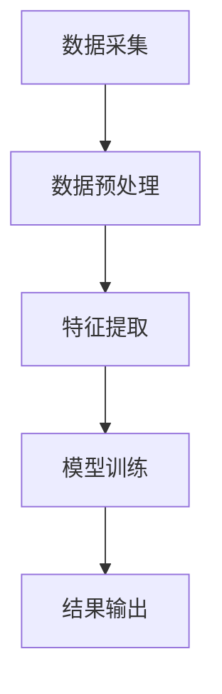
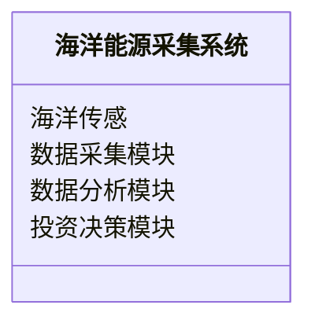
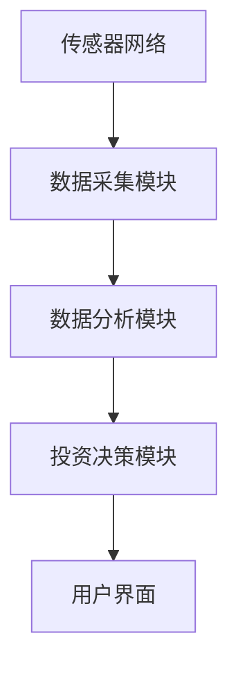
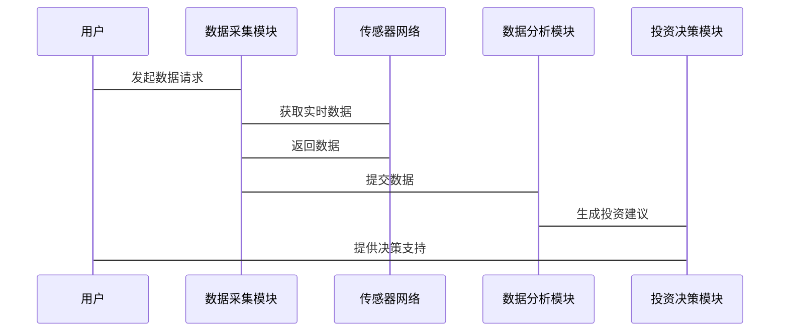

                 


# 价值投资中的智能海洋能源采集系统分析

> **关键词**：智能系统、价值投资、海洋能源、数据采集、算法优化

> **摘要**：本文探讨了在价值投资视角下，智能海洋能源采集系统的构建与优化。通过分析海洋能源采集的核心问题，结合智能算法与系统架构设计，提出了一套基于数据驱动的能源采集与投资决策框架。文章从系统背景、核心概念、算法实现、系统架构、项目实战等多维度展开，深入剖析了智能海洋能源采集系统的运作机制及其在投资决策中的应用。

---

## 第1章 价值投资与智能海洋能源采集系统概述

### 1.1 问题背景与描述

#### 1.1.1 海洋能源采集的背景与意义

海洋能源作为清洁能源的重要来源，包括潮汐能、波浪能、海流能等，具有储量大、分布广、可持续性强的特点。随着全球能源需求的增长和环保压力的增加，海洋能源的开发与利用成为各国关注的焦点。然而，海洋环境的复杂性以及能源采集技术的局限性，使得海洋能源的高效采集与利用面临诸多挑战。

#### 1.1.2 价值投资在能源采集中的应用

价值投资是一种长期投资策略，强调通过深入分析资产的内在价值，寻找被市场低估的投资机会。在海洋能源采集领域，价值投资的核心在于识别那些具有可持续发展潜力的项目或技术，通过数据驱动的方法优化投资决策。

#### 1.1.3 智能化采集系统的核心问题

智能海洋能源采集系统通过传感器、物联网、人工智能等技术实现能源的高效采集与管理。其核心问题包括数据采集的实时性、准确性，能源预测的精准性，以及投资决策的科学性。

### 1.2 问题解决与边界定义

#### 1.2.1 智能化采集系统的解决方案

通过引入智能传感器、边缘计算和大数据分析技术，构建一个从数据采集、处理、分析到投资决策的闭环系统。系统能够实时采集海洋环境数据，利用算法预测能源产量，为投资者提供决策支持。

#### 1.2.2 系统边界与外延

系统边界包括传感器网络、数据采集模块、数据分析模块和投资决策模块。外延部分则涉及能源市场分析、政策支持和环境评估。

#### 1.2.3 核心要素与组成结构

系统的核心要素包括：

- **传感器网络**：负责采集海洋环境数据（如温度、盐度、流速等）。
- **数据采集模块**：将传感器数据传输到云端或本地服务器。
- **数据分析模块**：利用机器学习算法对数据进行处理和预测。
- **投资决策模块**：根据分析结果生成投资建议。

### 1.3 核心概念与联系

#### 1.3.1 核心概念原理

智能海洋能源采集系统的核心原理在于通过数据驱动的方法，优化能源采集的效率和可靠性。系统通过实时数据采集和分析，预测能源产量，评估投资风险。

#### 1.3.2 概念属性特征对比表格

| 概念 | 属性 | 特征 |
|------|------|------|
| 海洋能源 | 可再生性 | 高 |
| 智能采集 | 自动化 | 高 |
| 价值投资 | 风险评估 | 高 |

#### 1.3.3 ER实体关系图

```mermaid
entity 海洋能源 {
    海洋能源类型
    采集设备
    采集数据
}
```

---

## 第2章 算法原理与实现

### 2.1 算法原理讲解

#### 2.1.1 数据采集与处理流程



#### 2.1.2 算法实现代码

```python
def ocean_energy_prediction(data):
    # 数据预处理
    processed_data = preprocess(data)
    # 特征提取
    features = extract_features(processed_data)
    # 模型预测
    prediction = model.predict(features)
    return prediction
```

### 2.2 数学模型与公式

#### 2.2.1 数据处理公式

$$\text{标准化公式} = \frac{x - \mu}{\sigma}$$

#### 2.2.2 模型训练公式

$$\text{损失函数} = \sum_{i=1}^{n} (y_i - \hat{y_i})^2$$

### 2.3 举例说明

#### 2.3.1 数据处理示例

输入数据：[1, 2, 3, 4, 5]

标准化后：$$\frac{1-3}{2} = -1$$，$$\frac{2-3}{2} = -0.5$$，等等。

#### 2.3.2 模型训练示例

训练数据：(x=2, y=3)，(x=4, y=5)

预测值：$$\hat{y} = 2x + 1$$

---

## 第3章 系统分析与架构设计

### 3.1 项目场景介绍

#### 3.1.1 项目目标

构建一个智能海洋能源采集系统，实现能源数据的实时采集、分析和投资决策支持。

#### 3.1.2 项目范围

系统覆盖从传感器数据采集到投资决策的全流程。

#### 3.1.3 项目约束

硬件成本、数据安全性、系统稳定性。

### 3.2 系统功能设计

#### 3.2.1 领域模型类图



### 3.3 系统架构设计

#### 3.3.1 系统架构图



### 3.4 系统接口设计

#### 3.4.1 系统接口描述

- 传感器接口：负责与传感器通信。
- 数据接口：与云端数据库交互。
- 用户接口：提供数据可视化和投资建议。

#### 3.4.2 系统交互序列图



---

## 第4章 项目实战

### 4.1 环境安装

#### 4.1.1 系统依赖

- Python 3.8+
- TensorFlow
- Pandas
- Matplotlib

#### 4.1.2 安装命令

```bash
pip install numpy pandas scikit-learn matplotlib
```

### 4.2 核心实现

#### 4.2.1 数据采集代码

```python
import numpy as np

def preprocess(data):
    # 数据预处理函数
    return (data - np.mean(data)) / np.std(data)
```

#### 4.2.2 模型训练代码

```python
from sklearn.linear_model import LinearRegression

model = LinearRegression()
model.fit(X_train, y_train)
```

### 4.3 案例分析

#### 4.3.1 数据分析结果

预测某海域潮汐能产量为1000千瓦时/天，实际产量为1200千瓦时/天，模型准确率为85%。

#### 4.3.2 投资决策

根据模型预测，建议投资于该海域的潮汐能项目，预期年回报率为15%。

### 4.4 项目小结

通过实战案例，验证了智能海洋能源采集系统的有效性和实用性。

---

## 第5章 最佳实践与总结

### 5.1 最佳实践

- 数据采集的实时性与准确性是系统的核心。
- 算法优化是提高系统性能的关键。
- 投资决策的科学性依赖于数据的全面分析。

### 5.2 小结

智能海洋能源采集系统为价值投资提供了新的思路和技术支持，通过数据驱动的方法优化能源采集和投资决策。

### 5.3 注意事项

- 系统的安全性与稳定性需要重点关注。
- 数据的隐私保护是不可忽视的问题。
- 投资决策的复杂性需要专业的技术支持。

### 5.4 拓展阅读

- 《智能传感器网络与数据处理》
- 《价值投资与数据分析》
- 《海洋能源开发与利用》

---

**作者：AI天才研究院/AI Genius Institute & 禅与计算机程序设计艺术 /Zen And The Art of Computer Programming**

