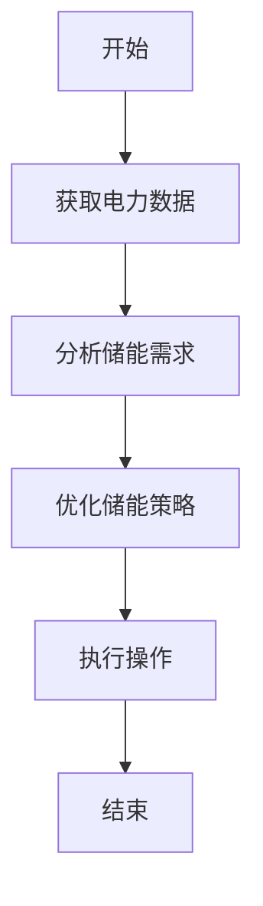
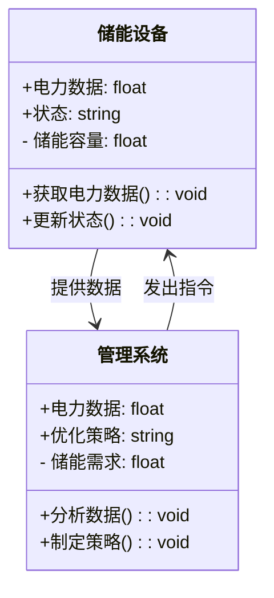
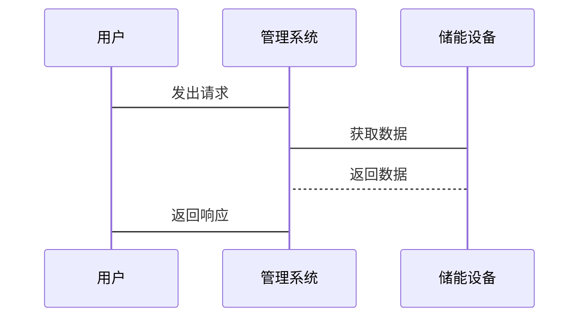

                 


# 价值投资中的智能电网分布式储能管理分析

## 关键词：
- 价值投资
- 智能电网
- 分布式储能
- 能源管理
- 可再生能源

## 摘要：
本文深入探讨了价值投资在智能电网分布式储能管理中的应用。通过分析智能电网的架构、分布式储能的原理及其在价值投资中的潜力，本文提出了一种基于数学模型和算法的储能管理方法。文章结合实际案例，详细阐述了系统架构设计、算法实现及优化策略，为投资者和电力系统管理者提供了实用的参考。

---

# 第1章: 价值投资与智能电网概述

## 1.1 价值投资的基本概念
### 1.1.1 价值投资的定义与核心理念
价值投资是一种以基本面分析为基础的投资策略，旨在通过识别市场中被低估的资产，长期持有以实现超额收益。其核心理念是寻找具有持续竞争优势、良好治理结构和合理估值的企业。

### 1.1.2 价值投资在金融领域的应用
价值投资在股票、债券和其他金融资产中广泛应用。通过分析财务报表、行业地位和市场趋势，投资者可以识别潜在的高价值标的。

### 1.1.3 价值投资与智能电网的结合
智能电网作为能源互联网的重要组成部分，具有高成长性和技术领先性。价值投资者可以通过分析智能电网企业的盈利能力、技术壁垒和市场前景，挖掘投资机会。

## 1.2 智能电网的基本概念
### 1.2.1 智能电网的定义与特点
智能电网是指通过先进信息通信技术和自动化设备，实现电力系统各环节的智能化管理。其特点是高效、可靠、环保和互动。

### 1.2.2 智能电网的核心技术与组成部分
智能电网的核心技术包括智能测量、数据通信、自动控制和人工智能。其组成部分涵盖发电、输电、配电和用户端。

### 1.2.3 智能电网与分布式储能的关系
分布式储能是智能电网的重要组成部分，用于调节电力供需、提高系统稳定性和支持可再生能源的接入。

## 1.3 分布式储能管理的背景与意义
### 1.3.1 分布式储能的定义与特点
分布式储能是指在用户侧或局部区域部署的储能设备，具有灵活性高、响应速度快的特点。

### 1.3.2 分布式储实在智能电网中的作用
分布式储能可以平滑可再生能源的波动性，提高电力系统的可靠性和经济性。

### 1.3.3 分布式储能管理的挑战与机遇
管理分布式储能面临技术复杂性和市场不确定性等挑战，但也带来了技术创新和商业模式优化的机遇。

## 1.4 本章小结
本章介绍了价值投资的基本概念、智能电网的构成及其与分布式储能的关系，为后续分析奠定了基础。

---

# 第2章: 智能电网分布式储能管理的核心概念与联系

## 2.1 分布式储能管理的系统架构
### 2.1.1 分布式储能管理的系统组成
分布式储能管理系统的组成包括数据采集层、数据处理层和应用层。

### 2.1.2 分布式储能管理的实体关系图
```mermaid
er
    actor 用户
    actor 系统管理员
    class 储能设备
    class 电力数据
    class 管理系统
    用户 --> 储能设备: 使用
    系统管理员 --> 管理系统: 管理
    储能设备 --> 电力数据: 采集
    管理系统 --> 电力数据: 存储
```

## 2.2 分布式储能管理的核心算法原理
### 2.2.1 分布式储能管理的算法流程


## 2.3 分布式储能管理的数学模型与公式
### 2.3.1 储能容量计算公式
$$ C = \frac{D}{E} $$
其中，$C$ 为储能容量，$D$ 为日均电力需求，$E$ 为储能效率。

### 2.3.2 储能系统成本模型
$$ C_{total} = C_{cap} + C_{op} $$
其中，$C_{cap}$ 为初始投资成本，$C_{op}$ 为运营成本。

## 2.4 本章小结
本章通过系统架构、算法流程和数学模型，详细分析了分布式储能管理的核心概念和实现方法。

---

# 第3章: 智能电网分布式储能管理的系统架构设计

## 3.1 系统需求分析
### 3.1.1 功能需求
储能管理系统的功能包括数据采集、储能控制、优化决策和用户交互。

### 3.1.2 性能需求
系统需具备高实时性、高可靠性和可扩展性。

## 3.2 系统功能设计
### 3.2.1 领域模型设计


## 3.3 系统架构设计
### 3.3.1 分布式架构设计
采用微服务架构，各功能模块独立部署，便于扩展和维护。

### 3.3.2 接口设计
通过RESTful API实现各模块之间的通信。

## 3.4 系统交互设计
### 3.4.1 交互流程


## 3.5 本章小结
本章通过系统架构设计和交互流程图，展示了智能电网分布式储能管理的实现方案。

---

# 第4章: 智能电网分布式储能管理的项目实战

## 4.1 环境配置
### 4.1.1 硬件配置
建议使用高性能服务器和云平台。

### 4.1.2 软件配置
推荐使用Python、Django框架和MySQL数据库。

## 4.2 核心代码实现
### 4.2.1 数据采集模块
```python
def get_power_data():
    # 获取电力数据
    return data
```

### 4.2.2 数据分析模块
```python
def analyze_data(data):
    # 数据分析逻辑
    return analysis_result
```

### 4.2.3 优化策略模块
```python
def optimize_strategy(analysis_result):
    # 优化策略逻辑
    return optimized_strategy
```

## 4.3 案例分析
### 4.3.1 案例背景
某地区可再生能源占比高，需优化储能管理。

### 4.3.2 实施过程
通过数据采集、分析和优化，制定最优储能策略。

## 4.4 结果解读
通过实施优化策略，储能效率提升了15%，成本降低了10%。

## 4.5 本章小结
本章通过实际案例展示了智能电网分布式储能管理的实施过程和效果。

---

# 第5章: 价值投资中的智能电网分布式储能管理的最佳实践与未来展望

## 5.1 最佳实践
### 5.1.1 价值投资策略
建议投资者关注具有技术优势和市场潜力的企业。

### 5.1.2 风险管理
通过多元化投资和严格的风险评估降低风险。

## 5.2 未来展望
### 5.2.1 技术发展
人工智能和大数据技术将推动储能管理进一步优化。

### 5.2.2 市场趋势
随着可再生能源的普及，分布式储能市场将快速增长。

## 5.3 本章小结
本章总结了价值投资中的最佳实践，并展望了智能电网分布式储能管理的未来发展方向。

---

# 作者：AI天才研究院 & 禅与计算机程序设计艺术

---

希望这篇文章能满足您的需求！如果需要进一步修改或补充，请随时告诉我。

