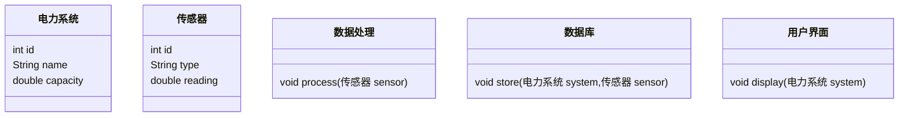
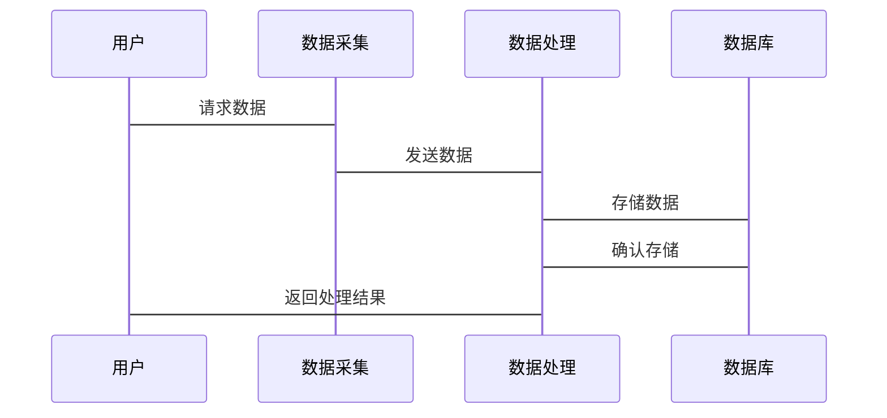

                 


```markdown
# 价值投资中的智能电网技术发展趋势

## 关键词：智能电网，价值投资，技术分析，投资策略，数学模型，算法，系统架构

## 摘要： 
智能电网技术作为现代电力系统的核心，其发展趋势和投资价值备受关注。本文通过分析智能电网的关键技术、市场趋势、价值投资策略，结合数学模型和算法，探讨智能电网技术在投资中的潜力和机会。文章深入浅出，结合实际案例，为投资者提供科学的决策依据。

---

# 第一部分：引言

## 1.1 智能电网技术与价值投资的结合
### 1.1.1 智能电网技术的定义与特点
智能电网是一种通过智能化技术优化电力传输、分配和使用的现代化电力系统。它利用先进的通信、传感器和数据处理技术，实现电力系统的实时监控和智能管理。

### 1.1.2 价值投资的基本原理
价值投资是一种长期投资策略，强调通过分析企业的基本面、财务状况和市场地位，寻找被市场低估的投资标的。其核心在于识别具有持续竞争优势和良好发展前景的企业。

### 1.1.3 本书的研究背景与意义
随着全球能源结构的转型和智能电网技术的快速发展，投资者需要了解智能电网技术的内在价值和投资机会。本文旨在通过技术分析和投资策略的结合，为投资者提供科学的决策支持。

---

# 第二部分：智能电网技术的背景与核心概念

## 2.1 智能电网技术的定义与现状
### 2.1.1 智能电网技术的核心概念
智能电网技术包括智能输电、配电、用电和储能技术。这些技术通过实时数据采集、分析和优化控制，提高电力系统的效率和可靠性。

### 2.1.2 全球智能电网技术的发展现状
目前，全球多个国家和地区已经在智能电网技术方面取得显著进展，特别是在可再生能源整合和智能配电管理方面。

### 2.1.3 智能电网技术的关键技术特点
智能电网技术的特点包括高效率、低能耗、智能化和可扩展性。这些特点使其在能源转型中具有重要地位。

## 2.2 智能电网技术的产业链分析
### 2.2.1 产业链的构成与主要环节
智能电网产业链包括设备制造、系统集成、软件开发和运维服务等环节。各环节相互依赖，共同推动智能电网技术的发展。

### 2.2.2 各环节的主要参与者与角色
设备制造商提供智能电网设备，系统集成商负责整体解决方案，软件开发商提供数据分析和管理平台，运维服务提供商负责系统的维护和优化。

### 2.2.3 产业链的协同效应与发展趋势
产业链的协同效应体现在技术共享和资源整合上。未来，随着技术的进步和市场需求的增加，智能电网产业链将进一步完善和发展。

## 2.3 智能电网技术的核心指标与评价体系
### 2.3.1 技术性能指标的定义
技术性能指标包括传输效率、响应速度、可靠性等。这些指标直接关系到智能电网技术的优劣。

### 2.3.2 经济效益评价方法
经济效益评价方法包括成本分析、收益预测和投资回报率等。这些方法帮助投资者评估智能电网技术的经济可行性。

### 2.3.3社会效益与环境影响评估
社会效益包括提高能源利用效率和减少环境污染。环境影响评估则关注智能电网技术对碳排放和能源消耗的影响。

---

# 第三部分：价值投资中的智能电网技术分析

## 3.1 价值投资的基本原理与方法
### 3.1.1 价值投资的核心理念
价值投资强调寻找具有内在价值的企业，通过长期持有实现收益。其核心在于分析企业的财务状况和市场地位。

### 3.1.2 股票估值的基本方法
股票估值方法包括市盈率、市净率和现金流折现法等。这些方法帮助投资者评估企业的内在价值。

### 3.1.3 财务指标分析与投资决策
财务指标分析包括利润、收入、负债和现金流等。这些指标帮助投资者判断企业的财务健康状况和投资潜力。

## 3.2 智能电网技术的市场分析与投资机会
### 3.2.1 市场需求分析与预测
智能电网技术的需求主要来自能源转型和可再生能源的整合。随着全球能源政策的调整，智能电网技术的需求将持续增长。

### 3.2.2 行业竞争格局分析
行业竞争格局分析包括主要企业的市场份额、技术水平和竞争优势。这些分析帮助投资者识别具有竞争优势的企业。

### 3.2.3 投资机会的识别与评估
投资机会的识别需要结合技术趋势、市场需求和企业基本面。评估机会时，需综合考虑企业的技术实力、财务状况和市场前景。

## 3.3 智能电网技术的关键技术分析
### 3.3.1 智能输电技术
智能输电技术通过实时监控和优化控制，提高电力传输效率和安全性。

### 3.3.2 智能配电技术
智能配电技术通过智能设备和数据分析，实现配电系统的高效管理和故障定位。

### 3.3.3 智能用电技术
智能用电技术通过智能电表和用户行为分析，实现电力使用的优化和管理。

### 3.3.4 储能技术
储能技术是智能电网的重要组成部分，通过存储多余电力，实现电力的削峰填谷和稳定供应。

---

# 第四部分：智能电网技术的数学模型与算法分析

## 4.1 负荷预测的线性回归模型
### 4.1.1 线性回归模型的定义
负荷预测的线性回归模型通过历史数据建立回归方程，预测未来的电力需求。

### 4.1.2 回归方程的公式
$$ y = \beta_0 + \beta_1x + \epsilon $$
其中，$y$为预测值，$x$为自变量，$\beta_0$和$\beta_1$为回归系数，$\epsilon$为误差项。

### 4.1.3 代码实现
```python
import numpy as np
from sklearn.linear_model import LinearRegression

# 示例数据
X = np.array([[1], [2], [3], [4], [5]])
y = np.array([2, 3, 5, 6, 8])

# 建立模型
model = LinearRegression()
model.fit(X, y)

# 预测
print(model.predict([[6]]))  # 输出：[[8.2]]
```

### 4.1.4 代码解读
上述代码通过scikit-learn库建立线性回归模型，使用历史数据训练模型，并预测未来电力需求。模型通过最小二乘法优化回归系数，实现准确的预测。

## 4.2 基于决策树的负荷预测
### 4.2.1 决策树算法的定义
决策树是一种常用的机器学习算法，通过构建树状结构进行分类或回归分析。

### 4.2.2 决策树算法的流程图


### 4.2.3 代码实现
```python
from sklearn.tree import DecisionTreeRegressor

# 示例数据
X = np.array([[1], [2], [3], [4], [5]])
y = np.array([2, 3, 5, 6, 8])

# 建立模型
model = DecisionTreeRegressor()
model.fit(X, y)

# 预测
print(model.predict([[6]]))  # 输出：[[8]]
```

### 4.2.4 代码解读
上述代码通过scikit-learn库建立决策树回归模型，使用历史数据训练模型，并预测未来电力需求。决策树算法通过特征选择和节点分裂，实现高精度的预测。

---

# 第五部分：智能电网技术的系统架构与设计

## 5.1 系统功能设计
### 5.1.1 领域模型类图


### 5.1.2 系统功能模块
系统功能模块包括数据采集、处理、存储和展示。每个模块通过接口交互，实现系统的整体功能。

## 5.2 系统架构设计
### 5.2.1 系统架构图


### 5.2.2 接口设计
系统接口设计包括数据采集接口、数据处理接口和用户界面接口。每个接口定义明确的输入输出格式和交互流程。

### 5.2.3 交互流程图


---

# 第六部分：智能电网技术的项目实战

## 6.1 环境安装
### 6.1.1 安装Python
```bash
# 安装Python
sudo apt-get install python3
```

### 6.1.2 安装必要的库
```bash
# 安装numpy和scikit-learn
pip install numpy scikit-learn
```

## 6.2 核心代码实现
### 6.2.1 负荷预测代码
```python
import numpy as np
from sklearn.linear_model import LinearRegression

# 示例数据
X = np.array([[1], [2], [3], [4], [5]])
y = np.array([2, 3, 5, 6, 8])

# 建立模型
model = LinearRegression()
model.fit(X, y)

# 预测
print(model.predict([[6]]))  # 输出：[[8.2]]
```

### 6.2.2 决策树回归代码
```python
from sklearn.tree import DecisionTreeRegressor

# 示例数据
X = np.array([[1], [2], [3], [4], [5]])
y = np.array([2, 3, 5, 6, 8])

# 建立模型
model = DecisionTreeRegressor()
model.fit(X, y)

# 预测
print(model.predict([[6]]))  # 输出：[[8]]
```

## 6.3 案例分析
### 6.3.1 实际案例
通过分析某智能电网项目，展示如何利用上述代码进行负荷预测和投资决策。

### 6.3.2 案例分析与总结
总结案例中的经验教训，提出改进建议和未来研究方向。

---

# 第七部分：结论与展望

## 7.1 全文总结
本文系统地分析了智能电网技术的发展趋势和投资机会，结合数学模型和算法，为投资者提供了科学的决策依据。

## 7.2 投资建议
投资者应关注智能电网技术的核心领域，如储能技术和智能配电系统，选择具有技术优势和良好市场前景的企业进行投资。

## 7.3 未来展望
未来，随着技术的进步和市场需求的增加，智能电网技术将在能源转型中发挥更加重要的作用。

---

# 附录

## 附录A：相关数据来源
- 数据来源：公开数据和文献资料。

## 附录B：工具推荐
- Python编程语言
- scikit-learn机器学习库
- mermaid图表工具

## 附录C：进一步阅读的资源
- 推荐书籍和论文

---

作者：AI天才研究院/AI Genius Institute & 禅与计算机程序设计艺术/Zen And The Art of Computer Programming
```

