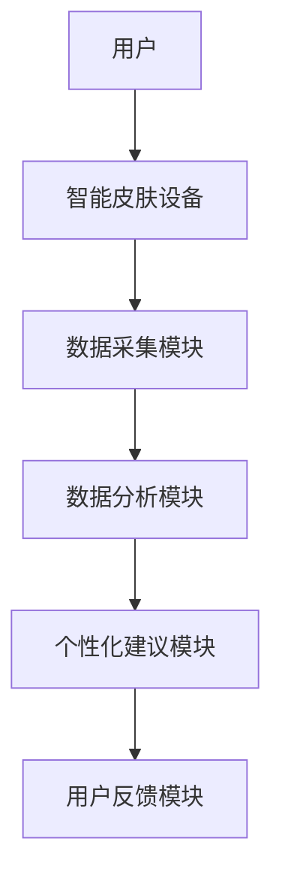

                 


# 价值投资中的智能皮肤技术商业化前景

> 关键词：智能皮肤技术、价值投资、商业化前景、算法原理、系统架构、项目实战

> 摘要：本文探讨智能皮肤技术在价值投资中的商业化潜力，分析其技术原理、市场机会及商业化策略。通过系统分析和实战案例，揭示智能皮肤技术在皮肤健康与美容领域的未来发展方向。

---

# 第一部分：智能皮肤技术的核心概念

## 第1章：智能皮肤技术的定义与背景

### 1.1 问题背景：皮肤健康与美容的数字化需求

现代人对皮肤健康的关注日益增加，但传统皮肤护理方式存在效率低、个性化不足等问题。智能皮肤技术通过大数据与人工智能，提供精准的皮肤分析与个性化建议。

### 1.2 问题描述：传统皮肤护理的局限性

传统皮肤护理依赖实验室测试，效率低，成本高，且难以满足个性化需求。此外，传统方法难以实时监测皮肤状态，无法及时调整护理方案。

### 1.3 问题解决：智能皮肤技术的出现

智能皮肤技术通过采集皮肤数据，结合AI算法，实时分析皮肤状况，提供个性化建议。这种方式高效、精准，降低了成本。

### 1.4 智能皮肤技术的边界与外延

智能皮肤技术不仅限于皮肤护理，还可应用于医疗诊断、美容产品推荐等领域。其边界包括数据采集、分析、个性化建议，外延则涉及健康监测、美容产业智能化等。

### 1.5 概念结构与核心要素组成

智能皮肤技术由数据采集模块、数据分析模块、个性化建议模块组成。其核心要素包括高精度传感器、AI算法、个性化推荐系统。

---

## 第2章：智能皮肤技术的核心属性与特征对比

### 2.1 核心属性对比表格

| 属性 | 传统皮肤护理 | 智能皮肤技术 |
|------|--------------|--------------|
| 数据来源 | 实验室测试 | 大数据与AI分析 |
| 个性化程度 | 低 | 高 |
| 效率 | 低 | 高 |
| 成本 | 高 | 中低 |

### 2.2 ER实体关系图（Mermaid流程图）



---

# 第二部分：价值投资的基本原理

## 第3章：价值投资的核心理念

### 3.1 价值投资的定义

价值投资是一种投资策略，通过分析企业的基本面，寻找被市场低估的投资机会。

### 3.2 价值投资的核心原则

价值投资强调长期投资、安全边际、内在价值。投资者应关注企业的盈利能力、财务状况、竞争优势等。

---

## 第4章：智能皮肤技术的商业化潜力

### 4.1 市场需求分析

随着消费者对个性化健康服务的需求增加，智能皮肤技术市场潜力巨大。预计到2030年，市场规模将超过100亿美元。

### 4.2 技术可行性分析

智能皮肤技术基于成熟的大数据与AI技术，结合高精度传感器，技术可行性高。未来可通过深度学习进一步提升准确性。

### 4.3 商业模式探讨

智能皮肤技术可通过订阅模式、硬件销售、数据服务等方式盈利。企业可与美容品牌合作，提供定制化产品推荐服务。

---

# 第三部分：智能皮肤技术的商业化策略

## 第5章：商业化策略的制定原则

### 5.1 用户需求导向

商业化策略应围绕用户需求展开，提供个性化、高效的解决方案。企业需通过市场调研确定目标用户群体。

### 5.2 技术驱动创新

智能皮肤技术的核心竞争力在于算法与数据处理能力。企业需持续投入研发，提升技术壁垒。

### 5.3 市场竞争分析

分析竞争对手的优劣势，找到市场空白点。制定差异化策略，突出自身产品的独特优势。

---

## 第6章：商业化策略的具体实施

### 6.1 产品定位与开发

企业应明确产品定位，开发适合不同用户群体的产品。例如，面向年轻人推出便捷的智能皮肤检测仪，面向中高端用户开发个性化美容方案。

### 6.2 市场推广与营销

通过社交媒体、KOL推广等方式提升品牌知名度。举办线上活动，吸引用户参与，增强用户粘性。

### 6.3 服务体系与客户维护

建立完善的售后服务体系，及时解决用户问题。通过会员制度、积分奖励等方式增强客户忠诚度。

---

# 第四部分：智能皮肤技术的算法原理

## 第7章：算法原理概述

### 7.1 数据采集与预处理

智能皮肤技术通过高精度传感器采集皮肤数据，包括水分含量、弹性、酸碱度等。数据预处理包括去噪、标准化等步骤。

### 7.2 特征提取与模型训练

特征提取：通过主成分分析（PCA）提取关键特征。模型训练：使用支持向量机（SVM）或随机森林（Random Forest）进行分类或回归。

### 7.3 模型优化与部署

通过交叉验证优化模型参数。部署模型到云端或本地设备，提供实时分析服务。

---

## 第8章：算法实现代码示例

### 8.1 数据预处理

```python
import numpy as np
from sklearn.preprocessing import StandardScaler

# 假设data是原始数据
data = np.random.randn(100, 5)  # 100样本，5特征
scaler = StandardScaler()
data_normalized = scaler.fit_transform(data)
```

### 8.2 模型训练

```python
from sklearn.svm import SVC

model = SVC(kernel='rb

