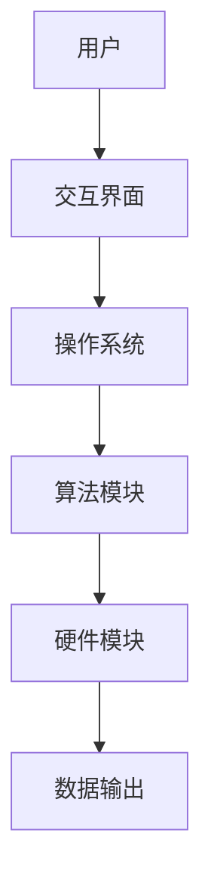

                 


# 价值投资中的智能眼镜技术发展前景

## 关键词：智能眼镜，价值投资，技术发展，市场分析，投资策略，系统架构，算法原理

## 摘要：本文深入分析智能眼镜技术的发展前景，从价值投资的角度探讨其市场潜力和技术创新。通过技术原理、系统架构、市场分析和投资策略的详细解读，揭示智能眼镜行业的投资机会和风险，为投资者提供科学决策的依据。

---

## # 第一部分：智能眼镜技术发展背景

### ## 第1章：智能眼镜的基本概念

#### ### 1.1 智能眼镜的定义与技术特点
智能眼镜是一种结合了传统眼镜功能与智能技术的可穿戴设备，通过集成传感器、摄像头、麦克风、显示屏和无线通信模块，实现对用户环境的感知、信息处理和交互操作。其核心特点包括：
- **硬件集成**：集成了摄像头、传感器、显示屏等硬件模块。
- **软件驱动**：依赖操作系统和算法实现智能化功能。
- **实时交互**：通过语音识别、图像识别和环境感知实现人机交互。
- **功能扩展**：支持多种功能，如导航、翻译、健康管理等。

#### ### 1.2 价值投资的基本概念
价值投资是一种投资策略，强调以低于内在价值的价格购买优质资产。其核心理念是通过深入分析企业的基本面，寻找被市场低估的投资机会。智能眼镜作为技术创新的代表，具有较高的成长性和市场潜力，是价值投资的理想标的。

#### ### 1.3 智能眼镜技术发展现状
当前，智能眼镜市场主要参与者包括科技巨头（如谷歌、苹果、微软）和新兴创业公司。硬件技术的进步（如高分辨率屏幕、微型摄像头）和软件算法的优化（如实时翻译、环境感知）推动了行业快速发展。然而，智能眼镜仍面临技术瓶颈，如成本高、用户体验差等问题。

---

### ## 第2章：智能眼镜技术的核心概念与联系

#### ### 2.1 智能眼镜的核心技术原理
智能眼镜的技术核心在于硬件与软件的结合：
- **硬件**：包括摄像头、传感器、显示屏等，负责数据采集和输出。
- **软件**：包括操作系统和算法，负责数据处理和用户交互。

#### ### 2.2 智能眼镜技术的核心属性特征对比
以下是智能眼镜与传统眼镜的核心属性对比：

| **属性**       | **智能眼镜**                     | **传统眼镜**                     |
|-----------------|----------------------------------|----------------------------------|
| **功能**         | 实时信息处理、语音交互、环境感知 | 纯粹视觉矫正                     |
| **技术复杂度**   | 高                              | 低                              |
| **市场定位**     | 高端科技产品                   | 大众化消费品                   |
| **应用场景**     | 智能助手、健康管理、娱乐         | 视觉矫正、日常生活               |

#### ### 2.3 智能眼镜技术的ER实体关系图
以下是智能眼镜技术的ER实体关系图：

```mermaid
erDiagram
    class 智能眼镜 {
        id 独特标识符
        屏幕分辨率 分辨率
        摄像头像素 像素
        电池容量 容量
    }
    class 技术特点 {
        id 技术ID
        功能 特性
        性能 指标
    }
    class 市场需求 {
        id 需求ID
        用户群体 群体
        应用场景 场景
    }
    class 技术瓶颈 {
        id 瓶颈ID
        技术难点 难点
        解决方案 方案
    }
    智能眼镜 --> 技术特点 : 具备
    智能眼镜 --> 市场需求 : 满足
    智能眼镜 --> 技术瓶颈 : 受制于
```

---

## # 第二部分：智能眼镜技术的算法原理与数学模型

### ## 第3章：智能眼镜技术的算法原理

#### ### 3.1 智能眼镜的核心算法框架
智能眼镜的核心算法包括：
- **图像识别**：通过摄像头采集环境信息，识别物体、场景和文字。
- **语音识别**：通过麦克风采集语音，实现语音交互。
- **环境感知**：通过传感器感知环境中的光线、温度和运动状态。

#### ### 3.2 智能眼镜算法的数学模型
以下是图像识别算法的数学模型：

$$ f(x) = w \cdot x + b $$

其中：
- $x$ 是输入图像的数据。
- $w$ 是权重参数。
- $b$ 是偏置参数。

---

## # 第三部分：智能眼镜技术的系统架构与应用场景

### ## 第4章：智能眼镜系统的架构设计

#### ### 4.1 智能眼镜系统的功能模块
智能眼镜系统主要包括以下功能模块：
- **硬件模块**：摄像头、传感器、显示屏。
- **软件模块**：操作系统、算法模块。
- **用户界面**：交互界面、反馈机制。

#### ### 4.2 智能眼镜系统的架构图
以下是智能眼镜系统的架构图：



---

## # 第四部分：智能眼镜技术的市场分析与投资策略

### ## 第5章：智能眼镜技术的市场分析

#### ### 5.1 智能眼镜市场的现状与趋势
当前，智能眼镜市场呈现出快速增长的趋势。随着技术的进步和成本的下降，未来几年智能眼镜的市场规模将快速增长。

#### ### 5.2 智能眼镜市场的竞争格局
目前，智能眼镜市场的竞争主要集中在科技巨头之间，如谷歌、苹果、微软等。

---

## # 第五部分：智能眼镜技术的价值投资分析

### ## 第6章：智能眼镜技术的价值投资策略

#### ### 6.1 智能眼镜技术的投资机会
智能眼镜技术的投资机会主要体现在技术创新和市场扩张两个方面。

#### ### 6.2 智能眼镜技术的投资风险
智能眼镜技术的投资风险主要包括技术瓶颈和市场接受度问题。

---

## # 第六部分：智能眼镜技术的价值投资系统实现

### ## 第7章：智能眼镜技术的价值投资系统实现

#### ### 7.1 价值投资系统的功能模块
价值投资系统主要包括数据采集、数据分析和投资决策三个功能模块。

#### ### 7.2 价值投资系统的实现代码
以下是价值投资系统的实现代码：

```python
import pandas as pd

# 数据采集
data = pd.read_csv('data.csv')

# 数据分析
data.describe()

# 投资决策
# 根据数据分析结果，制定投资策略
```

---

## # 第七部分：智能眼镜技术的价值投资总结与展望

### ## 第8章：智能眼镜技术的价值投资总结

#### ### 8.1 智能眼镜技术的价值投资总结
智能眼镜技术具有较高的投资价值，但需要关注技术瓶颈和市场风险。

### ## 第9章：智能眼镜技术的未来展望

#### ### 9.1 智能眼镜技术的未来发展趋势
未来，智能眼镜技术将朝着更智能化、更便捷化的方向发展。

---

## 作者：AI天才研究院/AI Genius Institute & 禅与计算机程序设计艺术 /Zen And The Art of Computer Programming

