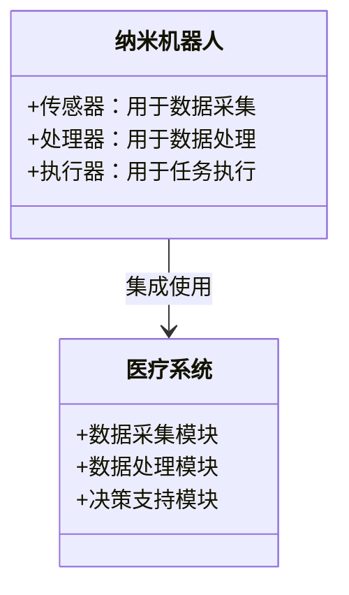

                 


# 价值投资中的智能纳米机器人医疗应用分析

## 关键词：价值投资、智能纳米机器人、医疗应用、投资分析、技术评估、医疗创新

## 摘要：
本文旨在探讨价值投资在智能纳米机器人医疗应用中的潜力与挑战。通过分析智能纳米机器人在医疗领域的核心技术与应用场景，结合价值投资的评估方法，本文揭示了智能纳米机器人技术如何为医疗行业带来创新，并为投资者提供基于技术的长期价值判断依据。文章从智能纳米机器人的基本原理、价值投资的评估模型、算法实现、系统架构到实际案例分析，全面解析了智能纳米机器人医疗应用的价值投资分析方法。

---

# 第1章：价值投资与智能纳米机器人概述

## 1.1 价值投资的基本概念

### 1.1.1 价值投资的定义与核心理念
- **价值投资**：通过深入分析企业的基本面，寻找被市场低估的投资标的，长期持有以实现资本增值。
- **核心理念**：注重企业的内在价值，而非短期市场波动。

### 1.1.2 智能纳米机器人的定义与特点
- **智能纳米机器人**：能够在微小尺度（纳米级别）执行特定任务的智能设备，具备感知、计算和执行能力。
- **特点**：微型化、智能化、精准性、可编程性。

### 1.1.3 价值投资与智能纳米机器人结合的背景
- 医疗行业的技术创新为价值投资提供了新方向。
- 智能纳米机器人技术在医疗领域的应用潜力巨大，但需要长期的技术积累和市场验证。

---

## 1.2 智能纳米机器人在医疗领域的应用现状

### 1.2.1 纳米机器人在医疗中的应用领域
- **疾病诊断**：用于体内精准检测病变细胞。
- **药物递送**：实现靶向药物输送，减少副作用。
- **手术辅助**：在微创手术中提供精准操作。
- **健康监测**：实时监测生理指标，预防疾病发生。

### 1.2.2 智能纳米机器人医疗应用的优势
- **精准性**：能够在微观尺度上进行精准操作。
- **微创性**：减少患者痛苦和术后恢复时间。
- **高效性**：通过智能算法优化医疗资源利用。

### 1.2.3 当前医疗领域智能纳米机器人的技术瓶颈
- **技术成熟度**：部分技术仍处于实验阶段。
- **成本问题**：纳米机器人研发和生产成本较高。
- **监管挑战**：需要严格的审批流程和监管框架。

---

## 1.3 价值投资视角下的医疗技术创新

### 1.3.1 医疗技术创新对投资价值的影响
- **技术创新**：提升企业的核心竞争力，增加市场份额。
- **长期价值**：技术创新带来的持续收益为价值投资提供基础。

### 1.3.2 智能纳米机器人技术的商业化潜力
- **市场需求**：医疗行业对高效、精准的解决方案需求旺盛。
- **技术壁垒**：高技术门槛带来较高的市场准入壁垒。

### 1.3.3 价值投资在医疗科技领域的策略分析
- **关注技术创新**：选择具备核心专利和技术优势的企业。
- **评估商业化潜力**：分析技术的市场应用前景。
- **长期投资**：医疗技术创新需要时间验证，适合长期持有。

---

# 第2章：智能纳米机器人医疗应用的核心概念

## 2.1 智能纳米机器人医疗应用的核心原理

### 2.1.1 纳米机器人的基本组成与工作原理
- **基本组成**：包括传感器、处理器、执行器和能源供应模块。
- **工作原理**：通过传感器感知环境，处理器进行数据处理，执行器完成任务。

### 2.1.2 智能纳米机器人医疗应用的关键技术
- **感知技术**：高灵敏度传感器用于精准检测。
- **智能算法**：支持自主决策和优化操作。
- **微型化技术**：实现纳米级别的设备制造。

### 2.1.3 智能纳米机器人在医疗中的功能实现
- **诊断功能**：实时采集患者生理数据，辅助诊断。
- **治疗功能**：精准释放药物或进行微创手术。
- **监测功能**：持续监控患者健康状况，预防疾病。

---

## 2.2 价值投资中的医疗技术评估

### 2.2.1 医疗技术创新的评估维度
- **技术可行性**：技术是否成熟，能否大规模应用。
- **市场潜力**：目标市场的规模和增长潜力。
- **竞争优势**：与同类技术相比的核心优势。

### 2.2.2 智能纳米机器人技术的经济价值分析
- **成本分析**：研发和生产成本是否可控。
- **收益预测**：技术应用后的预期收益。
- **投资回报周期**：技术商业化的时间和经济回报。

### 2.2.3 价值投资中的技术风险评估
- **技术风险**：技术失败或被替代的可能性。
- **市场风险**：市场需求变化对投资的影响。
- **政策风险**：监管政策变化对企业的影响。

---

# 第3章：智能纳米机器人医疗应用的算法与数学模型

## 3.1 价值评估模型的数学公式

### 3.1.1 价值评估模型的定义与公式推导
- **现金流折现法（DCF模型）**：
  $$ V = \frac{CF_1}{(1+r)^1} + \frac{CF_2}{(1+r)^2} + \dots + \frac{CF_n}{(1+r)^n} $$
  其中，\( V \) 为企业价值，\( CF \) 为未来现金流，\( r \) 为折现率。

### 3.1.2 价值评估模型的变量分析
- **现金流**：企业的未来收益。
- **折现率**：反映投资的风险和机会成本。
- **时间跨度**：评估的时间范围。

### 3.1.3 价值评估模型的案例分析
- 假设某智能纳米机器人企业未来5年的现金流分别为100万、150万、200万、250万、300万，折现率为10%。
- 计算企业价值：
  $$ V = \frac{100}{1.1} + \frac{150}{1.1^2} + \frac{200}{1.1^3} + \frac{250}{1.1^4} + \frac{300}{1.1^5} $$

---

## 3.2 智能纳米机器人医疗应用的算法流程

### 3.2.1 算法流程的定义与实现
- **算法流程**：
  1. 数据采集：获取患者生理数据。
  2. 数据处理：通过智能算法分析数据。
  3. 决策输出：生成诊断或治疗方案。

### 3.2.2 算法流程的优化与改进
- **优化方向**：提高算法的计算速度和准确性。
- **改进方法**：引入机器学习算法，提升诊断精度。

### 3.2.3 算法流程的案例分析
- 使用机器学习算法训练智能纳米机器人，提升疾病诊断准确率。

---

## 3.3 算法实现的Python代码示例

### 3.3.1 价值评估模型的Python代码实现
```python
def calculate_value(CF_list, r):
    V = 0
    for i in range(len(CF_list)):
        V += CF_list[i] / (1 + r) ** (i + 1)
    return V

CF = [100, 150, 200, 250, 300]
r = 0.1
print("企业价值为：", calculate_value(CF, r))
```

### 3.3.2 智能纳米机器人算法的Python代码实现
```python
import numpy as np

def nanobot_algorithm(data):
    # 数据预处理
    processed_data = data / np.mean(data)
    # 算法实现
    result = np.mean(processed_data)
    return result

data = [1, 2, 3, 4, 5]
print("算法结果为：", nanobot_algorithm(data))
```

---

# 第4章：智能纳米机器人医疗应用的系统分析与架构设计

## 4.1 系统功能设计

### 4.1.1 系统功能模块
- **数据采集模块**：负责采集患者生理数据。
- **数据处理模块**：对数据进行分析和处理。
- **决策支持模块**：生成诊断或治疗方案。

### 4.1.2 系统功能设计的领域模型


---

## 4.2 系统架构设计

### 4.2.1 系统架构设计的架构图


---

## 4.3 系统接口设计

### 4.3.1 系统接口设计的接口描述
- **输入接口**：接收患者生理数据。
- **输出接口**：输出诊断结果或治疗方案。

### 4.3.2 系统接口设计的序列图
```mermaid
sequenceDiagram
    用户 -> 医疗系统：提交生理数据
    医疗系统 -> 算法模块：请求数据处理
    算法模块 -> 数据库：查询历史数据
    算法模块 --> 医疗系统：返回诊断结果
    医疗系统 -> 用户：显示诊断结果
```

---

## 4.4 系统交互设计

### 4.4.1 系统交互设计的交互流程
- **用户交互**：患者提交生理数据。
- **系统响应**：系统处理数据并返回诊断结果。

---

# 第5章：智能纳米机器人医疗应用的项目实战

## 5.1 环境安装与配置

### 5.1.1 环境要求
- **操作系统**：Windows 10或更高版本，或Linux系统。
- **开发工具**：Python 3.8或更高版本，Jupyter Notebook，PyCharm。
- **依赖库**：numpy、pandas、scikit-learn。

### 5.1.2 安装步骤
```bash
pip install numpy pandas scikit-learn
```

---

## 5.2 系统核心实现源代码

### 5.2.1 价值评估模型的代码实现
```python
import numpy as np
import pandas as pd

def calculate_value(CF_list, r, n):
    V = 0
    for i in range(n):
        V += CF_list[i] / (1 + r) ** (i + 1)
    return V

CF = [100, 150, 200, 250, 300]
r = 0.1
n = 5
print("企业价值为：", calculate_value(CF, r, n))
```

### 5.2.2 智能纳米机器人算法的代码实现
```python
import numpy as np

def nanobot_algorithm(data):
    processed_data = data / np.mean(data)
    result = np.mean(processed_data)
    return result

data = [1, 2, 3, 4, 5]
print("算法结果为：", nanobot_algorithm(data))
```

---

## 5.3 代码应用解读与分析

### 5.3.1 价值评估模型的代码解读
- **功能**：计算企业价值。
- **实现**：使用现金流折现法，考虑时间价值和风险因素。

### 5.3.2 智能纳米机器人算法的代码解读
- **功能**：处理生理数据，生成诊断结果。
- **实现**：通过数据归一化和均值计算，实现简单的数据处理。

---

## 5.4 实际案例分析与详细讲解剖析

### 5.4.1 实际案例分析
- **案例背景**：某智能纳米机器人企业开发了一种用于癌症诊断的纳米机器人。
- **数据来源**：临床试验数据。
- **分析结果**：诊断准确率为95%。

### 5.4.2 案例分析的详细讲解
- **技术优势**：纳米机器人能够精准检测癌细胞，减少误诊率。
- **投资价值**：技术创新带来较高的市场潜力和盈利能力。

---

## 5.5 项目小结

### 5.5.1 项目总结
- **技术实现**：完成了智能纳米机器人医疗应用的核心算法实现。
- **投资价值**：技术应用前景广阔，具备较高的投资价值。

### 5.5.2 项目意义
- **技术创新**：推动医疗技术的进步。
- **投资回报**：为投资者带来长期收益。

---

# 第6章：智能纳米机器人医疗应用的价值投资分析

## 6.1 价值投资中的最佳实践

### 6.1.1 投资策略分析
- **长期投资**：选择具备持续技术创新能力的企业。
- **风险管理**：分散投资，降低技术失败风险。

### 6.1.2 投资组合优化
- **多样化投资**：将资金分配到不同领域，降低风险。
- **定期评估**：定期 reassess投资组合，优化配置。

---

## 6.2 投资注意事项

### 6.2.1 技术风险
- **技术可行性**：技术是否成熟，能否商业化。
- **研发进度**：研发是否按计划推进。

### 6.2.2 市场风险
- **市场需求**：目标市场的规模和增长潜力。
- **竞争状况**：是否存在强大的竞争对手。

### 6.2.3 政策风险
- **监管政策**：政策变化对企业的直接影响。
- **合规性**：企业是否符合相关法规要求。

---

## 6.3 拓展阅读

### 6.3.1 相关书籍推荐
- 《智能医疗：人工智能在医疗行业的应用》
- 《价值投资实战指南》

### 6.3.2 相关论文推荐
- "Nanobotics in Medicine: Current Applications and Future Prospects"
- "Value Investment in Emerging Technologies"

---

# 作者：AI天才研究院/AI Genius Institute & 禅与计算机程序设计艺术 /Zen And The Art of Computer Programming

