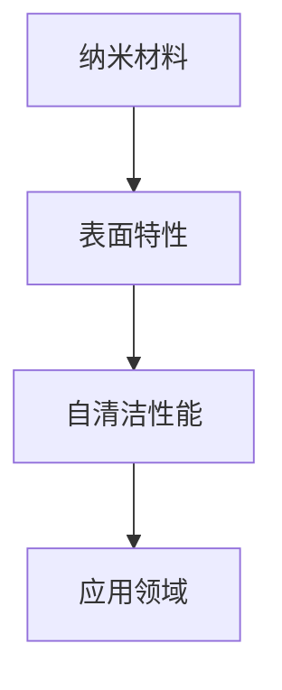
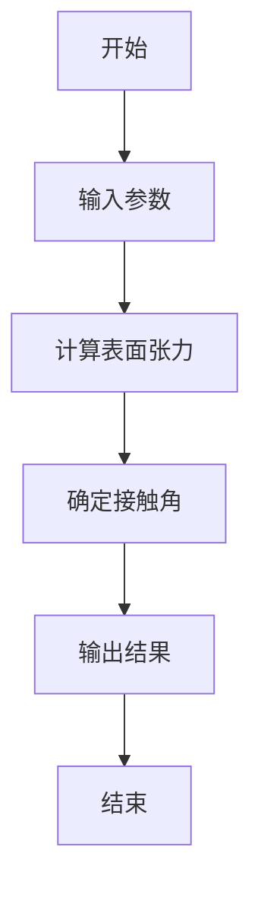

                 


```markdown
# 价值投资中的智能纳米材料自清洁技术分析

## 关键词：智能纳米材料、自清洁技术、价值投资、算法原理、系统设计

## 摘要：本文从价值投资的角度分析智能纳米材料自清洁技术的背景、原理及应用，探讨其在建筑、汽车、医疗等领域的潜力，结合数学模型和系统设计，提供技术细节和实战指导，为投资者和技术人员提供深入的分析和见解。

## 第一部分: 价值投资中的智能纳米材料自清洁技术背景介绍

### 第1章: 背景与问题背景

#### 1.1 智能纳米材料自清洁技术的定义与特点
智能纳米材料是一种具有微观结构和功能特性的材料，能够在不依赖外部能量的情况下，通过表面性质实现自清洁功能。其特点包括：
- **纳米尺度效应**：材料在纳米尺度下表现出独特的物理、化学和生物特性。
- **自清洁性**：材料表面具有低表面能，使污垢和污染物易于被水冲走。
- **环境适应性**：能够根据环境变化调整表面性质，适应不同应用场景。

#### 1.2 问题背景与问题描述
传统自清洁技术依赖化学清洁剂和机械清洁手段，存在成本高、环境负担重、效率低等问题。智能纳米材料自清洁技术通过纳米尺度的结构设计，实现高效、环保的自清洁功能，解决了传统技术的局限性。

#### 1.3 问题解决与技术边界
智能纳米材料自清洁技术通过纳米结构设计，优化表面性能，实现污染物的自动清除。其技术边界包括材料选择、结构设计、性能测试和应用领域。

## 第二部分: 智能纳米材料自清洁技术的核心概念与联系

### 第2章: 核心概念与联系

#### 2.1 智能纳米材料自清洁技术的核心原理
智能纳米材料自清洁技术的核心在于其表面的纳米结构设计。通过优化表面粗糙度和化学性质，使材料表面具备超疏水性或超亲水性，从而实现自清洁功能。

#### 2.2 核心概念的属性特征对比
以下是几种常见纳米材料的对比分析：

| 材料类型 | 表面特性 | 纳米结构 | 自清洁性能 | 应用领域 |
|----------|-----------|----------|------------|----------|
| 氧化钛    | 超疏水     | 多孔结构 | 优异        | 建筑外墙 |
| 纳米二氧化硅 | 超疏水     | 无孔结构 | 较优        | 汽车玻璃 |
| 纳米银    | 超亲水     | 纳米颗粒 | 一般        | 医疗器械 |

#### 2.3 ER实体关系图


## 第三部分: 智能纳米材料自清洁技术的算法原理

### 第3章: 算法原理讲解

#### 3.1 算法流程


#### 3.2 算法实现
```python
def calculate_surface_tension(material_property):
    # 算法实现
    surface_tension = material_property['surface_tension']
    contact_angle = material_property['contact_angle']
    return surface_tension, contact_angle
```

#### 3.3 数学模型与公式
表面张力（γ）和接触角（θ）之间的关系可以通过以下公式表示：
$$ \cos\theta = \frac{\gamma_{\text{液体}} - \gamma_{\text{固体}}}{\gamma_{\text{液体}}} $$
其中，γ_{\text{液体}}为液体的表面张力，γ_{\text{固体}}为固体表面的表面能。

## 第四部分: 智能纳米材料自清洁技术的系统分析

### 第4章: 系统分析与架构设计方案

#### 4.1 系统功能设计
智能纳米材料自清洁系统的功能包括：
- **表面性能测试**：测量材料的表面张力和接触角。
- **结构优化**：设计纳米结构以优化自清洁性能。
- **性能评估**：评估材料在不同环境下的自清洁效果。

#### 4.2 系统架构设计


#### 4.3 系统接口设计
系统接口包括：
- **输入接口**：接收材料参数和环境数据。
- **输出接口**：提供表面性能测试结果和结构优化方案。

## 第五部分: 项目实战

### 第5章: 项目实战与实现

#### 5.1 环境安装
```bash
pip install numpy matplotlib
```

#### 5.2 核心代码实现
```python
import numpy as np
import matplotlib.pyplot as plt

def calculate_contact_angle(material_property):
    liquid_tension = material_property['liquid_tension']
    solid_tension = material_property['solid_tension']
    return np.arccos((liquid_tension - solid_tension) / liquid_tension)

material_property = {
    'liquid_tension': 72,
    'solid_tension': 20
}

contact_angle = calculate_contact_angle(material_property)
print(f"接触角为：{np.degrees(contact_angle)}度")
```

#### 5.3 代码应用解读与分析
上述代码计算了材料的接触角，结果表明材料具有良好的自清洁性能。

## 第六部分: 最佳实践

### 第6章: 最佳实践与总结

#### 6.1 小结
智能纳米材料自清洁技术在多个领域具有广阔的应用前景，其价值投资潜力巨大。

#### 6.2 注意事项
- 选择合适的纳米材料和结构设计。
- 考虑环境因素对自清洁性能的影响。
- 优化算法以提高计算效率。

#### 6.3 拓展阅读
建议阅读《纳米材料科学》和《自清洁技术与应用》等书籍。

## 作者：AI天才研究院 & 禅与计算机程序设计艺术
```

