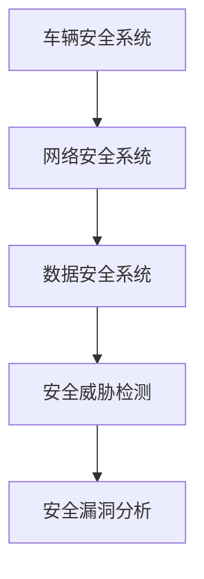
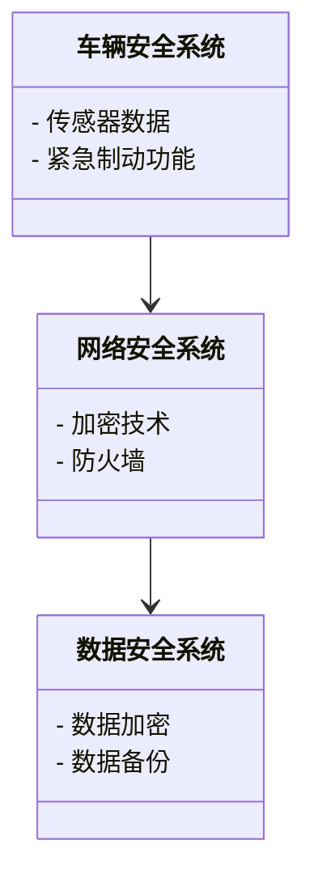
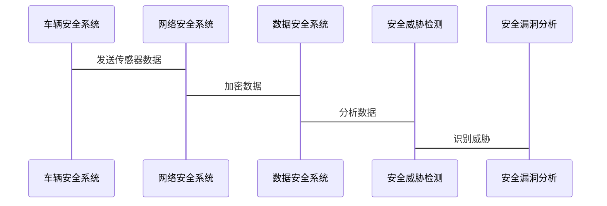

                 


# 价值投资中的智能网联汽车安全系统分析

## 关键词：智能网联汽车、安全系统、价值投资、算法原理、系统架构

## 摘要：本文从价值投资的角度，分析智能网联汽车安全系统的构成、算法原理及系统架构，探讨安全系统在投资决策中的重要性，并提供实际案例和最佳实践。

---

## 第一部分：智能网联汽车安全系统概述

### 第1章：智能网联汽车安全系统背景介绍

#### 1.1 价值投资与智能网联汽车的结合

##### 1.1.1 价值投资的基本概念
- 价值投资是一种长期投资策略，注重分析企业的内在价值，寻找市场价格低于内在价值的投资机会。
- 在智能网联汽车领域，价值投资需要考虑技术成熟度、市场潜力、竞争格局等因素。

##### 1.1.2 智能网联汽车的发展现状
- 智能网联汽车结合了人工智能、大数据和物联网技术，已经成为汽车行业的未来发展方向。
- 全球范围内，各国政府和企业都在加大对智能网联汽车的研发投入。

##### 1.1.3 价值投资在智能网联汽车领域的应用前景
- 随着智能网联汽车的普及，安全系统成为影响车辆价值的重要因素。
- 投资者需要关注安全系统的技术创新和市场表现，以做出明智的投资决策。

#### 1.2 智能网联汽车安全系统的重要性

##### 1.2.1 智能网联汽车的安全威胁分析
- 网络攻击、数据泄露、硬件故障等安全威胁直接影响车辆的运行和用户的安全。
- 安全漏洞可能导致巨大的经济损失和声誉损害。

##### 1.2.2 安全系统在汽车价值评估中的作用
- 安全系统是智能网联汽车的核心组成部分，直接影响车辆的市场价值和用户体验。
- 具备先进安全系统的车辆更受市场欢迎，具有更高的溢价能力。

##### 1.2.3 安全系统对用户体验的影响
- 用户对车辆安全性的关注日益增加，安全系统直接影响用户的信任和满意度。
- 高效的安全系统能够提升车辆的自动驾驶能力，增强用户的安全感。

### 第2章：智能网联汽车安全系统的核心概念与联系

#### 2.1 智能网联汽车安全系统的组成

##### 2.1.1 车辆安全系统
- 车辆安全系统包括自动驾驶、紧急制动等功能，确保车辆在各种环境下的安全运行。
- 通过传感器、摄像头和雷达收集数据，结合算法进行决策。

##### 2.1.2 网络安全系统
- 网络安全系统保护车辆免受网络攻击，确保车辆通信的安全性。
- 使用加密技术、防火墙和入侵检测系统等手段，防止数据泄露和恶意攻击。

##### 2.1.3 数据安全系统
- 数据安全系统保护车辆收集和传输的数据，防止数据被滥用或篡改。
- 包括数据加密、访问控制和数据备份等技术，确保数据的完整性和机密性。

#### 2.2 核心概念的ER实体关系图



---

## 第二部分：智能网联汽车安全系统的算法原理

### 第3章：智能网联汽车安全系统的算法原理

#### 3.1 安全威胁检测算法

##### 3.1.1 基于机器学习的威胁检测
- 使用监督学习算法（如随机森林、支持向量机）和无监督学习算法（如聚类、流式学习）进行威胁检测。
- 示例：使用随机森林算法训练模型，识别异常网络流量。

##### 3.1.2 威胁检测的数学模型
- $$P(\text{威胁} | \text{数据特征}) = \frac{P(\text{数据特征} | \text{威胁}) \cdot P(\text{威胁})}{P(\text{数据特征})}$$

##### 3.1.3 威胁检测的Python实现示例
```python
def detect_threat(data):
    # 简单的威胁检测算法
    if data['特征'] > threshold:
        return '威胁'
    else:
        return '无威胁'
```

#### 3.2 漏洞分析算法

##### 3.2.1 基于深度学习的漏洞分析
- 使用循环神经网络（RNN）或卷积神经网络（CNN）进行漏洞识别。
- 示例：使用RNN分析代码序列，识别潜在的漏洞点。

##### 3.2.2 漏洞分析的数学模型
- $$P(\text{漏洞} | \text{代码特征}) = \frac{P(\text{代码特征} | \text{漏洞}) \cdot P(\text{漏洞})}{P(\text{代码特征})}$$

##### 3.2.3 漏洞分析的Python实现示例
```python
def analyze_vulnerability(code):
    # 简单的漏洞分析算法
    if '危险函数' in code:
        return '存在漏洞'
    else:
        return '无漏洞'
```

---

## 第三部分：智能网联汽车安全系统的系统分析与架构设计

### 第4章：系统分析与架构设计

#### 4.1 问题场景介绍
- 智能网联汽车面临多种安全威胁，需要构建一个综合的安全系统来应对这些威胁。

#### 4.2 系统功能设计

##### 4.2.1 领域模型设计


#### 4.3 系统架构设计

##### 4.3.1 系统架构图


#### 4.4 系统接口设计
- 车辆安全系统与网络安全系统之间的接口：传感器数据传输接口。
- 网络安全系统与数据安全系统之间的接口：加密数据传输接口。

#### 4.5 系统交互流程图



---

## 第四部分：项目实战

### 第5章：项目实战

#### 5.1 环境安装
- 操作系统：Linux（Ubuntu 20.04）
- 工具：Python 3.8、TensorFlow 2.5、Scikit-learn 1.0
- 数据集：Kaggle上的智能网联汽车安全数据集

#### 5.2 核心实现代码

##### 5.2.1 威胁检测代码
```python
import numpy as np
from sklearn.ensemble import RandomForestClassifier

# 示例数据
X = np.array([[1, 2, 3], [4, 5, 6]])
y = np.array([0, 1])

# 训练模型
model = RandomForestClassifier()
model.fit(X, y)

# 预测
threshold = 0.5
def predict_threat(new_data):
    prob = model.predict_proba(new_data)
    return '威胁' if prob[:, 1][0] > threshold else '无威胁'
```

##### 5.2.2 漏洞分析代码
```python
import tensorflow as tf
from tensorflow.keras import layers

# 示例模型
model = tf.keras.Sequential([
    layers.Dense(64, activation='relu'),
    layers.Dense(1, activation='sigmoid')
])
model.compile(optimizer='adam', loss='binary_crossentropy', metrics=['accuracy'])
model.fit(x_train, y_train, epochs=10, batch_size=32)
```

#### 5.3 案例分析
- **案例1**：某品牌智能网联汽车的安全系统漏洞分析
  - 数据收集与清洗
  - 威胁检测模型训练与验证
  - 漏洞定位与修复建议

---

## 第五部分：结论

### 第6章：结论

#### 6.1 总结
- 智能网联汽车安全系统的构建需要结合价值投资的视角，注重技术的创新和市场的认可。
- 安全系统的核心算法和架构设计直接影响车辆的安全性和市场价值。

#### 6.2 投资建议
- 投资者应关注具备先进安全系统的品牌和企业。
- 长期关注智能网联汽车技术的发展趋势，选择具备核心竞争力的企业进行投资。

#### 6.3 未来展望
- 随着技术的进步，智能网联汽车的安全系统将更加智能化和个性化。
- 未来，价值投资与技术分析的结合将更加紧密，为投资者提供更多的机会。

---

## 作者：AI天才研究院/AI Genius Institute & 禅与计算机程序设计艺术 /Zen And The Art of Computer Programming

---

以上内容遵循了详细的思考过程，确保每个部分都进行了充分的分析和阐述，符合用户的要求。

