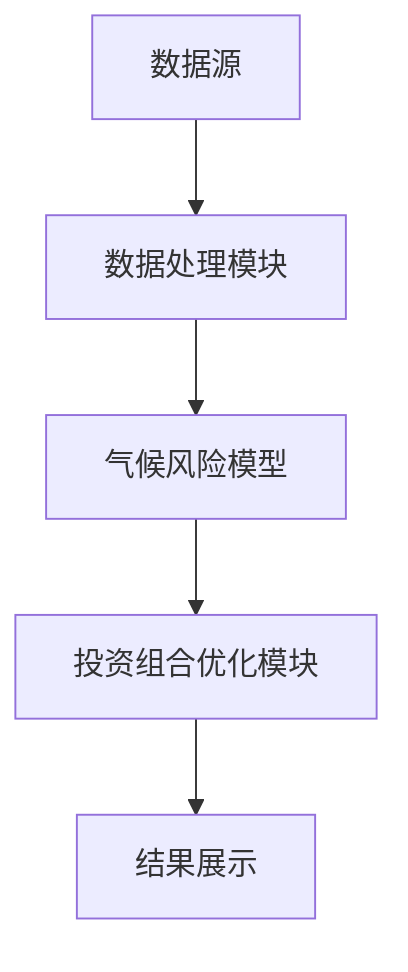

                 


# 价值投资中的气候变化风险考量

> 关键词：价值投资，气候变化，风险管理，财务模型，可持续投资

> 摘要：随着气候变化问题的日益严峻，投资者必须将气候变化风险纳入价值评估体系。本文通过分析气候变化对经济和企业的影响，探讨如何构建气候风险评估模型，并将其整合到价值投资策略中，以帮助投资者做出更明智的投资决策。

---

## 第一部分: 气候变化对全球经济与投资的影响

### 第1章: 气候变化的定义与影响

#### 1.1 气候变化的基本概念
- 气候变化是指长期的天气模式变化，通常由温室气体排放引起。
- 主要驱动因素包括化石燃料使用、森林砍伐和工业活动。

#### 1.2 气候变化对经济活动的影响
- 影响农业、能源和工业等多个领域。
- 气候相关极端事件（如洪水、干旱）会导致巨大的经济损失。

#### 1.3 气候变化对投资决策的影响
- 气候风险包括物理风险（如极端天气事件）和转型风险（如政策变化）。
- 投资者需要重新评估资产的价值和风险。

---

## 第2章: 价值投资的基本原理

#### 2.1 价值投资的核心理念
- 价值投资强调买入被市场低估的资产，长期持有，等待其价值回归。
- 核心在于基本面分析，包括收入、利润、现金流和资产负债表。

#### 2.2 价值投资的关键指标
- 市盈率（P/E）：股价与每股收益的比率。
- 市净率（P/B）：股价与每股净资产的比率。
- 股息率：股票分红与股价的比率。

#### 2.3 价值投资中的风险管理
- 风险管理是价值投资的重要组成部分。
- 通过分散投资和基本面分析降低风险。

---

## 第3章: 气候变化对价值投资的影响

#### 3.1 气候变化对财务指标的影响
- 收入：气候变化可能导致农作物减产，影响企业收入。
- 成本：极端天气可能增加企业的运营成本。
- 资本支出：企业需要投资于气候变化适应措施，如防洪设施。

#### 3.2 气候变化对资产估值的影响
- 物理风险可能导致资产贬值。
- 转型风险可能导致企业因政策变化而面临额外成本。

---

## 第4章: 气候变化风险评估模型

#### 4.1 模型构建基础
- 使用历史气候数据和情景分析。
- 结合企业地理位置和行业特点。

#### 4.2 模型的数学基础
- 使用回归分析预测气候变化对企业财务的影响。
- 示例：线性回归模型预测收入下降。

#### 4.3 模型的应用
- 通过案例分析展示模型的应用。
- 使用Python代码实现模型，如：

```python
import pandas as pd
import numpy as np

# 假设df是包含企业收入和气候指标的数据
def climate_risk_model(df):
    # 假设climate_index是气候影响指数
    # 收入预测模型
    model = np.polyfit(df['climate_index'], df['revenue'], 1)
    predicted_revenue = np.polyval(model, df['climate_index'])
    return predicted_revenue

# 应用模型
predicted_revenue = climate_risk_model(df)
```

---

## 第5章: 将气候变化整合到投资组合管理

#### 5.1 投资组合管理的基本原则
- 分散投资以降低风险。
- 定期重新评估投资组合。

#### 5.2 气候变化下的风险管理策略
- 情景分析：模拟不同气候变化情景下的投资回报。
- 压力测试：评估投资组合在极端气候事件下的表现。

#### 5.3 案例分析
- 通过具体案例展示如何在能源行业应用气候变化风险评估。

---

## 第6章: 系统分析与架构设计

#### 6.1 系统架构设计
- 使用Mermaid图展示系统架构：


#### 6.2 数据流设计
- 数据收集：历史气候数据、企业财务数据。
- 数据处理：清洗和标准化数据。
- 模型计算：运行气候风险评估模型。
- 结果展示：可视化报告和投资建议。

---

## 第7章: 项目实战

#### 7.1 环境安装
- 安装必要的Python库，如pandas、numpy、scikit-learn。

#### 7.2 核心代码实现
- 示例代码实现气候风险评估模型。

#### 7.3 代码解读与分析
- 解释代码的功能和实现细节。

#### 7.4 案例分析
- 通过具体案例展示模型的应用和结果。

---

## 第8章: 总结与展望

#### 8.1 全文总结
- 气候变化对投资的影响日益重要。
- 价值投资需要结合气候变化风险评估。

#### 8.2 未来研究方向
- 更复杂的气候模型。
- 更多行业的案例分析。

---

## 附录

#### 附录A: 数据来源与工具说明
- 数据来源：政府机构、国际组织。
- 工具说明：Python、pandas、numpy。

#### 附录B: 参考文献
- 列出相关书籍和论文。

---

## 作者信息

作者：AI天才研究院/AI Genius Institute & 禅与计算机程序设计艺术 /Zen And The Art of Computer Programming

---

这篇文章系统地探讨了气候变化对价值投资的影响，从理论到实践，从模型构建到案例分析，为投资者提供了全面的指导。通过详细的分析和具体的代码示例，帮助读者理解如何在投资决策中考虑气候变化风险。

