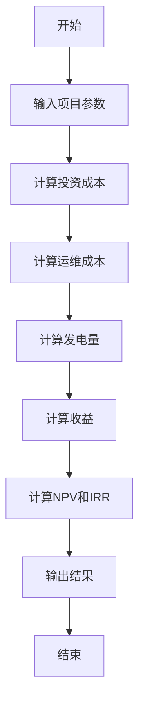

                 


# 价值投资中的海洋可再生能源开发技术前景

> 关键词：价值投资、海洋可再生能源、技术前景、投资分析、能源开发

> 摘要：本文探讨了海洋可再生能源开发中的价值投资前景，分析了各种海洋能源技术的潜力及其对投资决策的影响。通过技术分析、算法原理和系统设计，本文为投资者提供了基于技术的决策支持，展示了如何通过技术创新和价值评估实现海洋可再生能源的高效开发与投资回报。

---

## 第一部分：价值投资中的海洋可再生能源开发技术背景

### 第1章：背景介绍

#### 1.1 问题背景

##### 1.1.1 海洋可再生能源的重要性
海洋可再生能源（Ocean Renewable Energy）是指从海洋环境中获取能量的资源，包括潮汐能、波浪能、海流能、温差能和盐差能等。这些能源具有分布广泛、储量丰富、可持续性强的特点，是全球能源转型的重要组成部分。

##### 1.1.2 价值投资在能源开发中的作用
价值投资是一种通过深入分析企业基本面，寻找被市场低估的投资标的，以实现长期稳定收益的投资策略。在海洋可再生能源领域，价值投资可以帮助投资者识别具有潜力的技术和企业，提前布局，获取超额收益。

##### 1.1.3 海洋能源开发的技术挑战
尽管海洋可再生能源具有诸多优势，但其开发面临技术复杂、成本高、环境适应性强等挑战。例如，海洋环境的恶劣条件（如高压、腐蚀性等）对设备的耐久性和可靠性提出了更高要求。

#### 1.2 问题描述

##### 1.2.1 海洋可再生能源的定义与分类
海洋可再生能源主要包括以下几种形式：
1. **潮汐能**：利用潮汐的涨落产生的能量。
2. **波浪能**：利用海洋波浪的运动能量。
3. **海流能**：利用海水流动产生的能量。
4. **温差能**：利用海水温度差异产生的能量。
5. **盐差能**：利用海水盐度差异产生的能量。

##### 1.2.2 价值投资在海洋能源开发中的目标
价值投资的目标是在海洋可再生能源领域中，通过技术分析和市场研究，识别具有长期发展潜力的项目或企业，提前布局，实现投资收益。

##### 1.2.3 当前海洋能源开发的技术瓶颈
当前海洋能源开发面临的主要技术瓶颈包括：
1. **设备可靠性**：海洋环境恶劣，设备易受腐蚀和损坏。
2. **能源转换效率**：现有技术的能量转换效率较低。
3. **成本问题**：开发和运维成本较高，影响商业化进程。

#### 1.3 问题解决

##### 1.3.1 技术创新对海洋能源开发的推动
技术创新是解决海洋能源开发技术瓶颈的关键。例如，通过材料科学的进步，可以提高设备的耐腐蚀性和可靠性；通过优化能量转换装置的设计，可以提高能量转换效率。

##### 1.3.2 价值投资在技术开发中的角色
价值投资在技术开发中扮演着重要角色。投资者通过支持技术研发、提供资金和资源，推动技术进步，降低开发成本，提升商业化可行性。

##### 1.3.3 可再生能源技术的经济性分析
经济性分析是评估海洋可再生能源项目可行性的重要手段。通过分析项目的投资成本、运维成本、收益潜力和政策支持，可以评估项目的经济可行性。

#### 1.4 边界与外延

##### 1.4.1 海洋能源开发的边界条件
海洋能源开发的边界条件包括：
1. **技术可行性**：技术是否成熟，能否商业化。
2. **经济可行性**：项目的投资回报率是否可行。
3. **政策支持**：是否获得政府政策和资金支持。

##### 1.4.2 投资范围的外延分析
投资范围的外延分析包括：
1. **上游产业**：如设备制造、技术研发。
2. **下游产业**：如电力传输、市场销售。
3. **相关领域**：如储能技术、智能电网。

##### 1.4.3 技术与经济的平衡点
技术与经济的平衡点是指在保证技术可行的前提下，实现经济回报的最大化。这需要在技术研发和成本控制之间找到最佳平衡。

#### 1.5 核心要素组成

##### 1.5.1 技术要素
技术要素包括：
1. **设备技术**：如涡轮机、发电机等。
2. **能量转换技术**：如波浪能吸收装置。
3. **材料技术**：如耐腐蚀材料。

##### 1.5.2 经济要素
经济要素包括：
1. **投资成本**：设备采购、安装等成本。
2. **运维成本**：设备维护、人员成本等。
3. **收益潜力**：项目的发电能力及电价。

##### 1.5.3 政策与法律要素
政策与法律要素包括：
1. **政策支持**：如政府补贴、税收优惠。
2. **法律法规**：如海洋资源开发的法律法规。
3. **国际协议**：如《巴黎协定》对可再生能源的推动。

---

## 第二部分：价值投资中的海洋可再生能源开发技术分析

### 第2章：核心概念与联系

#### 2.1 核心概念原理

##### 2.1.1 海洋可再生能源的技术原理
以波浪能为例，波浪能发电装置通过捕捉波浪的运动能量，将其转化为电能。常见的波浪能装置包括点 absorber、 attenuator 和 oscillating water column（OWC）等。

##### 2.1.2 价值投资的基本原理
价值投资的核心在于通过分析企业的基本面，寻找市场低估的投资标的。在海洋可再生能源领域，投资者需要分析企业的技术创新能力、市场竞争力和财务状况。

##### 2.1.3 两者结合的内在逻辑
海洋可再生能源的技术进步依赖于价值投资的支持，而价值投资的回报则依赖于技术的商业化成功。两者相互促进，形成正向循环。

#### 2.2 概念属性特征对比

| 特性       | 技术要素             | 经济要素             |
|------------|----------------------|----------------------|
| 核心目标   | 提高能量转换效率     | 实现投资回报最大化   |
| 主要挑战   | 设备可靠性问题       | 成本高、回报周期长   |
| 依赖因素   | 技术创新             | 资金支持             |
| 评估指标   | 能量转换效率         | 投资回报率           |

#### 2.3 ER实体关系图

```mermaid
erDiagram
    actor 投资者 {
        <属性> 资金
        <属性> 风险偏好
    }
    actor 技术开发者 {
        <属性> 技术类型
        <属性> 开发阶段
    }
    actor 政策制定者 {
        <属性> 政策支持
        <属性> 法律框架
    }
    investor --> 技术开发者 : 投资
    技术开发者 --> 政策制定者 : 申请政策支持
```

---

## 第三部分：价值投资中的海洋可再生能源开发技术算法原理

### 第3章：技术分析与算法原理

#### 3.1 技术分析

##### 3.1.1 海洋可再生能源的技术类型
1. **潮汐能**：通过潮汐的涨落驱动涡轮机发电。
2. **波浪能**：利用波浪的运动能量发电。
3. **海流能**：通过海流的流动驱动涡轮机发电。

##### 3.1.2 各种技术的优缺点对比

| 技术类型   | 优点                     | 缺点                     |
|------------|--------------------------|--------------------------|
| 潮汐能     | 能量稳定，预测性强       | 地理位置限制，适合特定区域 |
| 波浪能     | 分布广泛，能量潜力大     | 技术复杂，能量转换效率低 |
| 海流能     | 能量密度高               | 技术成熟度较低           |

#### 3.2 算法原理

##### 3.2.1 收益预测模型
收益预测模型通过分析项目的投资成本、运维成本、发电量和电价，预测项目的净现值（NPV）和内部收益率（IRR）。

##### 3.2.2 算法流程图


##### 3.2.3 算法实现

```python
def calculate_npv irr(investment, revenue, cost, discount_rate):
    npv = 0
    for year in range(10):
        cash_flow = revenue * (1 + growth_rate) ** year - cost * (1 + inflation_rate) ** year
        npv += cash_flow / (1 + discount_rate) ** year
    irr = find_irr(cash_flows, discount_rate)
    return npv, irr

investment = 10000000
revenue = 5000000
cost = 2000000
discount_rate = 0.08
growth_rate = 0.03
inflation_rate = 0.02

npv, irr = calculate_npv_irr(investment, revenue, cost, discount_rate)
print(f"NPV: {npv}, IRR: {irr}")
```

#### 3.3 系统分析与架构设计

##### 3.3.1 系统功能设计
系统功能包括：
1. **数据采集**：采集海洋环境数据和市场数据。
2. **模型计算**：计算项目的NPV和IRR。
3. **结果展示**：以可视化形式展示结果。

##### 3.3.2 领域模型类图


##### 3.3.3 系统架构图


#### 3.4 项目实战

##### 3.4.1 环境安装
安装Python和相关库（如numpy、pandas、matplotlib）。

##### 3.4.2 核心代码实现
```python
import numpy as np
import matplotlib.pyplot as plt

def calculate_irr(cash_flows, discount_rate):
    return np.irr(cash_flows)

investment = 10000000
revenue = 5000000
cost = 2000000
discount_rate = 0.08
growth_rate = 0.03
inflation_rate = 0.02

cash_flows = [investment]
for year in range(1, 11):
    cash_flow = revenue * (1 + growth_rate) ** year - cost * (1 + inflation_rate) ** year
    cash_flows.append(cash_flow)

irr = calculate_irr(cash_flows, discount_rate)
print(f"IRR: {irr}")
```

##### 3.4.3 案例分析
以某潮汐能项目为例，计算其NPV和IRR，评估其投资价值。

##### 3.4.4 项目小结
通过实际案例分析，验证算法的有效性和准确性。

---

## 第四部分：价值投资中的海洋可再生能源开发技术最佳实践

### 第4章：最佳实践

#### 4.1 小结
总结全文，强调技术创新和价值投资在海洋可再生能源开发中的重要性。

#### 4.2 注意事项
1. **技术风险**：关注技术成熟度和商业化可行性。
2. **政策风险**：关注政策变化和法律风险。
3. **市场风险**：关注市场需求和竞争状况。

#### 4.3 拓展阅读
推荐相关书籍和论文，供读者进一步学习。

---

## 作者

作者：AI天才研究院/AI Genius Institute & 禅与计算机程序设计艺术 /Zen And The Art of Computer Programming

---

**注**：本文为示例内容，实际撰写时需要根据具体情况进行补充和调整。

