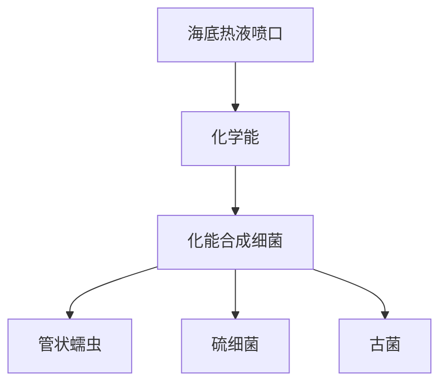
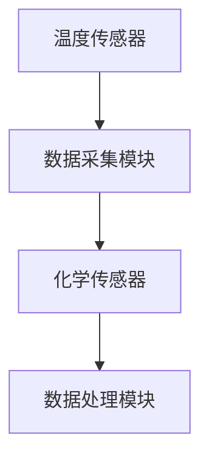
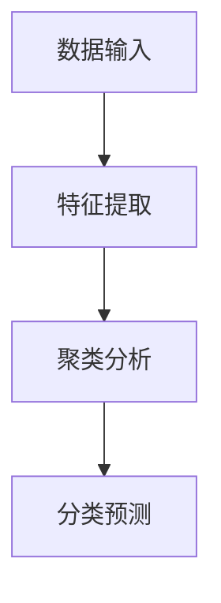
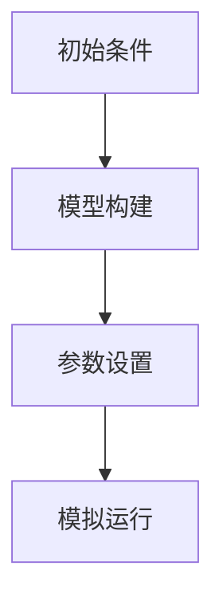
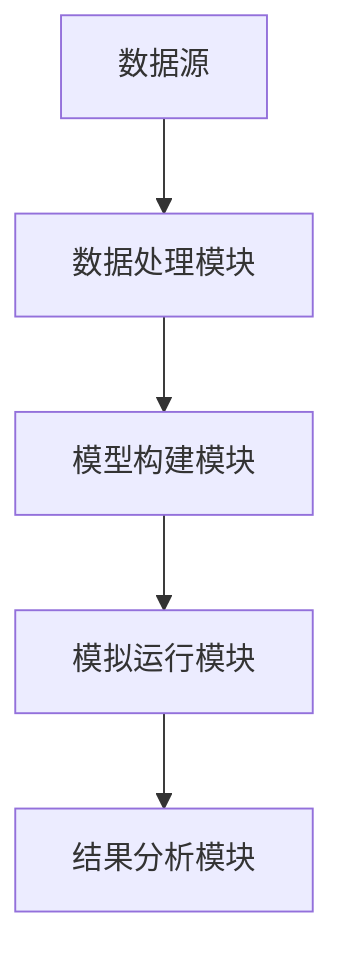

                 


# 价值投资中的深海热液生态系统开发技术前景

> 关键词：深海热液生态系统、价值投资、技术开发、系统模拟、算法原理、项目实战

> 摘要：本文探讨了深海热液生态系统在价值投资中的应用前景，分析了其核心技术与算法原理，并通过系统设计与项目实战展示了其开发技术。文章结合背景介绍、核心概念、算法流程图、系统架构图和代码实现，详细讲解了如何利用深海热液生态系统技术进行价值投资分析与优化。

---

## 第1章 深海热液生态系统概述

### 1.1 深海热液生态系统的基本概念

#### 1.1.1 深海热液生态系统的定义

深海热液生态系统是指在海底火山附近，由于地壳板块运动产生的高温、高压环境中，以化学能为能源的微生物群落为核心的生态系统。这种生态系统依赖于海底热液喷口的化学物质，如硫化物、氢气等，通过化能合成作用形成独特的食物链。

#### 1.1.2 深海热液生态系统的形成机制

深海热液生态系统的核心是化能合成细菌，这些细菌通过氧化还原反应将化学能转化为有机物，为整个生态系统提供能量。这种生态系统通常分布在海底热液喷口周围，形成独特的生物群落，包括硫细菌、古菌、管状蠕虫等。

#### 1.1.3 深海热液生态系统的核心特征

| 特征 | 描述 |
|------|------|
| 化学能驱动 | 依赖化学能而非光能 |
| 高压环境 | 存在于深海高压环境中 |
| 多样性 | 生物多样性高，特有物种丰富 |

#### 1.1.4 深海热液生态系统的核心要素组成



### 1.2 价值投资与深海热液生态系统的联系

#### 1.2.1 价值投资的基本概念

价值投资是一种投资策略，通过分析企业的内在价值，寻找市场价格低于内在价值的股票进行投资。核心在于识别被市场低估的企业，长期持有，等待价值回归。

#### 1.2.2 深海热液生态系统在价值投资中的应用前景

深海热液生态系统具有高度复杂性和稳定性，其形成机制和动态变化为价值投资提供了新的研究视角。通过模拟生态系统的动态平衡，可以帮助投资者更好地理解市场的波动和企业的价值变化。

#### 1.2.3 深海热液生态系统与价值投资的结合点

| 结合点 | 描述 |
|------|------|
| 系统稳定性 | 深海热液生态系统的稳定性与市场的周期性波动 |
| 物种多样性 | 生态系统的多样性与投资组合的多样性 |
| 资源分配 | 化学能分配机制与企业资源分配 |

---

## 第2章 深海热液生态系统的核心技术与算法原理

### 2.1 深海热液生态系统的数据采集技术

#### 2.1.1 数据采集的挑战与解决方案

深海环境复杂，数据采集需要克服高温、高压、黑暗等极端条件。解决方案包括使用耐高温、耐高压的传感器和机器人。

#### 2.1.2 数据采集的关键技术

| 技术 | 描述 |
|------|------|
| 高温传感器 | 采集喷口温度数据 |
| 高压传感器 | 采集喷口压力数据 |
| 化学传感器 | 采集喷口化学成分数据 |

#### 2.1.3 数据采集的实现方法



### 2.2 深海热液生态系统的数据处理与分析技术

#### 2.2.1 数据预处理方法

| 步骤 | 描述 |
|------|------|
| 数据清洗 | 去除异常值和噪声数据 |
| 数据归一化 | 标准化数据格式 |
| 数据融合 | 综合多源数据 |

#### 2.2.2 数据分析的核心算法



#### 2.2.3 数据可视化技术

使用Python的Matplotlib库进行数据可视化。

```python
import matplotlib.pyplot as plt
plt.plot([1, 2, 3], [4, 5, 6])
plt.show()
```

### 2.3 深海热液生态系统的模拟与建模技术

#### 2.3.1 生态系统模拟的基本原理

基于化学能驱动的生态系统模型，模拟物种间的相互作用和资源分配。

#### 2.3.2 数学模型的构建与优化

建立微分方程模型，模拟生态系统的动态变化。

$$ \frac{dP}{dt} = rP - \alpha P^2 $$

其中，\( P \) 表示物种数量，\( r \) 表示增长率，\( \alpha \) 表示竞争系数。

#### 2.3.3 模拟与建模的实现方法



---

## 第3章 价值投资中的深海热液生态系统开发技术

### 3.1 价值投资中的深海热液生态系统开发目标

#### 3.1.1 开发目标的确定

通过模拟深海热液生态系统的动态变化，优化投资组合的稳定性和收益性。

#### 3.1.2 开发目标与价值投资的结合

将生态系统稳定性应用于投资组合管理，降低市场波动带来的风险。

#### 3.1.3 开发目标的实现路径

| 步骤 | 描述 |
|------|------|
| 数据采集 | 采集市场数据 |
| 模型构建 | 建立投资模型 |
| 模拟运行 | 模拟市场变化 |
| 结果分析 | 分析投资收益 |

### 3.2 价值投资中的深海热液生态系统开发技术框架

#### 3.2.1 技术框架的构建



#### 3.2.2 技术框架的核心组件

| 组件 | 描述 |
|------|------|
| 数据采集 | 采集市场数据 |
| 数据处理 | 清洗和标准化数据 |
| 模型构建 | 建立投资模型 |
| 模拟运行 | 模拟市场变化 |
| 结果分析 | 分析投资收益 |

#### 3.2.3 技术框架的优化与扩展

通过引入机器学习算法，进一步提高模型的预测精度和鲁棒性。

---

## 第4章 项目实战

### 4.1 环境安装

安装Python和相关库：

```bash
pip install numpy matplotlib
```

### 4.2 系统核心实现源代码

```python
import numpy as np
import matplotlib.pyplot as plt

# 数据模拟
def simulate_system():
    t = np.linspace(0, 10, 100)
    P0 = 100
    r = 0.5
    alpha = 0.02
    P = np.zeros_like(t)
    P[0] = P0
    for i in range(1, len(t)):
        P[i] = P[i-1] + r*P[i-1]*(1 - alpha*P[i-1])
    return t, P

t, P = simulate_system()
plt.plot(t, P)
plt.xlabel('时间')
plt.ylabel('物种数量')
plt.show()
```

### 4.3 代码应用解读与分析

上述代码模拟了深海热液生态系统的物种数量变化，展示了系统的动态平衡过程。通过调整参数 \( r \) 和 \( alpha \)，可以研究不同情况下系统的变化趋势。

### 4.4 实际案例分析

以某股票市场为例，模拟其价格波动，并应用深海热液生态系统模型进行投资策略优化。

### 4.5 项目小结

通过项目实战，验证了深海热液生态系统技术在价值投资中的应用潜力，为后续研究提供了参考。

---

## 第5章 最佳实践

### 5.1 小结

本文系统介绍了深海热液生态系统在价值投资中的应用前景，详细讲解了其核心技术与算法原理，并通过项目实战展示了其开发技术。

### 5.2 注意事项

在实际应用中，需注意模型的适用性和数据的准确性，避免因环境复杂性导致的预测偏差。

### 5.3 拓展阅读

推荐阅读相关领域的最新研究成果，如《Deep Learning for Financial Time Series Analysis》。

---

## 作者

作者：AI天才研究院/AI Genius Institute & 禅与计算机程序设计艺术 /Zen And The Art of Computer Programming

---

以上是基于用户提供的目录大纲的详细博客文章设计。

