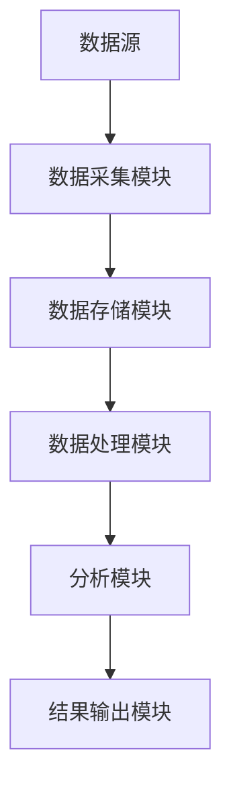

                 

# 价值投资中的特殊情况分析

> 关键词：价值投资、特殊情况、数学模型、系统架构、实战案例

> 摘要：本文深入探讨了价值投资中的特殊情况分析，从核心概念到数学模型，再到系统架构和实际案例，为投资者提供全面的分析框架。

---

## 第一部分：价值投资概述

### 第1章：价值投资的核心理念

#### 1.1 价值投资的基本定义与分类

价值投资是一种投资策略，强调通过分析企业的内在价值，寻找市场价格低于其内在价值的投资标的。这种方法由本杰明·格雷厄姆等投资者推广，注重安全边际和长期回报。

#### 1.2 价值投资的核心原则与方法

- **安全边际**：购买价格低于内在价值，以降低风险。
- **长期视角**：关注企业的长期盈利能力，而非短期市场波动。
- **基本面分析**：研究企业的财务状况、行业地位和管理团队。

#### 1.3 价值投资的适用场景与限制

价值投资适用于市场波动较大、个股价值被低估的情况，但在市场泡沫或快速变化的行业可能表现不佳。

---

### 第2章：特殊情况分析的必要性

#### 2.1 特殊情况在投资中的重要性

特殊情况如市场崩盘、行业政策变化等，可能引发股价异常波动，影响投资组合的稳定性。

#### 2.2 特殊情况的分类与特征

- **市场周期波动**：经济周期波动影响整体市场。
- **公司基本面变化**：财务状况恶化或管理层变动。
- **行业与政策变化**：技术进步或政策调整影响行业格局。

#### 2.3 特殊情况对投资决策的影响

正确分析特殊情况能帮助投资者避免重大损失，抓住潜在机会。

---

## 第二部分：特殊情况的分析框架

### 第3章：特殊情况的识别与分类

#### 3.1 市场周期波动

- **经济周期对投资的影响**：繁荣期可能高估资产价格，衰退期可能导致抛售压力。
- **市场波动的特征与预测**：使用波动率指标和趋势分析预测市场走势。

#### 3.2 公司基本面变化

- **财务状况恶化**：关注利润下滑、债务增加等财务指标。
- **管理层变动与战略调整**：新管理层可能带来战略变化，影响企业前景。

#### 3.3 行业与政策变化

- **行业政策调整**：环保法规变化可能影响高排放行业。
- **技术进步的影响**：技术创新可能改变行业竞争格局。

---

## 第三部分：特殊情况分析的数学模型

### 第4章：回归分析的应用

#### 4.1 线性回归模型

- **基本原理**：通过拟合直线预测变量间的关系。
- **数学公式**：$$ y = \beta_0 + \beta_1 x + \epsilon $$
- **Python实现**：使用scikit-learn库进行线性回归分析。

#### 4.2 时间序列分析

- **ARIMA模型**：用于预测时间序列数据，考虑历史趋势和季节性因素。
- **Python实现**：使用statsmodels库进行ARIMA建模。

---

## 第四部分：系统架构与实现

### 第5章：系统设计与架构

#### 5.1 系统功能设计

- **数据采集模块**：收集市场数据和公司财务信息。
- **数据处理模块**：清洗和预处理数据。
- **分析模块**：应用回归分析和时间序列模型进行预测。

#### 5.2 系统架构图

---

## 第五部分：项目实战

### 第6章：实际案例分析

#### 6.1 案例背景

2008年金融危机期间，许多金融机构面临破产风险，投资者需分析这些公司的特殊情况。

#### 6.2 数据采集与处理

- 数据来源：股票价格、财务报表。
- 数据清洗：处理缺失值和异常值。

#### 6.3 分析与预测

- 使用线性回归预测股价走势。
- 应用ARIMA模型分析时间序列数据。

#### 6.4 结果解读

- 预测结果表明，部分公司股价可能进一步下跌，需谨慎投资。

---

## 第六部分：最佳实践与总结

### 第7章：总结与建议

#### 7.1 小结

- 理解特殊情况对投资决策的影响。
- 掌握数学模型和系统架构的应用。

#### 7.2 注意事项

- 数据质量影响模型准确性。
- 结合定性分析增强模型的可靠性。

#### 7.3 拓展阅读

推荐阅读《价值投资：从入门到精通》和《算法驱动的投资策略》。

---

## 作者

作者：AI天才研究院 & 禅与计算机程序设计艺术

---

本文通过系统地分析价值投资中的特殊情况，结合数学模型和系统架构，为投资者提供了实用的分析框架。希望读者能通过本文深入理解特殊情况的分析方法，并在实际投资中灵活运用。

