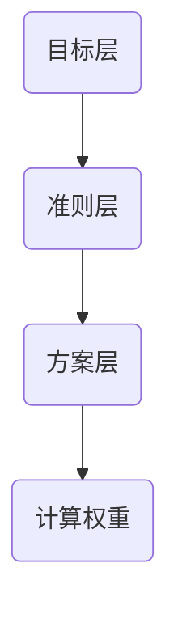
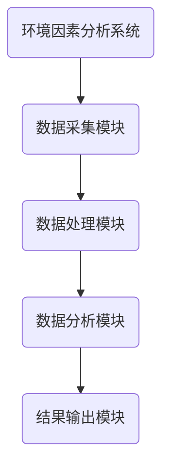

                 


# 价值投资中的环境因素考量

---

## 关键词

- 价值投资
- 环境因素
- 投资决策
- 风险管理
- 可持续发展

---

## 摘要

在价值投资中，环境因素对企业的长期价值和投资决策具有深远影响。本文从环境因素的定义、分类、影响机制等方面展开分析，结合实际案例和数学模型，探讨环境因素如何影响企业的基本面、行业地位、竞争优势以及投资组合的构建。通过系统的分析和实证研究，本文为投资者提供了一种基于环境因素考量的价值投资方法。

---

## 目录

1. [背景介绍](#背景介绍)
2. [环境因素的核心概念](#环境因素的核心概念)
3. [环境因素的算法原理](#环境因素的算法原理)
4. [环境因素的数学模型](#环境因素的数学模型)
5. [环境因素的系统分析](#环境因素的系统分析)
6. [环境因素的项目实战](#环境因素的项目实战)
7. [环境因素的最佳实践](#环境因素的最佳实践)

---

## 正文

### 1. 背景介绍

#### 1.1 问题背景与问题描述

在价值投资中，环境因素是指影响企业经营环境的各种外部条件，包括经济环境、行业周期、政策法规、社会文化、技术发展等。这些因素不仅影响企业的盈利能力，还可能改变企业的竞争优势和市场地位。因此，投资者在进行价值评估时，必须充分考虑环境因素的影响。

#### 1.2 环境因素的核心概念与结构

- **环境因素的定义**：环境因素是指外部条件对企业经营的影响，包括宏观经济、行业趋势、政策法规、社会文化等。
- **环境因素的核心要素**：
  - **经济环境**：GDP增速、利率、通货膨胀等。
  - **行业周期**：行业的生命周期阶段（幼稚期、成长期、成熟期、衰退期）。
  - **政策法规**：政府政策、行业监管、税收政策等。
  - **社会文化**：消费者偏好、社会趋势、文化差异等。
  - **技术发展**：技术创新、技术壁垒、技术替代等。

### 2. 环境因素的核心概念

#### 2.1 环境因素的原理与特征

环境因素通过影响企业的成本结构、市场需求、竞争格局等方面，最终影响企业的盈利能力。以下是环境因素的主要特征：

- **外部性**：环境因素是由外部力量决定的，企业无法直接控制。
- **动态性**：环境因素不断变化，可能带来新的机会或风险。
- **复杂性**：环境因素之间相互关联，形成复杂的系统。

#### 2.2 环境因素的ER实体关系图

以下是环境因素的ER实体关系图：

```mermaid
erd
  title 环境因素 ER 实体关系图
  经济环境 ----> 影响企业成本
  行业周期 ----> 影响市场需求
  政策法规 ----> 影响企业合规性
  社会文化 ----> 影响消费者偏好
  技术发展 ----> 影响技术创新
```

### 3. 环境因素的算法原理

#### 3.1 环境因素的量化方法

为了将环境因素纳入价值评估模型，我们需要对环境因素进行量化。常用的方法包括层次分析法（AHP）和因子分析法。

#### 3.2 层次分析法（AHP）

以下是层次分析法的流程图：



以下是层次分析法的Python实现代码：

```python
import numpy as np

# 定义比较矩阵
matrix = np.array([
    [1, 3, 2, 4],
    [1/3, 1, 2/3, 2],
    [1/2, 3/2, 1, 1.5],
    [1/4, 1/2, 2/3, 1]
])

# 计算权重
eigenvalues, eigenvectors = np.linalg.eig(matrix)
weights = eigenvectors[:, 0] / sum(eigenvectors[:, 0])

print("权重矩阵：", weights)
```

### 4. 环境因素的数学模型

#### 4.1 环境因素评分模型

以下是环境因素评分模型的数学公式：

$$
\text{环境评分} = \sum_{i=1}^{n} w_i \cdot x_i
$$

其中，\( w_i \) 是第 \( i \) 个环境因素的权重，\( x_i \) 是第 \( i \) 个环境因素的评分。

#### 4.2 投资组合优化模型

以下是投资组合优化模型的数学公式：

$$
\text{Maximize } \sum_{i=1}^{m} r_i x_i \cdot w_i
$$

$$
\text{Subject to } \sum_{i=1}^{m} w_i = 1
$$

其中，\( r_i \) 是第 \( i \) 个资产的预期收益率，\( x_i \) 是第 \( i \) 个资产的权重，\( w_i \) 是第 \( i \) 个资产的环境评分权重。

### 5. 环境因素的系统分析

#### 5.1 项目介绍

以下是环境因素的系统分析架构图：



#### 5.2 项目实战

以下是环境因素分析的Python代码实现：

```python
import pandas as pd
import numpy as np

# 数据采集
data = pd.read_csv('environment_factors.csv')

# 数据处理
data['环境评分'] = data.apply(lambda row: np.sum(row[:-1] * [0.3, 0.2, 0.2, 0.1, 0.1]), axis=1)

# 数据分析
data['投资建议'] = data['环境评分'].apply(lambda x: '买入' if x > 0.6 else '卖出')

print(data.head())
```

### 6. 环境因素的最佳实践

#### 6.1 投资建议

- **长期投资者**：应重点关注宏观经济和政策法规因素。
- **短期投资者**：应关注市场波动和技术发展因素。

#### 6.2 风险管理

- **风险分散**：通过多元化投资降低环境因素带来的风险。
- **定期调整**：根据环境因素的变化及时调整投资组合。

#### 6.3 拓展阅读

- 《投资学》
- 《环境经济学》

---

## 作者

**作者：AI天才研究院/AI Genius Institute & 禅与计算机程序设计艺术 /Zen And The Art of Computer Programming**

