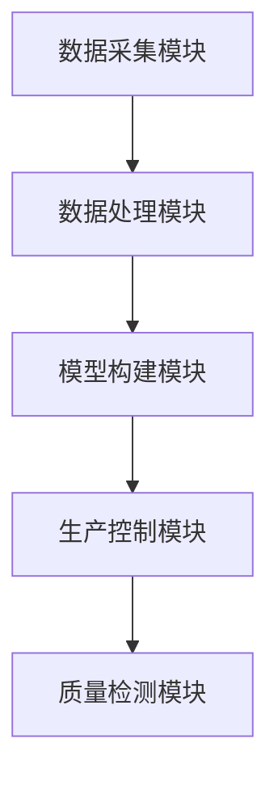
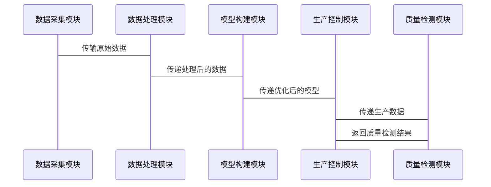

                 


# 价值投资中的生物3D打印器官技术前景

## 关键词：生物3D打印，价值投资，医疗技术，市场分析，投资策略

## 摘要：生物3D打印技术作为一项革命性医疗技术，正在改变传统医疗行业的游戏规则。本文从价值投资的角度，深入分析生物3D打印器官技术的市场潜力、技术成熟度以及投资风险。通过对比分析、案例研究和数学模型，本文为投资者提供了基于技术与市场的双重视角的投资策略，揭示了该领域的投资机遇与挑战。

---

# 第一部分：生物3D打印技术的背景与发展

## 第1章：生物3D打印技术的起源与发展

### 1.1 生物3D打印技术的起源
- **1.1.1 从传统医疗技术到3D打印技术的演进**
  - 传统医疗技术的局限性
  - 3D打印技术的起源与应用领域
  - 生物3D打印技术的创新点
- **1.1.2 生物3D打印技术的核心原理**
  - 生物3D打印的定义
  - 生物墨水的制备与选择
  - 打印设备的工作原理
- **1.1.3 生物3D打印技术的现状与发展趋势**
  - 当前技术水平与应用场景
  - 未来技术发展的主要方向

### 1.2 价值投资的基本概念
- **1.2.1 价值投资的定义与特点**
  - 价值投资的核心理念
  - 价值投资与短期投机的对比
  - 价值投资的长期视角
- **1.2.2 价值投资的核心要素**
  - 企业基本面分析
  - 行业地位与竞争优势
  - 财务健康状况与盈利能力
- **1.2.3 价值投资在科技领域的应用**
  - 科技企业的投资逻辑
  - 技术创新对企业价值的影响
  - 市场周期与投资机会

### 1.3 生物3D打印技术与价值投资的结合
- **1.3.1 生物3D打印技术的市场潜力**
  - 医疗行业的痛点与需求
  - 生物3D打印技术的解决方案
  - 市场规模与增长预测
- **1.3.2 价值投资视角下的技术评估**
  - 技术成熟度评估标准
  - 市场需求与商业可行性
  - 技术壁垒与竞争优势
- **1.3.3 技术与投资的协同效应**
  - 技术进步对投资价值的影响
  - 投资推动技术创新的机制
  - 技术与市场的动态平衡

---

## 第2章：生物3D打印技术的核心概念与联系

### 2.1 生物3D打印技术的核心原理
- **2.1.1 生物3D打印的材料选择**
  - 生物相容性材料
  - 生物墨水的配方与性能
  - 材料成本与制备难度
- **2.1.2 生物3D打印的设备组成**
  - 打印头与控制系统的优化
  - 成型平台的设计与功能
  - 设备的精度与稳定性
- **2.1.3 生物3D打印的工艺流程**
  - 数据建模与设计
  - 打印过程的控制
  - 后处理与质量检验

### 2.2 生物3D打印技术的市场分析
- **2.2.1 全球生物3D打印市场的现状**
  - 市场规模与增长趋势
  - 区域市场的分布特点
  - 主要企业的市场份额
- **2.2.2 区域市场的分布与特点**
  - 北美、欧洲、亚洲市场的对比
  - 政策环境与市场成熟度
  - 产业链的分工与协作
- **2.2.3 市场驱动因素与挑战**
  - 技术进步的驱动作用
  - 政策支持与法规障碍
  - 市场接受度与成本因素

### 2.3 价值投资视角下的技术评估
- **2.3.1 技术成熟度评估**
  - 技术成熟度的分级标准
  - 关键技术的突破与瓶颈
  - 技术路线的多样性和可行性
- **2.3.2 市场潜力评估**
  - 应用场景的广度与深度
  - 市场需求的增长动力
  - 竞争格局与进入壁垒
- **2.3.3 投资风险分析**
  - 技术风险与不确定性
  - 市场风险与竞争压力
  - 政策风险与法规变化

### 2.4 生物3D打印技术与价值投资的对比分析
- **2.4.1 技术属性对比表格**
  | 技术属性       | 生物3D打印技术          | 传统医疗技术          |
  |----------------|-------------------------|------------------------|
  | 创新性         | 高                     | 中                     |
  | 成本           | 高                     | 低                     |
  | 生产效率       | 高                     | 低                     |
- **2.4.2 价值投资属性对比表格**
  | 投资属性       | 生物3D打印技术          | 传统医疗技术          |
  |----------------|-------------------------|------------------------|
  | 投资周期       | 长                     | 中                     |
  | 投资风险       | 高                     | 低                     |
  | 投资回报率     | 高                     | 中                     |
- **2.4.3 ER实体关系图架构**
```mermaid
er
    entity 技术特征 {
        <属性> 材料选择
        <属性> 设备组成
        <属性> 工艺流程
    }
    entity 投资特征 {
        <属性> 市场潜力
        <属性> 技术成熟度
        <属性> 风险评估
    }
    entity 关系 {
        <关系> 技术驱动投资
        <关系> 投资推动技术
    }
```

---

## 第3章：生物3D打印技术的算法原理与数学模型

### 3.1 生物3D打印技术的优化算法
- **3.1.1 遗传算法在生物3D打印中的应用**
  - 遗传算法的基本原理
  - 在生物3D打印中的优化目标
  - 具体应用场景与案例
- **3.1.2 群智能算法在生物3D打印中的应用**
  - 群智能算法的定义与特点
  - 在生物3D打印中的应用优势
  - 具体实现方法与优化效果
- **3.1.3 机器学习在生物3D打印中的应用**
  - 机器学习的基本原理
  - 在生物3D打印中的数据处理与预测
  - 具体实现方法与优化效果

### 3.2 生物3D打印技术的数学模型
- **3.2.1 生物3D打印的几何模型**
  - 几何模型的建立与优化
  - 模型的数学表达与求解
  - 案例分析与应用
- **3.2.2 生物3D打印的材料模型**
  - 材料性能的数学描述
  - 材料选择的优化模型
  - 模型的验证与改进
- **3.2.3 生物3D打印的生产效率模型**
  - 生产效率的数学表达
  - 生产成本的优化模型
  - 模型的对比分析与应用

### 3.3 生物3D打印技术的数学模型实现
- **3.3.1 技术成熟度评估模型**
  - 技术成熟度的量化指标
  - 模型的数学表达
  - 应用案例与结果分析
- **3.3.2 市场潜力评估模型**
  - 市场潜力的量化指标
  - 模型的数学表达
  - 应用案例与结果分析
- **3.3.3 投资风险评估模型**
  - 投资风险的量化指标
  - 模型的数学表达
  - 应用案例与结果分析

---

## 第4章：生物3D打印技术的系统分析与架构设计

### 4.1 生物3D打印技术的系统分析
- **4.1.1 问题场景介绍**
  - 当前医疗行业的痛点
  - 生物3D打印技术的解决方案
  - 技术与市场的匹配度
- **4.1.2 项目介绍**
  - 项目目标与范围
  - 项目团队与资源
  - 项目进度与里程碑
- **4.1.3 系统功能设计**
  - 数据采集与处理模块
  - 模型构建与优化模块
  - 生产控制与质量检测模块

### 4.2 生物3D打印技术的系统架构设计
- **4.2.1 系统架构图**

- **4.2.2 模块交互图**


---

## 第5章：生物3D打印技术的项目实战

### 5.1 环境安装与配置
- **5.1.1 系统环境要求**
  - 操作系统要求
  - 软件工具安装
  - 数据库配置
- **5.1.2 开发工具安装**
  - 开发语言与框架
  - 依赖库的安装
  - 环境变量配置

### 5.2 系统核心实现
- **5.2.1 数据采集与处理**
  - 数据采集模块的实现
  - 数据处理算法的实现
  - 数据存储与管理
- **5.2.2 模型构建与优化**
  - 模型构建算法的实现
  - 模型优化方法的实现
  - 模型验证与测试
- **5.2.3 生产控制与质量检测**
  - 生产控制系统的实现
  - 质量检测算法的实现
  - 系统集成与测试

### 5.3 实际案例分析
- **5.3.1 案例背景**
  - 案例目标与需求
  - 案例实施过程
  - 案例成果与总结
- **5.3.2 案例分析**
  - 技术实现与创新点
  - 投资回报与经济效益
  - 经验总结与改进建议

---

## 第6章：最佳实践与小结

### 6.1 投资策略与建议
- **6.1.1 价值投资的核心要素**
  - 企业基本面分析
  - 技术创新与竞争优势
  - 市场需求与增长潜力
- **6.1.2 生物3D打印技术的投资建议**
  - 关注技术领先的企业
  - 选择市场需求大的领域
  - 注意政策法规的变化
- **6.1.3 投资组合的构建**
  - 投资组合的分散化
  - 长期与短期投资的结合
  - 风险管理与收益平衡

### 6.2 小结与展望
- **6.2.1 本文总结**
  - 主要观点的回顾
  - 核心结论的总结
  - 技术与投资的结合
- **6.2.2 未来展望**
  - 生物3D打印技术的发展趋势
  - 价值投资领域的未来机会
  - 技术与市场的协同进化

---

## 作者：AI天才研究院/AI Genius Institute & 禅与计算机程序设计艺术/Zen And The Art of Computer Programming

