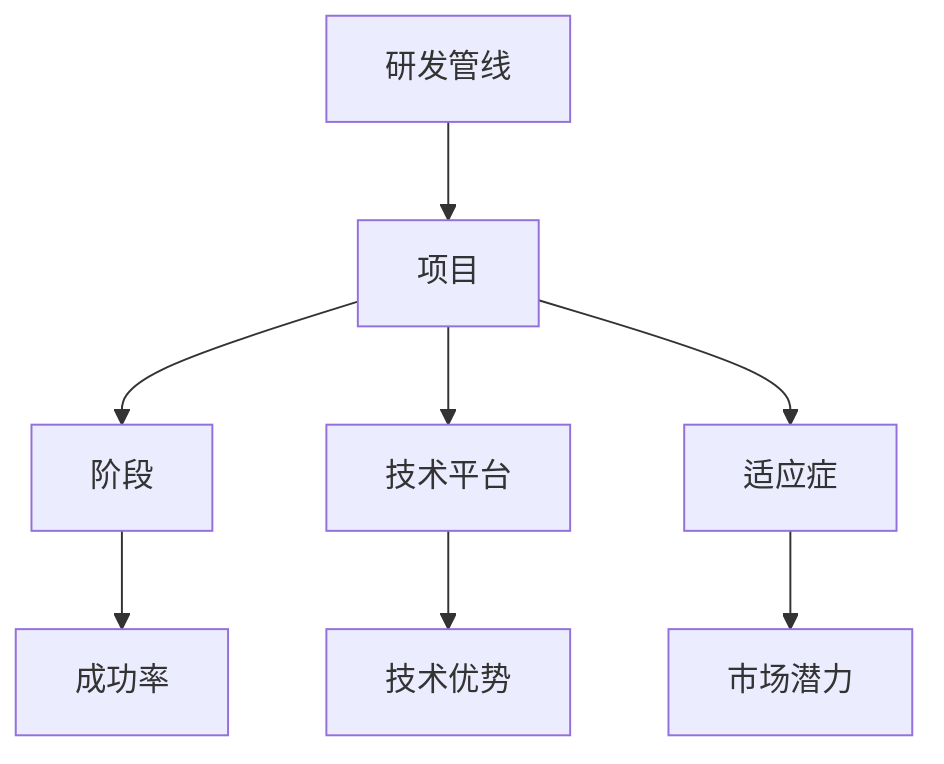
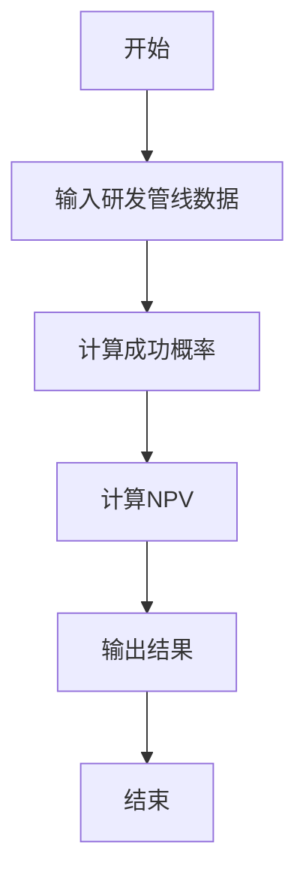
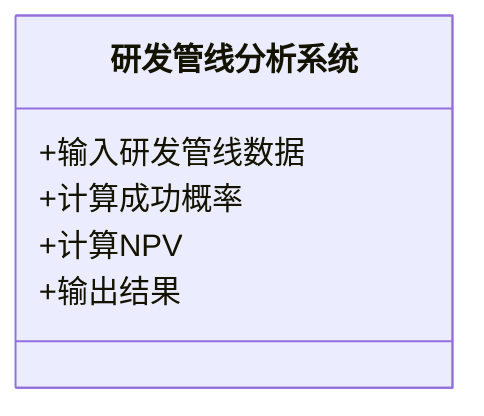
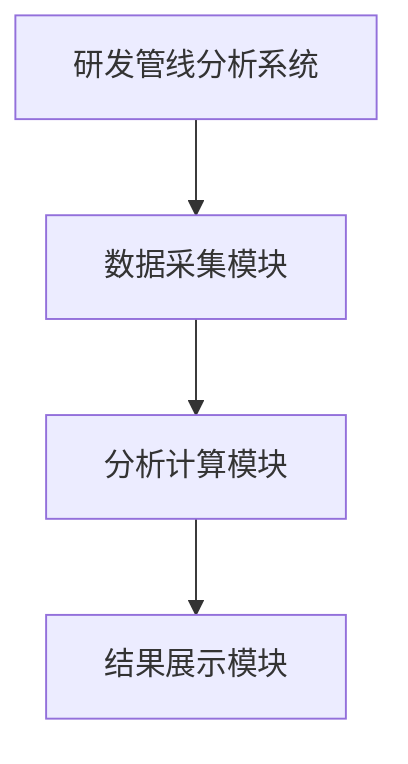
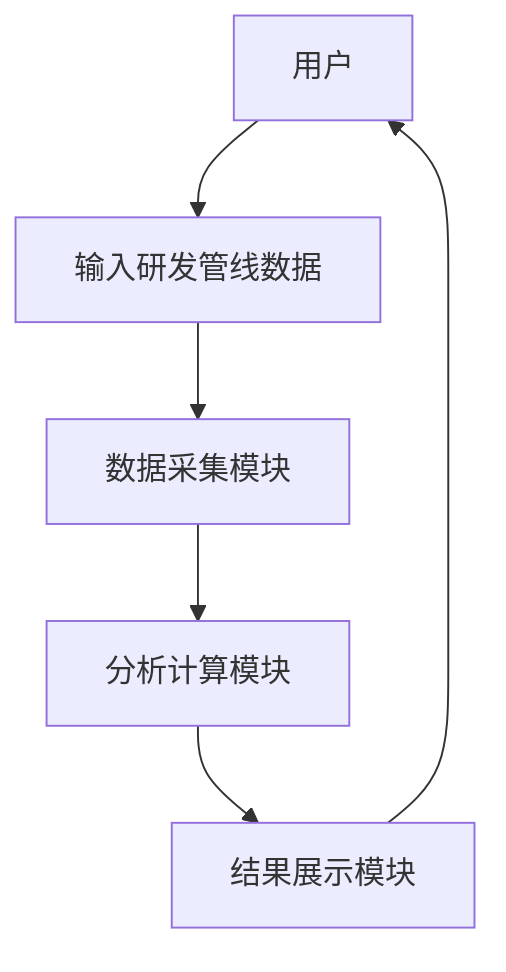

                 


# 价值投资中的生物制药研发管线分析

> 关键词：价值投资，生物制药，研发管线，NPV模型，成功率分析

> 摘要：本文详细探讨了生物制药研发管线分析在价值投资中的应用，从研发管线的定义、核心概念、数学模型、系统架构设计到实际案例分析，逐步展开。通过概率模型和NPV模型的结合，分析研发管线的市场价值，帮助投资者做出科学决策。

---

## 第一章: 价值投资与生物制药研发管线分析的背景

### 1.1 价值投资与生物制药行业的结合

#### 1.1.1 生物制药行业的特点
生物制药行业是一个高度创新和风险的行业，其研发投入巨大，周期长，但一旦成功，回报也非常高。生物制药的核心在于研发管线，即从药物发现到临床试验再到商业化的一系列项目。研发管线的质量和潜力直接决定了企业的市场价值。

#### 1.1.2 价值投资的核心理念
价值投资是一种以低于内在价值的价格购买优质资产的投资策略。其核心在于寻找被市场低估的公司，并长期持有。在生物制药领域，价值投资者需要深入分析企业的研发管线，评估其潜在价值。

#### 1.1.3 研发管线分析在价值投资中的重要性
研发管线是生物制药企业的核心资产。通过分析研发管线的成功率、市场潜力和经济价值，投资者可以更准确地评估企业的内在价值，从而做出更明智的投资决策。

### 1.2 生物制药研发管线的基本结构

#### 1.2.1 研发管线的定义
研发管线是指企业在研的药物项目，包括从早期药物发现到临床试验再到商业化的一系列阶段。每个阶段都有不同的风险和成本。

#### 1.2.2 研发管线的生命周期
1. **药物发现**：实验室研究，寻找潜在药物分子。
2. **临床前研究**：动物实验，评估药物的安全性和有效性。
3. **临床试验**：分为I、II、III期，评估药物在人体中的安全性和有效性。
4. **商业化**：药物获批后，进行大规模生产并推向市场。

#### 1.2.3 研发管线的核心要素
- **成功率**：每个阶段的成功概率。
- **成本**：每个阶段的研发成本。
- **市场潜力**：药物的市场规模和定价能力。

---

## 第二章: 研发管线分析的核心原理

### 2.1 研发管线分析的原理

#### 2.1.1 研发管线的阶段模型
研发管线的阶段模型将药物开发过程分为多个阶段，每个阶段都有不同的成功概率和成本。例如，临床II期的成功率为30%，而临床III期的成功率为70%。

#### 2.1.2 研发管线的概率模型
通过概率模型，可以估算每个阶段的成功概率，并结合成本和收益，计算研发管线的总体价值。

#### 2.1.3 研发管线的NPV模型
净现值（NPV）是评估研发管线经济价值的重要指标。通过将未来现金流折现，可以估算研发管线的当前价值。

### 2.2 研发管线分析的关键属性对比

#### 2.2.1 不同阶段项目的成功率对比
- **药物发现**：20%
- **临床前研究**：30%
- **临床I期**：70%
- **临床II期**：30%
- **临床III期**：70%

#### 2.2.2 不同技术平台的优劣势对比
- **小分子药物**：成本低，但竞争激烈。
- **抗体药物**：疗效显著，但研发成本高。
- **基因治疗**：技术门槛高，但潜力巨大。

#### 2.2.3 不同适应症的市场潜力对比
- **罕见病**：市场规模小，但单价高。
- **癌症**：市场规模大，但竞争激烈。

### 2.3 研发管线的ER实体关系图


---

## 第三章: 研发管线分析的数学模型

### 3.1 研发管线的概率模型

#### 3.1.1 研发管线的成功概率计算
$$ P = \frac{\text{成功案例数}}{\text{总案例数}} $$

#### 3.1.2 研发管线的失败概率计算
$$ P_{\text{失败}} = 1 - P $$

#### 3.1.3 研发管线的整体概率评估
通过将每个阶段的成功概率相乘，可以得到整个研发管线的成功概率。

### 3.2 研发管线的NPV模型

#### 3.2.1 NPV的基本公式
$$ NPV = \sum_{t=1}^{n} \frac{CF_t}{(1 + r)^t} $$

其中，$CF_t$是第$t$年的现金流，$r$是贴现率。

#### 3.2.2 NPV在研发管线中的应用
通过将未来现金流（包括研发成本和潜在收益）折现，可以估算研发管线的当前价值。

#### 3.2.3 NPV的敏感性分析
$$ \Delta NPV = \frac{\partial NPV}{\partial x} \cdot \Delta x $$

### 3.3 研发管线的数学公式

#### 3.3.1 成功概率公式
$$ P = \frac{\text{成功案例数}}{\text{总案例数}} $$

#### 3.3.2 NPV计算公式
$$ NPV = \sum_{t=1}^{n} \frac{CF_t}{(1 + r)^t} $$

#### 3.3.3 NPV的敏感性分析公式
$$ \Delta NPV = \frac{\partial NPV}{\partial x} \cdot \Delta x $$

### 3.4 算法流程图


---

## 第四章: 系统分析与架构设计方案

### 4.1 系统功能需求

#### 4.1.1 系统功能模块
- **数据采集模块**：收集研发管线数据。
- **分析计算模块**：计算成功率和NPV。
- **结果展示模块**：展示分析结果。

#### 4.1.2 系统功能模块类图


#### 4.1.3 系统架构图


### 4.2 系统接口设计

#### 4.2.1 系统接口
- **输入接口**：接收研发管线数据。
- **输出接口**：输出分析结果。

#### 4.2.2 系统交互图


---

## 第五章: 项目实战

### 5.1 环境配置

#### 5.1.1 环境要求
- Python 3.8+
- NumPy和Pandas库

#### 5.1.2 环境安装
```bash
pip install numpy pandas
```

### 5.2 核心实现

#### 5.2.1 成功概率计算代码
```python
import numpy as np
import pandas as pd

def calculate_success_probability(success_cases, total_cases):
    return success_cases / total_cases

# 示例数据
success_cases = 10
total_cases = 50
probability = calculate_success_probability(success_cases, total_cases)
print(f"成功概率为：{probability}")
```

#### 5.2.2 NPV计算代码
```python
def calculate_npv(cash_flows, discount_rate):
    return np.npv(discount_rate, cash_flows)

# 示例数据
cash_flows = [-100, 50, 50, 50]
discount_rate = 0.1
npv = calculate_npv(cash_flows, discount_rate)
print(f"净现值为：{npv}")
```

### 5.3 案例分析

#### 5.3.1 案例选择
假设某生物制药公司有一个针对晚期癌症的药物项目，处于临床III期。

#### 5.3.2 数据收集
- 成功概率：70%
- 研发成本：1亿美元
- 商业化收益：10亿美元

#### 5.3.3 分析与结果
- 成功概率：70%
- NPV：正数，说明项目具有投资价值。

---

## 第六章: 总结与展望

### 6.1 总结
研发管线分析是生物制药价值投资的核心内容。通过概率模型和NPV模型的结合，投资者可以更科学地评估研发管线的市场价值。

### 6.2 投资策略建议
- 优先关注成功率高的项目。
- 评估企业的研发能力。
- 结合市场潜力和风险进行综合判断。

### 6.3 风险管理
- 关注研发管线的多样性。
- 评估政策和市场风险。

### 6.4 拓展阅读
- 《价值投资：从格雷厄姆到巴菲特》
- 《生物制药研发管理》

---

## 作者：AI天才研究院 & 禅与计算机程序设计艺术

