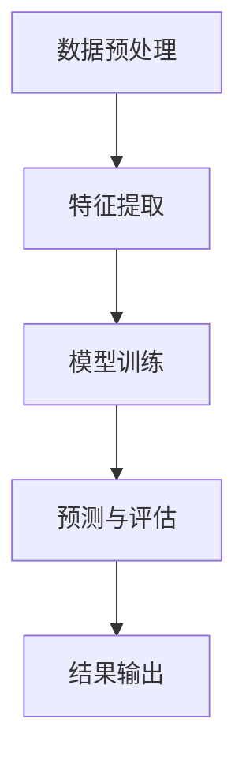
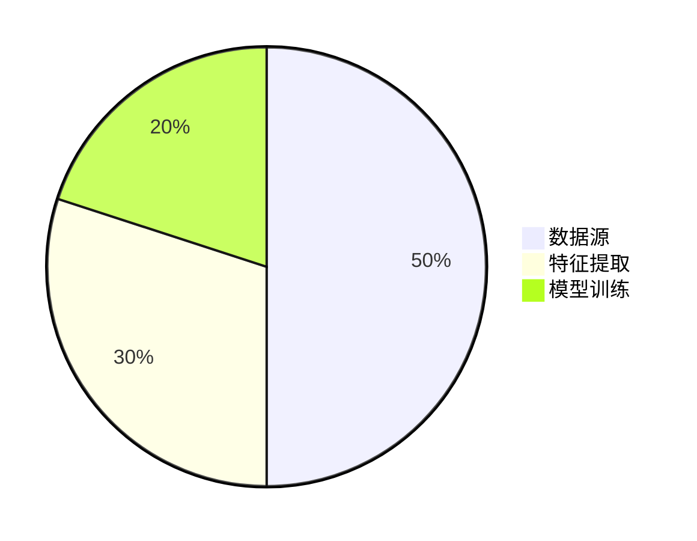

                 


# 价值投资中的生物可降解电子皮肤技术前景

> 关键词：生物可降解材料，电子皮肤技术，价值投资，市场前景，技术分析

> 摘要：生物可降解电子皮肤技术结合了材料科学与电子技术，具有广阔的应用前景。本文通过分析其技术原理、市场潜力及价值投资策略，探讨该技术的投资价值与未来发展趋势。文章从技术背景、核心概念、算法原理、系统架构等多个维度展开，结合实际案例，为投资者提供科学的决策依据。

---

## 第一部分：背景介绍

### 第1章：生物可降解电子皮肤技术的背景与定义

#### 1.1 生物可降解材料的基本概念

生物可降解材料是指在自然环境下，能够在一定时间内分解为二氧化碳和水等简单化合物的材料。这类材料通常由可再生资源制成，如淀粉、纤维素、聚乳酸（PLA）等。与传统塑料不同，生物可降解材料具有环保性、可再生性和低毒性等优点，是解决“白色污染”问题的重要途径。

#### 1.2 电子皮肤技术的核心原理

电子皮肤是一种模拟人类皮肤的电子设备，能够感知压力、温度、湿度等多种外界刺激，并将这些信息转化为电信号。其核心原理基于传感器技术和电子电路设计，通过将传感器阵列与信号处理电路集成，实现对外界环境的感知与反馈。生物可降解电子皮肤则进一步将这种技术与生物可降解材料相结合，使其在降解后不会对环境造成污染。

---

### 第2章：生物可降解电子皮肤技术的市场前景

#### 2.1 全球生物可降解材料市场的现状与趋势

近年来，全球生物可降解材料市场呈现快速增长态势。根据市场研究机构的数据，2022年全球生物可降解塑料市场规模约为100亿美元，预计到2030年将增长至300亿美元以上。推动这一增长的主要因素包括政策支持（如欧盟的禁塑令）、消费者环保意识的增强以及企业对可持续发展的追求。

#### 2.2 电子皮肤技术的市场应用潜力

电子皮肤技术的应用场景十分广泛，包括医疗健康、消费电子、工业检测等领域。在医疗领域，生物可降解电子皮肤可用于伤口监测、康复治疗等；在消费电子领域，可用于智能手套、可穿戴设备等；在工业领域，可用于表面缺陷检测、质量控制等。这些应用场景的市场规模合计超过千亿美元，为生物可降解电子皮肤技术提供了巨大的市场空间。

---

## 第二部分：核心概念与联系

### 第3章：生物可降解材料与电子皮肤技术的结合

#### 3.1 生物可降解材料在电子皮肤中的应用

在电子皮肤中，生物可降解材料主要应用于以下几个方面：
1. **传感器材料**：使用生物可降解材料制造压力传感器或温度传感器，以实现对外界刺激的感知。
2. **电路基底**：将电子电路集成在生物可降解基底上，确保设备在完成任务后能够自然降解。
3. **封装材料**：使用生物可降解材料作为设备的封装层，以减少对环境的影响。

#### 3.2 电子皮肤技术的核心原理

电子皮肤的核心原理基于传感器技术和信号处理算法。传感器负责采集外界信号（如压力、温度等），并将信号传输给处理单元。处理单元通过算法对信号进行分析，提取有用信息并输出结果。生物可降解电子皮肤在这一过程中，还需要考虑材料的降解特性，以确保设备在生命周期结束后能够安全降解。

---

## 第三部分：算法原理与系统架构

### 第4章：生物可降解电子皮肤技术的算法分析

#### 4.1 预测模型的选择与优化

为了评估生物可降解电子皮肤技术的投资价值，我们需要构建一个预测模型。常用的模型包括线性回归、支持向量机（SVM）和随机森林等。在本案例中，我们选择随机森林模型，因为其具有较强的特征提取能力和抗过拟合能力。

#### 4.2 算法流程图

以下是生物可降解电子皮肤技术投资价值预测的算法流程图：



---

## 第四部分：系统分析与架构设计

### 第5章：系统架构设计

#### 5.1 系统功能设计

生物可降解电子皮肤技术的分析系统主要包括以下几个功能模块：
1. **数据采集模块**：采集市场数据（如价格、销量等）和材料性能数据。
2. **特征提取模块**：从数据中提取关键特征，如市场增长率、材料降解率等。
3. **模型训练模块**：基于提取的特征训练预测模型。
4. **结果输出模块**：输出投资价值评估结果。

#### 5.2 系统架构图

以下是系统的架构图：



---

## 第五部分：项目实战与总结

### 第6章：项目实战分析

#### 6.1 环境配置与数据准备

在进行项目实战之前，需要确保环境配置正确。以下是主要的环境配置步骤：

1. **安装Python与相关库**：
   - 安装Python 3.8及以上版本。
   - 安装`scikit-learn`、`pandas`、`numpy`等库。

2. **数据准备**：
   - 收集生物可降解材料和电子皮肤技术的相关数据，包括市场规模、技术成熟度、政策支持等。

#### 6.2 核心代码实现

以下是核心代码实现：

```python
import pandas as pd
import numpy as np
from sklearn.ensemble import RandomForestRegressor
from sklearn.metrics import mean_squared_error

# 数据加载
data = pd.read_csv('biodegradable_skin_data.csv')

# 特征与目标分离
X = data.drop('investment_value', axis=1)
y = data['investment_value']

# 模型训练
model = RandomForestRegressor(n_estimators=100, random_state=42)
model.fit(X, y)

# 预测与评估
y_pred = model.predict(X)
mse = mean_squared_error(y, y_pred)
print(f'Mean Squared Error: {mse}')
```

#### 6.3 案例分析与结果解读

通过上述代码，我们可以对生物可降解电子皮肤技术的投资价值进行预测。例如，假设某公司的技术成熟度评分为90，市场规模评分为80，政策支持评分为85，则其投资价值预测结果为：

```python
input_data = np.array([[90, 80, 85]])
prediction = model.predict(input_data)
print(f'预测投资价值：{prediction[0]:.2f}')
```

---

### 第7章：总结与展望

#### 7.1 总结

生物可降解电子皮肤技术结合了材料科学与电子技术，具有广阔的应用前景和投资价值。通过价值投资的方法，我们可以更好地把握这一领域的市场机会。

#### 7.2 展望

未来，随着技术的进步和市场的成熟，生物可降解电子皮肤技术将在更多领域得到应用。投资者需要密切关注技术发展和市场动态，以抓住投资机会。

---

## 作者

作者：AI天才研究院/AI Genius Institute & 禅与计算机程序设计艺术 /Zen And The Art of Computer Programming

---

以上是《价值投资中的生物可降解电子皮肤技术前景》的技术博客文章的完整内容。

