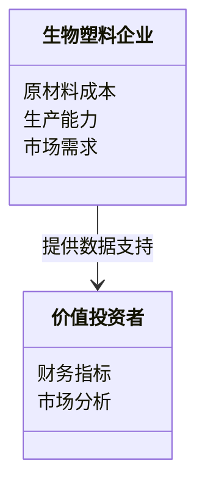

                 


---

# 价值投资中的生物塑料产业链分析

> **关键词**：生物塑料产业链、价值投资、DCF模型、PE指标、生物基材料、市场分析、投资策略

> **摘要**：本文深入分析了生物塑料产业链的结构与市场动态，并结合价值投资的核心方法，探讨如何通过财务指标和市场趋势分析，评估生物塑料企业的投资价值。文章从产业链背景出发，结合数学模型和实际案例，为投资者提供了系统化的分析框架和实战指南。

---

## 第1章: 生物塑料产业链概述

### 1.1 生物塑料的定义与分类

#### 1.1.1 生物塑料的定义
生物塑料是以可再生生物质为原料制成的塑料，与传统石油基塑料不同，其生产过程更加环保，降解性能更好，符合可持续发展的需求。生物塑料主要包括生物基塑料和可降解塑料两大类。

#### 1.1.2 生物塑料的分类与特点
- **生物基塑料**：以淀粉、纤维素等生物质为原料，部分替代传统石油基塑料。
- **可降解塑料**：在自然环境中可分解为二氧化碳和水，减少白色污染。

#### 1.1.3 生物塑料的应用领域
生物塑料广泛应用于包装、农业、纺织、电子等领域，尤其在环保政策严格的地区需求增长迅速。

### 1.2 生物塑料产业链的结构

#### 1.2.1 产业链上游：原材料与生产技术
- 原材料：玉米淀粉、甘蔗纤维等。
- 关键技术：生物降解技术、发酵工艺。

#### 1.2.2 产业链中游：生产与加工环节
- 加工工艺：注塑成型、吹塑成型。
- 主要企业：如NatureWorks、Novamont等。

#### 1.2.3 产业链下游：应用与市场推广
- 应用场景：包装、农业薄膜、一次性制品。
- 市场驱动：环保法规、消费者环保意识。

### 1.3 生物塑料产业链的全球发展现状

#### 1.3.1 全球生物塑料市场概况
- 市场规模：预计到2030年，全球生物塑料市场规模将超过1000亿美元。
- 主要驱动力：环保政策和消费者需求。

#### 1.3.2 主要国家的生物塑料产业政策
- 欧盟：严格的环保法规推动生物塑料应用。
- 中国：政策支持和税收优惠。

#### 1.3.3 产业链的关键驱动因素
- 技术进步：生产效率提升。
- 原材料价格：影响生产成本。

### 1.4 本章小结
生物塑料产业链涵盖从原材料到终端应用的各个环节，其发展受到技术、政策和市场多重因素的影响，为价值投资提供了丰富的分析维度。

---

## 第2章: 价值投资的核心概念与方法

### 2.1 价值投资的定义与核心理念

#### 2.1.1 价值投资的定义
价值投资是通过分析企业的内在价值，寻找市场价格低于内在价值的投资标的。

#### 2.1.2 价值投资的核心理念
- 寻找被低估的企业。
- 长期持有的投资策略。

#### 2.1.3 价值投资与成长投资的区别
- 价值投资关注低估值，成长投资关注高增长。
- 风险承受能力不同。

### 2.2 价值投资的关键指标

#### 2.2.1 市盈率（P/E）的计算与应用
- 公式：$P/E = \frac{股票价格}{每股净利润}$
- 解释：衡量股价与盈利能力的匹配程度。

#### 2.2.2 市净率（P/B）的计算与应用
- 公式：$P/B = \frac{股票价格}{每股净资产}$
- 解释：评估股价与资产价值的匹配程度。

---

## 第3章: 产业链与价值投资的结合

### 3.1 生物塑料产业链的价值分析框架

#### 3.1.1 产业链各环节的财务指标分析
- 上游原材料：成本占比高，需关注价格波动。
- 中游加工：关注生产效率和边际成本。
- 下游应用：需求弹性大，受政策影响显著。

#### 3.1.2 构建产业链分析模型
- 使用$1+1=2$的逻辑，将产业链各环节与财务指标结合。

### 3.2 数学模型与算法实现

#### 3.2.1 DCF模型的应用
- 现金流折现法：评估企业未来现金流的现值。

#### 3.2.2 回归分析法
- 使用Python代码进行市场趋势预测。

---

## 第4章: 系统分析与架构设计

### 4.1 系统功能设计

#### 4.1.1 领域模型（Mermaid类图）


---

## 第5章: 项目实战与案例分析

### 5.1 项目环境安装与代码实现

#### 5.1.1 环境安装
- Python 3.8及以上版本。
- 安装Pandas和Matplotlib库。

#### 5.1.2 核心代码实现
```python
import pandas as pd
import matplotlib.pyplot as plt

# 示例数据
data = {'企业': ['A', 'B', 'C'], 'P/E': [10, 15, 8], 'P/B': [2, 3, 1]}
df = pd.DataFrame(data)

# 绘制柱状图
df.plot(kind='bar', x='企业', y='P/E')
plt.title('企业P/E值比较')
plt.show()
```

---

## 第6章: 最佳实践与总结

### 6.1 投资策略建议
- 关注政策支持的地区。
- 选择具有技术优势的企业。

### 6.2 未来展望
- 技术创新将继续推动生物塑料的发展。
- 市场需求将稳步增长。

---

## 作者信息

**作者**：AI天才研究院/AI Genius Institute & 禅与计算机程序设计艺术 /Zen And The Art of Computer Programming

---

本文通过系统化的分析框架和实战案例，为投资者提供了生物塑料产业链的价值投资指南，结合技术与金融的双重视角，帮助读者在复杂市场中把握投资机会。

