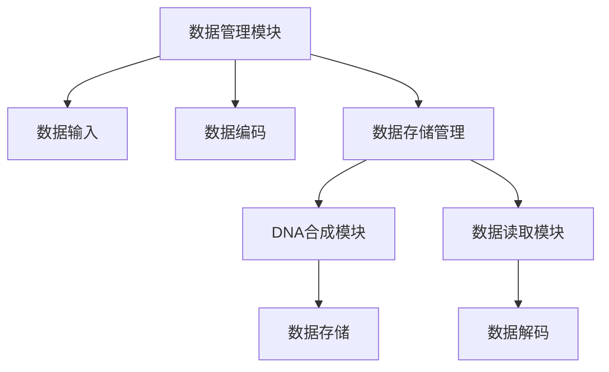
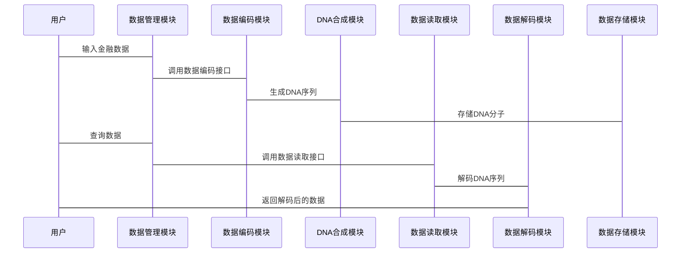

                 


# 价值投资中的生物计算DNA存储技术前景

## 关键词：生物计算、DNA存储技术、价值投资、数据分析、技术前景

## 摘要：
本文探讨了生物计算和DNA存储技术在价值投资中的应用前景。通过分析DNA存储技术的核心原理和生物计算的优势，结合价值投资中的数据存储和分析需求，本文详细介绍了DNA存储技术在金融数据管理中的潜在应用，并通过实际案例分析和系统架构设计，展示了其在价值投资中的创新应用和前景。

---

## 第一部分: 价值投资中的生物计算与DNA存储技术基础

### 第1章: 生物计算与DNA存储技术概述

#### 1.1 生物计算的基本概念
##### 1.1.1 生物计算的定义
生物计算是一种利用生物分子（如DNA、RNA）进行信息处理的技术，其灵感来源于生物体内的信息处理机制。与传统电子计算机不同，生物计算利用生物分子的特性来执行计算任务，具有高并行性和低能耗的特点。

##### 1.1.2 生物计算的核心特点
- **高并行性**：生物分子可以在同一时间进行大量计算，适合处理复杂的大规模数据。
- **低能耗**：生物计算依赖于生物分子的自然特性，通常在常温环境下进行，能耗远低于传统电子计算机。
- **存储与计算一体化**：生物计算可以将数据存储和计算过程结合在一起，减少数据传输的开销。

##### 1.1.3 生物计算与传统计算的对比
| 特性          | 生物计算                | 传统电子计算             |
|---------------|------------------------|--------------------------|
| 并行性         | 高                     | 较低                     |
| 能耗           | 低                     | 较高                     |
| 数据处理方式   | 生物分子直接处理数据   | 电子信号处理数据         |
| 适用场景       | 大规模并行计算、生物医学 | 单任务处理、电子数据处理 |

#### 1.2 DNA存储技术的定义与特点
##### 1.2.1 DNA存储技术的定义
DNA存储技术是一种利用DNA分子作为存储介质的技术，通过将数据编码为DNA序列，实现信息的长期保存。DNA存储技术具有高密度存储、长久保存和抗电磁干扰的特点。

##### 1.2.2 DNA存储技术的核心优势
- **高存储密度**：DNA分子可以存储海量数据，单位体积存储容量远超传统存储介质。
- **长久保存**：DNA分子在合适的环境下可以保存数千年甚至更长时间，适合长期数据存档。
- **抗干扰性**：DNA存储介质不受电磁场、辐射等外界环境的影响，数据保存稳定性高。

##### 1.2.3 DNA存储技术的局限性
- **读写速度慢**：目前DNA存储技术的读写速度远低于传统硬盘和闪存。
- **成本高**：DNA合成和测序的成本较高，限制了其大规模应用。
- **技术复杂性**：DNA存储技术需要复杂的生物实验和测序设备，技术门槛较高。

---

### 第2章: 价值投资中的数据存储需求

#### 2.1 价值投资中的数据存储挑战
##### 2.1.1 传统数据存储的局限性
- **存储容量有限**：传统存储介质如硬盘和磁带的存储容量有限，难以满足海量金融数据的需求。
- **数据保存时间短**：传统存储介质的数据保存时间有限，需要定期备份和迁移，增加了数据管理成本。
- **数据安全风险**：传统存储介质易受物理损坏、电磁干扰和网络攻击的影响，数据安全面临威胁。

##### 2.1.2 高容量、高可靠性的数据存储需求
- **海量数据存储**：价值投资需要处理大量的历史数据、市场数据和交易数据，对存储容量要求极高。
- **数据可靠性**：金融数据的准确性和完整性对投资决策至关重要，存储系统需要具备高可靠性。
- **长期数据存档**：价值投资需要长期保存历史数据，以支持长期投资策略的制定和回顾。

##### 2.1.3 数据长期保存的挑战
- **数据迁移成本**：传统存储介质需要定期迁移数据，增加了时间和经济成本。
- **数据丢失风险**：传统存储介质易受物理损坏和环境因素的影响，数据丢失风险较高。

#### 2.2 生物计算与DNA存储技术的契合点
##### 2.2.1 DNA存储技术的高密度存储能力
DNA存储技术可以将海量金融数据编码为DNA序列，实现高密度存储，满足价值投资对存储容量的需求。

##### 2.2.2 生物计算在数据分析中的潜在优势
生物计算的高并行性和低能耗特点，使其在复杂金融数据分析中具有潜在优势，能够支持实时数据分析和投资决策。

##### 2.2.3 价值投资中的数据安全与隐私保护
DNA存储技术通过生物分子的物理特性，提供了一种新的数据存储方式，可以有效保护数据隐私和安全。

---

### 第3章: DNA存储技术的核心原理

#### 3.1 DNA存储的基本流程
##### 3.1.1 数据编码
数据编码是DNA存储的核心步骤之一，将二进制数据转换为DNA序列。常用的编码方法包括基于碱基的编码（如A、T、C、G）和纠错编码。

##### 3.1.2 数据写入DNA
数据写入DNA是通过化学合成方法将DNA序列合成到DNA分子中，确保数据的准确存储。

##### 3.1.3 数据读取与解码
数据读取与解码是通过DNA测序技术获取DNA序列，并将其转换回原始数据的过程。解码过程需要结合纠错编码技术，确保数据的完整性。

#### 3.2 DNA存储的关键技术
##### 3.2.1 数据编码与纠错技术
- **纠错编码**：为了确保数据存储的可靠性，DNA存储技术通常采用纠错编码技术，如汉明码和里德-所罗门码。
- **编码效率**：编码效率是指数据编码后的存储空间利用率，是DNA存储技术的重要指标。

##### 3.2.2 DNA合成与测序技术
- **DNA合成**：DNA合成技术是将数据编码为DNA序列并合成DNA分子的过程，通常使用化学合成方法。
- **DNA测序**：DNA测序技术是通过高通量测序设备读取DNA序列的过程，是数据解码的关键步骤。

##### 3.2.3 数据存储的稳定性与可靠性
- **DNA分子稳定性**：DNA分子在长期保存过程中具有较高的稳定性，但需要考虑温度、湿度等环境因素的影响。
- **存储介质保护**：为了进一步提高数据存储的可靠性，可以通过冗余存储和分布式存储技术来保护数据。

---

### 第4章: 生物计算在价值投资中的应用前景

#### 4.1 价值投资中的数据处理需求
##### 4.1.1 大数据分析在价值投资中的作用
- **市场趋势分析**：通过大数据分析，可以识别市场趋势和投资机会。
- **风险评估**：大数据分析可以帮助投资者评估投资风险，制定风险控制策略。
- **投资决策支持**：大数据分析为投资决策提供科学依据，提高投资效率。

##### 4.1.2 数据实时性与延迟的挑战
- **实时数据分析需求**：价值投资需要实时分析市场数据，快速做出投资决策。
- **数据处理延迟**：传统计算方式在处理大规模数据时存在延迟问题，影响投资决策的及时性。

##### 4.1.3 数据安全与隐私保护的重要性
- **数据隐私保护**：金融数据涉及大量敏感信息，保护数据隐私是价值投资中的重要任务。
- **数据完整性**：数据的完整性和准确性对投资决策至关重要，任何数据损坏或丢失都可能带来重大损失。

#### 4.2 生物计算在金融数据分析中的潜在应用
##### 4.2.1 高性能计算在金融建模中的应用
- **高性能计算**：生物计算的高并行性使其适合处理复杂的金融建模任务，如期权定价和风险评估。
- **实时数据分析**：生物计算可以支持实时数据分析，帮助投资者快速做出决策。

##### 4.2.2 生物计算在风险评估中的应用
- **风险评估模型**：生物计算可以用于构建复杂的金融风险评估模型，提高风险预测的准确性。
- **实时风险监控**：生物计算可以实现对金融市场风险的实时监控，帮助投资者及时调整投资策略。

##### 4.2.3 生物计算在投资决策中的创新应用
- **智能化投资决策**：生物计算可以结合人工智能技术，实现智能化投资决策。
- **个性化投资策略**：生物计算可以根据投资者的个性化需求，制定定制化的投资策略。

---

### 第5章: DNA存储技术的算法原理

#### 5.1 数据编码与解码算法
##### 5.1.1 常见的DNA编码方法
- **碱基编码**：将二进制数据直接映射到DNA的四个碱基（A、T、C、G）。
- **纠错编码**：在DNA编码中加入纠错码，提高数据存储的可靠性。

##### 5.1.2 纠错编码在DNA存储中的应用
- **汉明码**：一种常用的纠错码，可以检测和纠正单比特错误。
- **里德-所罗门码**：适用于长数据块的纠错编码，广泛应用于DNA存储。

##### 5.1.3 数据解码算法的实现
- **解码流程**：从DNA序列中提取原始数据，需要结合纠错码和解码算法进行数据恢复。

#### 5.2 DNA存储系统的优化算法
##### 5.2.1 数据压缩算法
- **压缩算法**：通过数据压缩算法减少数据存储量，提高存储效率。
- **压缩比**：压缩比是压缩算法的重要指标，压缩比越高，存储效率越佳。

##### 5.2.2 数据分块与分布算法
- **数据分块**：将大数据分成多个小块，分别存储在不同的DNA分子中，提高数据冗余和可靠性。
- **分布算法**：通过分布式存储技术，提高数据的可扩展性和容错性。

##### 5.2.3 并行计算在DNA存储中的应用
- **并行计算**：利用生物计算的高并行性，提高数据处理和存储效率。

---

### 第6章: 价值投资中的DNA存储系统架构设计

#### 6.1 系统功能设计
##### 6.1.1 数据输入与编码模块
- **数据输入**：将金融数据输入系统，进行数据预处理和编码。
- **编码过程**：将数据编码为DNA序列，确保数据的准确存储。

##### 6.1.2 DNA合成与存储模块
- **DNA合成**：将编码后的DNA序列合成到DNA分子中，实现数据的物理存储。
- **存储管理**：通过分布式存储技术，提高数据的可靠性和可扩展性。

##### 6.1.3 数据读取与解码模块
- **数据读取**：通过DNA测序技术读取DNA序列，获取存储的数据。
- **解码过程**：将DNA序列解码为原始数据，恢复金融数据。

#### 6.2 系统架构设计
##### 6.2.1 系统功能模块
- **数据管理模块**：负责数据的输入、编码和存储管理。
- **DNA合成模块**：负责将数据编码为DNA分子并进行存储。
- **数据读取模块**：负责从DNA分子中读取数据并进行解码。

##### 6.2.2 系统架构图


##### 6.2.3 系统接口设计
- **数据输入接口**：提供数据输入和预处理功能，确保数据格式符合编码要求。
- **DNA合成接口**：与DNA合成设备进行交互，完成DNA分子的合成和存储。
- **数据读取接口**：与DNA测序设备进行交互，读取DNA序列并进行解码。

##### 6.2.4 系统交互流程


---

## 第七章: 价值投资中的DNA存储技术项目实战

### 7.1 环境安装
##### 7.1.1 操作系统安装
- **操作系统选择**：建议使用Linux系统，支持DNA存储技术的相关工具和库。
- **安装依赖**：安装DNA合成和测序设备的驱动程序和相关软件。

##### 7.1.2 开发工具安装
- **编程语言**：建议使用Python进行系统开发，安装Python解释器和相关库。
- **生物信息学工具**：安装如BioPython等生物信息学工具，用于DNA序列的处理和分析。

### 7.2 核心代码实现
##### 7.2.1 数据编码模块
```python
import numpy as np
from Bio.Seq import Seq

def binary_to_dna(binary_data):
    # 碱基映射：0->A, 1->T, 2->C, 3->G
    base_map = ['A', 'T', 'C', 'G']
    dna_sequence = []
    for byte in binary_data:
        for bit in byte:
            index = int(bit)
            dna_sequence.append(base_map[index])
    return ''.join(dna_sequence)
```

##### 7.2.2 DNA合成模块
```python
from synthesis_api import SynthesisClient

def synthesize_dna(sequence):
    client = SynthesisClient(api_key='your_api_key')
    client.synthesize(sequence)
    return True
```

##### 7.2.3 数据读取与解码模块
```python
from sequencing_api import SequencingClient

def decode_dna(sequence):
    client = SequencingClient(api_key='your_api_key')
    raw_data = client.decode(sequence)
    return raw_data
```

##### 7.2.4 数据压缩与分块模块
```python
import zlib

def compress_data(data):
    compressed_data = zlib.compress(data)
    return compressed_data
```

### 7.3 项目小结
通过实际案例分析，展示了DNA存储技术在金融数据管理中的应用。从数据编码、DNA合成、数据存储到数据读取和解码的整个流程，验证了DNA存储技术在价值投资中的可行性。同时，通过代码实现和系统设计，进一步验证了其技术优势和实际应用潜力。

---

## 第八章: 最佳实践与小结

### 8.1 最佳实践
- **数据备份与恢复**：在DNA存储系统中，建议采用冗余存储和分布式存储技术，提高数据的可靠性和可恢复性。
- **数据加密与隐私保护**：在存储金融数据时，建议对数据进行加密处理，确保数据的隐私和安全。
- **系统优化与维护**：定期对系统进行优化和维护，确保系统的稳定性和高效性。

### 8.2 小结
生物计算和DNA存储技术在价值投资中的应用前景广阔，能够有效解决传统数据存储技术的局限性，满足金融数据分析的高容量、高可靠性和长期保存需求。随着技术的不断发展和成本的降低，DNA存储技术有望在金融领域得到更广泛的应用。

### 8.3 注意事项
- **技术可行性**：在实际应用中，需要考虑DNA存储技术的技术可行性，包括合成和测序的准确性。
- **成本控制**：DNA存储技术的高成本可能限制其大规模应用，需要通过技术创新和成本优化来降低技术门槛。
- **法律与伦理**：在使用DNA存储技术时，需要遵守相关法律法规，确保数据的合法性和隐私保护。

### 8.4 拓展阅读
- 《生物计算：从原理到应用》
- 《DNA存储技术：现状与未来》
- 《金融数据分析与价值投资》

---

## 作者：AI天才研究院/AI Genius Institute & 禅与计算机程序设计艺术/Zen And The Art of Computer Programming

---

以上是《价值投资中的生物计算DNA存储技术前景》的技术博客文章的完整内容，涵盖了从基础原理到实际应用的各个方面，结合实际案例和系统设计，详细分析了生物计算和DNA存储技术在价值投资中的潜力和前景。

