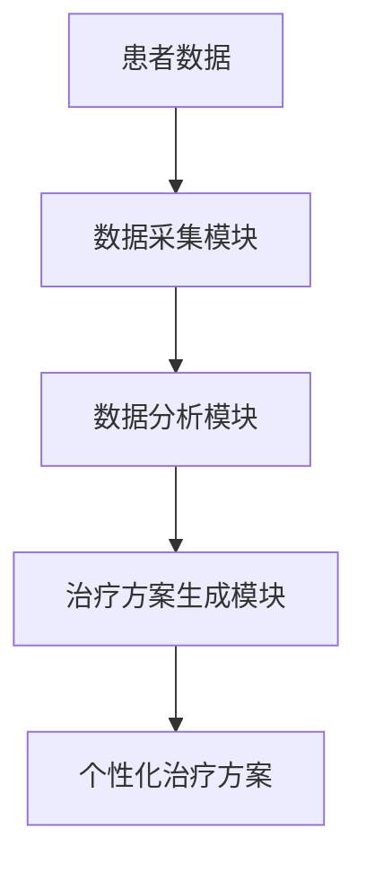
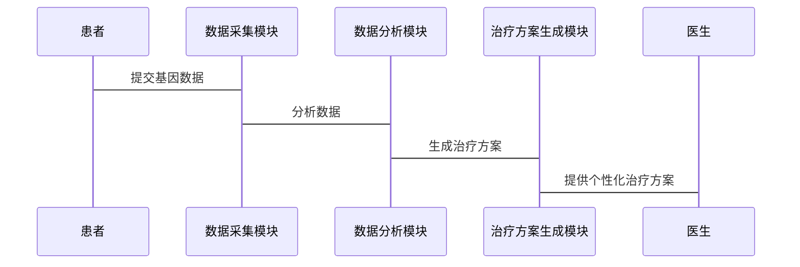

                 


# 价值投资中的精准医疗技术趋势

## 关键词：价值投资、精准医疗、技术趋势、算法原理、系统架构、项目实战、数学模型

## 摘要：  
精准医疗技术近年来在医疗行业掀起了一场革命，其以患者个体化特征为基础的诊断和治疗方式，正在改变传统医疗的模式。本文将从价值投资的角度出发，深入探讨精准医疗技术的发展趋势及其对投资决策的影响。通过对精准医疗的核心技术、算法原理、系统架构的详细分析，结合实际项目案例，本文旨在为投资者提供一个从技术角度理解精准医疗发展的新视角，帮助他们在医疗投资领域做出更明智的决策。

---

# 第一章：价值投资与精准医疗的背景与概念

## 1.1 价值投资的核心理念  
### 1.1.1 价值投资的定义  
价值投资是一种以基本面分析为基础的投资策略，强调以低于内在价值的价格买入优质资产，长期持有，等待市场回归其真实价值。  

### 1.1.2 价值投资的基本原则  
- 购买具有持续竞争优势的企业。  
- 坚持长期投资，避免短期市场波动的干扰。  
- 以合理的价格买入，注重安全边际。  

### 1.1.3 价值投资与精准医疗的结合  
随着医疗技术的进步，精准医疗正在成为医疗行业的重要趋势。通过技术分析和数据驱动的方法，精准医疗可以帮助投资者更准确地评估医疗企业的价值，发现具有长期竞争优势的企业。  

---

## 1.2 精准医疗的定义与特点  
### 1.2.1 精准医疗的定义  
精准医疗是以患者个体特征为基础，结合基因组学、蛋白质组学等多组学数据，制定个性化诊断和治疗方案的医疗模式。  

### 1.2.2 精准医疗的核心技术  
- 基因测序技术。  
- 生物标记物的识别与验证。  
- 人工智能在医疗数据分析中的应用。  

### 1.2.3 精准医疗与传统医疗的区别  
- 个性化 vs. 普通化：精准医疗注重个体差异，传统医疗注重通用性。  
- 数据驱动 vs. 经验驱动：精准医疗依赖大数据分析，传统医疗依赖医生经验。  
- 成本 vs. 效益：精准医疗初期投入高，但长期效果更优。  

---

## 1.3 价值投资中的精准医疗趋势  
### 1.3.1 精准医疗在医疗行业的应用  
- 基因检测技术在肿瘤治疗中的应用。  
- 个性化药物开发。  
- 精准诊断技术的普及。  

### 1.3.2 精准医疗对投资决策的影响  
- 提高医疗企业的估值准确性。  
- 帮助投资者识别具有技术优势的医疗企业。  
- 降低投资风险，提高投资回报率。  

---

## 1.4 本章小结  
本章从价值投资和精准医疗的基本概念出发，分析了精准医疗的核心技术及其与传统医疗的区别，最后探讨了精准医疗技术对价值投资的影响。通过本章的学习，读者可以初步理解精准医疗在医疗投资中的重要性。

---

# 第二章：精准医疗技术的核心概念与联系  

## 2.1 精准医疗技术的核心原理  
### 2.1.1 基因测序技术  
- 基因测序的基本原理。  
- 测序技术的进展与应用。  
- 基因测序在精准医疗中的作用。  

### 2.1.2 生物标记物的识别  
- 生物标记物的定义与分类。  
- 生物标记物在疾病诊断和治疗中的应用。  
- 生物标记物的发现与验证过程。  

### 2.1.3 个性化治疗方案的制定  
- 个性化治疗的定义与优势。  
- 个性化治疗方案的制定流程。  
- 个性化治疗对医疗成本和效果的影响。  

---

## 2.2 精准医疗技术的核心要素  
### 2.2.1 数据采集与分析  
- 数据采集的来源与方法。  
- 数据分析的关键步骤与技术。  
- 数据安全与隐私保护。  

### 2.2.2 人工智能在精准医疗中的应用  
- 机器学习在疾病预测中的应用。  
- 自然语言处理在医学文献分析中的应用。  
- 神经网络在图像识别中的应用。  

### 2.2.3 知识库与专家系统的构建  
- 医疗知识库的构建方法。  
- 专家系统的定义与功能。  
- 知识库与专家系统在精准医疗中的协同作用。  

---

## 2.3 精准医疗技术与价值投资的关系  
### 2.3.1 精准医疗技术对医疗成本的影响  
- 精准医疗如何降低医疗成本。  
- 个性化治疗对医疗资源分配的影响。  
- 精准医疗技术的普及对医疗企业成本结构的优化。  

### 2.3.2 精准医疗技术对医疗效果的提升  
- 精准医疗如何提高治疗效果。  
- 个性化治疗对患者生存率和生活质量的改善。  
- 精准医疗技术对医疗企业市场竞争力的提升。  

### 2.3.3 精准医疗技术对投资决策的支持  
- 精准医疗技术如何帮助投资者评估医疗企业的技术优势。  
- 精准医疗技术对医疗企业未来收益的预测。  
- 精准医疗技术在风险控制中的应用。  

---

## 2.4 本章小结  
本章详细分析了精准医疗技术的核心原理和关键要素，探讨了精准医疗技术对价值投资的重要影响。通过本章的学习，读者可以深入了解精准医疗技术在医疗投资中的实际应用。

---

# 第三章：精准医疗技术的算法原理与数学模型  

## 3.1 精准医疗中的算法原理  
### 3.1.1 机器学习在精准医疗中的应用  
- 机器学习的基本原理。  
- 机器学习在疾病预测中的应用。  
- 机器学习在治疗方案优化中的应用。  

### 3.1.2 精准医疗中的数学模型  
- 统计模型在精准医疗中的应用。  
- 优化模型在精准医疗中的应用。  
- 网络模型在精准医疗中的应用。  

---

## 3.2 算法原理的数学公式  
### 3.2.1 机器学习算法的数学公式  
- 线性回归的数学公式：$y = \beta_0 + \beta_1x + \epsilon$  
- 逻辑回归的数学公式：$P(y=1|x) = \frac{e^{\beta_0 + \beta_1x}}{1 + e^{\beta_0 + \beta_1x}}$  

### 3.2.2 统计模型的数学公式  
- t检验的统计公式：$t = \frac{\bar{x}_1 - \bar{x}_2}{\sqrt{\frac{s_1^2}{n_1} + \frac{s_2^2}{n_2}}}$  
- 方差分析的统计公式：$F = \frac{MSB}{MSW}$  

### 3.2.3 优化模型的数学公式  
- 线性规划的优化公式：$\text{minimize } c^T x \text{ subject to } Ax \leq b$  

---

## 3.3 算法原理的实例分析  
### 3.3.1 机器学习在疾病预测中的应用  
- 使用逻辑回归模型预测肿瘤患者的生存率。  

### 3.3.2 统计模型在生物标记物识别中的应用  
- 使用t检验分析基因表达差异。  

### 3.3.3 优化模型在治疗方案制定中的应用  
- 使用线性规划模型优化药物剂量分配。  

---

## 3.4 本章小结  
本章通过数学公式和实例分析，详细解释了精准医疗中常用的算法原理和数学模型。通过本章的学习，读者可以理解这些技术在精准医疗中的具体应用。

---

# 第四章：精准医疗技术的系统分析与架构设计  

## 4.1 精准医疗系统的架构设计  
### 4.1.1 系统功能设计  
- 数据采集模块：负责采集患者的基因数据、临床数据等。  
- 数据分析模块：利用机器学习和统计模型对数据进行分析。  
- 治疗方案生成模块：根据分析结果生成个性化治疗方案。  

### 4.1.2 系统架构图  


---

## 4.2 精准医疗系统的接口设计  
### 4.2.1 数据接口  
- 数据采集接口：与基因测序设备对接。  
- 数据分析接口：与第三方AI平台对接。  

### 4.2.2 用户接口  
- 患者端接口：提供个性化诊断报告。  
- 医生端接口：提供治疗方案建议。  

---

## 4.3 系统交互流程图  


---

## 4.4 本章小结  
本章通过系统架构图和交互流程图，详细分析了精准医疗系统的功能设计和接口设计。通过本章的学习，读者可以理解精准医疗技术在实际应用中的系统架构。

---

# 第五章：精准医疗技术的项目实战  

## 5.1 环境安装与配置  
### 5.1.1 系统环境  
- 操作系统：Linux/Windows/MacOS  
- 开发工具：Python、Jupyter Notebook、Git  

### 5.1.2 依赖库安装  
- Python库：numpy、pandas、scikit-learn、tensorflow  
- 数据可视化工具：Matplotlib、Seaborn  

---

## 5.2 核心实现代码  
### 5.2.1 数据预处理  
```python
import pandas as pd
import numpy as np

# 加载数据
data = pd.read_csv('medical_data.csv')

# 数据清洗
data.dropna(inplace=True)
data = pd.get_dummies(data)
```

### 5.2.2 机器学习模型训练  
```python
from sklearn.model

