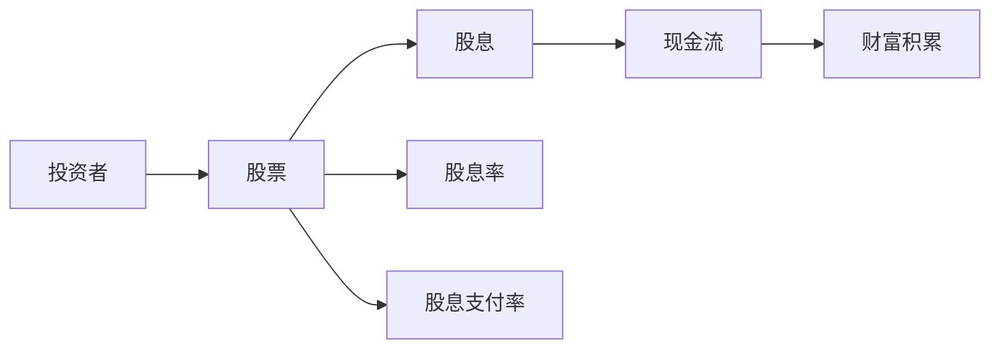
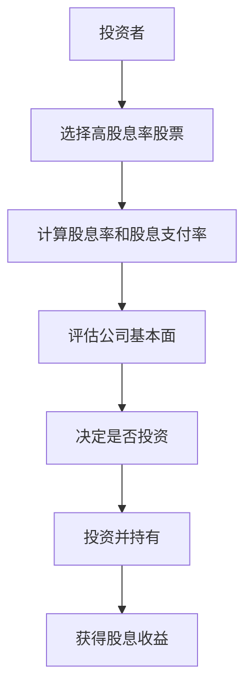
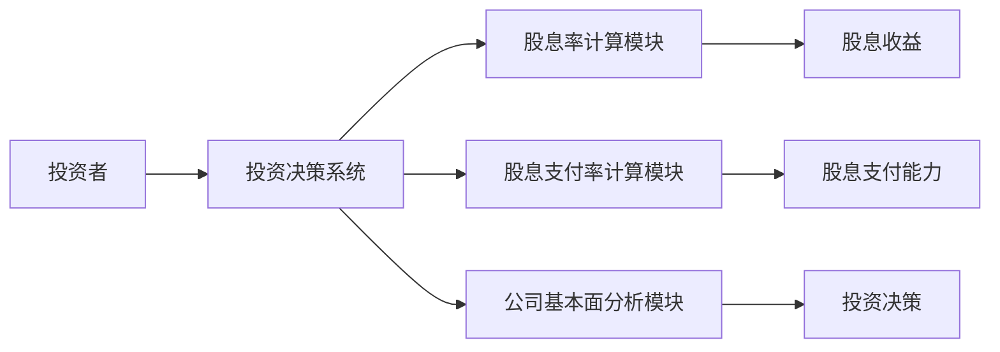
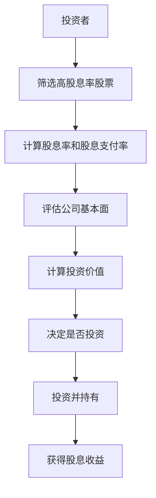
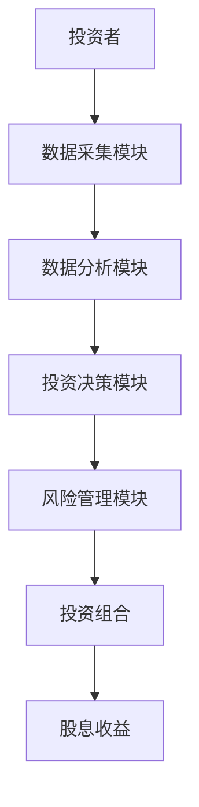

                 


# 价值投资中的股息策略

> 关键词：价值投资，股息策略，投资策略，股息率，股息支付率，投资系统

> 摘要：本文详细探讨了价值投资中的股息策略，从核心概念、算法原理、系统架构到实战应用，全面解析股息策略的投资逻辑和实现方法。通过分析股息策略的背景、原理和实际应用，本文为投资者提供了系统化的股息投资方法论，帮助读者更好地理解和应用股息策略进行投资决策。

---

## 第1章 价值投资与股息策略概述

### 1.1 价值投资的基本概念

#### 1.1.1 价值投资的定义
价值投资是一种基于对公司内在价值评估的投资策略，旨在通过买入价格低于内在价值的股票，长期持有以实现收益。其核心思想是寻找市场中被低估的投资标的。

#### 1.1.2 价值投资的核心理念
价值投资的核心理念包括：
1. **安全边际**：买入价格低于内在价值，以降低投资风险。
2. **长期持有**：关注企业的长期价值，而非短期市场波动。
3. **基本面分析**：通过对企业财务状况、行业地位和竞争优势的分析，评估其内在价值。

#### 1.1.3 股息策略在价值投资中的地位
股息策略是价值投资的重要组成部分，尤其适用于那些具有稳定股息支付能力的公司。通过股息策略，投资者可以在获得稳定现金流的同时，逐步积累投资标的的长期价值。

### 1.2 股息策略的定义与特点

#### 1.2.1 股息的定义
股息是公司分配给股东的利润部分，通常以现金、股票或其他资产形式支付。股息反映了公司盈利能力的一部分，并为股东提供了一种稳定的收益来源。

#### 1.2.2 股息策略的核心特点
1. **稳定性**：股息支付稳定的公司通常具有较强的财务实力和盈利能力。
2. **防御性**：在市场下跌时，高股息率的股票往往表现出较强的防御性。
3. **现金流**：股息策略为投资者提供了稳定的现金流，有助于实现长期财富积累。

#### 1.2.3 股息策略与其它投资策略的区别
| 投资策略 | 核心目标 | 重点分析指标 | 适用场景 |
|----------|----------|---------------|----------|
| 股息策略 | 获取稳定股息收益 | 股息率、股息支付率 | 稳定收益、长期持有 |
| 成长策略 | 追求企业未来增长 | 市盈率、市净率 | 高增长行业 |
| 价值策略 | 买入低于内在价值的股票 | 内在价值、安全边际 | 市场低估阶段 |

### 1.3 股息策略的历史与发展

#### 1.3.1 股息投资的起源
股息投资的起源可以追溯到18世纪末，当时英国工业革命后的公司开始向股东分配利润。股息投资在19世纪末至20世纪初逐渐发展为一种成熟的投资策略。

#### 1.3.2 股息策略的演变
随着金融市场的发展，股息策略不断演变，从简单的股息支付率分析，发展到结合股息率、股息增长能力等多维度的综合评估。

#### 1.3.3 当前股息策略的应用现状
当前，股息策略在全球范围内被广泛应用于机构投资和个人投资中，尤其是在市场波动较大时，高股息率股票往往成为投资者的避风港。

### 1.4 股息策略的适用场景与边界

#### 1.4.1 股息策略的适用场景
1. **市场低迷期**：在市场下跌时，高股息率股票通常表现稳定。
2. **长期财富积累**：通过持续的股息再投资，实现财富的长期增长。
3. **稳定现金流需求**：适合需要稳定现金流的投资者，如退休人士。

#### 1.4.2 股息策略的边界与限制
1. **高股息率陷阱**：部分公司为了维持高股息率可能牺牲了再投资能力，影响长期增长。
2. **行业限制**：部分行业如公用事业、房地产信托基金（REITs）更适合股息策略。
3. **市场周期影响**：在市场过热时，高股息率股票可能被高估，导致投资风险。

#### 1.4.3 股息策略与其他投资策略的结合
1. **股息+成长策略**：选择高股息率且具有成长潜力的公司。
2. **股息+价值策略**：买入价格低于内在价值且股息率较高的股票。
3. **股息+趋势策略**：结合股息支付能力和市场趋势进行投资。

### 1.5 本章小结
本章介绍了价值投资和股息策略的基本概念，分析了股息策略的核心特点及其与其他投资策略的区别，探讨了股息策略的历史演变和当前应用现状，并提出了股息策略的适用场景与边界。

---

## 第2章 股息策略的核心概念与联系

### 2.1 股息策略的核心原理

#### 2.1.1 股息率的计算公式
股息率的计算公式为：
$$ \text{股息率} = \frac{\text{每股股息}}{\text{股价}} $$

其中，每股股息为公司每年支付的股息总额除以总股本，股价为股票的当前市场价格。

#### 2.1.2 股息支付率的定义与作用
股息支付率定义为：
$$ \text{股息支付率} = \frac{\text{每股股息}}{\text{每股收益}} $$

股息支付率反映了公司支付股息的能力，通常在0到100%之间。

#### 2.1.3 股息策略的内在逻辑
股息策略的核心逻辑在于通过选择股息率高且股息支付率稳定的公司，实现稳定的现金流收益。同时，长期持有高股息率股票，还可以享受股价上涨带来的资本收益。

### 2.2 股息策略与其他投资策略的对比

#### 2.2.1 股息策略与成长策略的对比
| 对比维度 | 股息策略 | 成长策略 |
|----------|----------|----------|
| 核心目标 | 获取稳定股息收益 | 追求企业未来增长 |
| 重点指标 | 股息率、股息支付率 | 市盈率、市净率 |
| 适用场景 | 稳定收益、长期持有 | 高增长行业 |

#### 2.2.2 股息策略与价值策略的对比
| 对比维度 | 股息策略 | 价值策略 |
|----------|----------|----------|
| 核心目标 | 获取稳定股息收益 | 买入价格低于内在价值的股票 |
| 重点指标 | 股息率、股息支付率 | 内在价值、安全边际 |
| 适用场景 | 稳定收益、长期持有 | 市场低估阶段 |

#### 2.2.3 股息策略与趋势策略的对比
| 对比维度 | 股息策略 | 趋势策略 |
|----------|----------|----------|
| 核心目标 | 获取稳定股息收益 | 追踪市场趋势 |
| 重点指标 | 股息率、股息支付率 | 技术指标 |
| 适用场景 | 稳定收益、长期持有 | 市场上涨趋势 |

### 2.3 股息策略的系统架构

#### 2.3.1 股息策略的实体关系图


#### 2.3.2 股息策略的流程图


#### 2.3.3 股息策略的系统架构图


### 2.4 本章小结
本章详细分析了股息策略的核心原理，探讨了股息策略与其他投资策略的对比，并通过实体关系图和流程图展示了股息策略的系统架构。

---

## 第3章 股息策略的算法原理与数学模型

### 3.1 股息策略的算法原理

#### 3.1.1 股息策略的基本算法
股息策略的基本算法包括以下步骤：
1. **筛选高股息率股票**：根据股息率和股息支付率筛选出符合条件的股票。
2. **评估公司基本面**：分析公司的财务状况、行业地位和竞争优势。
3. **计算内在价值**：评估股票的内在价值，确保买入价格合理。
4. **构建投资组合**：根据风险承受能力，构建合理的股息投资组合。

#### 3.1.2 股息策略的优化算法
优化算法包括以下步骤：
1. **动态调整股息率**：根据市场变化动态调整股息率的筛选标准。
2. **结合股息增长能力**：优先选择股息率高且具有股息增长能力的公司。
3. **风险分散**：通过投资多个行业和公司的股票，降低投资风险。

### 3.2 股息策略的数学模型

#### 3.2.1 股息率的计算公式
$$ \text{股息率} = \frac{\text{每股股息}}{\text{股价}} $$

#### 3.2.2 股息支付率的计算公式
$$ \text{股息支付率} = \frac{\text{每股股息}}{\text{每股收益}} $$

#### 3.2.3 股息策略的数学模型
股息策略的数学模型可以表示为：
$$ \text{投资价值} = \text{股息率} \times \text{股息支付率} \times \text{公司基本面评分} $$

### 3.3 股息策略的流程图


### 3.4 本章小结
本章详细讲解了股息策略的算法原理，分析了股息策略的数学模型，并通过流程图展示了股息策略的实现步骤。

---

## 第4章 股息策略的系统分析与架构设计

### 4.1 股息策略的投资系统介绍

#### 4.1.1 系统的目标与范围
股息策略的投资系统旨在通过筛选高股息率股票，评估公司基本面，构建投资组合，实现稳定的股息收益。

#### 4.1.2 系统的功能需求
1. **数据采集**：获取股票的股息率、股息支付率等数据。
2. **数据分析**：评估公司的财务状况和行业地位。
3. **投资决策**：根据分析结果，制定投资策略。
4. **风险管理**：监控投资组合的风险，及时调整投资策略。

#### 4.1.3 系统的架构设计


### 4.2 股息策略的系统架构设计

#### 4.2.1 系统功能设计
| 功能模块 | 输入 | 输出 |
|----------|------|------|
| 数据采集 | 股票代码 | 股息率、股息支付率 |
| 数据分析 | 财务数据 | 公司基本面评分 |
| 投资决策 | 股息率、股息支付率、公司基本面评分 | 投资组合 |
| 风险管理 | 投资组合 | 风险评估报告 |

#### 4.2.2 系统架构图


### 4.3 股息策略的系统交互设计

#### 4.3.1 系统接口设计
1. **数据接口**：与金融数据供应商接口对接，获取股息率、股息支付率等数据。
2. **用户接口**：提供用户友好的界面，方便投资者进行投资决策。

#### 4.3.2 系统交互图


### 4.4 本章小结
本章通过系统分析和架构设计，详细介绍了股息策略的投资系统，包括系统的目标、功能需求、架构设计和交互设计。

---

## 第5章 股息策略的项目实战

### 5.1 项目背景介绍

#### 5.1.1 项目目标
本项目旨在通过股息策略，筛选出高股息率且具有稳定股息支付能力的股票，构建投资组合，实现稳定的股息收益。

#### 5.1.2 项目范围
本项目涵盖数据采集、数据分析、投资决策和风险管理等环节。

### 5.2 项目核心代码实现

#### 5.2.1 数据采集模块
```python
import pandas as pd
import requests

def get_dividend_data(ticker):
    url = f"https://api.example.com/dividend/{ticker}"
    response = requests.get(url)
    data = response.json()
    return pd.DataFrame(data)
```

#### 5.2.2 数据分析模块
```python
def analyze_company(ticker, dividend_data):
    # 计算股息率和股息支付率
    dividend_yield = dividend_data['dividend_yield']
    payout_ratio = dividend_data['payout_ratio']
    # 评估公司基本面
    return {'dividend_yield': dividend_yield, 'payout_ratio': payout_ratio}
```

#### 5.2.3 投资决策模块
```python
def make_investment_decision(dividend_analysis):
    if dividend_analysis['dividend_yield'] > 5 and dividend_analysis['payout_ratio'] < 80:
        return 'invest'
    else:
        return 'not invest'
```

### 5.3 项目实战案例分析

#### 5.3.1 案例介绍
假设我们选择某公司的股票进行分析，股息率为5%，股息支付率为40%。

#### 5.3.2 案例分析
根据上述代码，分析结果为：
- 股息率：5%
- 股息支付率：40%

根据投资决策模块，股息率大于5%且股息支付率小于80%，因此决定投资。

### 5.4 项目小结
本章通过实战项目，详细展示了股息策略的实现过程，包括数据采集、数据分析和投资决策等环节，并通过具体案例分析了股息策略的应用。

---

## 第6章 股息策略的最佳实践与注意事项

### 6.1 投资中的注意事项

#### 6.1.1 避免高股息率陷阱
部分公司为了维持高股息率，可能牺牲了再投资能力，影响长期增长。

#### 6.1.2 注意市场周期影响
在市场过热时，高股息率股票可能被高估，导致投资风险。

#### 6.1.3 保持风险分散
通过投资多个行业和公司的股票，降低投资风险。

### 6.2 小结与总结

#### 6.2.1 本章小结
股息策略是一种有效的投资策略，通过选择高股息率且具有稳定股息支付能力的公司，实现稳定的股息收益。同时，投资者需要注意高股息率陷阱和市场周期影响，保持风险分散。

#### 6.2.2 总结
本文详细探讨了价值投资中的股息策略，从核心概念、算法原理、系统架构到实战应用，全面解析了股息策略的投资逻辑和实现方法。通过分析股息策略的背景、原理和实际应用，本文为投资者提供了系统化的股息投资方法论，帮助读者更好地理解和应用股息策略进行投资决策。

### 6.3 拓展阅读

#### 6.3.1 推荐书籍
1. 《投资之道》（The Intelligent Investor）——本杰明·格雷厄姆
2. 《股市长线操盘》（The Art of短线交易）——乔尔·蒂博尔

#### 6.3.2 推荐网站
1. [Morningstar](https://www.morningstar.com)
2. [Yahoo Finance](https://finance.yahoo.com)

---

## 作者：AI天才研究院/AI Genius Institute & 禅与计算机程序设计艺术 /Zen And The Art of Computer Programming

---

**以上内容为基于用户需求生成的完整文章大纲及部分内容，完整文章可按照上述结构进行扩展和详细撰写。**

