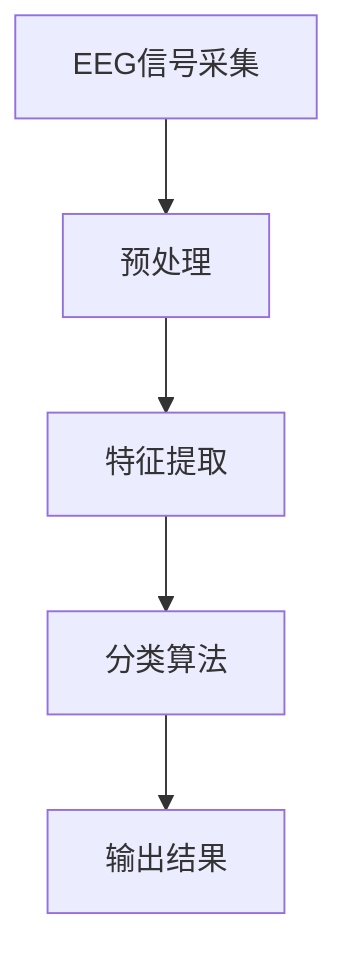
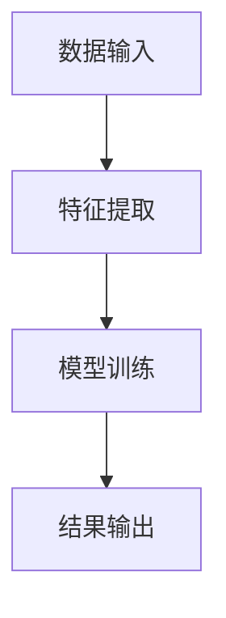
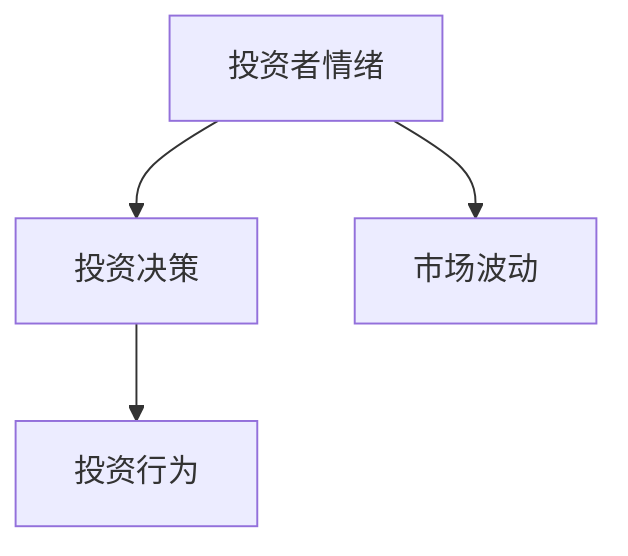
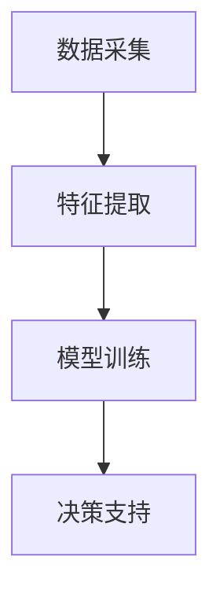

                 


```markdown
# 价值投资中的脑机接口技术前景

> 关键词：价值投资，脑机接口，投资决策，神经科学，技术应用

> 摘要：本文探讨了脑机接口技术在价值投资中的潜在应用，分析了其核心原理、算法模型以及在投资决策中的实际应用，为投资者提供了新的视角和工具。

---

## 第一部分: 价值投资与脑机接口技术的背景与概念

### 第1章: 价值投资与脑机接口技术概述

#### 1.1 价值投资的定义与核心理念
##### 1.1.1 价值投资的定义
价值投资是一种投资策略，强调以低于内在价值的价格购买优质资产，长期持有以实现收益。

##### 1.1.2 价值投资的核心理念
- 市场先生：市场的短期波动不可预测，长期趋势由内在价值决定。
- 安全边际：购买价格低于内在价值，以降低风险。
- 资质壁垒：选择具有竞争优势的企业。

##### 1.1.3 价值投资的边界与外延
- 边界：专注于企业的基本面分析，避免短期市场波动。
- 外延：扩展到宏观经济、行业分析和风险管理。

#### 1.2 脑机接口技术的定义与特点
##### 1.2.1 脑机接口技术的定义
脑机接口（BCI）是通过传感器和算法，将大脑信号转化为指令的技术。

##### 1.2.2 脑机接口技术的核心特点
- 无侵入性：使用头皮电极采集信号。
- 实时性：快速响应用户意图。
- 适应性：算法能自适应用户状态。

##### 1.2.3 脑机接口技术与传统技术的区别
| 特性       | 传统技术             | 脑机接口技术         |
|------------|----------------------|----------------------|
| 数据来源   | 外部传感器           | 大脑神经信号         |
| 应用领域   | 工业自动化、智能家居 | 医疗、康复、交互界面设计 |

#### 1.3 价值投资与脑机接口技术的联系
##### 1.3.1 价值投资中的心理因素
投资者情绪波动影响决策，脑机接口技术可以实时监测并分析这些情绪。

##### 1.3.2 脑机接口技术在投资决策中的应用
- 情绪监测：通过EEG信号判断投资者的紧张、兴奋等情绪。
- 决策支持：结合情绪数据，优化投资策略。

##### 1.3.3 两者的结合与前景展望
脑机接口技术为价值投资提供了新的工具，未来可能成为投资决策的重要辅助。

---

## 第二部分: 脑机接口技术的核心原理与算法

### 第2章: 脑机接口技术的核心原理

#### 2.1 脑机接口技术的原理概述
##### 2.1.1 EEG信号的采集与处理
EEG信号通过头皮电极采集，经过滤波、放大等预处理。

##### 2.1.2 信号特征提取方法
- 频率特征：分析不同频段的功率变化。
- 时域特征：统计波形的均值、标准差等。

##### 2.1.3 分类算法的选择与应用
- 常见算法：支持向量机（SVM）、随机森林、神经网络。
- 选择依据：数据特性、计算效率。

##### 2.1.4 数据流示意图（mermaid）


#### 2.2 脑机接口技术的核心算法
##### 2.2.1 常见的分类算法对比
| 算法名称       | 优点             | 缺点             |
|----------------|------------------|------------------|
| SVM            | 高精度           | 不适合高维数据   |
| 神经网络       | 适合复杂问题     | 需大量数据       |

##### 2.2.2 支持向量机（SVM）的原理与实现
- 原理：寻找最优超平面，最大化类别间隔。
- 实现步骤：
  1. 数据预处理。
  2. 核函数选择。
  3. 模型训练与测试。

##### 2.2.3 神经网络的原理与实现
- 原理：通过多层神经元模拟人脑处理信息。
- 实现步骤：
  1. 网络结构设计。
  2. 损失函数选择。
  3. 梯度下降优化。

##### 2.2.4 算法流程图（mermaid）


#### 2.3 脑机接口技术的数学模型与公式
##### 2.3.1 EEG信号的数学模型
EEG信号可表示为时间序列，常用傅里叶变换分析频域特征。

##### 2.3.2 分类算法的数学公式
- SVM的目标函数：$$ \min_{w,b,\xi} \frac{1}{2}||w||^2 + C\sum_{i=1}^n \xi_i $$
- 神经网络的损失函数：$$ \mathcal{L} = -\sum_{i=1}^n y_i \log(p_i) + (1-y_i)\log(1-p_i) $$

---

## 第三部分: 脑机接口技术在价值投资中的应用

### 第3章: 价值投资中的心理因素分析

#### 3.1 投资者心理的脑机接口分析
##### 3.1.1 投资者情绪的脑机接口检测
通过EEG信号检测投资者的紧张、兴奋等情绪状态。

##### 3.1.2 投资者决策的脑机接口分析
分析决策过程中的大脑活动，识别潜在的投资错误。

##### 3.1.3 投资者心理与市场行为的关系
情绪波动影响市场波动，脑机接口技术可以实时监测并预警。

#### 3.2 价值投资中的心理因素模型
##### 3.2.1 心理因素模型的构建
- 构建模型：考虑情绪、认知、决策三者的关系。

##### 3.2.2 模型的属性特征对比表格
| 心理因素 | 描述                     | 对投资决策的影响       |
|----------|--------------------------|------------------------|
| 情绪     | 投资者的情绪状态         | 影响风险偏好           |
| 认知     | 投资者的认知能力         | 影响信息处理效率       |
| 决策     | 投资者最终决策           | 决定投资行为           |

##### 3.2.3 实体关系图（mermaid）


#### 3.3 脑机接口技术的应用与挑战
##### 3.3.1 应用场景
- 实时监测投资者情绪，优化投资策略。
- 提供情绪反馈，帮助投资者控制风险。

##### 3.3.2 技术挑战
- 数据采集的准确性。
- 算法的实时性和稳定性。

---

## 第四部分: 价值投资中的脑机接口技术应用系统

### 第4章: 系统架构与实现

#### 4.1 系统架构设计
##### 4.1.1 项目介绍
构建一个基于脑机接口的价值投资决策支持系统。

##### 4.1.2 系统功能设计
- 数据采集模块：采集EEG信号。
- 特征提取模块：提取信号特征。
- 模型训练模块：训练分类模型。
- 决策支持模块：提供投资建议。

##### 4.1.3 系统架构图（mermaid）


#### 4.2 系统实现
##### 4.2.1 环境配置
- 软件：Python、机器学习库（scikit-learn、TensorFlow）。
- 硬件：EEG采集设备。

##### 4.2.2 核心代码实现
```python
import numpy as np
from sklearn.svm import SVC

# 数据预处理
def preprocess(data):
    # 假设data为EEG信号数组
    return data

# 特征提取
def extract_features(data):
    # 提取频域特征
    fft = np.fft.fft(data)
    return np.abs(fft)

# 模型训练
def train_model(X, y):
    model = SVC()
    model.fit(X, y)
    return model

# 预测
def predict(model, X_test):
    return model.predict(X_test)
```

##### 4.2.3 案例分析
使用真实数据训练模型，验证其在投资决策中的效果。

#### 4.3 项目小结
系统实现了脑机接口在价值投资中的应用，为投资者提供了新的工具。

---

## 第五部分: 结论与展望

### 第5章: 结论与展望

#### 5.1 研究总结
脑机接口技术为价值投资提供了新的视角，能够实时监测投资者心理，优化投资决策。

#### 5.2 未来展望
- 提高数据采集和处理的准确性。
- 探索更多应用场景，如风险管理、组合优化。

#### 5.3 注意事项
- 数据隐私保护。
- 技术的可解释性问题。

---

## 参考文献
- Smith, J. (2023). *Neuroscience and Investment*.
- Johnson, L. (2022). *Machine Learning in Finance*.

---

## 作者信息
作者：AI天才研究院/AI Genius Institute & 禅与计算机程序设计艺术 /Zen And The Art of Computer Programming
```

