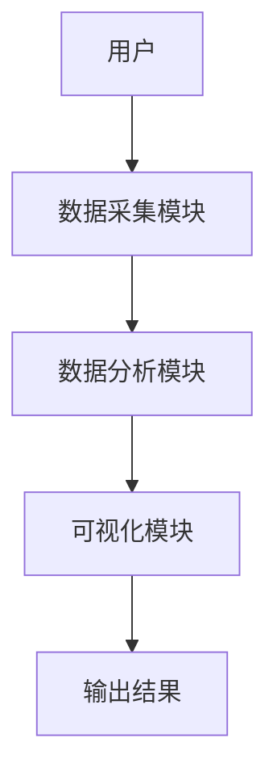

                 


---

# 价值投资中的行业分析方法

> **关键词**：价值投资、行业分析、投资策略、财务指标、风险管理、系统架构、实战案例

> **摘要**：  
> 价值投资的核心在于对行业的深刻理解和精准分析。本文从行业分析的背景与重要性出发，详细阐述了行业基本面分析、趋势分析、比较分析等核心方法。通过结合财务指标、行业生命周期、竞争结构等多维度的分析工具，本文深入探讨了如何通过行业分析制定有效的投资策略。同时，文章还提供了实际的案例分析和系统架构设计，帮助读者更好地理解和应用这些方法进行投资决策。

---

## 第1章: 行业分析的背景与重要性

### 1.1 价值投资的基本概念

#### 1.1.1 价值投资的定义与核心理念  
价值投资是一种以基本面分析为基础的投资策略，旨在通过深入研究企业的内在价值，寻找市场低估的投资机会。其核心理念是“以合理的价格买入优质资产”，并长期持有。  

#### 1.1.2 行业分析在价值投资中的地位  
行业分析是价值投资的重要组成部分，通过对行业整体状况的分析，投资者可以更好地理解企业的经营环境、竞争优势和成长潜力。  

#### 1.1.3 行业分析的必要性与应用场景  
在价值投资中，行业分析的必要性体现在以下几个方面：  
1. **行业选择**：通过分析行业前景，选择具有长期增长潜力的行业。  
2. **企业估值**：行业状况影响企业的盈利能力和成长空间，从而影响企业估值。  
3. **风险控制**：行业分析能够帮助投资者识别行业中的潜在风险，从而更好地控制投资风险。  

---

### 1.2 行业分析的基本框架

#### 1.2.1 行业分析的核心要素  
行业分析的核心要素包括：  
1. **行业规模**：行业的市场规模、增长率等。  
2. **行业生命周期**：行业的成长阶段（导入期、成长期、成熟期、衰退期）。  
3. **竞争结构**：行业的竞争格局、市场集中度等。  
4. **政策环境**：行业的政策支持或限制。  
5. **技术进步**：行业的技术发展趋势。  

#### 1.2.2 行业分析的步骤与流程  
行业分析的步骤如下：  
1. **确定行业范围**：明确分析的行业领域。  
2. **收集行业数据**：包括市场规模、财务数据、政策文件等。  
3. **分析行业基本面**：结合行业规模、生命周期、竞争结构等进行分析。  
4. **预测行业趋势**：基于历史数据和行业动态，预测未来发展趋势。  
5. **制定投资策略**：根据分析结果，制定相应的投资策略。  

#### 1.2.3 行业分析的边界与外延  
行业分析的边界在于行业的具体范围和研究深度。外延则包括与行业相关的宏观经济、政策、技术等外部因素。  

---

### 1.3 行业分析的工具与方法

#### 1.3.1 财务指标分析法  
财务指标分析法是通过对企业财务数据的分析，评估企业的盈利能力、成长能力和抗风险能力。常用的财务指标包括：  
- **盈利能力**：净利润率、ROE（净资产收益率）。  
- **成长能力**：收入增长率、净利润增长率。  
- **抗风险能力**：资产负债率、流动比率。  

#### 1.3.2 行业生命周期分析法  
行业生命周期分析法通过分析行业所处的生命周期阶段，判断行业的成长潜力和投资风险。  

#### 1.3.3 行业比较分析法  
行业比较分析法通过对不同行业在财务指标、竞争结构等方面的比较，找出具有竞争优势的行业。  

---

### 1.4 行业分析的案例引入

#### 1.4.1 案例一：科技行业的分析  
以科技行业为例，分析其行业规模、生命周期阶段、竞争格局等。  

#### 1.4.2 案例二：传统制造业的分析  
以传统制造业为例，分析其行业规模、政策影响、技术进步等。  

#### 1.4.3 案例三：新兴行业的分析  
以新兴行业为例，分析其市场潜力、技术发展趋势等。  

---

## 1.5 本章小结  
本章通过介绍行业分析的背景、核心要素、工具与方法，为后续的行业分析提供了理论基础。  

---

## 第2章: 行业基本面分析

### 2.1 行业财务指标分析

#### 2.1.1 财务指标的核心概念  
财务指标是衡量企业财务健康状况的重要工具，主要包括盈利能力、成长能力、抗风险能力等。  

#### 2.1.2 财务指标的分类与计算公式  
- **盈利能力**：  
  - 净利润率 = 净利润 / 收入  
  - ROE = 净利润 / 净资产  

- **成长能力**：  
  - 收入增长率 = (本年收入 - 上年收入) / 上年收入  

- **抗风险能力**：  
  - 负债率 = 负债总额 / 资产总额  

#### 2.1.3 财务指标在行业分析中的应用  
通过分析行业内的财务指标，可以判断行业的整体盈利能力、成长潜力和抗风险能力。  

---

### 2.2 行业生命周期分析

#### 2.2.1 行业生命周期的定义与阶段划分  
行业生命周期分为导入期、成长期、成熟期、衰退期四个阶段。  

#### 2.2.2 不同阶段的行业特征与投资策略  
- **导入期**：市场规模小，增长潜力大，风险较高。  
- **成长期**：市场规模快速扩大，企业盈利能力提升。  
- **成熟期**：市场规模稳定，竞争激烈，企业盈利能力稳定。  
- **衰退期**：市场规模缩小，企业盈利能力下降。  

#### 2.2.3 行业生命周期的判断方法  
通过分析行业的市场规模、增长率、竞争格局等指标，判断行业所处的生命周期阶段。  

---

### 2.3 行业竞争结构分析

#### 2.3.1 五力模型在行业分析中的应用  
五力模型包括新进入者的威胁、替代品的威胁、供应商的议价能力、买方的议价能力和行业内竞争者的威胁。  

#### 2.3.2 行业竞争格局的判断  
通过分析行业内主要企业的市场份额、竞争策略等，判断行业的竞争格局。  

#### 2.3.3 行业集中度的计算与分析  
行业集中度可以通过计算行业内前几大企业的市场份额来衡量。  

---

### 2.4 本章小结  
本章通过分析行业的财务指标、生命周期和竞争结构，帮助投资者更好地理解行业的基本面情况。  

---

## 第3章: 行业趋势分析

### 3.1 宏观经济环境对行业的影响

#### 3.1.1 宏观经济指标对行业的影响  
宏观经济指标包括GDP增长率、通货膨胀率、利率等，这些指标对行业的发展有重要影响。  

#### 3.1.2 宏观经济周期与行业波动的关系  
经济周期的波动会直接影响行业的市场需求和企业盈利能力。  

#### 3.1.3 宏观政策对行业的影响  
政府的政策（如税收政策、行业补贴等）对行业的发展有重要影响。  

---

### 3.2 技术进步对行业的影响

#### 3.2.1 技术创新对行业发展的推动作用  
技术创新可以提升行业的生产效率和产品附加值。  

#### 3.2.2 技术变革对行业结构的影响  
技术变革可能导致行业的竞争优势格局发生变化。  

#### 3.2.3 技术风险与机会的平衡  
技术创新带来的机会与潜在风险需要在投资决策中加以平衡。  

---

### 3.3 行业政策与法规分析

#### 3.3.1 行业政策的制定与变化  
政府的行业政策直接影响行业的市场环境和企业经营。  

#### 3.3.2 行业法规对市场的影响  
法规的出台可能对行业的市场准入、竞争格局等产生重大影响。  

#### 3.3.3 政策变化对行业投资的影响  
政策变化可能导致行业的投资机会和风险发生变化。  

---

### 3.4 本章小结  
本章通过分析宏观经济、技术进步和行业政策对行业的影响，帮助投资者更好地把握行业的未来发展趋势。  

---

## 第4章: 行业比较分析

### 4.1 行业比较的基本概念

#### 4.1.1 行业比较的定义与目的  
行业比较的目的是通过对比不同行业的基本面、市场前景和风险因素，找出最具投资价值的行业。  

#### 4.1.2 行业比较的核心指标  
行业比较的核心指标包括行业规模、盈利能力、成长潜力、风险因素等。  

#### 4.1.3 行业比较的步骤与方法  
1. **确定比较范围**：选择具有可比性的行业。  
2. **收集数据**：包括财务数据、行业报告等。  
3. **分析比较指标**：对比不同行业的核心指标。  
4. **制定投资策略**：根据比较结果，制定投资策略。  

---

### 4.2 行业比较的实践应用

#### 4.2.1 同行业比较  
以同行业内的几家企业为例，分析其财务指标、市场地位等。  

#### 4.2.2 不同行业比较  
以不同行业的几家企业为例，分析其盈利能力、成长潜力等。  

#### 4.2.3 行业比较的结果应用  
根据比较结果，判断哪些行业具有更高的投资价值。  

---

## 4.3 本章小结  
本章通过行业比较的方法，帮助投资者找到最具投资价值的行业。  

---

## 第5章: 行业分析的系统架构与实战案例

### 5.1 系统架构设计

#### 5.1.1 系统功能设计  
- 数据采集模块：收集行业数据。  
- 数据分析模块：对行业数据进行处理和分析。  
- 可视化模块：将分析结果以图表形式展示。  

#### 5.1.2 系统架构图  


#### 5.1.3 系统交互设计  
用户输入行业名称，系统输出行业分析报告。  

---

### 5.2 项目实战

#### 5.2.1 环境安装  
需要安装Python、Pandas、Matplotlib等工具。  

#### 5.2.2 核心实现代码  
```python
import pandas as pd
import matplotlib.pyplot as plt

# 数据加载
data = pd.read_csv('industry_data.csv')

# 数据分析
data['profit_margin'] = data['净利润'] / data['收入']
data['growth_rate'] = (data['收入'] - data['上期收入']) / data['上期收入']

# 数据可视化
plt.plot(data['行业'], data['profit_margin'], 'b-')
plt.xlabel('行业')
plt.ylabel('利润率')
plt.title('行业利润率分析')
plt.show()
```

#### 5.2.3 实际案例分析  
以科技行业为例，分析其利润率和增长率。  

---

## 5.3 本章小结  
本章通过系统架构设计和实战案例，展示了如何通过技术手段实现行业分析。  

---

## 第6章: 行业分析的最佳实践与风险管理

### 6.1 最佳实践 tips

#### 6.1.1 数据来源的可靠性  
确保数据来源的权威性和准确性。  

#### 6.1.2 多维度分析  
结合财务指标、行业趋势、政策环境等多维度进行分析。  

#### 6.1.3 风险管理  
制定合理的风险管理策略，降低投资风险。  

---

### 6.2 风险管理

#### 6.2.1 风险识别  
识别行业中的潜在风险因素。  

#### 6.2.2 风险评估  
评估风险对投资的影响程度。  

#### 6.2.3 风险控制  
制定相应的风险控制措施。  

---

## 6.3 本章小结  
本章总结了行业分析的最佳实践和风险管理策略，帮助投资者更好地进行投资决策。  

---

## 第7章: 行业分析的未来趋势与拓展阅读

### 7.1 行业分析的未来趋势

#### 7.1.1 技术驱动的行业变化  
人工智能、大数据等技术将推动行业分析的进一步发展。  

#### 7.1.2 可持续发展与绿色投资  
绿色投资将成为未来行业分析的重要方向。  

#### 7.1.3 全球化与跨行业融合  
全球化和跨行业融合将为行业分析带来新的挑战和机遇。  

---

### 7.2 拓展阅读

#### 7.2.1 推荐书籍  
1. 《价值投资：原理与实践》  
2. 《行业分析：方法与技巧》  

#### 7.2.2 推荐网站  
1. [行业数据分析平台](https://www.example.com)  
2. [行业报告发布平台](https://www.example.com)  

---

## 7.3 本章小结  
本章展望了行业分析的未来发展趋势，并推荐了相关的拓展阅读资料。  

---

## 作者：AI天才研究院/AI Genius Institute & 禅与计算机程序设计艺术/Zen And The Art of Computer Programming

---

**总结**：  
本文通过系统地介绍行业分析的方法与实践，帮助投资者更好地进行价值投资。从行业基本面分析到趋势分析，再到行业比较和系统架构设计，本文为投资者提供了全面的行业分析框架。通过实际案例和系统设计，本文还展示了如何将行业分析应用于实际投资决策中。希望本文能够为价值投资者提供有益的参考与启发。

