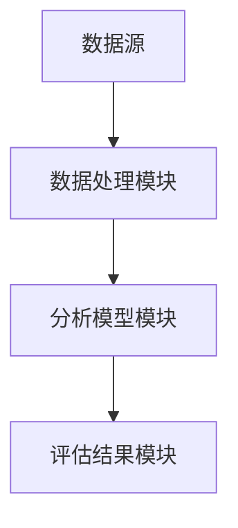

                 

# 价值投资中的行业壁垒评估

## 关键词：价值投资、行业壁垒、竞争优势、市场分析、投资策略

## 摘要：  
本文详细探讨了在价值投资中如何评估行业壁垒，分析了不同类型行业壁垒对企业竞争优势的影响，并提供了系统的评估方法和实战案例。通过数学模型、系统架构和实际项目分析，帮助投资者识别具备强大壁垒的企业，制定有效的投资策略。

---

## 第一部分: 价值投资与行业壁垒概述

### 第1章: 价值投资与行业壁垒的基本概念

#### 1.1 价值投资的定义与核心理念
- 1.1.1 价值投资的定义：价值投资是一种长期投资策略，强调以低于内在价值的价格买入优质资产。
- 1.1.2 价值投资的核心理念：寻找具有持续竞争优势、良好治理和合理估值的企业。
- 1.1.3 价值投资与成长投资的区别：价值投资关注低估资产，而成长投资关注高增长企业。

#### 1.2 行业壁垒的定义与分类
- 1.2.1 行业壁垒的定义：行业内存在的限制新竞争者进入的因素，包括技术、政策、资源等。
- 1.2.2 行业壁垒的主要分类：技术壁垒、政策壁垒、资源壁垒、品牌壁垒、资金壁垒。
- 1.2.3 行业壁垒对企业价值的影响：高壁垒行业具有更强的竞争优势和防御性。

#### 1.3 价值投资中行业壁垒的重要性
- 1.3.1 行业壁垒在价值投资中的作用：筛选出具备长期竞争优势的企业。
- 1.3.2 行业壁垒与企业竞争优势的关系：高壁垒行业企业更难被竞争对手取代。
- 1.3.3 行业壁垒与投资决策的关联：高壁垒行业更适合长期投资。

---

## 第二部分: 行业壁垒评估的核心维度

### 第2章: 市场进入壁垒

#### 2.1 市场进入壁垒的定义与类型
- 2.1.1 市场进入壁垒的定义：阻止或限制新竞争者进入市场的因素。
- 2.1.2 技术壁垒：高技术门槛限制新进入者。
- 2.1.3 政策壁垒：政府法规和许可限制市场准入。
- 2.1.4 资金壁垒：高初始投资需求限制进入。
- 2.1.5 品牌壁垒：知名品牌忠诚度和认知度高。

#### 2.2 市场进入壁垒对企业竞争优势的影响
- 2.2.1 技术壁垒对企业竞争力的影响：技术领先企业难以被替代。
- 2.2.2 政策壁垒对企业市场准入的影响：受政府保护的行业更具稳定性。
- 2.2.3 资金壁垒对企业扩张的限制：高投资需求限制了新进入者的数量。
- 2.2.4 品牌壁垒对企业市场份额的保障：知名品牌具有更强的客户忠诚度。

---

## 第三部分: 行业壁垒评估的数学模型与方法

### 第3章: 行业壁垒评估的数学模型

#### 3.1 市场集中度分析
- 3.1.1 市场集中度的定义：行业市场占有率的集中程度。
- 3.1.2 市场集中度的计算公式：
  $$CR_n = \sum_{i=1}^{n} s_i$$
  其中，$s_i$ 是第i个企业的市场份额，n是选取的企业数量。

#### 3.2 行业进入障碍分析
- 3.2.1 技术壁垒的衡量方法：专利数量、研发投入占比。
- 3.2.2 市场进入障碍的综合评估：结合市场集中度和新进入者的难度。

---

## 第四部分: 行业壁垒评估的系统分析与架构

### 第4章: 行业壁垒评估的系统架构

#### 4.1 系统功能设计
- 数据收集模块：收集行业数据，包括市场份额、专利数量等。
- 分析模型模块：应用数学模型进行分析，如CRn计算。
- 评估标准模块：设定评估标准，如高市场集中度和高技术壁垒。

#### 4.2 系统架构设计

---

## 第五部分: 项目实战

### 第5章: 项目实战：行业壁垒评估案例

#### 5.1 项目背景与目标
- 分析科技行业，评估行业壁垒，寻找具备竞争优势的企业。

#### 5.2 数据收集与处理
- 数据来源：行业报告、企业财报。
- 数据清洗：处理缺失值和异常值。

#### 5.3 分析与评估
- 计算CRn：假设前五家企业市场份额分别为30%、25%、20%、15%、10%。
  $$CR_5 = 30\% + 25\% + 20\% + 15\% + 10\% = 100\%$$

#### 5.4 结论与建议
- 科技行业市场集中度高，技术壁垒强，适合长期投资。

---

## 结论与建议

### 第6章: 结论与投资策略建议

#### 6.1 行业壁垒评估的重要性
- 行业壁垒是价值投资中的关键因素，高壁垒行业更具投资价值。

#### 6.2 投资策略建议
- 选择市场集中度高、技术壁垒强的行业。
- 结合财务指标和管理层能力，综合评估企业价值。

#### 6.3 未来研究方向
- 进一步研究新兴行业的壁垒变化。
- 开发更复杂的评估模型，结合AI技术进行分析。

---

## 附录

### 附录A: 术语表
- 术语：市场集中度（CRn）
- 定义：前n家企业的市场份额之和。

### 附录B: 数据来源
- 数据来源：行业报告、企业财报、专利数据库。

### 附录C: 工具推荐
- 工具：Excel、Python、行业数据分析平台。

---

## 作者：AI天才研究院 & 禅与计算机程序设计艺术

---

通过以上目录和内容，我将逐步撰写完整的文章，确保每个部分详细展开，逻辑清晰，内容丰富。

