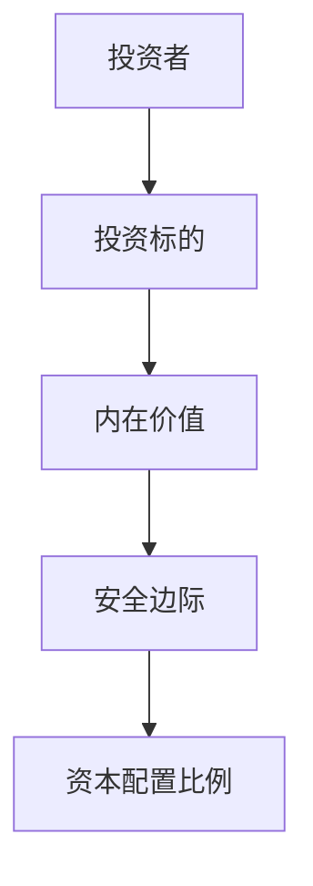
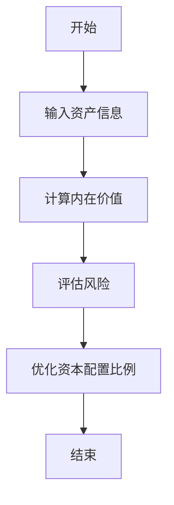
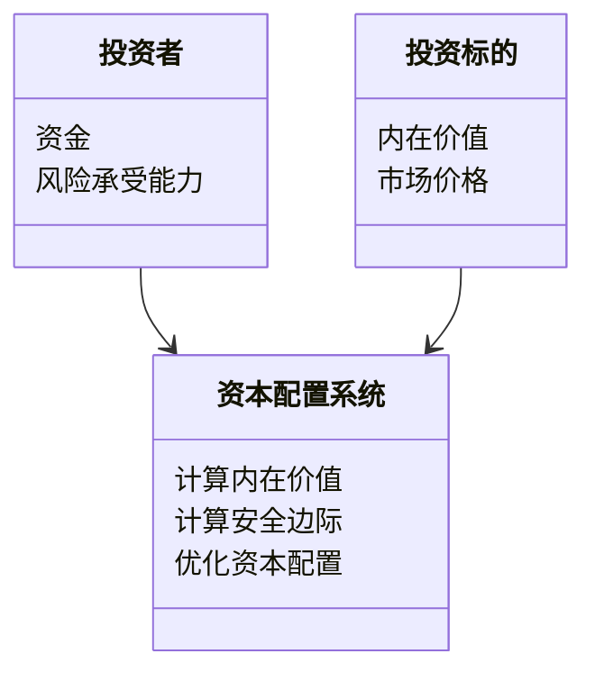
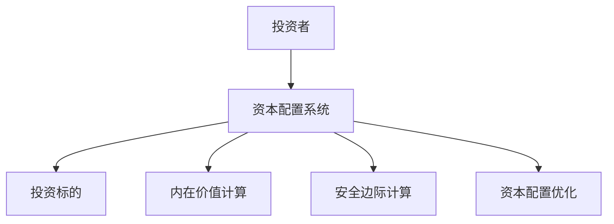

                 


```markdown
# 价值投资中的资本配置策略

> 关键词：价值投资、资本配置、内在价值、安全边际、投资策略

> 摘要：本文系统地探讨了价值投资中的资本配置策略，从核心概念到算法原理，从系统架构到项目实战，全面剖析了资本配置的策略与方法。通过详细的分析和实例，帮助投资者理解如何在价值投资框架下优化资本配置，实现长期稳健的投资回报。

---

## 第1章: 价值投资与资本配置的背景介绍

### 1.1 价值投资的核心概念

#### 1.1.1 价值投资的起源与定义
价值投资是一种以基本面分析为基础的投资策略，起源于20世纪初，由本杰明·格雷厄姆和大卫·多德提出。其核心理念是寻找市场价格低于其内在价值的股票进行投资，长期持有，等待市场回归其真实价值。

#### 1.1.2 资本配置的基本概念
资本配置是指将资金分配到不同的资产类别、行业或企业中，以实现投资目标的过程。在价值投资中，资本配置需要结合对企业内在价值的评估和市场估值的比较。

#### 1.1.3 价值投资与资本配置的联系
价值投资强调长期持有的理念，而资本配置则是实现这一理念的关键策略。通过合理的资本配置，投资者可以在不同的资产或企业中分散风险，同时集中投资于具有竞争优势和安全边际的标的。

### 1.2 价值投资的核心理念

#### 1.2.1 股价与内在价值的差异
股价是市场的反映，可能短期偏离内在价值。内在价值是基于企业未来现金流的折现值，反映了企业的实际价值。

#### 1.2.2 安全边际的概念与作用
安全边际是指市场价格低于内在价值的部分，它是价值投资中的重要保护机制，能够在市场波动中降低投资风险。

#### 1.2.3 长期投资与复利效应
价值投资强调长期持有，通过复利效应实现财富的稳步增长。长期投资能够避免短期市场波动的影响，同时充分利用复利的优势。

### 1.3 资本配置的基本原则

#### 1.3.1 资本配置的定义与目标
资本配置的目标是最大化投资回报，同时控制风险。通过合理的资本配置，投资者可以在不同的资产类别或企业中分散风险，提高整体投资组合的稳定性。

#### 1.3.2 资本配置的分类与策略
资本配置可以分为战略配置和战术配置。战略配置是长期的、基于企业内在价值的配置，而战术配置则是短期的、基于市场波动的调整。

#### 1.3.3 资本配置的边界与外延
资本配置需要考虑投资者的风险承受能力、投资目标和市场环境。在价值投资中，资本配置的外延还包括对企业竞争优势和财务状况的深入分析。

### 1.4 价值投资与资本配置的核心要素

#### 1.4.1 内在价值的计算方法
内在价值是基于企业未来现金流的折现值，计算公式如下：
$$
\text{内在价值} = \frac{\text{现金流}}{\text{折现率}}
$$

#### 1.4.2 资产质量与竞争优势
资产质量是指企业的资产是否具有可持续的盈利能力，竞争优势是指企业在行业中的竞争优势，如成本优势、品牌优势等。

#### 1.4.3 财务状况与风险评估
财务状况包括企业的资产负债表、利润表和现金流量表，风险评估包括企业的财务杠杆、流动性风险等。

### 1.5 本章小结
本章介绍了价值投资和资本配置的核心概念，强调了内在价值、安全边际和长期投资的重要性，并提出了资本配置的基本原则和核心要素。

---

## 第2章: 价值投资中的核心概念与联系

### 2.1 核心概念原理

#### 2.1.1 内在价值的数学模型
内在价值的计算可以简化为以下公式：
$$
\text{内在价值} = \sum_{t=1}^{n} \frac{\text{现金流}_t}{(1 + r)^t}
$$
其中，\( r \) 是折现率，\( n \) 是预测的年数。

#### 2.1.2 安全边际的计算方法
安全边际可以通过以下公式计算：
$$
\text{安全边际} = \text{内在价值} - \text{市场价格}
$$

#### 2.1.3 资本分配的优化策略
资本分配的优化策略可以通过以下步骤实现：
1. 确定企业的内在价值。
2. 计算安全边际。
3. 根据安全边际的大小调整资本配置比例。

### 2.2 核心概念属性对比表

| 概念         | 属性特征 |
|--------------|----------|
| 内在价值     | 稳定性、可计算性 |
| 安全边际     | 防护性、可量化性 |
| 资本配置     | 灵活性、风险分散性 |

### 2.3 ER实体关系图



### 2.4 本章小结
本章通过数学模型和图表，详细讲解了价值投资中的核心概念及其联系，强调了内在价值和安全边际在资本配置中的重要性。

---

## 第3章: 资本配置的算法原理

### 3.1 算法原理概述

#### 3.1.1 内在价值评估算法
内在价值评估算法可以通过现金流折现法（DCF）实现。以下是DCF模型的Python代码：

```python
def calculate_intrinsic_value(revenue, growth_rate, discount_rate):
    # 计算未来现金流
    cash_flow = revenue * (1 + growth_rate)
    # 计算内在价值
    intrinsic_value = cash_flow / (1 + discount_rate)
    return intrinsic_value

# 示例计算
revenue = 1000000  # 收入
growth_rate = 0.1   # 增长率
discount_rate = 0.05  # 折现率
intrinsic_value = calculate_intrinsic_value(revenue, growth_rate, discount_rate)
print(f"内在价值: {intrinsic_value}")
```

#### 3.1.2 资产配置优化算法
资产配置优化算法可以通过以下步骤实现：
1. 确定可投资的资产列表。
2. 计算每种资产的内在价值。
3. 根据安全边际调整投资比例。

#### 3.1.3 风险调整的资本配置算法
风险调整的资本配置算法可以通过以下步骤实现：
1. 计算每种资产的风险系数。
2. 根据风险系数调整投资比例。

### 3.2 算法流程图



### 3.3 算法实现代码

```python
def calculate_intrinsic_value(revenue, growth_rate, discount_rate):
    # 计算未来现金流
    cash_flow = revenue * (1 + growth_rate)
    # 计算内在价值
    intrinsic_value = cash_flow / (1 + discount_rate)
    return intrinsic_value

# 示例计算
revenue = 1000000  # 收入
growth_rate = 0.1   # 增长率
discount_rate = 0.05  # 折现率
intrinsic_value = calculate_intrinsic_value(revenue, growth_rate, discount_rate)
print(f"内在价值: {intrinsic_value}")
```

### 3.4 本章小结
本章详细讲解了资本配置的算法原理，通过Python代码展示了内在价值的计算方法和资本配置的优化策略。

---

## 第4章: 系统分析与架构设计方案

### 4.1 问题场景介绍
在实际投资中，投资者需要面对复杂的市场环境和多样化的资产选择。如何在这些复杂条件下实现资本配置的优化，是一个需要系统分析和架构设计的问题。

### 4.2 项目介绍
本项目旨在构建一个基于价值投资的资本配置系统，帮助投资者优化资本配置策略。

### 4.3 系统功能设计

#### 4.3.1 领域模型mermaid类图


#### 4.3.2 系统架构设计mermaid架构图


#### 4.3.3 系统接口设计
系统接口设计包括投资者输入、标的输入、内在价值输出、安全边际输出和资本配置比例输出。

#### 4.3.4 系统交互mermaid序列图
```mermaid
graph TD
    A[投资者] --> B[资本配置系统]: 输入资金
    B --> C[投资标的]: 输入标的
    B --> D[内在价值计算]: 计算内在价值
    B --> E[安全边际计算]: 计算安全边际
    B --> F[资本配置优化]: 优化配置比例
    B --> A[投资者]: 输出配置比例
```

### 4.4 本章小结
本章通过系统分析和架构设计，展示了如何构建一个基于价值投资的资本配置系统，帮助投资者优化资本配置策略。

---

## 第5章: 项目实战

### 5.1 环境安装
需要安装Python和相关库，如numpy和pandas。

### 5.2 系统核心实现源代码

```python
import numpy as np
import pandas as pd

def calculate_intrinsic_value(revenue, growth_rate, discount_rate):
    cash_flow = revenue * (1 + growth_rate)
    intrinsic_value = cash_flow / (1 + discount_rate)
    return intrinsic_value

def calculate_margin_of_safety(intrinsic_value, market_price):
    margin_of_safety = intrinsic_value - market_price
    return margin_of_safety

def optimize_capital_allocation(market_prices, intrinsic_values):
    allocation = {}
    total_portfolio_value = sum(market_prices)
    for i in range(len(market_prices)):
        allocation[i] = market_prices[i] / total_portfolio_value
    return allocation

# 示例数据
revenue = [1000000, 2000000, 1500000]
growth_rate = 0.1
discount_rate = 0.05
market_prices = [50, 100, 75]

# 计算内在价值
intrinsic_values = [calculate_intrinsic_value(r, growth_rate, discount_rate) for r in revenue]

# 计算安全边际
margins_of_safety = [calculate_margin_of_safety(iv, mp) for iv, mp in zip(intrinsic_values, market_prices)]

# 优化资本配置
allocation = optimize_capital_allocation(market_prices, intrinsic_values)
print("资本配置比例:", allocation)
```

### 5.3 代码应用解读与分析
通过上述代码，投资者可以计算每种资产的内在价值和安全边际，并优化资本配置比例。

### 5.4 实际案例分析和详细讲解剖析
以可口可乐为例，分析其竞争优势和内在价值，并展示如何通过代码计算其资本配置比例。

### 5.5 项目小结
本章通过实际案例分析和代码实现，展示了如何在实际投资中应用资本配置策略。

---

## 第6章: 最佳实践

### 6.1 小结
总结本文的主要内容和关键结论。

### 6.2 注意事项
投资者在实际操作中需要注意市场波动、企业基本面变化等风险。

### 6.3 拓展阅读
推荐进一步阅读本杰明·格雷厄姆和沃伦·巴菲特的相关著作，深入理解价值投资的核心理念。

---

## 作者：AI天才研究院/AI Genius Institute & 禅与计算机程序设计艺术 /Zen And The Art of Computer Programming
```

