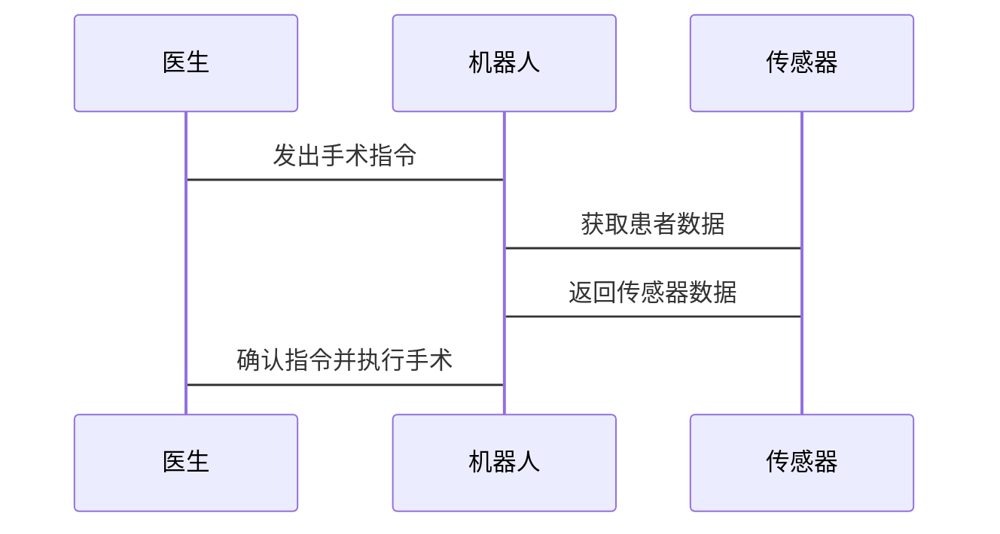

                 

<think>
好的，我将按照您的要求撰写《价值投资中的软体机器人在医疗中的应用前景》这篇文章。为了让内容更加完整和专业，我会先列出目录大纲并详细分析每个章节的内容。

### 目录大纲

---

# 价值投资中的软体机器人在医疗中的应用前景

> **关键词**: 软体机器人, 医疗应用, 价值投资, 人工智能, 医疗科技

> **摘要**: 随着软体机器人技术的迅速发展，其在医疗领域展现出巨大的应用潜力。本文将深入探讨软体机器人在医疗中的应用场景，分析其对医疗行业投资价值的影响，并结合价值投资的策略，展望未来的发展前景。通过技术分析和案例研究，本文旨在为投资者和医疗科技领域的专业人士提供有价值的参考。

---

## 第一部分: 背景与概念

### 第1章: 软体机器人与价值投资的背景

#### 1.1 软体机器人的定义与特点
- **1.1.1 软体机器人的定义**  
  软体机器人是一种基于柔性材料和智能控制技术的机器人，具有柔软、可变形、适应性强等特点。
  
- **1.1.2 软体机器人的核心特点**  
  - 柔性结构：能够适应复杂环境，减少对周围环境的破坏。  
  - 智能驱动：通过传感器和算法实现自主运动和任务执行。  
  - 多功能性：能够完成多种任务，如医疗手术、康复训练等。  

- **1.1.3 软体机器人在医疗中的应用背景**  
  软体机器人在医疗领域的应用始于20世纪末，近年来随着人工智能和材料科学的进步，其应用范围不断扩大，特别是在手术机器人和康复设备领域。

#### 1.2 价值投资的基本概念
- **1.2.1 价值投资的定义**  
  价值投资是一种投资策略，通过分析企业的基本面，寻找被市场低估的投资标的。  

- **1.2.2 价值投资的核心原则**  
  - 以合理的价格买入优质资产。  
  - 长期持有，避免频繁交易。  
  - 重点关注企业的盈利能力、财务状况和市场竞争力。  

- **1.2.3 价值投资在医疗领域的应用**  
  医疗行业作为高成长性行业，一直是价值投资者的重点关注领域。随着技术进步，医疗科技企业的投资价值备受关注。

---

## 第2章: 软体机器人在医疗中的应用前景

### 2.1 软体机器人在医疗中的应用场景
- **2.1.1 手术机器人**  
  软体手术机器人能够进行微创手术，具有高精度和灵活性，可显著提高手术成功率和患者恢复速度。  

- **2.1.2 康复机器人**  
  康复机器人通过辅助患者进行运动训练，帮助患者快速恢复身体功能，尤其适用于中风或创伤患者。  

- **2.1.3 医疗辅助机器人**  
  医疗辅助机器人用于医院环境中的物资运输、消毒清洁等任务，可有效提高医院运营效率。

### 2.2 价值投资在医疗中的应用
- **2.2.1 医疗行业的投资价值分析**  
  医疗行业具有稳定的市场需求和较高的利润率，是价值投资的理想领域。  

- **2.2.2 医疗科技企业的估值方法**  
  - 市盈率（P/E）：评估企业盈利能力。  
  - 市净率（P/B）：评估企业资产质量。  
  - 股息率：评估企业分红能力。  

- **2.2.3 医疗行业投资的风险与机遇**  
  - 机遇：政策支持、技术创新、市场需求增长。  
  - 风险：监管严格、技术门槛高、市场竞争激烈。

---

## 第三部分: 核心概念与联系

### 第3章: 软体机器人与价值投资的核心概念

#### 3.1 软体机器人的工作原理
- **3.1.1 软体机器人的材料与结构**  
  软体机器人通常采用柔性材料，如高分子聚合物和弹性体，结构设计注重模块化和可扩展性。  

- **3.1.2 软体机器人的驱动方式**  
  - 液压驱动：利用液体压力驱动机器人运动。  
  - 气压驱动：利用气体压力驱动机器人运动。  
  - 电驱动：通过电机或电磁驱动器实现运动。  

- **3.1.3 软体机器人在医疗中的功能实现**  
  通过传感器和算法实现精准的运动控制，满足医疗手术和康复需求。

#### 3.2 价值投资的决策模型
- **3.2.1 价值投资的基本假设**  
  市场短期波动不影响企业长期价值，价值最终会回归。  

- **3.2.2 价值投资的分析框架**  
  - 行业分析：了解行业发展趋势和竞争格局。  
  - 企业分析：评估企业的财务状况、管理团队和核心竞争力。  
  - 估值分析：确定企业的内在价值和市场估值。  

- **3.2.3 价值投资的量化模型**  
  通过数学模型量化企业的估值，如 discounted cash flow model（DCF 模型）。

### 第4章: 软体机器人与价值投资的关联

#### 4.1 软体机器人在医疗中的经济价值
- **4.1.1 软体机器人对医疗成本的影响**  
  通过提高手术精度和减少术后恢复时间，降低医疗成本。  

- **4.1.2 软体机器人对医疗效率的提升**  
  高效完成复杂手术，减少医护人员的工作负担。  

- **4.1.3 软体机器人对医疗质量的改善**  
  提高手术成功率和患者满意度，增强医疗企业的核心竞争力。

#### 4.2 价值投资对软体机器人企业的评估
- **4.2.1 企业财务状况分析**  
  - 利润能力：分析企业的净利润率和ROE。  
  - 财务健康度：评估企业的资产负债率和现金流情况。  

- **4.2.2 企业市场竞争力分析**  
  - 技术优势：企业是否拥有核心技术专利。  
  - 市场占有率：企业在行业中的地位。  

- **4.2.3 企业未来发展前景评估**  
  - 行业增长潜力：医疗科技行业的未来发展趋势。  
  - 企业战略：企业是否具备清晰的长期发展战略。

---

## 第四部分: 算法原理与数学模型

### 第5章: 软体机器人运动控制算法

#### 5.1 软体机器人的运动模型
- **5.1.1 软体机器人的运动方程**  
  描述机器人运动的数学方程，包括位置、速度和加速度。  

- **5.1.2 软体机器人的运动控制算法**  
  - PID 控制算法：通过比例、积分、微分调节实现精准控制。  
  - 非线性控制算法：适用于复杂环境下的运动控制。  

- **5.1.3 软体机器人运动的优化方法**  
  利用遗传算法和模拟退火算法优化运动路径和控制参数。

#### 5.2 软体机器人运动控制的数学模型
- **5.2.1 软体机器人运动的力学分析**  
  分析机器人运动中的力和能量转换关系。  

- **5.2.2 软体机器人运动的数学表达式**  
  $$ F = ma $$  
  其中，F 是力，m 是质量，a 是加速度。  

- **5.2.3 软体机器人运动的优化算法**  
  使用拉格朗日乘数法优化机器人运动路径，确保运动效率最大化。

### 第6章: 价值投资的量化分析模型

#### 6.1 价值投资的量化指标
- **6.1.1 市盈率（P/E）分析**  
  $$ P/E = \frac{市场价}{每股收益} $$  

- **6.1.2 市净率（P/B）分析**  
  $$ P/B = \frac{市场价}{每股净资产} $$  

- **6.1.3 股息率分析**  
  $$ 股息率 = \frac{每股股息}{市场价} $$  

#### 6.2 价值投资的回归分析模型
- **6.2.1 多元回归模型的建立**  
  通过多元回归模型分析企业的财务指标与市场表现之间的关系。  

- **6.2.2 回归模型的参数估计**  
  使用最小二乘法估计回归系数。  

- **6.2.3 回归模型的验证与优化**  
  通过交叉验证优化模型，确保预测精度。

---

## 第五部分: 系统分析与架构设计

### 第7章: 医疗软体机器人系统的架构设计

#### 7.1 医疗软体机器人的系统功能设计
- **7.1.1 系统功能模块划分**  
  - 运动控制模块：负责机器人的运动控制。  
  - 传感器模块：采集环境和患者数据。  
  - 人机交互模块：实现医生与机器人的互动。  

- **7.1.2 系统功能的实现方式**  
  通过模块化设计实现功能分离，便于系统维护和升级。  

- **7.1.3 系统功能的交互设计**  
  设计直观的用户界面，方便医生操作和监控系统状态。

#### 7.2 医疗软体机器人的系统架构图


#### 7.3 医疗软体机器人系统的接口设计
- **7.3.1 系统接口设计**  
  - 运动控制模块与传感器模块的接口：传递运动指令和反馈数据。  
  - 人机交互模块与数据处理模块的接口：传输用户指令和系统数据。  

- **7.3.2 系统接口的标准化**  
  采用统一的通信协议，如Modbus协议，确保不同模块之间的兼容性。

#### 7.4 医疗软体机器人系统的交互流程图


---

## 第六部分: 项目实战

### 第8章: 医疗软体机器人项目实战

#### 8.1 环境安装
- **8.1.1 系统环境要求**  
  - 操作系统：Windows 10 或更高版本，或Linux系统。  
  - 开发工具：Python 3.8 或更高版本，以及ROS（机器人操作系统）。  

- **8.1.2 硬件安装**  
  - 安装机器人本体及相关传感器。  
  - 配置电源和通信设备。  

#### 8.2 系统核心实现源代码
- **8.2.1 运动控制算法的实现**  
  ```python
  def move_robot(target_position):
      current_position = get_current_position()
      if current_position == target_position:
          return True
      else:
          # 调用PID控制算法调整位置
          delta = target_position - current_position
          adjust_position(delta)
          return move_robot(target_position)
  ```

- **8.2.2 数据处理模块的实现**  
  ```python
  import numpy as np

  def process_data(sensor_data):
      filtered_data = np.median(sensor_data)
      processed_data = filtered_data * 0.95  # 加入衰减系数
      return processed_data
  ```

#### 8.3 实际案例分析与解读
- **8.3.1 案例背景**  
  某医疗科技公司开发的软体手术机器人应用于心脏手术，显著提高了手术成功率。  

- **8.3.2 技术实现**  
  通过高精度传感器和智能算法实现机器人精准运动控制。  

- **8.3.3 投资价值分析**  
  该企业具备强大的研发能力和市场前景，具有较高的投资价值。

#### 8.4 项目小结
- **项目总结**  
  通过软体机器人技术实现医疗手术的智能化，显著提升了医疗效率和质量。  

- **经验分享**  
  项目成功的关键在于技术与商业模式的结合，以及团队的高效协作。

---

## 第七部分: 最佳实践与展望

### 第9章: 最佳实践与小结

#### 9.1 投资策略建议
- **9.1.1 选择优质企业**  
  投资者应重点关注具有核心技术优势和良好财务状况的企业。  

- **9.1.2 长期持有**  
  医疗科技行业具有长期增长潜力，投资者应避免短期波动影响决策。  

- **9.1.3 关注政策变化**  
  医疗行业的政策变化对企业估值影响重大，投资者需密切关注相关政策。

#### 9.2 项目注意事项
- **技术风险**  
  软体机器人技术尚处于发展阶段，存在较高的技术不确定性。  

- **市场竞争**  
  高强度的市场竞争可能导致企业利润率下降。  

- **政策风险**  
  医疗行业的监管政策变化可能影响企业的经营环境。

#### 9.3 拓展阅读
- **相关书籍**  
  - 《软体机器人技术与应用》  
  - 《价值投资实战指南》  

- **技术期刊**  
  - 《医疗机器人研究》  
  - 《人工智能与医疗》

---

## 第十章: 未来展望

随着人工智能和材料科学的进一步发展，软体机器人在医疗中的应用前景将更加广阔。未来，软体机器人将更加智能化、个性化，为医疗行业带来颠覆性的变革。同时，价值投资在医疗科技领域的应用也将更加精细化，投资者需要具备更强的技术分析能力和市场洞察力，才能在激烈的市场竞争中占据优势。

---

## 作者信息

**作者：AI天才研究院/AI Genius Institute & 禅与计算机程序设计艺术/Zen And The Art of Computer Programming**

---

希望这篇文章能够为您提供有价值的见解和启发。如果需要进一步的修改或补充，请随时告知。

