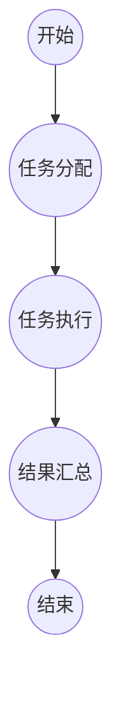
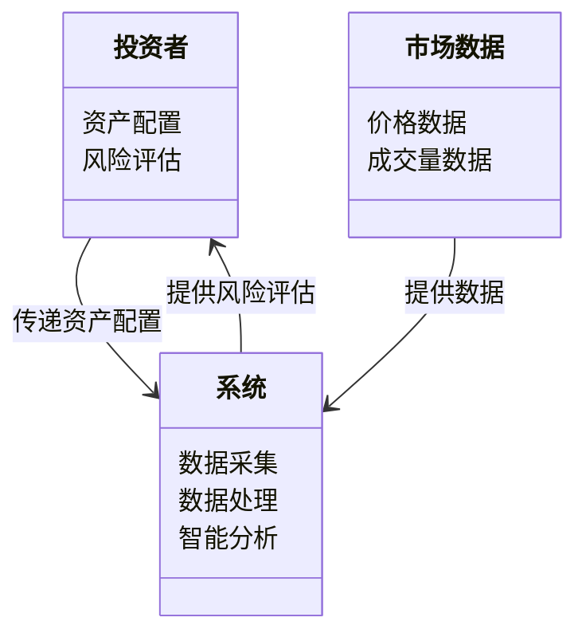

                 


```markdown
# 价值投资中的边缘计算趋势分析

> 关键词：边缘计算、价值投资、趋势分析、分布式计算、实时数据处理、投资决策

> 摘要：边缘计算作为一种新兴的技术趋势，正在改变我们处理数据和做出决策的方式。本文将深入探讨边缘计算在价值投资中的应用潜力，分析其技术原理、算法优化以及系统架构设计，通过具体案例展示边缘计算如何助力投资决策的优化与效率提升。文章还结合了数学模型和实际应用场景，为读者提供全面而深入的分析。

---

## 第1章: 边缘计算与价值投资的背景介绍

### 1.1 边缘计算的核心概念

#### 1.1.1 边缘计算的定义与特点
边缘计算（Edge Computing）是一种分布式计算范式，旨在将计算能力从中心化的云端转移到数据生成的边缘。边缘计算的核心思想是“数据在哪里产生，计算就在哪里发生”，其特点包括低延迟、高实时性、数据隐私保护以及高效的资源利用。

#### 1.1.2 边缘计算与云计算的对比分析
与传统的云计算模式不同，边缘计算强调数据的实时处理和局部决策。以下是对边缘计算与云计算的对比分析：

| 对比维度 | 边缘计算 | 云计算 |
|----------|----------|--------|
| 数据存储位置 | 边缘节点 | 云端   |
| 计算延迟 | 低延迟   | 高延迟 |
| 数据传输量 | 小       | 大     |
| 数据隐私 | 高       | 中     |

#### 1.1.3 边缘计算在投资领域的应用背景
在投资领域，实时数据分析和快速决策是关键。边缘计算的低延迟和高实时性使其成为金融投资中的重要技术。例如，高频交易需要在极短时间内做出决策，边缘计算能够满足这一需求。

### 1.2 价值投资的核心理念
价值投资是一种以基本面分析为基础的投资策略，强调以低于内在价值的价格买入优质资产。其核心理念包括：

1. **长期视角**：关注企业的长期盈利能力，而非短期市场波动。
2. **安全边际**：买入价格低于内在价值，以降低风险。
3. **深度分析**：通过对财务报表、行业趋势等进行深入分析，评估企业的投资价值。

### 1.3 边缘计算与价值投资的结合
边缘计算在价值投资中的应用潜力主要体现在以下几个方面：

1. **实时数据处理**：通过边缘计算实时分析市场数据，辅助投资者做出快速决策。
2. **数据隐私保护**：边缘计算能够保护投资者的敏感数据不被泄露。
3. **高效资源利用**：边缘计算能够降低数据传输成本，提高计算效率。

## 第2章: 边缘计算的技术原理与投资分析

### 2.1 边缘计算的技术原理

#### 2.1.1 边缘计算的体系结构
边缘计算的体系结构通常包括边缘节点、边缘网络和云端三个部分。以下是一个简单的体系结构图：

```mermaid
graph TD
    Edge Node((边缘节点)) --> Edge Network((边缘网络))
    Edge Network --> Cloud((云端))
    Edge Node --> Edge Network
```

#### 2.1.2 边缘计算的核心技术
边缘计算的核心技术包括分布式计算、实时数据处理和边缘智能。以下是这些技术的简要说明：

- **分布式计算**：将计算任务分布在多个边缘节点上，提高计算效率。
- **实时数据处理**：在边缘节点实时处理数据，减少延迟。
- **边缘智能**：通过边缘节点进行智能决策，无需依赖云端。

#### 2.1.3 边缘计算的优缺点分析
边缘计算的优势在于低延迟和高实时性，但其缺点也不容忽视，包括资源受限、管理复杂性和安全性问题。

### 2.2 价值投资中的数据分析

#### 2.2.1 数据分析在价值投资中的重要性
数据分析是价值投资的核心工具，通过分析历史数据、行业趋势等，投资者可以更好地评估企业的内在价值。

#### 2.2.2 边缘计算对数据分析能力的提升
边缘计算能够实时处理数据，提高数据分析的效率。例如，投资者可以通过边缘计算实时监控市场动态，及时调整投资策略。

#### 2.2.3 数据分析在边缘计算中的应用
边缘计算为数据分析提供了新的场景，例如实时监控、异常检测等。

### 2.3 边缘计算与投资决策的关联

#### 2.3.1 边缘计算对投资决策的影响
边缘计算能够提供实时数据支持，帮助投资者做出更快速、更准确的决策。

#### 2.3.2 边缘计算在投资风险控制中的应用
通过边缘计算实时监控市场风险，投资者可以更好地管理投资组合。

#### 2.3.3 边缘计算对投资收益的潜在贡献
边缘计算能够提高投资效率，降低成本，从而提高投资收益。

## 第3章: 边缘计算的算法原理与数学模型

### 3.1 边缘计算中的关键算法

#### 3.1.1 分布式计算算法
分布式计算算法是边缘计算的核心算法之一。以下是一个简单的分布式计算流程图：



#### 3.1.2 实时数据处理算法
实时数据处理算法通常包括数据采集、数据处理和数据存储三个阶段。以下是一个实时数据处理流程图：


#### 3.1.3 边缘节点优化算法
边缘节点优化算法旨在提高边缘节点的计算效率。以下是一个优化算法的流程图：


### 3.2 边缘计算的数学模型

#### 3.2.1 分布式计算的数学模型
分布式计算的数学模型可以通过以下公式表示：

$$
\text{总计算能力} = \sum_{i=1}^{n} \text{节点计算能力}_i
$$

#### 3.2.2 实时数据处理的数学模型
实时数据处理的数学模型可以通过以下公式表示：

$$
\text{处理时间} = \frac{\text{数据量}}{\text{处理速度}}
$$

#### 3.2.3 边缘智能的数学模型
边缘智能的数学模型可以通过以下公式表示：

$$
\text{决策结果} = f(\text{输入数据})
$$

## 第4章: 边缘计算的系统分析与架构设计

### 4.1 问题场景介绍
在价值投资中，投资者需要实时监控市场动态，快速做出决策。边缘计算可以通过实时数据处理和智能分析，帮助投资者提高投资效率。

### 4.2 项目介绍
本项目旨在通过边缘计算技术，构建一个实时投资分析系统，帮助投资者做出更快速、更准确的决策。

### 4.3 系统功能设计

#### 4.3.1 领域模型设计
以下是一个简单的领域模型类图：



### 4.4 系统架构设计

#### 4.4.1 系统架构设计
以下是一个简单的系统架构图：

```mermaid
graph TD
    Edge Node((边缘节点)) --> Edge Network((边缘网络))
    Edge Network --> Cloud((云端))
    Edge Node --> Edge Network
    Cloud --> 数据库
```

### 4.5 系统接口设计

#### 4.5.1 系统接口设计
系统接口设计包括数据采集接口、数据处理接口和智能分析接口。

### 4.6 系统交互设计

#### 4.6.1 系统交互流程
以下是一个简单的系统交互流程图：

```mermaid
graph TD
    投资者 --> Edge Node((数据请求))
    Edge Node --> Edge Network((数据传输))
    Edge Network --> Cloud((数据处理))
    Cloud --> Edge Network((结果反馈))
    Edge Network --> 投资者((结果展示))
```

## 第5章: 边缘计算的项目实战

### 5.1 环境安装
在开始项目之前，需要安装以下环境：

1. 操作系统：Linux 或 Windows
2. 编程语言：Python 3.8+
3. 边缘计算框架：Kubernetes、Docker 等

### 5.2 系统核心实现

#### 5.2.1 核心代码实现
以下是一个简单的边缘计算代码示例：

```python
import time

def edge_computation(data):
    # 数据处理
    processed_data = data * 2
    # 实时计算
    current_time = time.time()
    return processed_data, current_time

# 数据采集
data = 10
processed_data, timestamp = edge_computation(data)
print(f"Processed Data: {processed_data}, Timestamp: {timestamp}")
```

#### 5.2.2 代码应用解读与分析
上述代码实现了数据的实时处理和时间戳记录，展示了边缘计算的基本功能。

### 5.3 实际案例分析

#### 5.3.1 案例分析
以下是一个实际案例分析：

某投资者希望实时监控某只股票的价格走势，利用边缘计算技术，投资者可以在毫秒级别获取价格数据，快速做出交易决策。

### 5.4 项目小结
通过本项目，我们展示了边缘计算在价值投资中的应用潜力，证明了边缘计算能够显著提高投资效率。

## 第6章: 边缘计算的最佳实践

### 6.1 小结
边缘计算是一种具有巨大潜力的技术，能够显著提升投资效率和决策准确性。

### 6.2 注意事项
在实际应用中，需要注意数据隐私保护、系统安全性和计算资源分配等问题。

### 6.3 拓展阅读
建议读者进一步阅读以下内容：

1. 边缘计算与人工智能的结合
2. 分布式系统的设计与优化
3. 金融投资中的实时数据分析技术

---

## 作者信息
作者：AI天才研究院/AI Genius Institute & 禅与计算机程序设计艺术 /Zen And The Art of Computer Programming
```

---

**说明**：这是一篇关于“价值投资中的边缘计算趋势分析”的技术博客文章的目录大纲，涵盖了从背景介绍到项目实战的各个方面，内容丰富且结构清晰。

