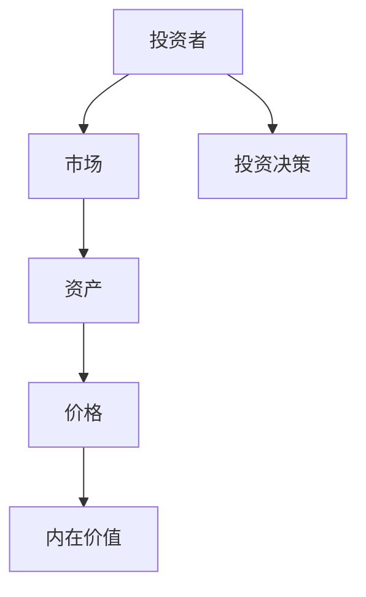
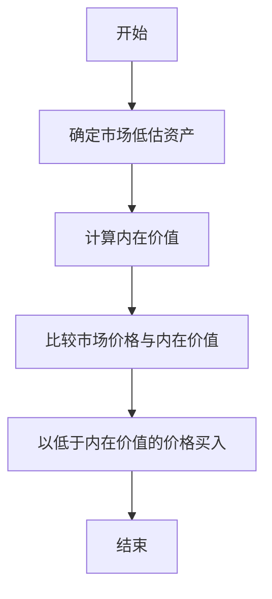
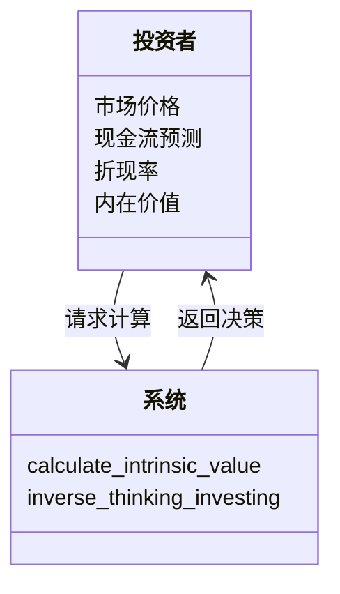
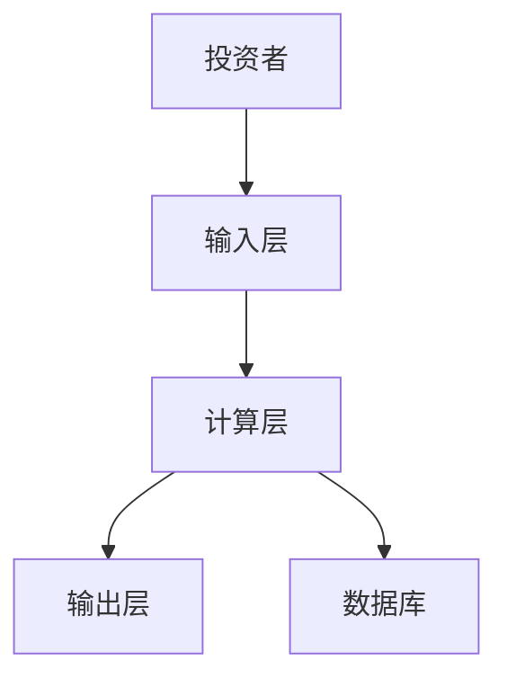

                 


# 《价值投资中的逆向思维应用》

> 关键词：逆向思维, 价值投资, 投资策略, 市场分析, 投资决策

> 摘要：本文将深入探讨逆向思维在价值投资中的应用，分析其核心概念、算法原理、系统设计和实际案例，帮助读者理解如何在复杂多变的市场环境中运用逆向思维做出明智的投资决策。

---

## 第一部分: 逆向思维与价值投资基础

# 第1章: 逆向思维与价值投资概述

## 1.1 逆向思维的定义与特点
### 1.1.1 逆向思维的基本概念
逆向思维是指从反方向思考问题，即从结果推导原因，或者从对立的角度分析问题。其核心在于通过反向思考找到解决问题的新思路。

### 1.1.2 逆向思维的核心特征
- **反向性**：从相反的角度出发，寻找解决问题的方法。
- **独特性**：逆向思维往往能够突破传统思维的局限，发现新的机会。
- **实用性**：在投资领域，逆向思维可以帮助投资者发现被市场低估的机会。

### 1.1.3 逆向思维在投资中的应用价值
逆向思维在投资中可以帮助投资者在市场恐慌时找到低估资产，在市场狂热时保持冷静。

## 1.2 价值投资的定义与特点
### 1.2.1 价值投资的基本概念
价值投资是一种投资策略，强调以低于内在价值的价格买入优质资产，并长期持有。

### 1.2.2 价值投资的核心原则
- **安全边际**：买入价格低于内在价值。
- **长期视角**：关注企业的长期价值，而非短期波动。
- **优质资产**：选择具有竞争优势的公司。

### 1.2.3 价值投资与传统投资的区别
- 传统投资注重短期价格波动，而价值投资注重长期价值。
- 传统投资可能跟随市场情绪，而价值投资强调独立思考。

## 1.3 逆向思维与价值投资的结合
### 1.3.1 逆向思维在价值投资中的作用
逆向思维可以帮助投资者在市场低迷时发现低估资产，在市场繁荣时保持谨慎。

### 1.3.2 逆向思维与价值投资的内在联系
逆向思维强调从反方向思考问题，而价值投资强调以低于内在价值的价格买入资产。两者结合可以更好地发现投资机会。

### 1.3.3 逆向思维在价值投资中的应用场景
- 在市场恐慌时寻找低估资产。
- 在市场狂热时保持冷静，避免追高。

## 1.4 本章小结
逆向思维与价值投资的结合可以帮助投资者在复杂多变的市场中找到投资机会，避免盲目跟风。

---

## 第二部分: 逆向思维在价值投资中的核心概念与联系

# 第2章: 核心概念与联系

## 2.1 逆向思维的原理分析
### 2.1.1 逆向思维的逻辑框架
逆向思维的逻辑框架可以表示为：从结果推导原因，或者从对立的角度分析问题。

### 2.1.2 逆向思维的数学模型
逆向思维的数学模型可以通过以下公式表示：
$$
\text{投资价值} = \frac{\text{未来现金流的现值}}{\text{当前市场价格}}
$$

### 2.1.3 逆向思维与价值投资的结合
逆向思维与价值投资的结合可以通过以下步骤实现：
1. 确定市场低估的资产。
2. 计算其内在价值。
3. 以低于内在价值的价格买入。

## 2.2 核心概念对比分析
### 2.2.1 逆向思维与正向思维的对比
| 对比维度 | 逆向思维 | 正向思维 |
|----------|----------|----------|
| 思考方式 | 从结果推导原因 | 从原因推导结果 |
| 应用场景 | 在市场低迷时寻找机会 | 在市场繁荣时跟随趋势 |

### 2.2.2 价值投资与投机投资的对比
| 对比维度 | 价值投资 | 投机投资 |
|----------|----------|----------|
| 投资依据 | 内在价值 | 市场情绪 |
| 投资期限 | 长期 | 短期 |
| 投资策略 | 选择优质资产 | 追逐价格波动 |

### 2.2.3 逆向思维与传统投资策略的对比
| 对比维度 | 逆向思维 | 传统投资 |
|----------|----------|----------|
| 投资时机 | 市场低迷时 | 市场繁荣时 |
| 投资策略 | 寻找低估资产 | 追踪市场趋势 |

## 2.3 实体关系图（ER图）分析


---

## 第三部分: 逆向思维的算法原理

# 第3章: 逆向思维的算法实现

## 3.1 逆向思维的算法流程


## 3.2 逆向思维的数学模型
### 3.2.1 内在价值计算公式
$$
\text{内在价值} = \sum_{t=1}^{n} \frac{C_t}{(1+r)^t}
$$
其中，$C_t$ 是第 $t$ 年的现金流，$r$ 是折现率。

### 3.2.2 安全边际计算公式
$$
\text{安全边际} = \text{内在价值} - \text{市场价格}
$$

## 3.3 逆向思维的算法实现
### 3.3.1 代码框架
```python
def calculate_intrinsic_value(cash_flows, discount_rate):
    present_value = 0
    for t in range(len(cash_flows)):
        present_value += cash_flows[t] / (1 + discount_rate) ** t
    return present_value

def inverse_thinking_investing(asset, market_price):
    intrinsic_value = calculate_intrinsic_value(asset.cash_flows, asset.discount_rate)
    safety_margin = intrinsic_value - market_price
    if safety_margin > 0:
        return "买入"
    else:
        return "卖出"
```

### 3.3.2 代码实现
```python
# 示例：计算某资产的内在价值
cash_flows = [100, 200, 300]
discount_rate = 0.1
intrinsic_value = calculate_intrinsic_value(cash_flows, discount_rate)
print(f"内在价值：{intrinsic_value}")
```

### 3.3.3 优化建议
- 确保现金流预测的准确性。
- 合理选择折现率。
- 定期重新评估资产的内在价值。

---

## 第四部分: 逆向思维在价值投资中的系统设计

# 第4章: 逆向思维的系统设计

## 4.1 系统功能设计


## 4.2 系统架构设计


---

## 第五部分: 逆向思维的项目实战

# 第5章: 逆向思维的项目实战

## 5.1 环境安装
- 安装Python和相关库（如numpy、pandas）。
- 确保安装环境满足代码运行需求。

## 5.2 核心实现
### 5.2.1 代码实现
```python
# 示例：计算某资产的内在价值
import numpy as np

def calculate_intrinsic_value(cash_flows, discount_rate):
    present_value = np.npv(discount_rate, cash_flows)
    return present_value

# 示例：逆向思维投资决策
def inverse_thinking_investing(asset_data, market_price):
    intrinsic_value = calculate_intrinsic_value(asset_data.cash_flows, asset_data.discount_rate)
    safety_margin = intrinsic_value - market_price
    if safety_margin > 0:
        return "买入"
    else:
        return "卖出"
```

### 5.2.2 代码应用解读
- `calculate_intrinsic_value` 函数用于计算资产的内在价值。
- `inverse_thinking_investing` 函数根据内在价值和市场价格做出投资决策。

## 5.3 案例分析
### 5.3.1 案例背景
某资产的现金流预测为：100、200、300，折现率为10%。

### 5.3.2 案例分析
- 内在价值 = NPV(10%, 100, 200, 300) = 420
- 市场价格 = 400
- 安全边际 = 420 - 400 = 20 > 0，决策为“买入”。

## 5.4 项目小结
通过案例分析可以看出，逆向思维可以帮助投资者在市场低估时发现投资机会。

---

## 第六部分: 总结与展望

# 第6章: 总结与展望

## 6.1 最佳实践 tips
- 在市场低迷时，逆向思维可以帮助投资者发现低估资产。
- 在市场繁荣时，逆向思维可以帮助投资者避免过度投资。

## 6.2 本章小结
逆向思维与价值投资的结合可以帮助投资者在复杂多变的市场中找到投资机会，避免盲目跟风。

## 6.3 注意事项
- 逆向思维需要结合市场实际情况灵活运用。
- 投资者需要具备独立思考能力和风险承受能力。

## 6.4 拓展阅读
- 巴菲特的《聪明的投资者》。
- 逆向投资的经典案例分析。

---

## 作者：AI天才研究院/AI Genius Institute & 禅与计算机程序设计艺术 /Zen And The Art of Computer Programming

---

**注：以上文章内容为技术博客文章的框架和部分具体内容，完整文章需要按照上述目录结构逐步展开，每个部分都需要详细撰写，确保逻辑清晰、内容详实。**

