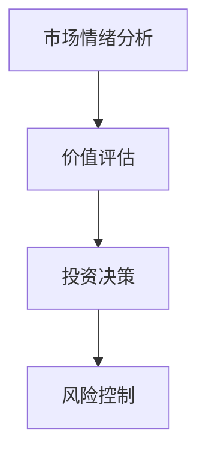
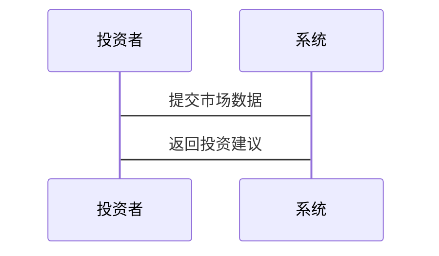

                 


# 《价值投资中的逆向思维：当别人恐惧时贪婪》

---

## 关键词：  
- 价值投资  
- 逆向思维  
- 市场情绪  
- 安全边际  
- 贪婪与恐惧  

---

## 摘要：  
本文将深入探讨价值投资中的逆向思维策略，从市场情绪分析、价值评估模型到实际投资案例，系统性地剖析如何在市场恐慌中寻找投资机会。通过数学模型、算法原理和系统架构的设计，结合实际案例分析，为读者提供一套完整的逆向投资解决方案。  

---

# 第一部分：引言

## 第1章：逆向思维的定义与重要性

### 1.1 逆向思维的定义  
逆向思维是一种与传统思维相反的思维方式，强调在市场非理性中寻找投资机会。其核心理念是“当别人恐惧时贪婪，当别人贪婪时恐惧”。  

### 1.2 投资中的常见误区  
- **追涨杀跌**：投资者往往跟随市场情绪，导致高位买入、低位卖出。  
- **短期波动与长期价值混淆**：过度关注短期价格波动，忽视长期价值。  
- **情绪驱动与理性分析失衡**：市场恐慌或贪婪时，理性分析被情绪支配。  

### 1.3 逆向思维的核心理念  
- **市场先生的寓言**：市场的波动性与非理性。  
- **安全边际的重要性**：内在价值与市场价格的差异。  
- **逆向思维的三大原则**：便宜、安全、确定性。  

---

# 第二部分：价值投资的核心理念

## 第2章：价值投资的哲学基础

### 2.1 价值投资的起源与发展  
- **本杰明·格雷厄姆**：价值投资的鼻祖，提出“安全边际”概念。  
- **沃伦·巴菲特**：格雷厄姆的学生，将价值投资发扬光大。  

### 2.2 市场先生的寓言  
- 市场先生的波动性与非理性。  
- 投资者与市场先生的关系：投资者应利用市场先生的非理性，寻找投资机会。  

### 2.3 安全边际的概念  
- **定义**：内在价值与市场价格之间的差距，提供保护的缓冲区。  
- **计算方法**：通过基本面分析，估算内在价值，与市场价格对比。  

---

## 第3章：逆向思维与价值评估

### 3.1 逆向思维的价值评估模型  
- **模型公式**：$$V = P \times (1 - E)$$  
  其中，V为内在价值，P为市场价格，E为市场情绪指数。  
- **市场情绪指数**：通过市场波动率、投资者情绪等指标量化。  

### 3.2 市场情绪的量化分析  
- **VIX指数**：市场恐慌指数，用于衡量市场波动性。  
- **投资者情绪周期**：从乐观到悲观，再到乐观的循环。  

### 3.3 逆向思维的数学模型  
- **公式推导**：通过历史数据，建立市场情绪与价格波动的关系模型。  
- **案例分析**：2008年金融危机期间，如何利用逆向思维模型寻找投资机会。  

---

# 第三部分：逆向思维的策略与技巧

## 第4章：逆向投资的策略体系

### 4.1 逆向投资的三大步骤  
1. **确定投资目标**：明确投资目标，分析市场趋势。  
2. **识别市场恐慌点**：通过市场情绪指数，判断恐慌阶段。  
3. **构建投资组合**：结合安全边际，选择低估资产。  

### 4.2 逆向投资的时机选择  
- **恐慌阶段判断**：通过市场先生的波动性，判断恐慌阶段。  
- **黄金时间窗口**：历史上恐慌时期的收益分析。  

### 4.3 逆向思维的组合管理  
- **资产配置金字塔模型**：从高风险到低风险的资产配置。  
- **风险控制的三重防线**：止损点、分散投资、动态调整。  

---

## 第5章：逆向思维的数学模型与算法

### 5.1 逆向思维的数学模型  
- **公式解析**：$$P = V \times (1 + r)^{-n}$$  
  其中，P为市场价格，V为内在价值，r为折现率，n为时间。  
- **算法实现**：通过Python代码，模拟逆向思维的数学模型。  

### 5.2 算法实现  
```python
import numpy as np

def inverse_thinking_model(value, rate, time):
    price = value * (1 + rate) ** (-time)
    return price

# 示例
V = 100
r = 0.05
n = 5
P = inverse_thinking_model(V, r, n)
print(f"市场价格：{P}")
```

### 5.3 案例分析  
- **案例1**：2008年金融危机期间，如何利用模型判断投资机会。  
- **案例2**：2020年新冠疫情市场恐慌期，如何运用逆向思维模型寻找低估资产。  

---

# 第四部分：系统分析与架构设计

## 第6章：系统架构设计

### 6.1 系统功能设计  
- **功能模块**：市场情绪分析、价值评估、投资决策、风险控制。  
- **模块化设计**：每个功能模块独立实现，便于维护和扩展。  

### 6.2 系统架构图  


### 6.3 接口设计  
- **输入接口**：市场数据、投资者情绪数据。  
- **输出接口**：投资建议、风险评估报告。  

### 6.4 交互设计  


---

# 第五部分：项目实战

## 第7章：项目实战

### 7.1 环境安装  
- **Python环境**：安装Python 3.9及以上版本。  
- **依赖库安装**：numpy, pandas, matplotlib。  

### 7.2 核心实现  
```python
import pandas as pd
import matplotlib.pyplot as plt

def calculate_inverse_value(value, rate, time):
    price = value * (1 + rate) ** (-time)
    return price

# 示例数据
values = [100, 200, 150]
rates = [0.05, 0.03, 0.04]
times = [5, 10, 7]

prices = []
for v, r, t in zip(values, rates, times):
    prices.append(calculate_inverse_value(v, r, t))

plt.plot(values, 'b-', label='内在价值')
plt.plot(prices, 'r-', label='市场价格')
plt.legend()
plt.show()
```

### 7.3 案例分析  
- **案例1**：2008年金融危机期间，利用系统分析寻找低估资产。  
- **案例2**：2020年新冠疫情市场恐慌期，如何利用系统架构设计进行逆向投资。  

---

## 第8章：小结与展望

### 8.1 小结  
- 逆向思维的核心在于利用市场非理性，寻找低估资产。  
- 通过数学模型与系统架构设计，提高投资决策的科学性。  

### 8.2 展望  
- 结合人工智能技术，进一步优化逆向思维模型。  
- 探索更多市场情绪分析的方法，提高投资收益。  

---

## 作者：AI天才研究院/AI Genius Institute & 禅与计算机程序设计艺术 /Zen And The Art of Computer Programming

