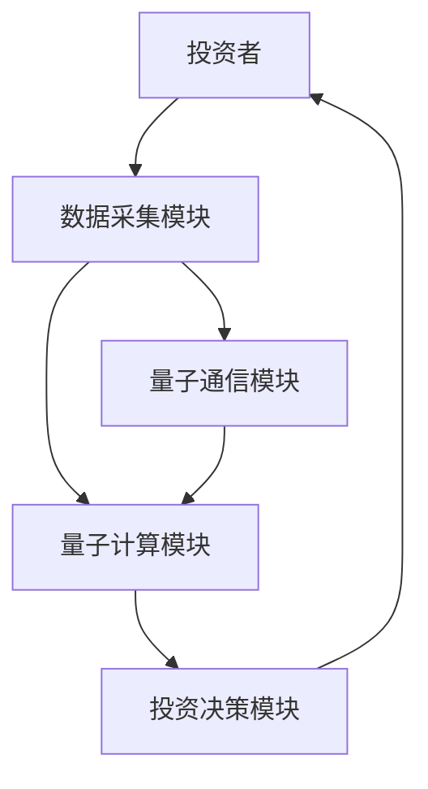
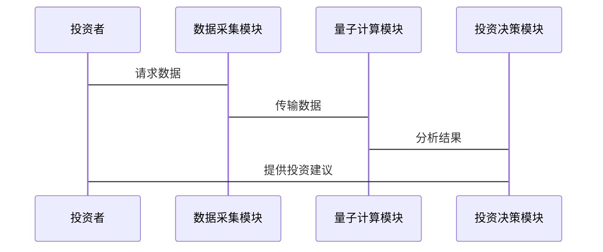

                 


# 价值投资中的量子互联网潜力分析

> **关键词**：量子互联网、价值投资、量子计算、量子通信、投资策略

> **摘要**：量子互联网作为下一代通信技术的核心，正在逐步改变金融市场的分析和交易方式。本文将从量子互联网的基本原理出发，分析其在价值投资中的潜在应用，探讨量子计算和量子通信如何提升投资决策的效率和安全性。通过详细讲解量子算法、数学模型和系统架构，本文为读者揭示量子互联网如何为价值投资带来新的机遇和挑战。

---

## 第1章: 量子互联网与价值投资的背景

### 1.1 量子互联网的定义与特点
量子互联网是一种基于量子力学原理构建的新型通信网络，与传统互联网相比，其核心优势在于数据传输的绝对安全性。以下是量子互联网的几个关键特点：

1. **数据传输不可被窃听**：基于量子纠缠的特性，任何对数据的窃听都会立即暴露。
2. **超高速计算能力**：量子计算机能够快速处理复杂问题，为金融建模提供强大的支持。
3. **抗量子攻击能力**：传统加密算法在量子计算机面前不堪一击，但量子通信可以有效防止此类攻击。

### 1.2 价值投资的基本原理
价值投资是一种长期投资策略，强调通过分析企业的基本面来评估其内在价值。核心在于寻找市场价格低于内在价值的企业进行投资。传统价值投资依赖于对市场数据的深度分析，而量子互联网的出现，可能为这种分析提供更强大的工具。

### 1.3 量子互联网对金融市场的潜在影响
1. **提升交易效率**：量子计算机可以快速分析海量数据，帮助投资者发现潜在的投资机会。
2. **增强数据安全性**：量子通信确保金融交易的安全性，防止数据泄露和篡改。
3. **改变投资策略**：量子互联网可能使得高频交易更加高效，同时为风险管理提供更精确的工具。

---

## 第2章: 量子互联网的核心概念与联系

### 2.1 量子计算的基本原理
量子计算的核心在于量子位（qubit）的特殊性质。与经典计算机中的二进制位不同，量子位可以同时处于多个状态的叠加态。以下是量子计算的几个关键概念：

1. **量子叠加**：量子位的状态可以表示为 $|0\rangle$、$|1\rangle$ 或 $|0\rangle+|1\rangle$ 等形式。
2. **量子纠缠**：两个或多个量子位之间形成纠缠态，使得对其中一个量子位的操作会影响另一个。
3. **量子算法**：如Shor算法和Grover算法，能够在特定问题上远超经典算法的效率。

### 2.2 量子通信的基本原理
量子通信利用量子纠缠和量子密钥分发（QKD）技术，确保数据传输的安全性。以下是其核心原理：

1. **量子密钥分发（QKD）**：通过量子态传输密钥，确保只有合法用户能够解密。
2. **量子隐形传态**：利用量子纠缠，将信息从一个地点传送到另一个地点，无需物理传输介质。
3. **抗窃听性**：任何窃听行为都会破坏量子态，从而被立即发现。

### 2.3 量子互联网的架构
量子互联网的架构可以分为以下几个层次：

1. **量子节点**：类似于传统互联网的路由器，用于量子信息的中继传输。
2. **量子链路**：连接量子节点的物理介质，如光纤或量子态传输装置。
3. **量子协议**：如BB84协议，用于确保数据传输的安全性。

### 2.4 核心概念对比表格

| 比较维度 | 量子计算 | 量子通信 | 传统计算 | 传统通信 |
|----------|----------|----------|----------|----------|
| 性能优势 | 高速处理复杂问题 | 绝对安全性 | 速度有限 | 易受窃听 |
| 核心技术 | 量子位、量子叠加 | 量子密钥分发 | 二进制位 | 加密算法 |
| 应用领域 | 金融建模、密码破解 | 金融交易安全 | 数据处理 | 数据传输 |

### 2.5 ER实体关系图
以下是量子互联网的核心实体关系图：

```mermaid
erDiagram
    actor 投资者 {
        <identity>
        id : integer
        name : string
    }
    actor 金融机构 {
        <identity>
        id : integer
        name : string
    }
    entity 量子节点 {
        <identity>
        id : integer
        name : string
    }
    entity 量子链路 {
        <identity>
        id : integer
        type : string
    }
    entity 量子密钥 {
        <identity>
        id : integer
        key : string
    }
    relationship 投资者-金融机构 : 可能通过量子节点进行交易
    relationship 金融机构-量子节点 : 使用量子链路传输数据
    relationship 量子节点-量子链路 : 通过链路连接
    relationship 量子链路-量子密钥 : 分发密钥用于加密
```

---

## 第3章: 量子互联网中的价值投资分析

### 3.1 量子计算在投资分析中的应用
量子计算的强大能力为价值投资提供了新的工具，以下是其主要应用：

1. **金融建模**：利用量子算法快速分析市场数据，预测股票价格走势。
2. **风险管理**：通过量子计算优化投资组合，降低风险。
3. **投资组合优化**：量子计算机能够快速找到最优的投资组合配置。

### 3.2 量子通信在金融交易中的应用
量子通信的安全性为金融交易提供了更高的保障，以下是其主要应用：

1. **高频交易**：通过量子通信实现超低延迟的交易，抢占市场先机。
2. **跨境支付**：量子通信确保支付过程的安全性，防止欺诈。
3. **数据加密**：利用量子密钥分发技术，保护交易数据不被窃听。

### 3.3 量子互联网对金融市场的潜在影响
1. **提升交易效率**：量子计算机的高速处理能力使得交易决策更加迅速。
2. **改变投资策略**：量子互联网可能使得投资策略更加依赖于实时数据分析。
3. **增强市场流动性**：量子通信的高效性可能增加市场的流动性。

---

## 第4章: 量子互联网中的算法原理与数学模型

### 4.1 量子算法的基本原理
以下是几个关键的量子算法及其应用：

1. **Shor算法**：用于大整数分解，常用于加密破解和质因数分解。
2. **Grover算法**：用于无序数据库的搜索，可以加速金融数据的分析。
3. **量子傅里叶变换**：用于信号处理和模式识别，适用于金融时间序列分析。

### 4.2 量子通信中的算法原理
1. **BB84协议**：量子密钥分发协议，确保密钥的安全传输。
2. **EPR协议**：利用量子纠缠实现远距离通信。
3. **量子隐形传态**：通过量子纠缠实现信息的无损传输。

### 4.3 量子互联网中的数学模型
以下是量子叠加和纠缠态的数学表达：

1. **量子叠加态**：
   $$
   |\psi\rangle = \alpha|0\rangle + \beta|1\rangle
   $$
   其中，$\alpha$ 和 $\beta$ 是复数，满足 $|\alpha|^2 + |\beta|^2 = 1$。

2. **量子纠缠态**：
   $$
   |\psi\rangle = \frac{1}{\sqrt{2}}(|0\rangle|1\rangle + |1\rangle|0\rangle)
   $$

---

## 第5章: 量子互联网的投资分析系统架构

### 5.1 系统功能设计
以下是量子互联网投资分析系统的功能模块：

1. **数据采集模块**：从金融市场获取实时数据。
2. **量子计算模块**：利用量子算法进行数据分析。
3. **量子通信模块**：确保数据传输的安全性。
4. **投资决策模块**：基于分析结果生成投资策略。

### 5.2 系统架构设计
以下是系统的架构图：



### 5.3 系统接口设计
以下是系统的主要接口：

1. **数据接口**：与金融市场数据源对接。
2. **通信接口**：与量子通信网络对接。
3. **用户接口**：供投资者查看分析结果。

### 5.4 系统交互流程
以下是系统交互的流程图：



---

## 第6章: 项目实战——构建量子互联网投资分析系统

### 6.1 环境安装
以下是构建系统的环境要求：

1. **量子计算平台**：如 IBM Q Experience 或 Rigetti。
2. **量子通信设备**：如 Quantum Key Distribution（QKD）设备。
3. **开发工具**：Python、Qiskit 等。

### 6.2 核心代码实现
以下是关键代码示例：

1. **量子计算模块**：
   ```python
   from qiskit import QuantumCircuit, Aer, execute
   from qiskit.visualization import plot_histogram

   circuit = QuantumCircuit(2)
   circuit.h(0)
   circuit.cx(0, 1)
   circuit.measure(0, 0)
   circuit.measure(1, 1)

   result = execute(circuit, Aer.get_backend('qasm_simulator')).result()
   print(result.counts)
   ```

2. **量子通信模块**：
   ```python
   import qiskit
   from qiskit import QuantumCircuit, Aer, execute

   key = []
   for i in range(1024):
       qc = QuantumCircuit(2)
       qc.h(0)
       qc.cx(0, 1)
       qc.measure(0, 0)
       qc.measure(1, 1)
       result = execute(qc, Aer.get_backend('qasm_simulator')).result()
       key.append(result.counts)
   ```

### 6.3 案例分析
以下是利用量子互联网进行股票价格预测的案例：

1. **数据采集**：获取某公司过去5年的股价数据。
2. **量子计算**：利用量子算法分析数据，预测未来股价走势。
3. **投资决策**：基于分析结果，生成投资策略。

---

## 第7章: 总结与展望

### 7.1 本章总结
量子互联网作为下一代通信技术的核心，正在逐步改变金融市场的分析和交易方式。本文从量子互联网的基本原理出发，分析了其在价值投资中的潜在应用，并通过详细讲解量子算法、数学模型和系统架构，揭示了量子互联网如何为价值投资带来新的机遇和挑战。

### 7.2 未来展望
随着量子互联网技术的不断发展，其在金融市场的应用将更加广泛。未来的研究方向可能包括：
1. **量子算法的优化**：提高量子算法的效率和准确性。
2. **量子通信的安全性**：进一步提升量子通信的安全性，确保数据传输的绝对安全。
3. **量子互联网的标准化**：推动量子互联网的标准化，使其更好地服务于金融行业。

---

**作者：AI天才研究院/AI Genius Institute & 禅与计算机程序设计艺术 /Zen And The Art of Computer Programming**

