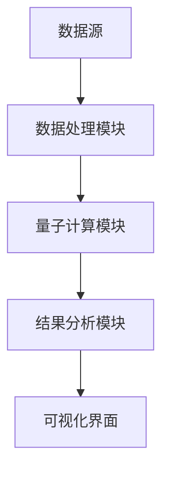

                 

# 价值投资中的量子计算商业化前景

**关键词**：量子计算，价值投资，商业化前景，金融建模，量子算法，投资决策

**摘要**：量子计算作为一种革命性的技术，正在逐步改变多个行业的商业模式和决策方式。本文将探讨量子计算在价值投资中的潜在应用，分析其商业化前景，并通过实际案例展示如何利用量子计算优化投资策略。

---

## 第1章 量子计算的基本概念与价值投资的概述

### 1.1 量子计算的基本概念

量子计算是一种基于量子力学原理的计算方式，利用量子位（qubit）的叠加态和纠缠态进行信息处理。与经典计算机的二进制位不同，量子计算机可以在同一时间处理多种可能性，从而在某些特定问题上远超经典计算机。

#### 1.1.1 量子位的特性

- **叠加态**：量子位可以同时处于0和1的状态，这使得量子计算机能够在同一时间处理多种可能性。
- **纠缠态**：两个或多个量子位可以通过纠缠形成一种特殊的关系，使得其中一个量子位的状态直接影响另一个。

#### 1.1.2 量子计算与经典计算的区别

- **计算速度**：在某些复杂问题（如大数分解和组合优化）上，量子计算机可以显著提高计算速度。
- **算法复杂度**：量子算法（如Shor算法和Grover算法）在特定问题上的复杂度远低于经典算法。

### 1.2 价值投资的基本原理

价值投资是一种通过分析企业的基本面（如财务状况、盈利能力、行业地位等）来寻找被市场低估的投资机会的策略。其核心理念是寻找具有长期竞争优势和稳定收益的企业。

#### 1.2.1 价值投资的关键要素

- **企业基本面分析**：包括收入、利润、资产负债表等财务数据。
- **行业分析**：分析企业所在行业的竞争格局、增长潜力等。
- **管理层能力**：评估企业管理层的决策能力和战略规划。

### 1.3 量子计算在价值投资中的应用潜力

随着量子计算技术的不断发展，其在金融领域的应用前景广阔。例如，量子计算可以用于优化投资组合、风险评估、市场预测等领域。

---

## 第2章 量子计算的核心原理与技术

### 2.1 量子叠加原理

量子叠加原理允许量子位同时处于多个状态，这使得量子计算机能够在同一时间处理大量可能性。

#### 2.1.1 量子叠加的数学表达

量子叠加可以用以下数学表达式表示：

$$ |q\rangle = \alpha|0\rangle + \beta|1\rangle $$

其中，$\alpha$ 和 $\beta$ 是概率幅，满足 $|\alpha|^2 + |\beta|^2 = 1$。

### 2.2 量子纠缠原理

量子纠缠是量子力学中的一个重要现象，两个或多个量子位可以形成一种特殊的关系，使得其中一个量子位的状态直接影响另一个。

#### 2.2.1 量子纠缠的数学表达

两个纠缠的量子位可以用以下波函数表示：

$$ |\psi\rangle = \frac{1}{\sqrt{2}}(|00\rangle + |11\rangle) $$

### 2.3 常见量子算法

#### 2.3.1 Shor算法

Shor算法用于大数分解，可以显著提高某些加密算法的安全性。

#### 2.3.2 Grover算法

Grover算法用于组合优化问题，可以显著提高搜索效率。

---

## 第3章 量子计算在价值投资中的应用

### 3.1 量子计算在金融建模中的应用

#### 3.1.1 投资组合优化

量子计算可以用于优化投资组合，降低风险并提高收益。

#### 3.1.2 风险评估

通过量子计算，可以更准确地评估投资风险，如信用风险和市场风险。

### 3.2 量子计算在市场预测中的应用

#### 3.2.1 时间序列分析

量子计算可以用于分析时间序列数据，预测市场趋势。

#### 3.2.2 股票价格预测

通过量子机器学习算法，可以提高股票价格预测的准确性。

---

## 第4章 量子计算系统的架构设计

### 4.1 系统功能设计

#### 4.1.1 数据收集与处理

收集和处理金融市场数据，如股票价格、财务报表等。

#### 4.1.2 量子计算模块

实现量子算法，如投资组合优化和风险评估。

#### 4.1.3 结果分析与可视化

将量子计算结果进行分析和可视化，帮助投资者做出决策。

### 4.2 系统架构图

---

## 第5章 项目实战：基于量子计算的价值投资系统

### 5.1 环境配置

安装必要的量子计算平台，如Qiskit或Rigetti。

### 5.2 核心算法实现

实现量子投资组合优化算法，如Grover算法。

### 5.3 系统测试与优化

测试系统的性能，并进行优化。

---

## 第6章 量子计算商业化中的挑战与建议

### 6.1 技术挑战

量子计算技术尚未完全成熟，存在硬件成本高、纠错能力强等问题。

### 6.2 市场挑战

市场对量子计算的认知度较低，存在接受度问题。

### 6.3 投资建议

投资者应关注量子计算技术的发展，寻找具有技术优势的企业进行投资。

### 6.4 未来展望

随着技术的进步，量子计算将在金融领域发挥越来越重要的作用。

---

## 小结

量子计算作为一种革命性的技术，正在逐步改变金融领域的商业模式和决策方式。通过本文的分析，我们可以看到量子计算在价值投资中的潜力和应用前景。尽管目前还存在一些挑战，但随着技术的不断发展，量子计算将在金融领域发挥越来越重要的作用。

---

**作者：AI天才研究院/AI Genius Institute & 禅与计算机程序设计艺术 /Zen And The Art of Computer Programming**

