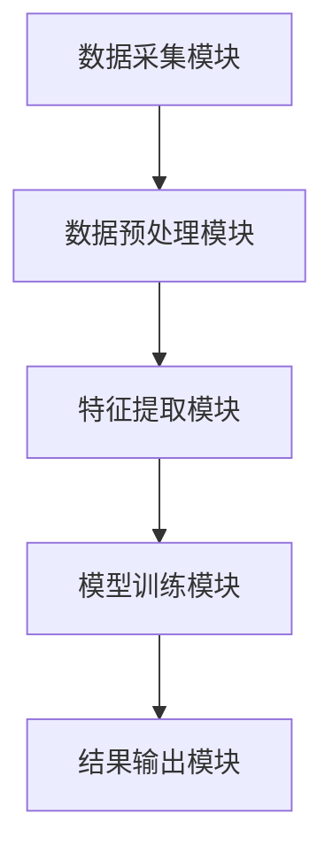

                 


# 价值投资中的颠覆性创新识别

> 关键词：价值投资，颠覆性创新，技术分析，市场预测，投资策略

> 摘要：本文深入探讨了价值投资与颠覆性创新的结合，通过系统化的分析方法、算法原理和实际案例，揭示了如何识别和评估颠覆性创新对投资决策的影响。文章从理论到实践，详细介绍了颠覆性创新的识别框架、数学模型和系统设计，为投资者提供了实用的工具和策略。

---

# 第1章: 引言

## 1.1 本书的目的与重要性
### 1.1.1 价值投资的核心理念
价值投资是一种长期投资策略，强调以低于内在价值的价格购买优质资产。其核心在于通过深入分析企业的基本面，寻找被市场低估的投资机会。颠覆性创新作为企业增长的核心驱动力，往往能够显著提升企业的内在价值。

### 1.1.2 颠覆性创新的定义与特征
颠覆性创新是指通过引入新技术、新商业模式或新产品，从根本上改变市场规则或行业格局的过程。其特征包括技术创新性、市场破坏性、用户价值提升和竞争优势重构。

### 1.1.3 本书的核心目标与价值
本书旨在帮助投资者识别和评估颠覆性创新，从而在价值投资中获得超额收益。通过系统化的分析框架和实战案例，为投资者提供科学的决策工具。

---

# 第2章: 颠覆性创新的背景与定义

## 2.1 颠覆性创新的背景分析
### 2.1.1 技术进步与市场变革
技术进步是颠覆性创新的催化剂，人工智能、大数据和区块链等技术的快速发展为创新提供了新的可能性。

### 2.1.2 行业竞争格局的变化
行业竞争格局的变化往往伴随着颠覆性创新的出现，新兴企业和创新技术可能迅速改变市场规则。

### 2.1.3 用户需求的演变
用户需求的演变是颠覆性创新的直接驱动力，消费者对新产品和新服务的需求推动了市场的变革。

## 2.2 颠覆性创新的定义与特征
### 2.2.1 颠覆性创新的定义
颠覆性创新是指通过引入新技术或新商业模式，彻底改变市场格局或用户行为的过程。

### 2.2.2 颠覆性创新的核心特征
- **技术创新性**：依赖新技术或新的技术组合。
- **市场破坏性**：对现有市场规则或竞争格局产生重大影响。
- **用户价值提升**：为用户创造新的价值或以更低的成本提供更好的服务。
- **竞争优势重构**：颠覆性创新通常会重构行业的竞争优势。

## 2.3 颠覆性创新的识别维度
### 2.3.1 技术维度
技术维度包括技术创新的可行性和潜在影响力。需要评估技术的成熟度、可扩展性和应用前景。

### 2.3.2 市场维度
市场维度关注市场需求的潜力和用户接受度。需要分析目标市场规模、增长潜力和用户需求的变化。

### 2.3.3 商业模式维度
商业模式维度关注企业的盈利模式和运营效率。颠覆性创新通常伴随着商业模式的创新，例如订阅制、免费增值模式等。

---

# 第3章: 价值投资中的创新识别框架

## 3.1 价值投资的基本框架
### 3.1.1 价值投资的核心原则
价值投资的核心原则包括长期投资、买入低估资产和注重基本面分析。

### 3.1.2 价值投资的分析方法
价值投资的分析方法包括财务分析、行业分析和竞争对手分析。

### 3.1.3 价值投资与市场周期的关系
价值投资需要考虑市场周期的影响，例如在熊市中寻找被低估的投资机会。

## 3.2 颠覆性创新识别的框架
### 3.2.1 技术创新的识别
技术创新的识别需要关注技术的先进性和应用前景。例如，人工智能技术的应用可能带来颠覆性创新。

### 3.2.2 商业模式创新的识别
商业模式创新的识别需要关注企业的盈利模式和用户价值。例如，免费增值模式可能通过改变用户行为实现颠覆性创新。

### 3.2.3 市场需求的预测
市场需求的预测需要结合市场趋势和用户需求变化。例如，随着用户对个性化服务的需求增加，新的商业模式可能成为颠覆性创新的驱动力。

## 3.3 价值投资与创新识别的结合
### 3.3.1 创新识别对价值投资的影响
创新识别可以帮助投资者发现那些具有长期增长潜力的企业，从而提高投资回报。

### 3.3.2 价值投资视角下的创新评估
价值投资视角下的创新评估需要结合企业的财务状况、行业地位和竞争优势。

### 3.3.3 创新识别在投资决策中的应用
创新识别在投资决策中的应用包括筛选具有创新潜力的企业、评估企业的竞争优势和预测企业的未来增长。

---

# 第4章: 颠覆性创新识别的核心工具与方法

## 4.1 技术分析工具
### 4.1.1 技术趋势分析
技术趋势分析包括对行业技术发展的预测和趋势分析。例如，人工智能技术的发展趋势可能为投资者提供颠覆性创新的线索。

### 4.1.2 技术生命周期分析
技术生命周期分析可以帮助投资者判断技术创新所处的阶段，从而评估其对企业的潜在影响。

### 4.1.3 技术可行性评估
技术可行性评估需要考虑技术的成熟度、成本和应用前景。例如，区块链技术的可行性评估可能包括技术成熟度、应用成本和市场需求。

## 4.2 市场分析工具
### 4.2.1 市场需求预测
市场需求预测需要结合市场研究和用户行为分析。例如，通过分析用户需求的变化，可以预测颠覆性创新的市场潜力。

### 4.2.2 市场竞争分析
市场竞争分析需要评估企业的竞争优势和市场地位。例如，分析企业的市场份额、竞争对手的创新能力和市场进入壁垒。

### 4.2.3 市场进入壁垒分析
市场进入壁垒分析需要评估市场的新进入者面临的障碍。例如，专利技术、品牌忠诚度和规模经济可能成为市场进入的壁垒。

## 4.3 商业模式分析工具
### 4.3.1 商业模式画布
商业模式画布是一种用于分析企业商业模式的工具，可以帮助投资者识别商业模式创新的潜力。

### 4.3.2 商业模式创新评估
商业模式创新评估需要结合企业的盈利模式、用户价值和市场定位。例如，订阅制商业模式可能通过改变用户支付习惯实现颠覆性创新。

### 4.3.3 商业模式可行性分析
商业模式可行性分析需要评估商业模式的实施成本、用户接受度和市场竞争情况。例如，免费增值模式的可行性分析可能包括成本结构、用户留存率和市场渗透率。

---

# 第5章: 颠覆性创新识别的算法原理

## 5.1 算法原理概述
### 5.1.1 算法的目标
算法的目标是通过数据驱动的方法，识别具有颠覆性创新潜力的企业。

### 5.1.2 算法的输入
算法的输入包括企业的财务数据、技术数据、市场数据和用户行为数据。

### 5.1.3 算法的输出
算法的输出包括企业创新潜力的评分、创新类型预测和投资建议。

## 5.2 算法实现步骤
### 5.2.1 数据预处理
数据预处理包括数据清洗、特征提取和数据标准化。例如，对企业的财务数据进行清洗，提取关键特征并进行标准化处理。

### 5.2.2 特征提取
特征提取需要从数据中提取与颠覆性创新相关的特征。例如，技术专利数量、研发投入比例、市场增长率等。

### 5.2.3 模型选择
模型选择需要根据数据特点选择合适的算法。例如，使用逻辑回归模型进行分类，或者使用随机森林模型进行特征重要性分析。

### 5.2.4 模型训练与评估
模型训练与评估需要对模型进行训练，并使用交叉验证方法评估模型的性能。例如，使用ROC曲线评估模型的分类性能。

## 5.3 数学模型与公式
### 5.3.1 颠覆性创新评分模型
颠覆性创新评分模型可以表示为一个线性回归模型：
$$
\text{创新评分} = \beta_0 + \beta_1 \times \text{技术创新性} + \beta_2 \times \text{市场潜力} + \beta_3 \times \text{商业模式创新} + \epsilon
$$

### 5.3.2 创新潜力预测模型
创新潜力预测模型可以表示为一个逻辑回归模型：
$$
P(\text{创新}) = \frac{1}{1 + e^{- (\beta_0 + \beta_1 \times X)}}
$$

---

# 第6章: 系统架构与设计

## 6.1 系统架构设计
### 6.1.1 系统目标
系统目标是构建一个能够识别颠覆性创新的系统，帮助投资者进行价值投资决策。

### 6.1.2 系统功能设计
系统功能设计包括数据采集、数据分析、结果输出和用户界面设计。例如，系统需要采集企业的财务数据、技术数据和市场数据，并通过算法进行分析，输出创新潜力评分和投资建议。

### 6.1.3 系统架构图
系统架构图如图所示：



## 6.2 系统交互设计
### 6.2.1 用户界面设计
用户界面设计需要简洁直观，方便用户输入数据和查看结果。例如，用户可以通过输入企业的基本信息和财务数据，获得创新潜力评分和投资建议。

### 6.2.2 系统接口设计
系统接口设计需要考虑数据输入和输出的格式。例如，数据采集模块需要与数据库接口进行交互，获取企业的数据。

---

# 第7章: 项目实战与案例分析

## 7.1 项目背景与目标
### 7.1.1 项目背景
本项目旨在通过构建一个颠覆性创新识别系统，帮助投资者识别具有潜力的企业。

### 7.1.2 项目目标
项目目标包括构建创新识别模型、实现系统原型和验证模型的有效性。

## 7.2 系统实现
### 7.2.1 环境安装
需要安装Python、scikit-learn、pandas和numpy等工具。

### 7.2.2 核心代码实现
以下是核心代码实现：

```python
import pandas as pd
from sklearn.linear_model import LogisticRegression
from sklearn.metrics import roc_auc_score
from sklearn.model_selection import train_test_split

# 数据加载
data = pd.read_csv('innovation.csv')

# 特征与目标分离
X = data.drop('is_innovative', axis=1)
y = data['is_innovative']

# 数据分割
X_train, X_test, y_train, y_test = train_test_split(X, y, test_size=0.2, random_state=42)

# 模型训练
model = LogisticRegression()
model.fit(X_train, y_train)

# 模型评估
y_pred = model.predict(X_test)
score = roc_auc_score(y_test, y_pred)
print(f'模型评估分数: {score}')
```

### 7.2.3 代码应用与解读
代码实现了一个逻辑回归模型，用于预测企业的创新潜力。数据加载、特征提取和模型训练是实现的核心步骤。

## 7.3 案例分析
### 7.3.1 案例背景
以苹果公司为例，分析其创新历程和市场表现。

### 7.3.2 创新识别
通过模型分析，识别苹果公司的创新潜力和市场地位。

### 7.3.3 投资建议
基于模型预测结果，提出相应的投资建议。

---

# 第8章: 总结与展望

## 8.1 本文总结
本文通过系统化的分析方法和算法原理，揭示了如何在价值投资中识别颠覆性创新。通过构建创新识别系统，为投资者提供了科学的决策工具。

## 8.2 未来展望
未来的研究可以进一步探索AI技术在创新识别中的应用，例如利用深度学习模型提高预测精度。

---

# 作者：AI天才研究院/AI Genius Institute & 禅与计算机程序设计艺术 /Zen And The Art of Computer Programming

---

**本文由AI天才研究院(AI Genius Institute)倾心打造，转载请注明出处。**

