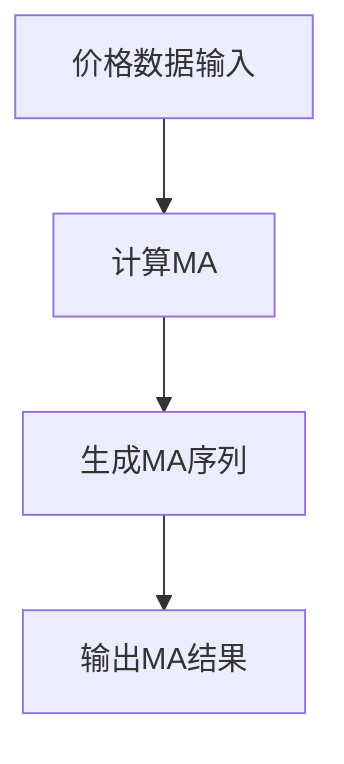
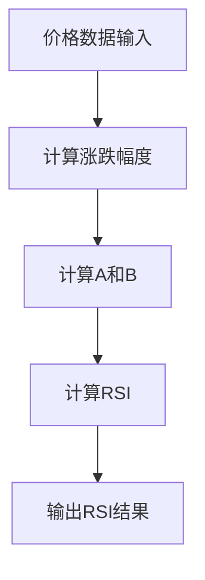
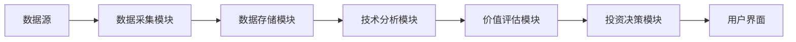

                 


# 《价值投资中的颠覆性技术分析》

## 关键词：价值投资，技术分析，移动平均线，相对强弱指数，投资策略

## 摘要：本文深入探讨了技术分析在价值投资中的应用，结合颠覆性技术，分析了技术指标如移动平均线和相对强弱指数的算法原理，构建了结合技术分析和价值投资的系统架构，并通过实际案例展示了技术分析在投资决策中的重要性，提出了最佳实践和投资策略建议。

---

## 第一部分：背景介绍

### 第1章：技术分析与价值投资概述

#### 1.1 技术分析的基本概念

- **技术分析的定义与起源**
  技术分析是一种通过研究历史市场数据（如价格和成交量）来预测未来市场走势的方法。起源于20世纪初，技术分析在金融领域得到了广泛应用。

- **价值投资的基本概念**
  价值投资是一种投资策略，强调以低于内在价值的价格购买优质资产。这种方法由本杰明·格雷厄姆和戴维·多德提出，注重长期收益和公司基本面分析。

- **技术分析与价值投资的结合**
  通过结合技术分析和价值投资，投资者可以在分析资产内在价值的同时，利用技术指标捕捉市场趋势，从而优化投资决策。

#### 1.2 技术分析的核心要素

- **K线图的解读**
  K线图展示了一段时间内资产的价格波动，包括开盘价、收盘价、最高价和最低价。通过分析K线图，投资者可以识别价格趋势和支撑阻力位。

- **移动平均线（MA）的应用**
  移动平均线是将一定时间内价格数据求平均值，用于平滑价格波动，识别趋势方向。常用的方法包括简单移动平均（SMA）和指数移动平均（EMA）。

- **相对强弱指数（RSI）的计算**
  RSI衡量了资产价格的超买或超卖状态，范围在0到100之间。RSI过高（>70）可能表示超买，RSI过低（<30）可能表示超卖。

#### 1.3 技术分析在价值投资中的作用

- **技术分析如何辅助价值投资决策**
  技术分析帮助投资者识别市场趋势，确定买入和卖出时机，从而优化资产配置。

- **技术分析与市场情绪的关系**
  技术指标如RSI和MACD反映了市场参与者的心理和情绪，帮助投资者理解市场动态。

---

## 第二部分：技术分析的核心概念与联系

### 第2章：技术分析的原理与数学模型

#### 2.1 技术分析的原理

- **技术分析的基本假设**
  价格反映所有信息，市场趋势延续，历史模式重复。

- **技术分析的核心假设**
  市场价格受供需影响，技术指标能预测价格变化。

- **技术分析的理论基础**
  基于 Dow 理论和 Elliott 波浪理论，技术分析提供了分析市场波动的工具。

#### 2.2 技术分析的核心指标

- **移动平均线（MA）的数学公式**
  $$ MA_n = \frac{1}{n} \sum_{i=1}^{n} P_i $$
  其中，$P_i$是第i个周期的价格，n是周期数。

- **相对强弱指数（RSI）的计算方法**
  $$ RSI = \frac{100}{1 + \frac{A}{B}} $$
  其中，A是一定时期内的平均上涨幅度，B是平均下跌幅度。

#### 2.3 技术分析与价值投资的联系

- **技术分析在价值投资中的应用**
  通过技术指标识别市场趋势，确定投资时机，辅助基本面分析。

- **技术分析与市场趋势的关系**
  技术指标帮助投资者识别趋势强度和趋势变化，指导投资策略。

---

### 第3章：技术分析的核心指标对比

#### 3.1 核心指标对比分析

| 指标名称 | 描述 | 计算公式 | 适用场景 |
|----------|------|----------|----------|
| MA       | 平滑价格波动，识别趋势 | $$ MA_n = \frac{1}{n} \sum_{i=1}^{n} P_i $$ | 确定趋势方向 |
| RSI      | 衡量超买超卖状态 | $$ RSI = \frac{100}{1 + \frac{A}{B}} $$ | 确定买卖信号 |

#### 3.2 技术分析与价值投资的联系

- **技术分析如何补充价值投资**
  技术指标帮助投资者识别市场时机，避免在高估或低估时期做出投资决策。

- **价值投资如何影响技术分析**
  价值投资者关注内在价值，技术分析则提供市场情绪和趋势信息，两者结合优化投资策略。

---

## 第三部分：技术分析的算法原理

### 第3章：技术分析的算法原理

#### 3.1 移动平均线（MA）的算法流程



#### 3.2 相对强弱指数（RSI）的算法流程



#### 3.3 移动平均线的Python实现

```python
import pandas as pd

def calculate_ma(data, window):
    return data['Close'].rolling(window).mean()

# 示例数据
data = pd.DataFrame({
    'Close': [100, 102, 101, 103, 104]
})
ma = calculate_ma(data, 3)
print(ma)
```

#### 3.4 相对强弱指数（RSI）的Python实现

```python
import pandas as pd
import numpy as np

def calculate_rsi(data, period=14):
    delta = data['Close'].diff(1)
    up = delta.where(delta > 0, 0)
    down = delta.where(delta < 0, 0)
    avg_up = up.rolling(period).mean()
    avg_down = down.rolling(period).mean()
    rsi = 100 * (avg_up / (avg_up + avg_down))
    return rsi

# 示例数据
data = pd.DataFrame({
    'Close': [100, 102, 101, 103, 104]
})
rsi = calculate_rsi(data)
print(rsi)
```

---

## 第四部分：系统分析与架构设计方案

### 第4章：系统架构设计

#### 4.1 问题场景介绍

- **问题场景**：投资者希望利用技术分析优化价值投资策略，构建一个结合技术分析和价值投资的系统。

#### 4.2 系统功能设计

- **功能模块**：
  - 数据采集模块：收集市场数据。
  - 技术分析模块：计算技术指标。
  - 价值评估模块：分析公司基本面。
  - 投资决策模块：生成投资策略。

#### 4.3 系统架构设计



#### 4.4 接口设计

- **数据采集模块接口**：
  - 输入：数据源类型。
  - 输出：数据流。

- **技术分析模块接口**：
  - 输入：价格数据。
  - 输出：技术指标。

#### 4.5 交互设计


---

## 第五部分：项目实战

### 第5章：项目实战

#### 5.1 环境安装

- **Python环境**：安装Python 3.8+。
- **依赖库**：安装pandas、numpy、matplotlib。

#### 5.2 核心代码实现

```python
import pandas as pd
import matplotlib.pyplot as plt

# 示例数据
data = pd.DataFrame({
    'Date': pd.date_range(start='2020-01-01', periods=10),
    'Close': [100, 102, 101, 103, 104, 105, 103, 106, 104, 107]
})

# 计算MA和RSI
ma = data['Close'].rolling(5).mean()
rsi = calculate_rsi(data)

# 绘制图表
plt.figure(figsize=(10, 6))
plt.plot(data['Date'], data['Close'], label='Price')
plt.plot(data['Date'], ma, label='MA(5)')
plt.plot(data['Date'], rsi, label='RSI(14)')
plt.legend()
plt.show()
```

#### 5.3 案例分析

- **案例描述**：分析某股票价格数据，计算MA和RSI，识别买卖信号。
- **分析结果**：当RSI低于30时，考虑买入；当RSI高于70时，考虑卖出。

---

## 第六部分：最佳实践

### 第6章：最佳实践

#### 6.1 小结

- **技术分析的重要性**：帮助识别市场趋势和买卖信号。
- **系统架构的优势**：整合技术分析和价值投资，优化投资决策。

#### 6.2 注意事项

- **数据质量**：确保数据准确可靠。
- **风险管理**：合理控制仓位，设置止损点。
- **持续学习**：关注市场变化，不断优化策略。

#### 6.3 拓展阅读

- 推荐阅读《证券分析》（本杰明·格雷厄姆）、《专业投机原理》（gary bishop）。

---

## 作者

作者：AI天才研究院/AI Genius Institute  
禅与计算机程序设计艺术/Zen And The Art of Computer Programming

---

# 结语

通过结合技术分析和价值投资，投资者可以更全面地评估资产，优化投资决策。本文从理论到实践，详细介绍了技术分析的应用，帮助投资者在金融市场中取得更好的收益。

